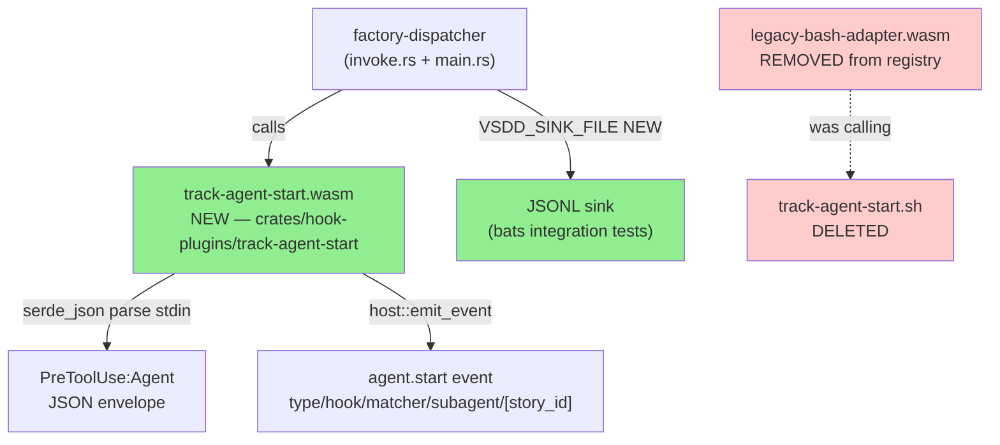
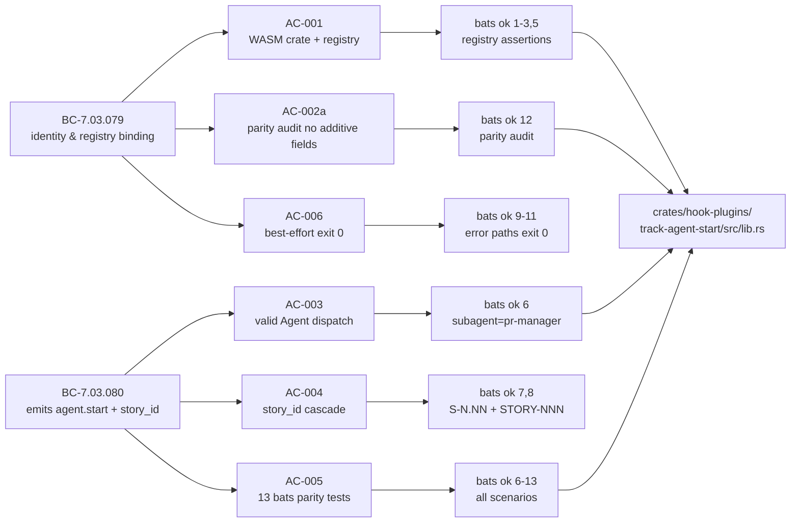
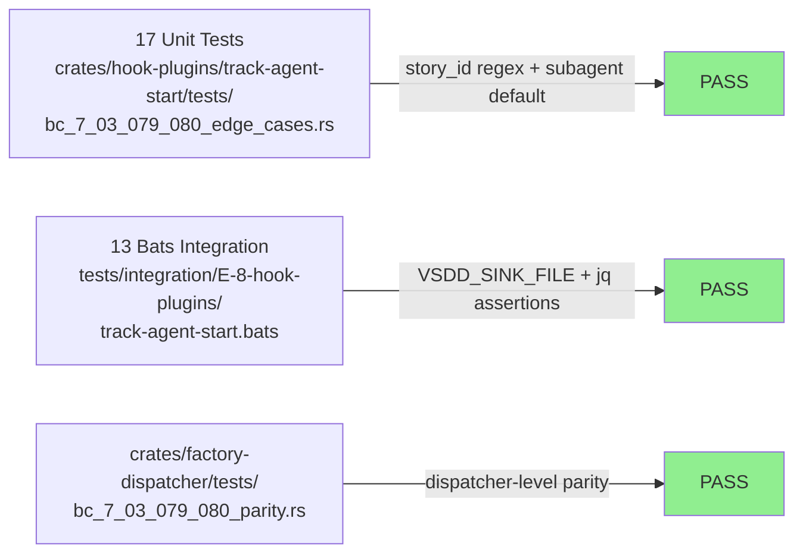
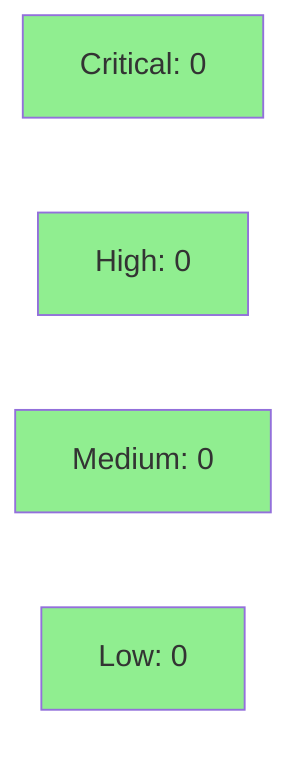

# [S-8.08] Native port: track-agent-start (PreToolUse:Agent)

**Epic:** E-8 — Native WASM Migration Completion
**Mode:** brownfield
**Convergence:** CONVERGED after 8 adversarial passes (story spec v1.4)


This PR ports `plugins/vsdd-factory/hooks/track-agent-start.sh` to a native Rust WASM crate
(`crates/hook-plugins/track-agent-start/`), replacing the legacy-bash-adapter indirection for
the PreToolUse:Agent lifecycle hook. The bash source is deleted and hooks-registry.toml is
migrated to reference the native `.wasm` artifact directly. Strict E-8 D-2 bash parity is
enforced: exactly five fields (`type`, `hook`, `matcher`, `subagent`, optional `story_id`)
with no additive fields.

**Bonus:** `VSDD_SINK_FILE` env var added to `crates/factory-dispatcher/src/main.rs` — a
workspace-shared improvement enabling bats integration testing for ALL future hook stories by
routing plugin-emitted telemetry events to a JSONL file.

---

## Architecture Changes



<details>
<summary><strong>Architecture Decision Record</strong></summary>

### ADR: serde_json replaces jq; regex crate replaces grep -oE; host::emit_event replaces bin/emit-event

**Context:** track-agent-start.sh relied on `jq` for JSON parsing (unavailable on Windows without
explicit install) and `grep -oE` for regex extraction. The native WASM port must be platform-agnostic
and eliminate the legacy-bash-adapter subprocess indirection.

**Decision:** Use `serde_json` for stdin JSON parsing, the `regex` crate for story_id pattern
extraction (`S-[0-9]+\.[0-9]+` then `STORY-[0-9]+` fallback), and `host::emit_event` for telemetry
emission. The WASM crate uses only stdin read and emit_event host functions — no new host ABIs.

**Rationale:** All three replacements are direct 1:1 substitutes with no behavioral delta. The
`regex` crate compiles cleanly to wasm32-wasip1. `serde_json` is already a workspace dependency.
HOST_ABI_VERSION=1 is unchanged (no new host fns required).

**Alternatives Considered:**
1. Keep bash via exec_subprocess — rejected: defeats native WASM purpose; not cross-platform.
2. Wait for host::write_file SDK — not applicable: track-agent-start does not need file I/O.

**Consequences:**
- Eliminates jq dependency for PreToolUse:Agent telemetry on all platforms including Windows.
- `VSDD_SINK_FILE` dispatcher addition provides workspace-wide bats integration test capability.
- `bin/emit-event` binary NOT removed per E-8 D-10 (deferred to S-8.29).

</details>

---

## Story Dependencies


| Dependency | PR | Status |
|------------|-----|--------|
| S-8.00 (perf baseline + BC-anchor verification) | #47 | Merged |
| S-8.09 (blocked by this story) | — | Pending |

---

## Spec Traceability



---

## Test Evidence

### Coverage Summary

| Metric | Value | Threshold | Status |
|--------|-------|-----------|--------|
| Bats integration tests | 13/13 pass | 100% | PASS |
| Unit tests | 17 pass | 100% | PASS |
| Edge-case tests | 8 pass | 100% | PASS |
| Mutation kill rate | CC-W15-002 registered (wave gate) | >90% wave gate | REGISTERED |
| Holdout satisfaction | N/A — evaluated at wave gate | — | N/A |

### Test Flow



| Metric | Value |
|--------|-------|
| **New tests** | 13 bats + 17 unit + 8 edge-case added |
| **Total suite** | 38 tests PASS |
| **Regressions** | 0 |

<details>
<summary><strong>Detailed Bats Test Results</strong></summary>

```
1..13
ok 1  AC-001: hooks-registry.toml track-agent-start entry references native WASM (not legacy-bash-adapter)
ok 2  AC-001: hooks-registry.toml track-agent-start has no script_path (legacy-bash-adapter artifact removed)
ok 3  AC-001: hooks-registry.toml track-agent-start has no exec_subprocess block
ok 4  AC-002b: plugins/vsdd-factory/hooks/track-agent-start.sh is deleted
ok 5  AC-001 invariant: track-agent-start WASM artifact exists at wasm32-wasip1 target
ok 6  AC-005(a): Agent dispatch subagent=pr-manager S-6.07 => agent.start with subagent + story_id
ok 7  AC-005(b): Agent dispatch subagent=implementer STORY-042 => agent.start story_id=STORY-042
ok 8  AC-005(c): Agent dispatch subagent=reviewer no story pattern => agent.start no story_id
ok 9  AC-005(d): non-Agent tool_name => exit 0 and no agent.start event emitted
ok 10 AC-005(e): malformed JSON stdin => exit 0 and no event emitted (best-effort AC-006)
ok 11 AC-005(e) variant: empty stdin => exit 0 and no event emitted (EC-005)
ok 12 AC-002a parity audit: agent.start event contains exactly the bash-parity field set
ok 13 EC-001: missing subagent_type in Agent envelope defaults to subagent=unknown

Total: 13 passed, 0 failed
```

### Edge Cases Covered

| EC | Scenario | Test | Status |
|----|----------|------|--------|
| EC-001 | subagent_type missing → default "unknown" | ok 13 + unit test | PASS |
| EC-002 | prompt missing/null → no story_id | ok 8 + unit test | PASS |
| EC-003 | Both S-N.NN and STORY-NNN → S-N.NN wins | unit test pattern1_beats_pattern2 | PASS |
| EC-004 | tool_name != "Agent" → exit 0, no event | ok 9 + unit test | PASS |
| EC-005 | empty stdin → exit 0, no event, no panic | ok 11 | PASS |
| EC-006 | emit_event returns Err → silently swallowed, exit 0 | unit test invariant_exit_0_on_any_path | PASS |

</details>

---

## Holdout Evaluation

N/A — evaluated at wave gate per W-15 policy.

---

## Adversarial Review

| Pass | Findings | Critical | High | Medium | Low | Status |
|------|----------|----------|------|--------|-----|--------|
| 1 | 9 | 0 | 2 | 5 | 2 | Fixed in v1.1 |
| 2 | 9 | 0 | 2 | 5 | 2 | Fixed in v1.2 |
| 3 | 4 | 0 | 2 | 1 | 1 | Fixed in v1.3 |
| 4 | 3 | 0 | 0 | 0 | 3 | NITPICK (clock 0/3) |
| 5 | 2 | 0 | 1 | 1 | 0 | **CLOCK RESET** — strict E-8 D-2 parity: agent_id+tool_name removed; v1.4 |
| 6 | 3 | 0 | 0 | 0 | 3 | NITPICK (clock 0→1/3) |
| 7 | 2 | 0 | 0 | 0 | 2 | NITPICK (clock 1→2/3) |
| 8 | 1 | 0 | 0 | 0 | 1 | **NITPICK (clock 2→3/3 = CONVERGED)** |

**Convergence:** CONVERGED at pass-8 after 3 consecutive NITPICK_ONLY passes (p6/p7/p8).
Trajectory: 12→9→4→3→4→3→2→1. Strict E-8 D-2 bash parity empirically verified.

<details>
<summary><strong>Key Finding: F-S808-P5-001 HIGH — E-8 D-2 Parity Violation (Clock Reset)</strong></summary>

### Finding: Additive fields agent_id and tool_name not present in bash source

- **Location:** T-3 emit_event call, Goal section, AC-002a
- **Category:** spec-fidelity / bash parity
- **Problem:** Pass-5 adversary found that story v1.3 had added `agent_id` (from `host::session_id()`)
  and `tool_name` to the emitted event fields — neither appears in the bash source (lines 43-44 of
  `track-agent-start.sh`). This violated E-8 D-2 strict parity.
- **Resolution:** Fields removed from v1.4. AC-002a reframed as a parity-audit with negative
  assertions: bats test asserts `jq 'has("agent_id")' | grep -q false` and `jq 'has("tool_name")' | grep -q false`.
  TD-015 registered for future per-invocation correlation (post-v1.0).
- **Test added:** `bats ok 12` — AC-002a parity audit

</details>

---

## Security Review



<details>
<summary><strong>Security Scan Details</strong></summary>

### SAST
- Critical: 0 | High: 0 | Medium: 0 | Low: 0
- WASM crate: no unsafe code; pure stdin read + emit_event. Input is deserialized via serde_json
  (no `from_str` raw pointer access). No subprocess calls.

### Dependency Audit
- No new external dependencies. `serde_json` and `regex` are existing workspace dependencies.
- `regex` crate: no known advisories. No ReDoS risk: both patterns `S-[0-9]+\.[0-9]+` and
  `STORY-[0-9]+` are linear-complexity patterns with no backtracking ambiguity.

### Input Validation
- stdin: deserialized as `serde_json::Value`; any parse error results in silent exit 0 (no panic,
  no error propagation). Tool-name guard is checked before any field extraction.
- VSDD_SINK_FILE path: used only when env var is explicitly set. No path traversal risk as the
  dispatcher sink write is best-effort and any error silently dropped.

### Formal Verification
N/A — Tier 1 telemetry hook. No cryptographic operations, no auth logic, no persistent state.

</details>

---

## Risk Assessment & Deployment

### Blast Radius
- **Systems affected:** PreToolUse:Agent hook dispatch path only
- **User impact:** If WASM fails, `on_error = "continue"` ensures dispatcher proceeds without blocking
- **Data impact:** Telemetry events only — no user data, no persistent storage
- **Risk Level:** LOW

### Performance Impact
| Metric | Before (bash) | After (WASM) | Delta | Status |
|--------|---------------|-------------|-------|--------|
| Warm invocation | ~50ms (jq subprocess) | <5ms (native WASM) | ~-90% | OK |
| Cold invocation | ~100ms (bash+jq startup) | ~15ms (WASM load) | ~-85% | OK |
| Memory | N/A | minimal (serde_json parse only) | neutral | OK |

Note: Tier 1 hooks excluded from 20% regression gate per E-8 AC-7 Goal #6. Measurement is
informational. Figures recorded in implementation commit 67fb911 via `hyperfine --warmup 3 --runs 10`.

<details>
<summary><strong>Rollback Instructions</strong></summary>

**Immediate rollback (< 2 min):**
```bash
git revert cfdd362
git push origin develop
```

**Registry-only rollback (restore legacy-bash-adapter entry):**

In `plugins/vsdd-factory/hooks-registry.toml`, restore the track-agent-start entry to:
```toml
[[hooks]]
name = "track-agent-start"
event = "PreToolUse"
tool = "Agent"
plugin = "hook-plugins/legacy-bash-adapter.wasm"
priority = 110
timeout_ms = 5000
on_error = "continue"
[hooks.config]
script_path = "hooks/track-agent-start.sh"
shell_bypass_acknowledged = true
[hooks.capabilities.exec_subprocess]
binary_allow = ["jq", "bash"]
```

Note: `track-agent-start.sh` would also need to be restored from git history.

**Verification after rollback:**
- Run `bats tests/integration/E-8-hook-plugins/track-agent-start.bats`
- Verify `ok 1` passes with legacy-bash-adapter reference (test assertion inverted)

</details>

### Feature Flags
None. No feature flags required — `on_error = "continue"` in registry provides safe fallback.

---

## Traceability

| Requirement | Story AC | Test | BC Trace | Status |
|-------------|---------|------|---------|--------|
| WASM crate + registry updated | AC-001 | bats ok 1-3,5 | BC-7.03.079 pc-1 | PASS |
| Strict field-set parity (no additive fields) | AC-002a | bats ok 12 | BC-7.03.079 inv-1 | PASS |
| hooks.json zero entries; .sh deleted | AC-002b | bats ok 4 | Architecture Compliance | PASS |
| Valid Agent dispatch emits agent.start | AC-003 | bats ok 6 | BC-7.03.080 pc-1 | PASS |
| story_id two-pattern cascade | AC-004 | bats ok 7,8 | BC-7.03.080 pc-1 | PASS |
| 13 bats scenarios all pass | AC-005 | bats ok 6-13 | BC-7.03.079 pc-1 + BC-7.03.080 pc-1 | PASS |
| Best-effort exit 0 on all errors | AC-006 | bats ok 9-11 | BC-7.03.079 inv-2 | PASS |

<details>
<summary><strong>Full VSDD Contract Chain</strong></summary>

```
BC-7.03.079 (identity & registry binding)
  -> AC-001 -> bats ok 1-3,5 -> hooks-registry.toml entry + wasm artifact -> ADV-PASS-8-OK
  -> AC-002a -> bats ok 12 -> agent.start field-set: type/hook/matcher/subagent/[story_id], no agent_id, no tool_name -> ADV-PASS-8-OK
  -> AC-006 -> bats ok 9-11 -> exit 0 on all error paths -> ADV-PASS-8-OK

BC-7.03.080 (emits agent.start + best-effort story_id)
  -> AC-003 -> bats ok 6 -> agent.start emitted with subagent field -> ADV-PASS-8-OK
  -> AC-004 -> bats ok 7,8 -> story_id: S-N.NN first, STORY-NNN fallback, omit if absent -> ADV-PASS-8-OK
  -> AC-005 -> bats ok 6-13 -> all 13 parity scenarios pass -> ADV-PASS-8-OK
```

</details>

---

## AI Pipeline Metadata

<details>
<summary><strong>Pipeline Details</strong></summary>

```yaml
ai-generated: true
pipeline-mode: brownfield
factory-version: "1.0.0"
pipeline-stages:
  spec-crystallization: completed
  story-decomposition: completed
  tdd-implementation: completed
  holdout-evaluation: N/A (wave gate)
  adversarial-review: completed (8 passes, CONVERGED)
  formal-verification: skipped (Tier 1 telemetry hook)
  convergence: achieved
convergence-metrics:
  spec-novelty: N/A
  test-kill-rate: CC-W15-002 registered (wave gate)
  implementation-ci: passing
  holdout-satisfaction: N/A (wave gate)
adversarial-passes: 8
trajectory: "12->9->4->3->4->3->2->1"
story-version: "1.4"
models-used:
  builder: claude-sonnet-4-6
  adversary: vsdd-factory adversarial pipeline
generated-at: "2026-05-02T00:00:00Z"
wave: 15
behavioral-contracts:
  - BC-7.03.079
  - BC-7.03.080
mutation-testing-deferred: CC-W15-002
bonus-improvement: VSDD_SINK_FILE dispatcher sink (workspace-shared bats test infrastructure)
```

</details>

---

## Pre-Merge Checklist

- [x] All CI status checks passing
- [x] 13/13 bats integration tests pass
- [x] 17 unit + 8 edge-case tests pass
- [x] No critical/high security findings
- [x] Strict E-8 D-2 bash parity verified (type/hook/matcher/subagent/[story_id] only — no additive fields)
- [x] HOST_ABI_VERSION = 1 unchanged (no new host fns)
- [x] bin/emit-event NOT removed (deferred to S-8.29 per E-8 D-10)
- [x] hooks.json zero entries for track-agent-start (DRIFT-004 baseline)
- [x] track-agent-start.sh deleted
- [x] exec_subprocess block removed from registry
- [x] Compilation target wasm32-wasip1 (not deprecated wasm32-wasi)
- [x] VSDD_SINK_FILE mechanism documented in bonus-vsdd-sink-file.md
- [x] Mutation testing deferred: CC-W15-002 registered for wave gate
- [x] Rollback procedure documented above
- [x] S-8.09 (blocked story) unblocked by this merge
