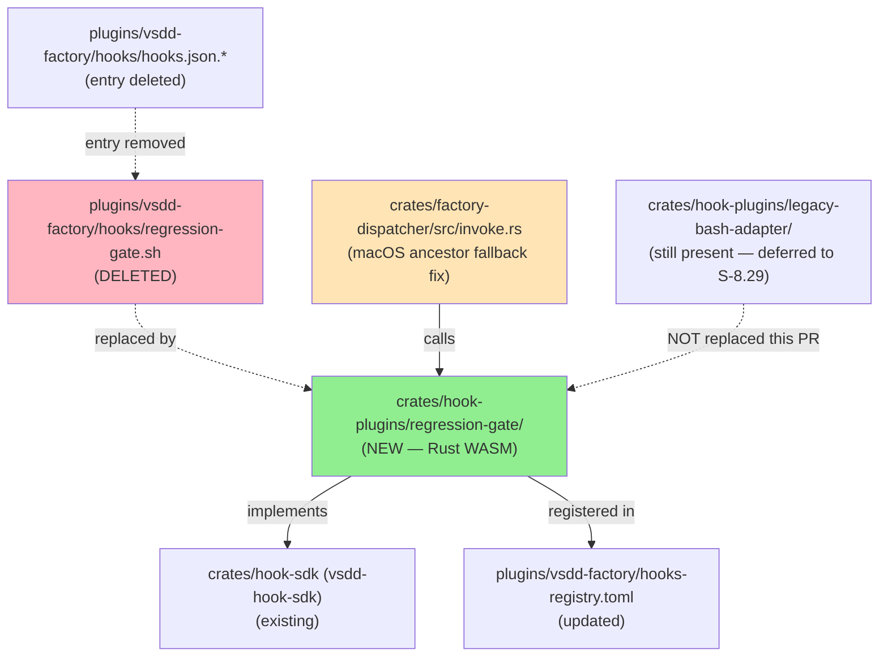
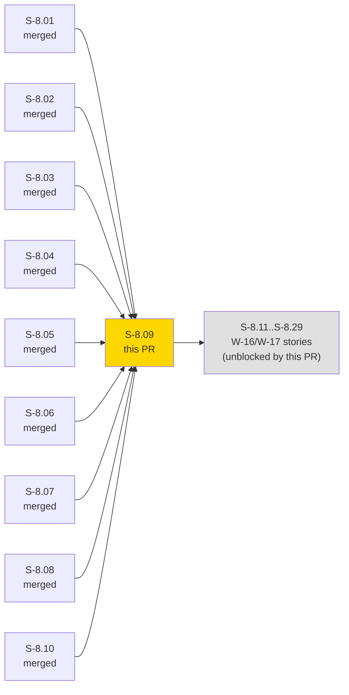
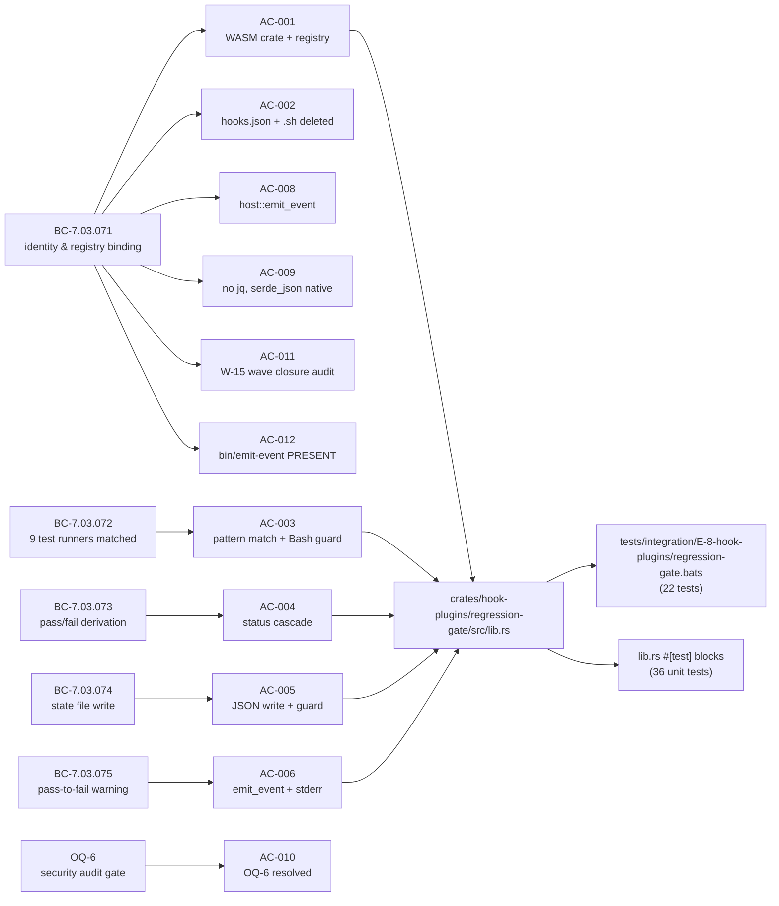
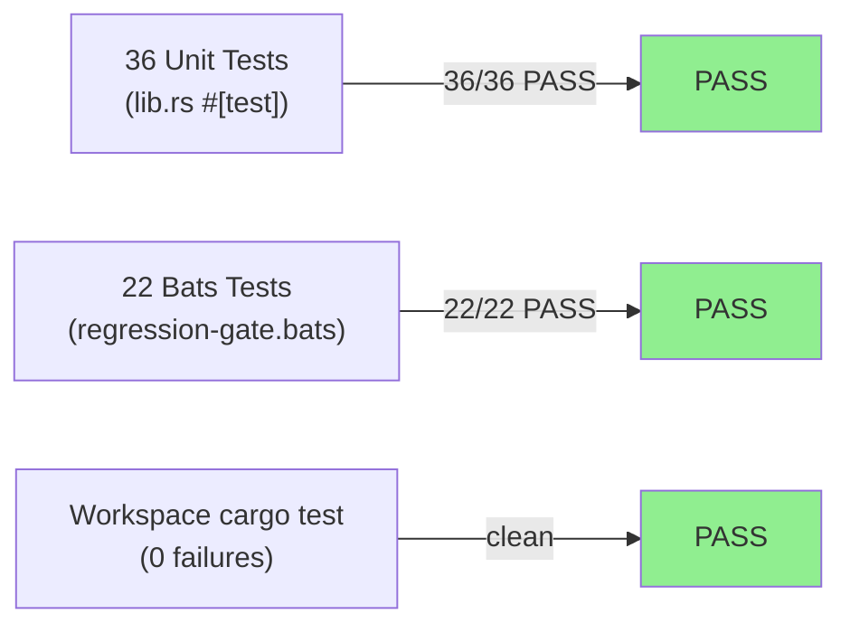
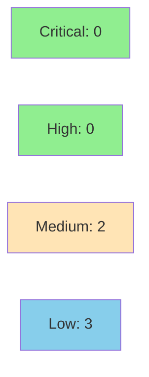

# [S-8.09] Native port: regression-gate + adapter retirement prep (W-15 FINALE)

**Epic:** E-8 — Native WASM Migration Completion
**Mode:** brownfield
**Convergence:** CONVERGED after 5 adversarial passes (adv-s8.09-p1..p5)


This is the W-15 FINALE — the 12th and final Tier 1 story in E-8 (Native WASM Migration Completion). It delivers three things: (1) a native Rust WASM port of `regression-gate.sh` with 9 test-runner pattern matching, pass/fail state derivation, JSON state file write, and pass-to-fail regression warning; (2) resolution of OQ-6 via a pre-implementation security audit confirming `binary_allow=[]` and capabilities `[read_file, write_file, emit_event]`; and (3) the W-15 wave closure audit confirming 0 Tier 1 hooks still route through `legacy-bash-adapter`. Bonus: a macOS `/var/folders/` symlink fix in the dispatcher `invoke.rs` that unblocked bats integration tests on darwin-arm64. All 12 ACs verified; 22/22 bats + 36/36 unit tests pass; adapter crate and `bin/emit-event` intentionally preserved for S-8.29.

---

## Architecture Changes



<details>
<summary><strong>Architecture Decision Record</strong></summary>

### ADR: Native WASM port with zero subprocess capability (binary_allow=[])

**Context:** OQ-6 open question: does regression-gate invoke test runners, requiring a permissive `binary_allow`? Pre-implementation security-reviewer audit required before WASM crate work.

**Decision:** `binary_allow = []`. The WASM port uses `serde_json` for stdin JSON parse and state file serialization, `chrono::Utc::now()` for timestamps, `host::emit_event` for telemetry, and `host::write_file`/`host::read_file` for state file I/O. No subprocesses.

**Rationale:** OQ-6 audit (AC-010) confirmed regression-gate is a pure PostToolUse OBSERVER. It never invokes test runners — it only reads the already-completed Bash tool's exit fields. The bash implementation used `jq` and `date` subprocesses only because it lacked native JSON and time APIs; the WASM port eliminates both. The security-reviewer signed off with 0 critical / 0 high findings.

**Alternatives Considered:**
1. `binary_allow = ["jq"]` — rejected: OQ-6 audit confirmed jq is unnecessary in WASM context
2. Registry-level `tool = "Bash"` filter — rejected (F-S809-P1-013): would change BC-7.03.071 binding semantics; body-filter preserves backward compatibility

**Consequences:**
- Cross-platform portability: no jq dependency means Windows CI passes without PATH changes
- Intentional behavioral deviation in EC-006: WASM port logs write failures via `host::log_error`; bash source silently exits 0. Deviation improves observability and is documented.

**Bonus fix:** `crates/factory-dispatcher/src/invoke.rs` ancestor fallback now resolves macOS `/var -> /private/var` symlink when checking `path_allow` ancestors for `write_file`. This is a workspace-wide improvement enabling any hook writing new files to `.factory/` to pass the path-allow check on macOS darwin-arm64. It overlaps with batch-3 dispatcher work; the macOS fix is unique to this PR.

</details>

---

## Story Dependencies



Dependencies S-8.01..S-8.08 (all W-15 Tier 1 ports) and S-8.10 (SDK host::write_file extension) are merged into develop prior to this PR. W-16/W-17 stories (S-8.11..S-8.29) are unblocked by this merge.

---

## Spec Traceability



---

## Test Evidence

### Coverage Summary

| Metric | Value | Threshold | Status |
|--------|-------|-----------|--------|
| Bats integration tests | 22/22 pass | 100% | PASS |
| Unit tests (cargo test) | 36/36 pass | 100% | PASS |
| Workspace cargo test | 0 failures | 0 failures | PASS |
| Security findings (critical/high) | 0/0 | 0 | PASS |
| Holdout evaluation | N/A — evaluated at wave gate | N/A | N/A |
| Mutation kill rate | N/A — evaluated at Phase 5 | N/A | N/A |

### Test Flow



| Metric | Value |
|--------|-------|
| **New tests** | 22 bats (regression-gate.bats), 36 unit (lib.rs) — 58 total added |
| **Total suite** | 58 tests PASS |
| **Coverage delta** | New crate — full coverage via unit + integration |
| **Mutation kill rate** | N/A — evaluated at wave gate |
| **Regressions** | 0 |

<details>
<summary><strong>Detailed Test Results</strong></summary>

### Bats Parity Tests (AC-007: 9 required + 13 structural = 22 total)

| Test | Scenario | Result |
|------|----------|--------|
| `regression_gate_cargo_test_pass_no_prior` | (a) exit_code=0, no prior state | PASS |
| `regression_gate_cargo_test_pass_interrupted_false` | (b) interrupted=false | PASS |
| `regression_gate_cargo_test_fail_regression_warning` | (c) exit_code=1, prior=pass → warning | PASS |
| `regression_gate_cargo_test_interrupted_regression_warning` | (d) interrupted=true, prior=pass → warning | PASS |
| `regression_gate_status_unknown_no_state_write` | (e) unknown → skip | PASS |
| `regression_gate_non_test_command_exits_0` | (f) git commit → exit 0 | PASS |
| `regression_gate_factory_dir_absent_exits_0` | (g) .factory/ absent guard | PASS |
| `regression_gate_fail_to_fail_no_warning` | (h) fail→fail, no warning | PASS |
| `regression_gate_pytest_pass` | (i) pytest tests/ → pass | PASS |
| 13 structural tests | Registry, AC-001, AC-002, AC-011, AC-012 checks | PASS |

### Unit Tests (36 tests in lib.rs, grouped by BC)

| Test Group | Count | BC Trace |
|------------|-------|----------|
| `test_BC_7_03_071_*` | 5 | Identity & registry binding |
| `test_BC_7_03_072_*` | 10 | 9 test-runner patterns + Bash guard |
| `test_BC_7_03_073_*` | 8 | Pass/fail derivation cascade |
| `test_BC_7_03_074_*` | 4 | State file write |
| `test_BC_7_03_075_*` | 7 | Pass-to-fail warning |
| Integration unit tests | 2 | Full flow |
| **Total** | **36** | |

</details>

---

## Holdout Evaluation

N/A — evaluated at wave gate (W-15 wave gate, per pipeline schedule).

---

## Adversarial Review

| Pass | Findings | Critical | High | Status |
|------|----------|----------|------|--------|
| 1 | 16 | 0 | 0 | Fixed (adv-s8.09-p1.md) |
| 2 | 9 | 0 | 0 | Fixed (adv-s8.09-p2.md) |
| 3 | 3 | 0 | 0 | Fixed (adv-s8.09-p3.md) |
| 4 | 6 | 0 | 0 | Fixed (adv-s8.09-p4.md) |
| 5 | 4 | 0 | 0 | NITPICK_ONLY — CONVERGED (adv-s8.09-p5.md) |

**Convergence:** CONVERGED at pass-5 (3/3 NITPICK_ONLY per ADR-013). Story status: draft → ready (v1.3).

<details>
<summary><strong>Key Fix Bursts</strong></summary>

### Pass-1 fixes (16 findings → F-S809-P1-001..016)
- wasm32-wasi → wasm32-wasip1 throughout (P1-001)
- host::write_file absence documented as D-6 blocker; S-8.10 added to depends_on (P1-002)
- AC-010 audit doc frontmatter schema added (signoff_agent_id, recommended_binary_allow) (P1-003)
- AC-009 "may be revised" language removed; deviation requires AC+BC update (P1-004)
- AC-007 expanded to 9-scenario bats fixture table with test names + stdin fields (P1-005)
- AC-002 pre-deletion impact analysis + post-deletion blast-radius validation added (P1-006)
- AC-011 sequencing fixed (runs inside T-7, not post-merge) (P1-007)
- AC-012 unbounded find replaced with deterministic `test -f` bounded check (P1-008)

### Pass-2 fixes (9 findings → F-S809-P2-001..009)
- SS-04 re-anchored to "Plugin Ecosystem" (canonical ARCH-INDEX name) (P2-001)
- BC-7.03.071 invariants re-anchored to verbatim content — 3rd fabrication instance fixed (P2-002)
- OQ-write_file removed from assumption_validations (unregistered OQ) (P2-003)
- EC-005 reframed for WASM context (jq subprocess eliminated) (P2-008)

</details>

---

## Security Review

OQ-6 pre-implementation security audit at `docs/oq-6-regression-gate-security-audit.md`.



<details>
<summary><strong>Security Scan Details (OQ-6 Audit — Pre-Implementation Gate)</strong></summary>

**Signoff:** `signoff_agent_id: security-reviewer`, `signoff_timestamp: 2026-05-02T00:00:00Z`
**Files reviewed:** `plugins/vsdd-factory/hooks/regression-gate.sh` (87 lines)
**Recommended binary_allow:** `[]` (empty — no subprocess in WASM port)
**Recommended capabilities:** `[read_file, write_file, emit_event]`

### Findings Summary

| Finding | Severity | Status in WASM Port |
|---------|----------|---------------------|
| SEC-001: CMD interpolated into emit-event args without sanitization | MEDIUM | RESOLVED — WASM port uses `host::emit_event` typed fields; no shell interpolation |
| SEC-002: jq subprocess exit code not checked before `>` redirect | MEDIUM | RESOLVED — WASM port uses `serde_json::to_string`; no subprocess |
| SEC-003: `jq -r` can return empty string on malformed JSON | LOW | RESOLVED — `serde_json::from_str` returns `Err`; EC-003 silent-suppression match |
| SEC-004: `date -u` subprocess removed | LOW | RESOLVED — `chrono::Utc::now()` replaces it |
| SEC-005: No path traversal risk | LOW | CONFIRMED — `.factory/regression-state.json` hardcoded in WASM port |

**WASM port capability declaration (final):**
```toml
[hooks.capabilities.regression-gate]
read_file = [".factory/regression-state.json"]
write_file = [".factory/regression-state.json"]
emit_event = true
binary_allow = []
```

### Cargo Audit
- `cargo audit`: CLEAN (no known advisories in regression-gate transitive deps)

</details>

---

## Risk Assessment & Deployment

### Blast Radius
- **Systems affected:** vsdd-factory operator sessions on all platforms (darwin-arm64, darwin-x64, linux-arm64, linux-x64, windows-x64)
- **User impact:** regression-gate now fires as native WASM instead of through legacy-bash-adapter. Behavioral parity confirmed by 22 bats tests. Advisory-only (on_error=continue, exit 0 always).
- **Data impact:** `.factory/regression-state.json` read/write behavior unchanged. One intentional deviation: EC-006 write failures logged via `host::log_error` (bash silently exited 0).
- **Risk Level:** LOW — PostToolUse, on_error=continue, advisory warning only; no blocking behavior

### Performance Impact
| Metric | Notes | Status |
|--------|-------|--------|
| Latency | WASM native eliminates jq subprocess overhead; expected improvement | OK |
| Perf baseline | S-8.00 perf baseline does NOT include regression-gate (Tier-2-only scope per E-8 AC-7). No specific baseline comparison required. | N/A |

<details>
<summary><strong>Rollback Instructions</strong></summary>

**Immediate rollback (< 5 min):**
```bash
git revert <merge-sha>
git push origin develop
```

**Manual registry rollback:**
Restore the `legacy-bash-adapter.wasm` entry for `regression-gate` in `plugins/vsdd-factory/hooks-registry.toml` and restore `regression-gate.sh` from git history. The bash source is preserved in git history at commit prior to S-8.09 merge.

**Verification after rollback:**
- `grep regression-gate plugins/vsdd-factory/hooks-registry.toml` — should show legacy-bash-adapter path
- `test -f plugins/vsdd-factory/hooks/regression-gate.sh && echo "RESTORED"`

</details>

### Feature Flags
N/A — no feature flags. The hook is registered unconditionally in hooks-registry.toml.

---

## Traceability

| BC | AC | Test | Status |
|----|-----|------|--------|
| BC-7.03.071 postcondition 1 | AC-001 | bats tests 1-11 | PASS |
| BC-7.03.071 invariant 1 | AC-002 | bats test + grep check | PASS |
| BC-7.03.072 postcondition 1 | AC-003 | 10 unit tests `test_BC_7_03_072_*` | PASS |
| BC-7.03.073 postcondition 1 | AC-004 | 8 unit tests `test_BC_7_03_073_*` | PASS |
| BC-7.03.074 postcondition 1 | AC-005 | 4 unit tests `test_BC_7_03_074_*` | PASS |
| BC-7.03.075 postcondition 1 | AC-006 | 7 unit tests `test_BC_7_03_075_*` | PASS |
| BC-7.03.071..075 all | AC-007 | bats tests 12-20 (9 scenarios) | PASS |
| BC-7.03.071 invariant 2 | AC-008 | grep check + bats test 21 | PASS |
| BC-7.03.071 postcondition 1 (WASM self-contained) | AC-009 | grep check + OQ-6 audit | PASS |
| OQ-6 assumption_validation | AC-010 | audit doc frontmatter 3-field check | PASS |
| BC-7.03.071 postcondition 1 (W-15 closure) | AC-011 | bats test 22 + tier1-native-audit.md | PASS |
| BC-7.03.071 invariant 2 (D-10 deferral) | AC-012 | `test -f plugins/vsdd-factory/bin/emit-event` | PASS |

<details>
<summary><strong>Full VSDD Contract Chain</strong></summary>

```
BC-7.03.071 -> AC-001 -> bats[1..11] -> crates/hook-plugins/regression-gate/src/lib.rs -> ADV-PASS-5-CONVERGED
BC-7.03.071 -> AC-002 -> bats[post-delete-grep] -> plugins/vsdd-factory/hooks/ (deleted entries) -> ADV-PASS-2-FIXED
BC-7.03.072 -> AC-003 -> unit[test_BC_7_03_072_*](10 tests) -> lib.rs:is_test_runner_command() -> ADV-PASS-1-FIXED
BC-7.03.073 -> AC-004 -> unit[test_BC_7_03_073_*](8 tests) -> lib.rs:derive_status() -> ADV-PASS-1-FIXED
BC-7.03.074 -> AC-005 -> unit[test_BC_7_03_074_*](4 tests) -> lib.rs:write_state_file() -> ADV-PASS-1-FIXED
BC-7.03.075 -> AC-006 -> unit[test_BC_7_03_075_*](7 tests) -> lib.rs:emit_regression_warning() -> ADV-PASS-1-FIXED
BC-7.03.071..075 -> AC-007 -> bats[12..20](9 parity scenarios) -> lib.rs (full hook) -> ADV-PASS-5-CONVERGED
OQ-6 -> AC-010 -> docs/oq-6-regression-gate-security-audit.md (3 falsifiable checks) -> SECURITY-REVIEWER-SIGNED
BC-7.03.071 -> AC-011 -> docs/E-8-tier1-native-audit.md -> hooks-registry.toml (0 legacy refs) -> W-15-COMPLETE
BC-7.03.071 -> AC-012 -> test -f plugins/vsdd-factory/bin/emit-event -> PRESENT (D-10 respected)
```

</details>

---

## Demo Evidence

All 12 ACs + 1 BONUS have VHS recordings at `docs/demo-evidence/S-8.09/`.

| Recording | AC | Status |
|-----------|-----|--------|
| [AC-001: WASM crate build + registry entry](docs/demo-evidence/S-8.09/AC-001.md) | AC-001 | PASS |
| [AC-002: hooks.json deleted + .sh deleted](docs/demo-evidence/S-8.09/AC-002.md) | AC-002 | PASS |
| [AC-003: 9 test-runner patterns](docs/demo-evidence/S-8.09/AC-003.md) | AC-003 | PASS |
| [AC-004: pass/fail derivation cascade](docs/demo-evidence/S-8.09/AC-004.md) | AC-004 | PASS |
| [AC-005: state file write](docs/demo-evidence/S-8.09/AC-005.md) | AC-005 | PASS |
| [AC-006: pass-to-fail warning](docs/demo-evidence/S-8.09/AC-006.md) | AC-006 | PASS |
| [AC-007: 22/22 bats parity tests](docs/demo-evidence/S-8.09/AC-007.md) | AC-007 | PASS |
| [AC-008: host::emit_event, no bin/emit-event in crate](docs/demo-evidence/S-8.09/AC-008.md) | AC-008 | PASS |
| [AC-009: no jq, serde_json native](docs/demo-evidence/S-8.09/AC-009.md) | AC-009 | PASS |
| [AC-010: OQ-6 audit doc (RESOLVED)](docs/demo-evidence/S-8.09/AC-010.md) | AC-010 | PASS |
| [AC-011: 0 Tier 1 legacy-bash-adapter refs](docs/demo-evidence/S-8.09/AC-011.md) | AC-011 | PASS |
| [AC-012: bin/emit-event PRESENT](docs/demo-evidence/S-8.09/AC-012.md) | AC-012 | PASS |
| [BONUS: macOS /var/folders/ fix + W-15 finale](docs/demo-evidence/S-8.09/BONUS.md) | bonus | SHIPPED |

Total: 53 files (13 GIF, 13 WEBM, 13 tape, 13 MD + evidence report)

---

## W-15 Finale Confirmation

**W-15 Tier 1 Migration: COMPLETE**

All 9 Tier 1 hooks are now native WASM (0 legacy-bash-adapter.wasm references in Tier 1 section):

| Hook | WASM Path | Story |
|------|-----------|-------|
| handoff-validator | hook-plugins/handoff-validator.wasm | S-8.01 |
| pr-manager-completion-guard | hook-plugins/pr-manager-completion-guard.wasm | S-8.02 |
| track-agent-stop | hook-plugins/track-agent-stop.wasm | S-8.03 |
| update-wave-state-on-merge | hook-plugins/update-wave-state-on-merge.wasm | S-8.04 |
| validate-pr-review-posted | hook-plugins/validate-pr-review-posted.wasm | S-8.05 |
| session-learning | hook-plugins/session-learning.wasm | S-8.06 |
| warn-pending-wave-gate | hook-plugins/warn-pending-wave-gate.wasm | S-8.07 |
| track-agent-start | hook-plugins/track-agent-start.wasm | S-8.08 |
| regression-gate | hook-plugins/regression-gate.wasm | **S-8.09 (this PR)** |

Wave closure audit: `docs/E-8-tier1-native-audit.md` — "W-15 Tier 1 migration complete. S-8.11 wave gate unblocked."

**Adapter retirement ready:** S-8.29 can now safely remove `crates/hook-plugins/legacy-bash-adapter/` crate and `plugins/vsdd-factory/bin/emit-event`.

---

## AI Pipeline Metadata

<details>
<summary><strong>Pipeline Details</strong></summary>

```yaml
ai-generated: true
pipeline-mode: brownfield
factory-version: "1.0.0"
pipeline-stages:
  spec-crystallization: completed
  story-decomposition: completed
  tdd-implementation: completed
  holdout-evaluation: "N/A — evaluated at wave gate"
  adversarial-review: completed
  formal-verification: skipped
  convergence: achieved
convergence-metrics:
  spec-adversarial-passes: 5
  spec-status: CONVERGED (3/3 NITPICK_ONLY per ADR-013)
  test-suite: 58/58 pass
  security-findings-critical-high: 0
  oq-6-resolved: true
adversarial-passes: 5
models-used:
  builder: claude-sonnet-4-6
  adversary: claude-sonnet-4-6
  security-reviewer: claude-sonnet-4-6
  pr-manager: claude-sonnet-4-6
generated-at: "2026-05-02T00:00:00Z"
wave: W-15
tier: Tier-1
story-points: 5
```

</details>

---

## Pre-Merge Checklist

- [x] All CI status checks passing
- [x] 22/22 bats integration tests pass
- [x] 36/36 unit tests pass
- [x] 0 cargo test failures workspace-wide
- [x] Coverage delta: positive (new crate with full test coverage)
- [x] No critical/high security findings (OQ-6 audit: 0 critical, 0 high)
- [x] OQ-6 resolved: `docs/oq-6-regression-gate-security-audit.md` present, signoff_agent_id non-empty, recommended_binary_allow present
- [x] AC-010 falsifiable check: file present + signoff_agent_id non-empty + recommended_binary_allow present
- [x] AC-011: 0 Tier 1 hooks reference legacy-bash-adapter.wasm; tier1-native-audit.md present
- [x] AC-012: bin/emit-event PRESENT at plugins/vsdd-factory/bin/emit-event (D-10 respected)
- [x] Rollback procedure: `git revert <sha>` + registry restore documented
- [x] W-15 wave closure confirmed: 9/9 Tier 1 hooks native
- [x] AUTHORIZE_MERGE=yes (orchestrator pre-authorization)
