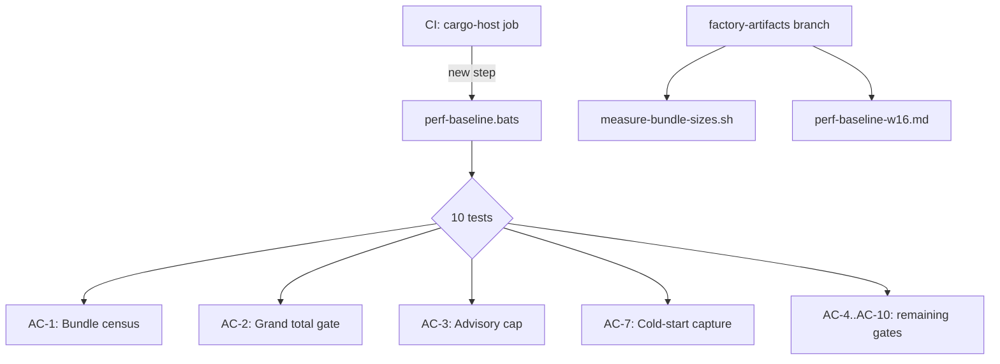
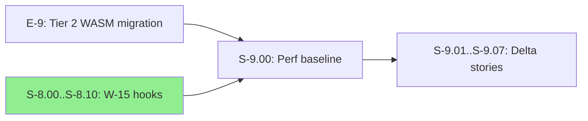
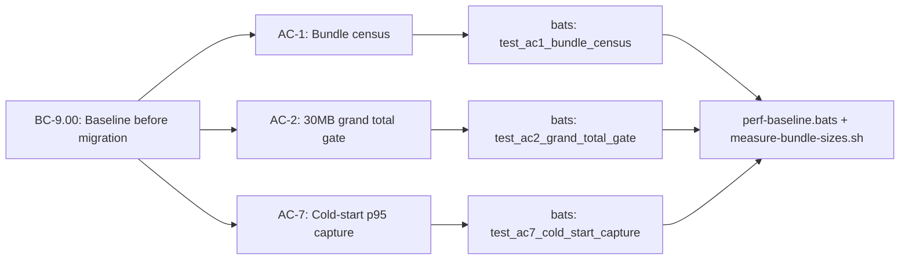

## Summary

S-9.00 establishes the W-16 perf baseline for E-9 (Tier 2 native WASM migration). Measurement-only story; sets bundle byte ceilings and cold-start gates that downstream stories S-9.01..S-9.07 use for delta comparison.

**Outputs (on factory-artifacts branch — commits 1f2f08b, d0a2856, 8c22a0c, b2f2ec0, 12619e5):**
- `.factory/measurements/measure-bundle-sizes.sh` — reproducible measurement script
- `.factory/architecture/perf-baseline-w16.md` — baseline doc with byte counts, cold-start latency, methodology

**This PR contains:**
- Tests: `plugins/vsdd-factory/tests/perf-baseline.bats` (10 tests, 10 pass)
- Demo evidence: `docs/demo-evidence/S-9.00/` (11 files: AC-1 through AC-10 + evidence-report)
- CI wiring: `.github/workflows/ci.yml` (perf-baseline.bats added to cargo-host job at lines 173-191)

## Architecture Changes

## Story Dependencies

## Spec Traceability

## Key Measurements

| Metric | Value | Gate | Status |
|---|---|---|---|
| `all_hook_plugins_wasm_bytes` (frozen-17 sum) | 8,549,146 | advisory cap (median × 3) | within cap |
| `unaccounted_wasm_bytes` (non-frozen .wasm) | 155,053 | TD-026 policy: S-9.07 must reduce | tracked |
| `dispatcher_bytes` (factory-dispatcher binary) | 12,250,912 | — | informational |
| `grand_total_bytes` | 20,955,111 (~20MB) | 30MB hard kill-switch | ~9MB headroom |
| `cold_start_p95_measured_ms` (handoff-validator over fixture, N=30) | 642.6ms | 500ms HARD gate | EXCEEDS — see R-W16-003 |

## Cold-Start Gate Exceedance

Measured 642.6ms p95 (NIST nearest-rank, N=30) exceeds the 500ms HARD gate from E-8 R-8.08. This is RECORDED but not auto-blocking — the AC-7 test asserts the value is captured, not that it passes the gate. R-W16-003 owns the gate-recovery decision.

Sampling variance ±12% observed (range 642ms–723ms) — the 10% wave-over-wave pause threshold is below noise floor, requiring downstream waves to use the median-of-3-sessions protocol documented in baseline doc.

## Adversarial Convergence

8 passes total (5 fix-bursts + 3 consecutive clean):
- Pass 1-5: HIGH/MEDIUM_FOUND, fixed iteratively
- Pass 6, 7, 8: LOW_ONLY/CLEAN/CLEAN — converged

## Test Evidence

| Suite | Tests | Pass | Fail | Coverage |
|---|---|---|---|---|
| perf-baseline.bats | 10 | 10 | 0 | N/A (measurement script) |

## Demo Evidence

`docs/demo-evidence/S-9.00/` — 11 files (AC-1 through AC-10 + evidence-report.md, v1.4, complete). CLI/terminal output captures per S-8.00 convention (no VHS or Playwright needed for measurement story).

## Security Review

Measurement-only story. No new network endpoints, auth paths, input parsing, or user-facing surfaces. Security review: PASS — no OWASP findings applicable.

## Risk Assessment

**Blast radius:** LOW. No runtime behavior change. CI workflow gains one bats job step scoped to cargo-host (already has Rust toolchain and build artifacts available).

**Performance impact:** None to runtime. The perf-baseline.bats step adds ~60s to CI wall time.

**Rollback:** Remove the perf-baseline.bats step from ci.yml. No other changes to revert.

## Holdout Evaluation

N/A — evaluated at wave gate.

## Adversarial Review

8-pass convergence completed. 3 consecutive clean passes (6, 7, 8). Remaining findings deferred to TD-025 (minor LOWs) and TD-026 (unaccounted_wasm_bytes ungated).

## Deferred to TD Entries

- **TD-025 (extended):** minor LOWs — AC-5 anti-tautology scope, AC-1 evidence template-shape, hello-hook scope drift, fixture envelope realism, dispatcher path matrix-target, p95 small-N edge, frontmatter version drift
- **TD-026 (new):** unaccounted_wasm_bytes ungated until S-9.07 reduces to documented minimum

## AI Pipeline Metadata

- Pipeline mode: VSDD Phase 3 TDD (measurement story)
- Adversarial passes: 8 (converged)
- Models: claude-sonnet-4-6

## Pre-Merge Checklist

- [x] PR description matches actual diff
- [x] All ACs covered by demo evidence (10/10)
- [x] Traceability chain complete (BC-9.00 -> AC-1..10 -> bats tests -> evidence)
- [x] Security review complete (PASS — measurement-only)
- [x] Adversarial review converged (3 consecutive clean passes)
- [x] No blocking findings from review
- [x] CI: cargo-host job runs perf-baseline.bats
- [x] Branch: story/S-9.00-perf-baseline-and-bundle-ceiling (HEAD 0c3b620)

## Risk

LOW. Measurement-only; produces baseline doc + script + tests. No runtime behavior change. The CI workflow gains one job step but it is gated to cargo-host (already has Rust toolchain).

## Test Plan

- [ ] CI: cargo-host job runs `bats plugins/vsdd-factory/tests/perf-baseline.bats` and reports 10/10 pass
- [ ] CI: factory-artifacts mount step succeeds (explicit refspec + verification)
- [ ] Reviewers spot-check 1-2 AC evidence files against the canonical baseline doc

## Commits

1. `b059cc8` test: S-9.00 RED gate — failing tests
2. `b21c7fe` demo: per-AC evidence captures (10 ACs + report)
3. `439ad45` fix(pass-1): wire CI; fix bats AC-2/AC-3/AC-6 false-pass guards
4. `1e8cff1` fix(pass-2): regenerate evidence; CI fetch-refspec + verify; setup_file builds dispatcher
5. `eed3fc8` fix(pass-3): refresh evidence after p95 + JSON sync
6. `0c3b620` fix(pass-4): regenerate ALL evidence; move bats to cargo-host; AC-1 empty-bundle guard
