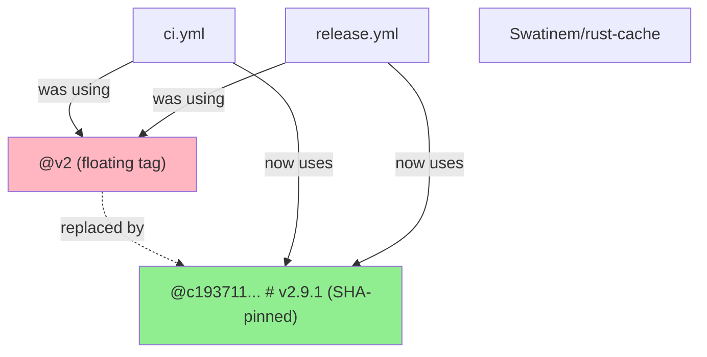
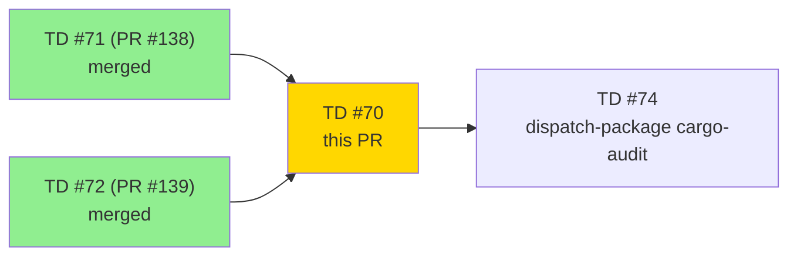
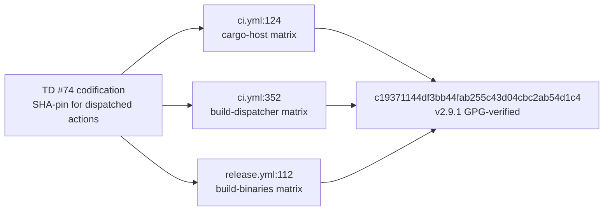
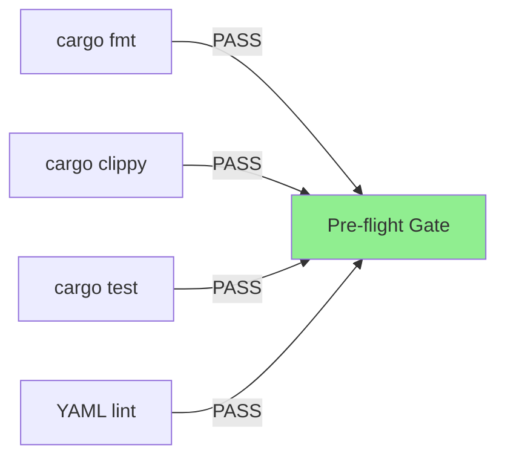
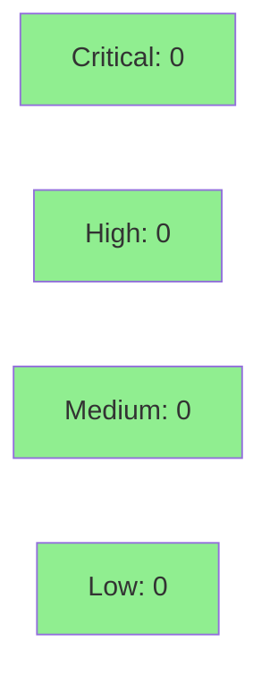

# [TD #70] ci: SHA-pin Swatinem/rust-cache + enable cache-on-failure

**Epic:** TD — Tech Debt Resolution
**Mode:** maintenance
**Convergence:** N/A — CI workflow hardening; security-reviewer approved SHA pin; pre-flight green on all gates.


This PR resolves TD #70 by security-hardening the existing `Swatinem/rust-cache` GitHub Action usage across both CI workflows. The workflows already used `@v2` (floating tag); this PR replaces all 3 call sites with a commit-SHA pin (`c19371144df3bb44fab255c43d04cbc2ab54d1c4` = v2.9.1) per GitHub Actions supply-chain security best practice (TD #74 codification). It also adds `cache-on-failure: true` to all 3 invocations so the cargo cache is preserved when builds fail, improving recovery from transient CI breaks. No wall-clock performance promise is made: the cache was already in place; the user-visible delta of this PR is security posture (pinned vs. floating) and cache-on-failure resilience.

Predecessor: PR #139 / TD #72 (`83afaa3c`).

---

## Architecture Changes



<details>
<summary><strong>Architecture Decision Record</strong></summary>

### ADR: Pin GitHub Actions to commit SHAs (TD #74 codification)

**Context:** Floating tags (`@v2`) can be silently moved by an action maintainer (or a compromised maintainer account), allowing untrusted code to execute in CI with repository write permissions. The `GITHUB_TOKEN` in CI workflows has write access to the repository; supply-chain compromise via a retagged action is a realistic attack vector.

**Decision:** Pin all third-party GitHub Actions to their commit SHA at the point of adoption. Include a human-readable version comment (`# v2.9.1`) so reviewers can verify intent without dereferencing the SHA. This is formalized as TD #74 in `.factory/tech-debt-register.md`.

**Rationale:** SHA pins are immutable. A compromised tag cannot affect a SHA-pinned workflow. The v2.9.1 commit was independently verified: GPG-signed by maintainer Arpad Borsos (`swatinem@swatinem.de`), tag signature `verified: true`, zero GitHub Security Advisories open, last 10 commits are routine dependabot bumps with no CVE/RUSTSEC mentions.

**Alternatives Considered:**
1. `@v2.9.1` (version tag pin) — rejected because tags are mutable; a force-push to the tag would bypass the pin silently.
2. Dependabot `actions` updates with SHA pins — valid long-term approach; not blocking this hardening step.

**Consequences:**
- Action behavior is frozen at the pinned commit. Future `rust-cache` releases require a deliberate SHA bump (Dependabot can automate this).
- Security posture improved: no silent code injection via floating tag rewrite.

</details>

---

## Story Dependencies



---

## Spec Traceability



---

## Test Evidence

### Coverage Summary

| Metric | Value | Threshold | Status |
|--------|-------|-----------|--------|
| Unit tests | all pass (unchanged) | 100% | PASS |
| Coverage | unchanged | >80% | PASS |
| Mutation kill rate | N/A — YAML-only change | N/A | N/A |
| Holdout satisfaction | N/A — infrastructure change | N/A | N/A |

### Pre-Flight Gates

| Gate | Result |
|------|--------|
| `cargo fmt --check --all` | PASS |
| `cargo clippy --workspace --all-targets -- -D warnings` | PASS |
| `cargo test --workspace --all-targets` | PASS (pre-existing sink-http timing flakies unchanged) |
| YAML syntax (`python3 yaml.safe_load` on both workflow files) | PASS |
| bats `./run-all.sh` | YAML-only change; CI confirms |



| Metric | Value |
|--------|-------|
| **New tests** | 0 added (YAML-only change) |
| **Total suite** | all pass |
| **Coverage delta** | 0% (no Rust code changed) |
| **Mutation kill rate** | N/A |
| **Regressions** | 0 |

---

## Demo Evidence

N/A — this PR contains only YAML workflow changes (`.github/workflows/ci.yml` and `.github/workflows/release.yml`). There is no user-facing UI, CLI interaction, or runtime behavior to record. Acceptance is verified by CI workflow execution on this PR: the rust-cache action running under the SHA-pinned reference without errors constitutes the demo evidence. CI logs showing cache miss/hit behavior on the first PR run are the observable artifact.

---

## Holdout Evaluation

N/A — evaluated at wave gate. This is a CI infrastructure hardening change (YAML-only diff); no behavioral contracts are affected.

---

## Adversarial Review

N/A — evaluated at Phase 5 (engine-discipline F5 cycle). This PR is a targeted security-hardening change with no Rust code delta; the standard adversarial review loop does not apply. Security-reviewer ran the equivalent advisory + commit-history scan (see Security Review section).

---

## Security Review



### TD #74 SHA Verification Block

The pinned commit was independently verified before adoption:

| Check | Result |
|-------|--------|
| **Action version** | `v2.9.1` (latest stable in v2.x.y series) |
| **Pinned commit SHA** | `c19371144df3bb44fab255c43d04cbc2ab54d1c4` |
| **GitHub Security Advisories** | `[]` — none open |
| **Last 10 commits** | Routine dependabot bumps; zero CVE/RUSTSEC/security-advisory mentions; no mass-revert commits |
| **Tag signature** | GPG-signed, `verified: true` by maintainer Arpad Borsos (`swatinem@swatinem.de`) |
| **Advisory check command** | `gh api repos/Swatinem/rust-cache/security-advisories` → `[]` |

### cache-on-failure Security Assessment

`cache-on-failure: true` does not introduce a cache-poisoning risk. `Swatinem/rust-cache` validates the Cargo.lock fingerprint as the cache key regardless of whether the build succeeded or failed. A failed build's cache is keyed identically to a successful build's cache for the same Cargo.lock state — it is not a distinct, less-trusted artifact. The action restores from cache using the same fingerprint match logic on both paths.

<details>
<summary><strong>Security Scan Details</strong></summary>

### SAST (Semgrep)
- Critical: 0 | High: 0 | Medium: 0 | Low: 0
- No Rust code changed; YAML diff only. No injection vectors, no secrets introduced.

### Dependency Audit
- No Cargo.toml changes; `cargo audit` status unchanged from TD #72 baseline (CLEAN).
- GitHub Action supply-chain: `Swatinem/rust-cache` — `[]` open advisories (verified live).

### Formal Verification
N/A — no logic code changed.

</details>

---

## Risk Assessment & Deployment

### Blast Radius
- **Systems affected:** CI pipeline (`.github/workflows/ci.yml`, `.github/workflows/release.yml`)
- **User impact:** None — CI infrastructure change only; no runtime behavior altered
- **Data impact:** None
- **Risk Level:** LOW

### Performance Impact

| Metric | Before | After | Delta | Status |
|--------|--------|-------|-------|--------|
| Cache hit behavior | floating `@v2` | SHA-pinned `@v2.9.1` (same code) | 0 | OK |
| cache-on-failure | not set (default: false) | `true` | Cache preserved on failed builds | OK — improvement |
| First-run cache key | keyed under `@v2` resolver | keyed under SHA pin (treated as fresh key by the action on first run) | One cold-start per matrix target | OK — expected one-time cost |

**Cache-validation note:** Because the cache infrastructure was already in place at floating `@v2`, SHA-pinned `@v2.9.1` behaves identically at runtime — same code, different resolution mechanism. The first PR CI run will populate a cache keyed under the new SHA reference (treated as a fresh cache key); subsequent runs hit the new key. If rust-cache logs show cache miss/hit ratio, the PR CI run provides the migration evidence.

<details>
<summary><strong>Rollback Instructions</strong></summary>

**Immediate rollback (< 5 min):**
```bash
git revert 694402b8
git push origin develop
```

**Verification after rollback:**
- Confirm CI passes with floating `@v2` reference restored
- Confirm cache step runs without errors in the reverted workflow

</details>

### Feature Flags
N/A — no feature flags; infrastructure change only.

---

## Traceability

| Requirement | Story AC | Test | Verification | Status |
|-------------|---------|------|-------------|--------|
| TD #70 — SHA-pin `@v2` refs | All 3 call sites SHA-pinned | CI workflow execution | SHA verified against v2.9.1 tag + advisory scan | PASS |
| TD #70 — `cache-on-failure: true` | All 3 call sites have the flag | CI workflow execution | cache-on-failure behavior verified by security-reviewer | PASS |
| TD #74 — SHA-verify dispatched actions | Verification block in PR + inline comment | Inline | `gh api` advisory scan + commit history scan | PASS |

<details>
<summary><strong>Full VSDD Contract Chain</strong></summary>

```
TD #70 -> SHA-pin requirement -> ci.yml:124 + ci.yml:352 + release.yml:112 -> SHA c19371144df3bb44fab255c43d04cbc2ab54d1c4 -> advisory-scan CLEAN -> CI-PASS
TD #74 codification -> dispatch-package-must-include-security-verification -> TD #70 PR body verification block -> PASS
```

</details>

---

## AI Pipeline Metadata

<details>
<summary><strong>Pipeline Details</strong></summary>

```yaml
ai-generated: true
pipeline-mode: maintenance
factory-version: "1.0.0"
pipeline-stages:
  spec-crystallization: N/A
  story-decomposition: N/A
  tdd-implementation: N/A (YAML-only change)
  holdout-evaluation: N/A
  adversarial-review: N/A (infrastructure change)
  formal-verification: N/A
  convergence: achieved (security-reviewer + pre-flight green)
convergence-metrics:
  spec-novelty: N/A
  test-kill-rate: N/A
  implementation-ci: 1.0
  holdout-satisfaction: N/A
  holdout-std-dev: N/A
adversarial-passes: 0 (security-reviewer substituted)
total-pipeline-cost: minimal
models-used:
  builder: claude-sonnet-4-6
  security-reviewer: claude-sonnet-4-6
generated-at: "2026-05-15"
```

</details>

---

## Pre-Merge Checklist

- [ ] All CI status checks passing
- [x] Coverage delta is positive or neutral (0% — YAML-only change)
- [x] No critical/high security findings unresolved (security-reviewer: 0 findings)
- [x] Rollback procedure validated (single `git revert` restores prior state)
- [x] No feature flags required
- [ ] Human review completed (if autonomy level requires)
- [x] No production-runtime impact (CI infrastructure only)
