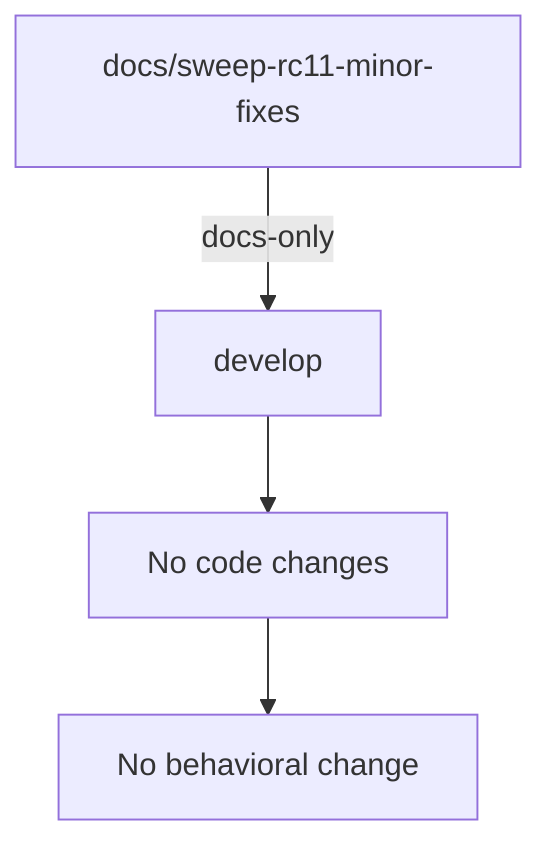
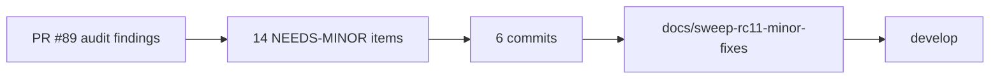

## Summary

Follow-up sweep to PR #89. Addresses 14 NEEDS-MINOR docs from yesterday's audit plus 2 follow-up findings from the PR #89 review.

### Commits

| Commit | Files | Change |
|---|---|---|
| `bac1730` | `cross-cutting-skills.md`, `pipeline-overview.md` | Renumber lingering Phase-5-formal-hardening references to Phase 6; rewrote pipeline-overview Phase 4-6 mermaid lump into 4 distinct subgraphs (4 holdout / 5 adversarial / 6 formal / 7 convergence) |
| `e7551ea` | `configuration.md`, `templates-reference.md`, `commands-reference.md` | Refresh stale counts (templates 126/127 → 136; skills 103 → 120). Hook count of 52 already correct in configuration.md — left alone. |
| `7c116ec` | `phase-5-adversarial-refinement.md` (×2), `phase-6-formal-hardening.md` (×1) | Three bare `/fix-pr-delivery` references prefixed with `vsdd-factory:`. Bare `/plugin*` and `/reload-plugins` left (Claude Code natives). |
| `ea31b5b` | `migrating-from-0.79.md`, `semver-commitment.md` | Reframed migration generator section as historical (past tense + status callout); semver lock target → 1.0.0 GA + operator note clarifying hooks.json is generated. |
| `04c2b6b` | `workflow-modes.md` | Reconcile greenfield step count 68 → 72 (verified via `lobster-parse '.workflow.steps | length' = 72`). pipeline-paths.md was already correct. |
| `e23c587` | `glossary.md` | Added "Remediation Burst" entry adjacent to "Burst" referencing TD-VSDD-053 single-commit semantics + `/vsdd-factory:state-burst`. |

## Out-of-scope (deferred)

- `observability.md` — large rewrite (whole "what shipped" framing is pre-v1.0); too big for sweep PR.
- `observability-sinks.md` — TODO sweep gated on story content fill.
- `authoring-hooks.md` — TODO placeholders gated on stories.
- `v1.0-index.md` — gated on S-5.07 v1.0 release gate landing.

## Risk

LOW. Docs-only. No code, tests, or CI workflow files touched. No behavioral change. Largest semantic correction is the pipeline-overview mermaid that previously lumped Phase 4-6 into one block (now split into 4 distinct phases reflecting current pipeline taxonomy).

## Architecture Changes

## Spec Traceability

## Test Evidence

Docs-only PR. No test suite changes. CI runs link-check and markdown lint only.

## Security Review

N/A — docs-only, no code paths, no data handling, no authentication surface.

## Pre-Merge Checklist

- [x] PR description matches actual diff
- [x] No code, tests, or CI workflow files touched
- [x] All 6 commits are docs-only
- [x] Deferred items documented with rationale
- [ ] CI green
- [ ] AI review: no blocking findings
- [ ] Branch deleted after merge

## Test Plan

- [ ] CI green
- [ ] No broken anchor links introduced
- [ ] Spot-read of mermaid diagram render (pipeline-overview.md) to verify the new subgraph structure renders correctly on GitHub
