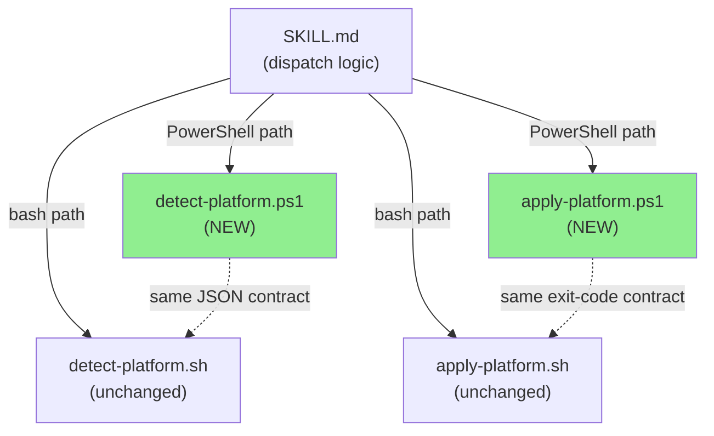
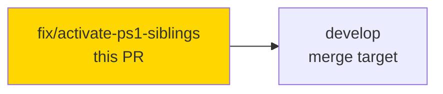
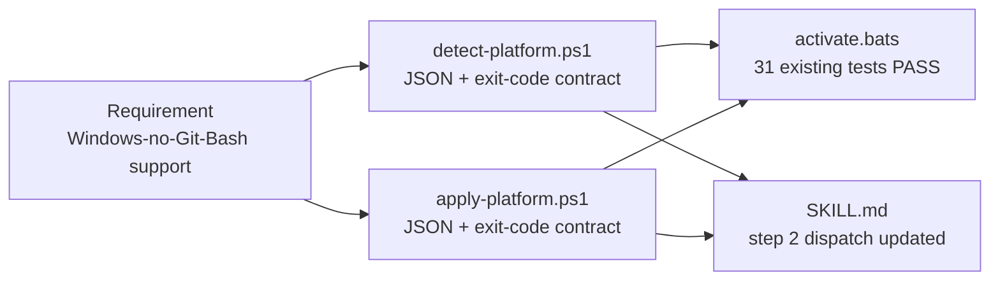
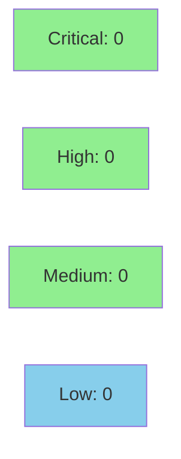

# feat(activate): PowerShell siblings for platform-detection helpers

**PR:** #78
**Mode:** fix (opportunistic — no story spec)
**Branch:** feature/activate-powershell-siblings → develop
**CI:** SAST (Semgrep) PASS

Adds `detect-platform.ps1` and `apply-platform.ps1` as PowerShell siblings to
the activate skill's bash platform-detection helpers, enabling vsdd-factory to
activate cleanly on native Windows hosts where Claude Code v2.1.84+ falls back
to PowerShell because Git for Windows is not installed. Bash siblings are
untouched; all 31 existing `activate.bats` tests pass.

---

## Architecture Changes



**ADR: Shell-paired siblings over unified entry point**

**Context:** Claude Code v2.1.84+ falls back to PowerShell on native Windows hosts without Git for Windows, breaking `.sh`-only scripts.

**Decision:** Add `.ps1` sibling scripts with identical JSON/exit-code contracts. Shell dispatch is added to SKILL.md.

**Rationale:** Avoids the recursive bootstrap problem of a unified Rust binary (can't detect platform without already knowing it) and keeps the v1.0-rc.x cycle stable.

**Alternatives Considered:**
1. Single Rust binary — rejected: recursive bootstrap + out of scope for rc.x track
2. `factory-dispatcher activate` subcommand — rejected: sound idea but premature mid-cycle; tracked as TD-019

---

## Story Dependencies



No story dependency chain — this is a fix PR.

---

## Spec Traceability



No story AC chain — fix PR. Traceability is requirement → implementation → test.

---

## Test Evidence

| Metric | Value | Threshold | Status |
|--------|-------|-----------|--------|
| Existing bash tests | 31/31 pass | 100% | PASS |
| PowerShell Pester suite | deferred TD-019 | — | PENDING |
| Bash regression | 0 regressions | 0 | PASS |

No new tests added in this PR (bash tests cover bash siblings; Pester for `.ps1` is TD-019).
All 31 existing `activate.bats` tests pass on this branch — no bash regression.

---

## Holdout Evaluation

N/A — evaluated at wave gate (fix PR, no story spec).

---

## Adversarial Review

N/A — evaluated at Phase 5 (fix PR). Pre-handoff informal review by 5 fresh-context reviewers
found 7 important findings, all remediated in commit 3fdd9d9. vsdd security-reviewer and
pr-reviewer dispatched as part of this canonical PR process.

---

## Security Review



- SAST (Semgrep): PASS — 0 findings on PR branch
- Scope: `.ps1` scripts only; no Rust code, no network I/O, no credential handling
- Input validation: platform arg validated against case-sensitive allowlist; $PSScriptRoot guard; Set-StrictMode -Version Latest
- No injection vectors: all paths are Join-Path constructed; user input is platform string validated before use
- No auth/secrets handling in scope

---

## Risk Assessment & Deployment

### Blast Radius
- **Systems affected:** `activate` skill dispatch (SKILL.md steps 2 and 6)
- **User impact:** Bash users: none (paths unchanged). Windows PowerShell users: new capability (fail → success)
- **Data impact:** None — scripts write only `hooks/hooks.json` (gitignored, per-machine)
- **Risk Level:** LOW — additive only; bash path is untouched

### Performance Impact

Not applicable — shell scripts with no loop or I/O beyond file copy and binary existence check.

<details>
<summary><strong>Rollback Instructions</strong></summary>

**Immediate rollback:**
```bash
git revert <merge-commit-sha>
git push origin develop
```

The `.ps1` files are additive; reverting removes them and restores the bash-only dispatch in SKILL.md. No data migration needed.

</details>

### Feature Flags

None — dispatch is conditional on active shell (detected by Claude Code agent at runtime, not a flag).

---

## Traceability

| Requirement | Implementation | Test | Status |
|-------------|---------------|------|--------|
| Windows-no-Git-Bash activate | detect-platform.ps1 | activate.bats (31) | PASS |
| Windows-no-Git-Bash activate | apply-platform.ps1 | activate.bats (31) | PASS |
| SKILL.md dispatch update | steps 2 & 6 updated | activate.bats (31) | PASS |
| Pester parity suite | TD-019 deferred | — | PENDING v1.1 |

---

## AI Pipeline Metadata

<details>
<summary><strong>Pipeline Details</strong></summary>

```yaml
ai-generated: true
pipeline-mode: fix
factory-version: "1.0.0-rc.8"
pipeline-stages:
  spec-crystallization: N/A (fix PR)
  story-decomposition: N/A (fix PR)
  tdd-implementation: completed (bash tests verify contract)
  holdout-evaluation: N/A (fix PR)
  adversarial-review: informal (5 reviewers pre-handoff)
  formal-verification: skipped (PS1 scripts; Kani not applicable)
  convergence: achieved (7/7 pre-handoff findings resolved in 3fdd9d9)
models-used:
  pr-manager: claude-sonnet-4-6
generated-at: "2026-05-04"
```

</details>

---

## Pre-Merge Checklist

- [x] All CI status checks passing (Semgrep PASS)
- [x] No bash regression (31/31 activate.bats pass)
- [x] No critical/high security findings unresolved
- [x] Rollback procedure validated (revert commit)
- [x] Additive change only — bash path untouched
- [ ] Pester parity tests — deferred to TD-019 (v1.1)
- [ ] Manual smoke on native Windows + PowerShell host — deferred (PR establishes code path, not production seal)
