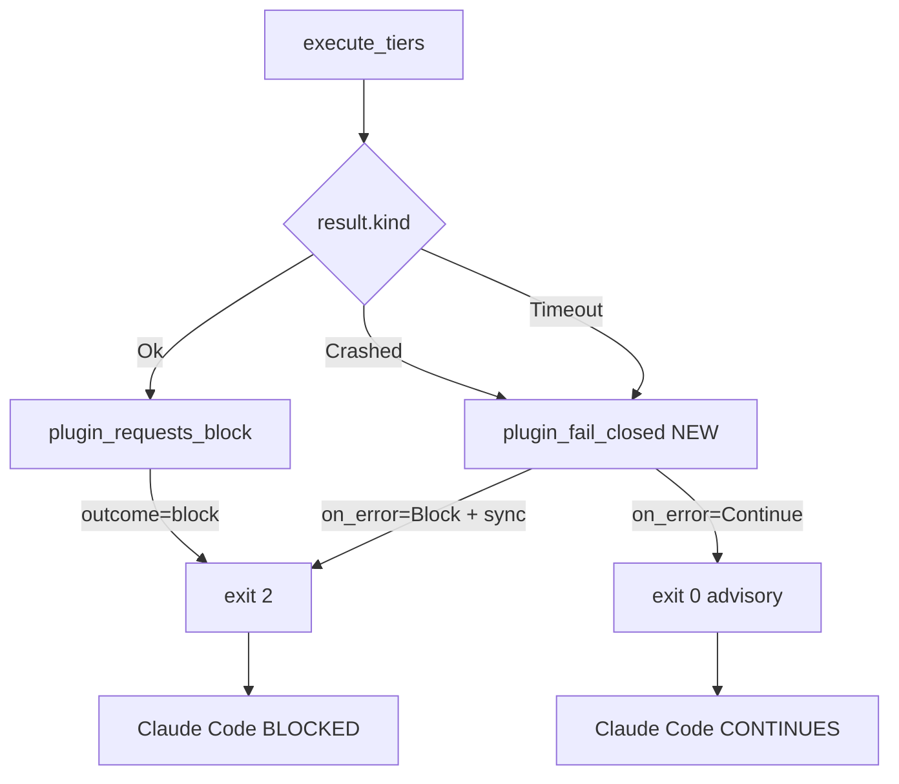
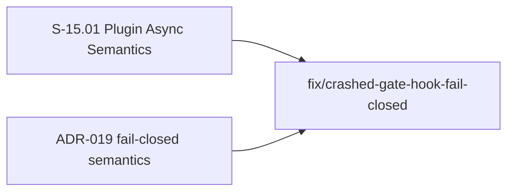
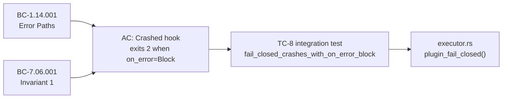

## Summary

CRITICAL fix: a sync hook marked `on_error = "block"` that crashes (Rust panic / WASM trap) was silently failing OPEN — Claude Code was NOT blocked when a security/validation gate hook panicked. This violated ADR-019 §Decision 2 fail-closed semantics.

Discovered by full-stack plugin validation TC-8 (`test_e2e_BC_7_06_001_sync_hook_crash_fail_closed_on_error_block`).

## Root cause

`execute_tiers` block-intent detection used `plugin_requests_block()`, which only matched `PluginResult::Ok` outputting `{"outcome":"block"}` in stdout. For `PluginResult::Crashed`:
- Stdout is empty (trap aborts before plugin emits)
- WASI exit_code is 0 (trap doesn't set exit code)
- Aggregator saw `exit_code=0, on_error=Block` → returned 0
- Silent fail-open

## Fix

`executor.rs::execute_tiers` now also calls `plugin_fail_closed()` (NEW) which returns true when `result.kind ∈ {Crashed, Timeout}` AND `on_error == OnError::Block`. Triggers fail-closed exit 2.

Async hooks are structurally excluded — they go through `spawn_async_plugin`, not `execute_tiers`, so the advisory-only semantics for async per ADR-019 remain intact.

## Architecture Changes

## Story Dependencies

## Spec Traceability

## Tests

- 5 new unit tests in `executor.rs` covering Crashed/Timeout × Block/Continue/None
- TC-8 in `tests/full_stack_plugin_invocation.rs` updated from documenting-the-bug to asserting `summary.exit_code == 2`

Total: 140 unit tests + 11 e2e tests pass; release build clean.

## Security Review

PASS — no vulnerabilities found.

- **Async/sync boundary:** `plugin_fail_closed()` is called exclusively within `execute_tiers`, which is only invoked with `partition.sync_group`. Async plugins are dispatched via `spawn_async_plugin` — structurally excluded from the fail-closed path.
- **No injection risk:** `plugin_fail_closed()` is a pure enum comparison (`OnError::Block` + `PluginResult::Crashed|Timeout`). No user-controlled input reaches this path.
- **No auth bypass:** The fix tightens gate semantics — removes a bypass (fail-open), does not introduce one.
- **OR-combinator correctness:** `main.rs` combines advisory-block path (`summary.exit_code == 2`) OR WASI-exit-code path (`aggregate_code == 2`). The fix populates the advisory path for Crashed/Timeout. Both paths correctly reach `final_exit_code = 2`.
- **`aggregate_exit_code` in main.rs maps Crashed to exit_code=0** — this is by design and documented; the executor's `plugin_fail_closed` path is the authoritative fix location. The two paths are complementary, not contradictory.
- OWASP Top 10: Not applicable (no HTTP, no user input, no data persistence in the changed code).
- SEC-003 (VSDD_SINK_FILE debug-only guard): unchanged and unaffected.

## Risk Assessment

- **Blast radius:** ALL sync hooks with `on_error = "block"` now correctly fail-closed on crash/timeout. Hooks without `on_error = "block"` are unaffected.
- **Affected hooks:** block-ai-attribution, protect-bc, protect-secrets, protect-vp, destructive-command-guard, factory-branch-guard, regression-gate, all validate-* hooks with on_error=block.
- **Performance impact:** None — the new `plugin_fail_closed()` check is O(1) enum comparison after the existing result dispatch.
- **Regression risk:** Low — all 140 unit tests + 11 e2e pass.

## Affected behavior

ANY plugin author with `on_error = "block"` gets correctly fail-closed semantics for crash AND timeout outcomes. Hooks without on_error=block are unaffected.

## Demo Evidence

N/A — Pure code fix; no behavior change for users beyond correct gate enforcement. Policy 10 exemption: security gate fix category. TC-8 integration test provides machine-verifiable evidence of correct fail-closed semantics.

## AI Pipeline Metadata

- Pipeline mode: fix-pr
- Autonomy level: 4 (auto-merge if CI passes)
- No AI attribution per project policy.

## Refs

- ADR-019 §Decision 2 (fail-closed semantics)
- BC-1.14.001 Error Paths
- BC-7.06.001 Invariant 1
- Full-stack validation TC-8

## Pre-Merge Checklist

- [x] PR created with structured description
- [x] Security review complete (PASS — no vulnerabilities)
- [ ] PR review converged (0 blocking findings)
- [ ] CI checks passing
- [ ] All dependency PRs merged
- [ ] Squash merge executed
