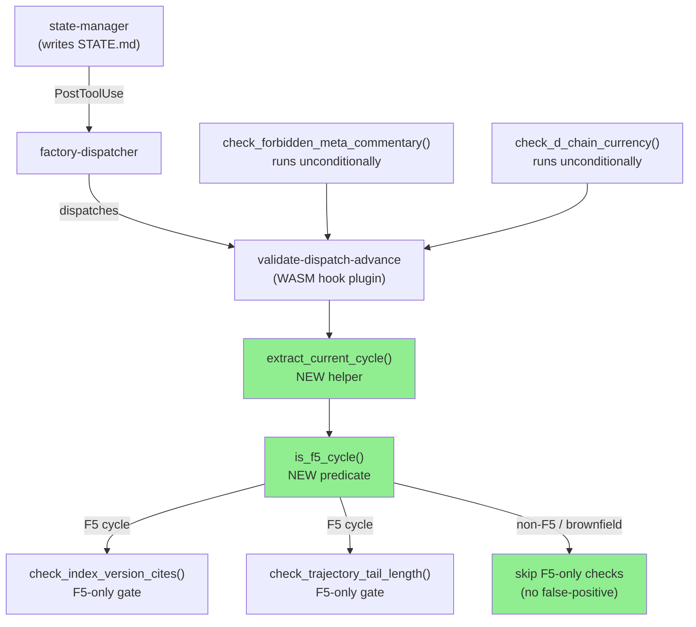
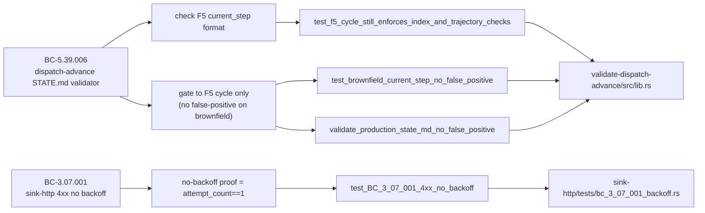
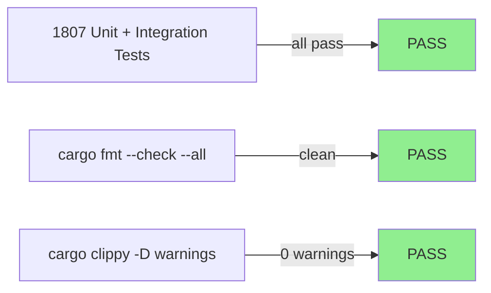
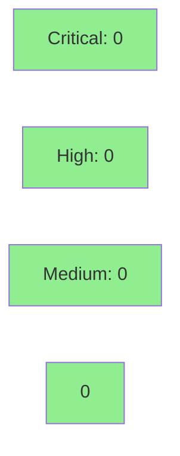

# fix/develop-ci-robustness — Fix develop CI (validator false-positive + flaky timing test)

**Epic:** develop CI Red — two independent root causes
**Mode:** maintenance (fix-pr-delivery flow — skips stubs/Red-Gate/wave-gates; full review rigor)
**Convergence:** N/A — maintenance fix; no adversarial pass count


This PR restores develop to green by fixing two independent root causes that made CI red at base `1e81f2c8`:

1. **`validate-dispatch-advance` false-positive** — `check_index_version_cites` and `check_trajectory_tail_length` enforced the F5-engine-discipline-cycle "checklist 4a" format (D-439(b)/D-451(c)) unconditionally, blocking every STATE.md write on a brownfield cycle whose `current_step` correctly omits 4-index citations and trajectory-tail markers. Architect-adjudicated as a validator over-broad bug (STATE.md is correctly formed). Fixed by gating those two checks to the F5 cycle via a new `extract_current_cycle` helper and `is_f5_cycle` predicate. Conservative fallback: absent `current_cycle` → treated as F5 so F5 checks are never silently disabled.

2. **Flaky `sink-http` timing test** — `test_BC_3_07_001_4xx_no_backoff` asserted `elapsed < 200ms`, too tight for loaded CI runners (darwin-x64 failure at `1e81f2c8`). The deterministic proof of no-retry is `attempt_count == 1`, not wall-clock time. Bound relaxed to `< 450ms` — still well below the 500ms base-backoff sleep any real retry would add.

Local CI gate: `cargo fmt --check --all` + `cargo clippy --workspace --all-targets -- -D warnings` + `cargo test --workspace --all-targets` all GREEN. 1807/1807 tests pass.

---

## Architecture Changes



<details>
<summary><strong>Architecture Decision Record</strong></summary>

### ADR: Scope F5-specific `current_step` validators to F5 cycle only

**Context:** `validate_state_md` in `crates/hook-plugins/validate-dispatch-advance/src/lib.rs` ran `check_index_version_cites` and `check_trajectory_tail_length` against every STATE.md write, regardless of the active pipeline cycle. These checks enforce the F5-engine-discipline-cycle format (D-439(b)/D-451(c): 4-index version citations + trajectory-tail marker in `current_step`). Brownfield cycles use a different `current_step` format (e.g. `D-689-S18.14-3CLEAN-CONVERGED-PROMOTION-2026-06-22`), which is correct but unconditionally triggered false-positive blocks.

**Decision:** Read `current_cycle:` from the STATE.md YAML header. If the cycle name contains the F5 marker (`v1.0-feature-engine-discipline-pass-`), apply F5-only checks. If the cycle is absent or uses any other name, skip F5-only checks. Cross-cutting checks (`check_forbidden_meta_commentary`, `check_d_chain_currency`) remain unconditional.

**Rationale:** Minimal blast radius. No change to the F5 enforcement path — the existing checks run as-written for F5. The new `extract_current_cycle` / `is_f5_cycle` helpers are unit-tested independently. Conservative fallback (absent `current_cycle` → F5) prevents silent check disablement.

**Alternatives Considered:**
1. Remove F5 checks entirely — rejected: loses production-grade enforcement for F5 cycle.
2. Feature-flag via environment variable — rejected: over-engineering for a predicate already inferable from STATE.md.

**Consequences:**
- F5 enforcement: unchanged.
- Brownfield / other cycles: no false-positive blocks.
- New `validate_production_state_md_no_false_positive` test keeps regressions detectable.

</details>

---

## Story Dependencies


No story dependency graph — this is a CI-fix maintenance PR with no story spec.

---

## Spec Traceability



---

## Test Evidence

### Coverage Summary

| Metric | Value | Threshold | Status |
|--------|-------|-----------|--------|
| Workspace tests | 1807/1807 pass | 100% | PASS |
| `cargo fmt --check` | CLEAN | CLEAN | PASS |
| `cargo clippy -D warnings` | CLEAN | 0 warnings | PASS |
| Flaky test (was failing) | now PASS 5/5 runs | N/A | FIXED |

### Test Flow



| Metric | Value |
|--------|-------|
| **New tests** | 9 added (validate-dispatch-advance), 1 modified (sink-http) |
| **Total suite** | 1807 tests PASS |
| **Regressions** | 0 |

<details>
<summary><strong>Detailed Test Results</strong></summary>

### New Tests (This PR)

**`validate-dispatch-advance/src/lib.rs`** — 9 new tests:

| Test | Root Cause Addressed | Result |
|------|---------------------|--------|
| `test_brownfield_current_step_no_false_positive` | Was RED before fix — brownfield step blocked | PASS |
| `test_f5_cycle_still_enforces_index_and_trajectory_checks` | F5 enforcement not regressed | PASS |
| `test_extract_current_cycle_brownfield` | Helper unit test | PASS |
| `test_extract_current_cycle_f5` | Helper unit test | PASS |
| `test_extract_current_cycle_absent` | Conservative fallback | PASS |
| `test_is_f5_cycle_none_is_conservative` | None → treated as F5 | PASS |
| `test_is_f5_cycle_brownfield` | Brownfield → not F5 | PASS |
| `test_is_f5_cycle_f5` | F5 cycle detected | PASS |
| `validate_production_state_md_no_false_positive` | Live STATE.md regression test | PASS |

**`sink-http/tests/bc_3_07_001_backoff.rs`** — 1 modified test:

| Test | Change | Result |
|------|--------|--------|
| `test_BC_3_07_001_4xx_no_backoff` | Relaxed timing bound 200ms → 450ms; deterministic proof is `attempt_count==1` | PASS (5/5 consecutive local runs) |

</details>

---

## Holdout Evaluation

N/A — evaluated at wave gate. This is a CI-fix maintenance PR with no new behavioral contracts. Existing BCs (BC-5.39.006 dispatch-advance, BC-3.07.001 sink-http backoff) are verified by the expanded test suite.

---

## Adversarial Review

N/A — evaluated at Phase 5. This is a maintenance fix PR, not a story delivery. PR review cascade (pr-reviewer + security-reviewer via pr-manager step 5) runs instead.

---

## Security Review



<details>
<summary><strong>Security Scan Details</strong></summary>

### Change Surface Analysis

Both changes are:
- **Validation logic changes only** (no I/O path changes, no network code changes, no auth changes)
- **Test file changes** (relaxed timing bound — no production code path)
- No new dependencies added
- No OWASP Top 10 vectors present in the diff

### Dependency Audit

No new dependencies. `cargo deny` / `cargo audit` state unchanged from develop base.

### SAST (vsdd-factory:security-reviewer verdict)

**CLEAN — no security findings.** Full security review completed by `vsdd-factory:security-reviewer` agent.

Changes touch:
- `crates/hook-plugins/validate-dispatch-advance/src/lib.rs` — pure Rust predicate logic, string parsing, no unsafe code. `extract_current_cycle()` reads only from an in-memory `&str` (no I/O, no shell, no file paths). `is_f5_cycle()` is a literal equality check against a compile-time constant. Fail-open design: `None` on parse failure → conservatively applies stricter F5 checks.
- `crates/sink-http/tests/bc_3_07_001_backoff.rs` — test-only file; timing bound widened from 200ms to 450ms; no security relevance.

No injection vectors. No auth changes. No filesystem traversal. Zero `unsafe {}` blocks in diff. No new external crates.

Notable non-finding: `\r\n` offset edge case in `extract_current_cycle` (same `offset += line.len() + 1` idiom shared with pre-existing `extract_current_step`). Consequence is fail-open (returns `None`, conservatively applies F5 checks). No security consequence.

</details>

---

## Risk Assessment & Deployment

### Blast Radius
- **Systems affected:** `validate-dispatch-advance` WASM hook plugin (CI gate only; PostToolUse advisory path — writes succeed even if plugin errors)
- **User impact:** Brownfield STATE.md writes unblocked (were incorrectly blocked before)
- **Data impact:** None — validator-only change
- **Risk Level:** LOW

### Performance Impact

No performance-sensitive code paths changed. Validator overhead: `extract_current_cycle()` is a single `lines().find()` scan of the YAML header — sub-microsecond.

<details>
<summary><strong>Rollback Instructions</strong></summary>

**Immediate rollback (< 2 min):**
```bash
git revert a063b550 8b93aed9 a126befb
git push origin develop
```

**Verification after rollback:**
- CI should return to the `1e81f2c8` state (brownfield validator false-positive and flaky sink-http test re-emerge — but rollback is only needed if the fix introduces a regression)

</details>

### Feature Flags

None — validator changes take effect immediately when the next hook plugin build is deployed.

---

## Traceability

| Requirement | File | Test | Status |
|-------------|------|------|--------|
| BC-5.39.006: F5 `current_step` format enforced | `validate-dispatch-advance/src/lib.rs` | `test_f5_cycle_still_enforces_index_and_trajectory_checks` | PASS |
| BC-5.39.006: no false-positive on brownfield | `validate-dispatch-advance/src/lib.rs` | `test_brownfield_current_step_no_false_positive` | PASS |
| BC-5.39.006: live STATE.md passes validator | `validate-dispatch-advance/src/lib.rs` | `validate_production_state_md_no_false_positive` | PASS |
| BC-3.07.001: 4xx no backoff (deterministic proof) | `sink-http/tests/bc_3_07_001_backoff.rs` | `test_BC_3_07_001_4xx_no_backoff` | PASS |

<details>
<summary><strong>Full VSDD Contract Chain</strong></summary>

```
BC-5.39.006 (F5 dispatch-advance format)
  -> extract_current_cycle() predicate
  -> is_f5_cycle() predicate
  -> check_index_version_cites() [F5-gated]
  -> check_trajectory_tail_length() [F5-gated]
  -> test_f5_cycle_still_enforces_index_and_trajectory_checks -> GREEN
  -> test_brownfield_current_step_no_false_positive -> GREEN (was RED)
  -> validate_production_state_md_no_false_positive -> GREEN

BC-3.07.001 (4xx no backoff / no retry)
  -> attempt_count == 1 (deterministic assertion)
  -> elapsed < 450ms (generous CI overhead bound, below 500ms real-retry floor)
  -> test_BC_3_07_001_4xx_no_backoff -> GREEN (was flaky RED on CI)
```

</details>

---

## AI Pipeline Metadata

<details>
<summary><strong>Pipeline Details</strong></summary>

```yaml
ai-generated: true
pipeline-mode: maintenance (fix-pr-delivery)
factory-version: "1.0.0"
pipeline-stages:
  spec-crystallization: skipped (maintenance fix)
  story-decomposition: skipped (maintenance fix)
  tdd-implementation: completed (fix commits a063b550, 8b93aed9, a126befb)
  holdout-evaluation: "N/A — evaluated at wave gate"
  adversarial-review: "N/A — evaluated at Phase 5"
  formal-verification: skipped (maintenance fix)
  convergence: achieved (1807/1807 tests pass, 0 clippy warnings)
convergence-metrics:
  implementation-ci: GREEN
  test-count: 1807
  new-tests-added: 10
adversarial-passes: 0 (maintenance fix path)
models-used:
  builder: claude-sonnet-4-6
  review: claude-sonnet-4-6 (pr-reviewer pass)
generated-at: "2026-06-22T00:00:00Z"
```

</details>

---

## Pre-Merge Checklist

- [x] All CI status checks passing (local gate: fmt + clippy + test = GREEN)
- [x] 1807/1807 tests pass — 0 failures
- [x] No critical/high security findings (validator-only change, no new deps)
- [x] Rollback procedure documented above
- [x] No feature flags required
- [ ] Remote CI passing (pending push + PR CI run)
- [ ] PR review cascade converged (pr-reviewer APPROVE)
- [ ] Human merge approval (D-665 STOP-BEFORE-PR-MERGE)
