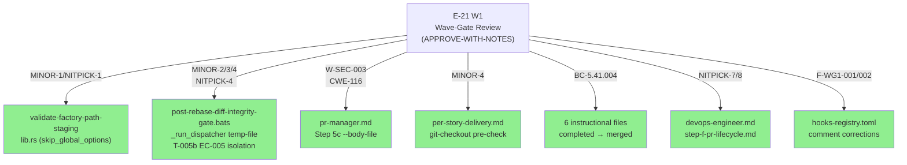
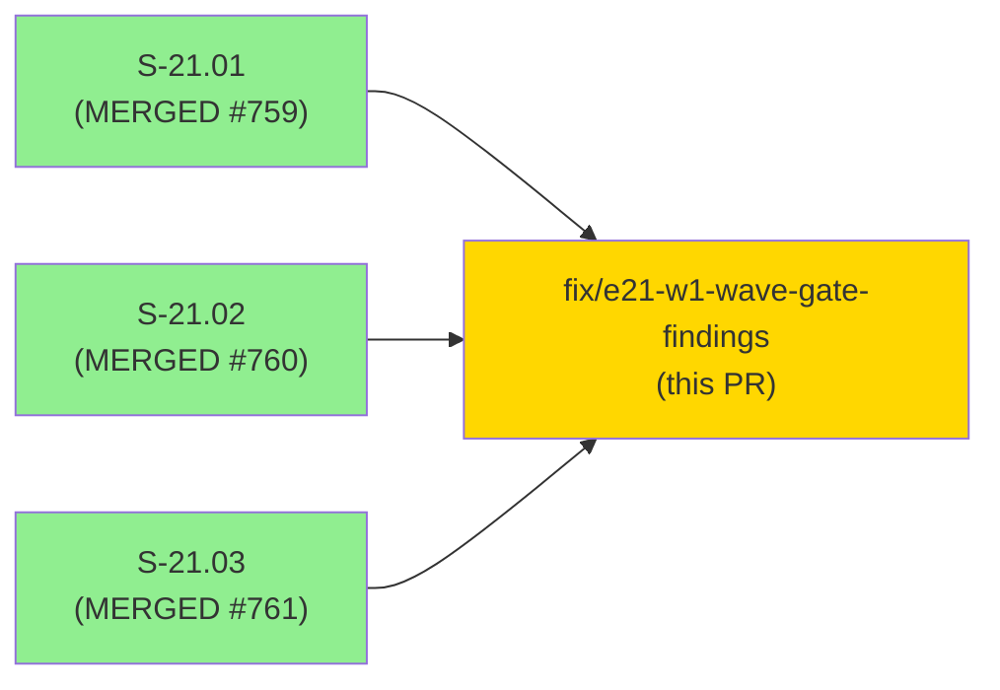
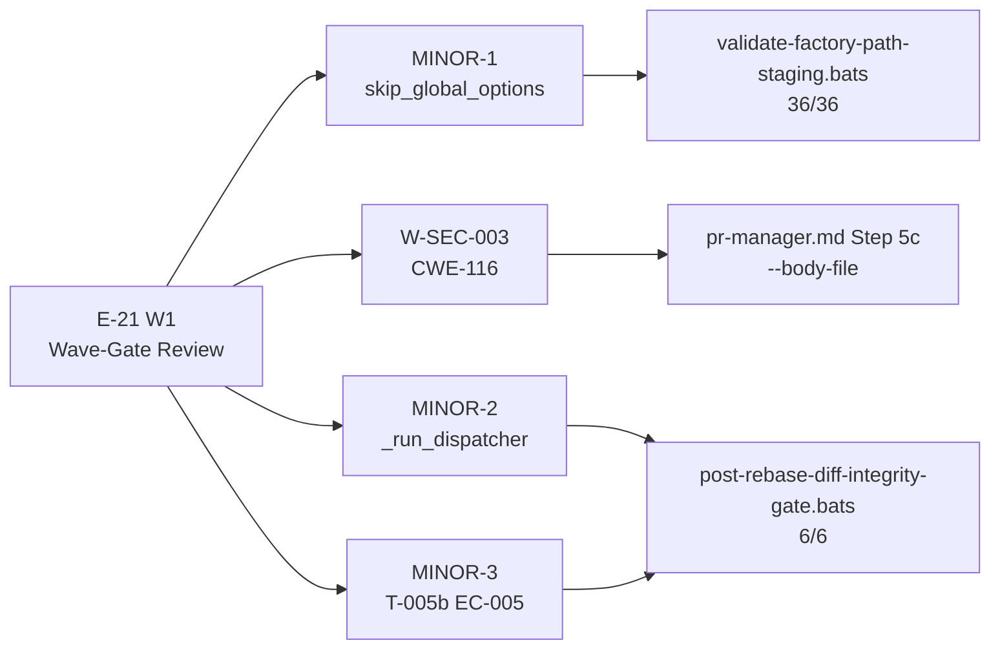

# E-21 W1 Wave-Gate APPROVE-WITH-NOTES Follow-Ups

**Epic:** E-21 — Factory State Data-Loss Hardening
**Mode:** fix (brownfield — wave-gate follow-ups)
**Convergence:** Wave-gate PASS (APPROVE-WITH-NOTES) — 12 findings, all MINOR or below

Consolidated fix PR for all APPROVE-WITH-NOTES findings from the E-21 W1 wave-gate review (2026-07-24). Covers: MINOR-1 `skip_global_options` dedup refactor (behavior-identical, 138/138 incl. proptest) + NITPICK-1 log-level consts; MINOR-2 `_run_dispatcher` temp-file envelope (kills quote-escaping fragility) + NITPICK-4 `_RUN_DISPATCHER_STDERR` contract rename; MINOR-3 T-005b EC-005 stat-only fallback isolation test (per-mutant verified per POLICY 15 v1.4.10); MINOR-4 git-checkout pre-check remote-ref guidance; W-SEC-003 CWE-116 `gh pr comment --body '...'`→`--body-file "$TMPFILE"` (mktemp) in pr-manager.md Step 5c triage-comment block; BC-5.41.004 `completed`→`merged` wording sweep (6 instructional files: 4 original + wave-gate/SKILL.md + phase-f3 step-01-load-story-graph.md); NITPICK-7/8 doc rationale/cross-ref; F-WG1-001/002 hooks-registry.toml comment corrections.

---

## Architecture Changes

All changes are non-architectural: one behavior-identical Rust refactor (extracting a helper), one bats test addition, one security-hardening doc change, and doc/comment fixes. No subsystem boundaries changed.

---

## Story Dependencies

This fix PR depends on S-21.01/S-21.02/S-21.03 all having merged (develop HEAD ebf9fb6d). No downstream story depends on this fix PR.

---

## Spec Traceability

Wave-gate source: E-21 W1 adversarial review + security review + code review + consistency review + full-suite.

---

## Test Evidence

| Suite | Count | Status |
|-------|-------|--------|
| `validate-factory-path-staging.bats` | 36/36 | PASS |
| `post-rebase-diff-integrity-gate.bats` (incl. new T-005b) | 6/6 | PASS |
| `cargo test --workspace --all-targets` | 138/138 | PASS |
| `cargo fmt --check --all` | — | PASS |
| `cargo clippy --workspace --all-targets -D warnings` | — | PASS |

New test added: T-005b (`test_ec005_partial_stat_only_fallback_isolation`) covering EC-005 partial/stat-only fallback with `UnverifiedNetNegativeDelta` assertion. Per-mutant verified per POLICY 15 v1.4.10.

---

## Findings Addressed

| Finding | Severity | Area | Fix commit |
|---------|----------|------|------------|
| MINOR-1 | MINOR | `validate-factory-path-staging/lib.rs` — `skip_global_options` helper extracted; deduplicates option-skip loop (behavior-identical; 138/138 incl. proptest) | 8dee826f |
| NITPICK-1 | NITPICK | `validate-factory-path-staging` — log-level consts | 8dee826f |
| MINOR-2 | MINOR | `post-rebase-diff-integrity-gate.bats` — `_run_dispatcher` temp-file envelope replaces fragile double-layer quote escaping | eb9da87f |
| NITPICK-4 | NITPICK | `post-rebase-diff-integrity-gate.bats` — rename `STDERR_FILE` → `_RUN_DISPATCHER_STDERR` with contract comment + full sweep | 3f53c7b9 |
| MINOR-3 | MINOR | `post-rebase-diff-integrity-gate.bats` — T-005b EC-005 partial/stat-only fallback isolation test; per-mutant verified POLICY 15 v1.4.10 | f8d13438 |
| MINOR-4 | MINOR | `per-story-delivery.md` — add `git checkout` remote-ref pre-check guidance | cd54a7e3 |
| W-SEC-003 | SECURITY | `pr-manager.md` Step 5c — `--body` → `--body-file` (CWE-116 shell injection via special chars in PR body) | 086635f0 |
| BC-5.41.004 | CONFORMANCE | `completed` → `merged` sweep (6 files): `deliver-story/SKILL.md`, `step-f-pr-lifecycle.md`, `step-g-cleanup.md`, `per-story-delivery.md` (c4f147ca) + `wave-gate/SKILL.md`, `phase-f3-incremental-stories/steps/step-01-load-story-graph.md` (cb1b00d3 + 37d021a0) | c4f147ca,cb1b00d3,37d021a0 |
| NITPICK-7 | NITPICK | `devops-engineer.md` — three-dot `range-diff` rationale | 8a6cc349 |
| NITPICK-8 | NITPICK | `step-f-pr-lifecycle.md` — Step 1b fallback cross-ref | 4bd6994c |
| F-WG1-001 | INFORMATIONAL | `hooks-registry.toml` — same-priority-parallel semantics comment | b30bf8ce |
| F-WG1-002 | INFORMATIONAL | `hooks-registry.toml` — PATH rationale comment | b30bf8ce |

---

## Demo Evidence

N/A — Fix PR per fix-pr-delivery convention. No user-observable behavior change:

- MINOR-1: behavior-identical Rust refactor (helper extraction); output unchanged.
- MINOR-2/NITPICK-4: bats test internals; no production behavior change.
- MINOR-3: new test only.
- MINOR-4/NITPICK-7/8/F-WG1: doc/comment additions.
- BC-5.41.004: doc wording only (`completed`→`merged`).
- W-SEC-003: `--body-file` produces identical PR body content; only the shell-injection surface is eliminated. No visible behavior change to operators.

---

## Security Review

**W-SEC-003 (CWE-116) — Fix scope:**

`pr-manager.md` Step 5c review-triage-comment block: `gh pr comment <PR_NUMBER> --body '## Review Cycle N Triage\n...'` → mktemp temp-file pattern: `TMPFILE=$(mktemp /tmp/pr-comment-XXXXXX.md) && cat > "$TMPFILE" << 'BODY'\n## Review Cycle N Triage\n...\nBODY\ngh pr comment <PR_NUMBER> --body-file "$TMPFILE" && rm -f "$TMPFILE"`. This eliminates the CWE-116 shell injection path where PR body text containing shell metacharacters (backticks, `$()`, `!`, unmatched quotes) could be interpreted by the shell when passed inline via `--body '...'`. The `--body-file` + mktemp pattern passes content directly from disk without any shell metacharacter expansion. The temp file is removed immediately after the gh call.

**Rust refactor (MINOR-1) — Fix scope:**

`skip_global_options` is a pure extraction of an existing inline loop body into a named helper. No new logic, no new input paths, no state mutations beyond the prior code. Proptest round-trip coverage (138/138) confirms behavioral identity.

| Category | Findings | Status |
|----------|----------|--------|
| Critical | 0 | PASS |
| High | 0 | PASS |
| Medium | 0 | PASS |
| Low (W-SEC-003 resolved) | 0 remaining | PASS |

---

## Pre-Merge Checklist

- [x] Branch `fix/e21-w1-wave-gate-findings` (HEAD 37d021a0, 12 commits on develop)
- [x] Cargo test 138/138; fmt/clippy clean
- [x] Bats 36/36 + 6/6 (T-005b new, per-mutant verified POLICY 15 v1.4.10) + 29/29 wave-gate-hooks
- [x] W-SEC-003 CWE-116 fixed: `--body-file` + mktemp pattern in Step 5c triage-comment block
- [x] BC-5.41.004 sweep complete: 6 instructional files `completed`→`merged` (includes wave-gate/SKILL.md + step-01-load-story-graph.md)
- [ ] Security review complete (agent)
- [ ] PR-reviewer convergence (fresh-eyes diff review)
- [ ] CI checks passing
- [ ] Human merge gate
