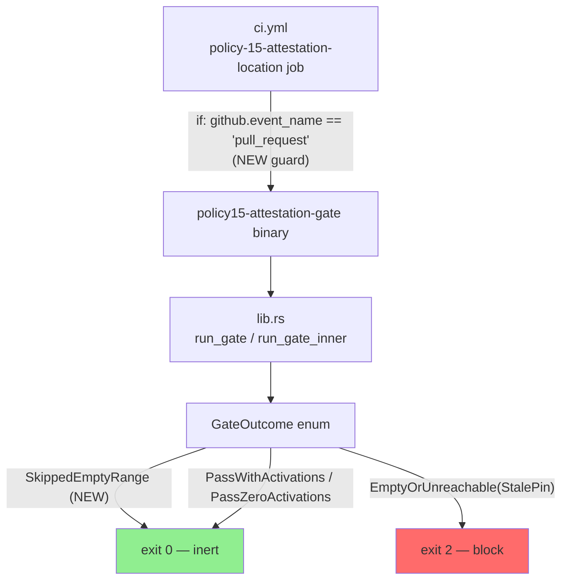
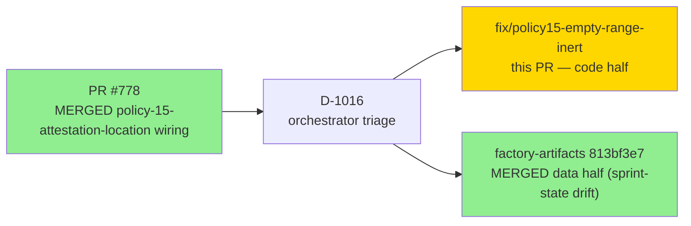
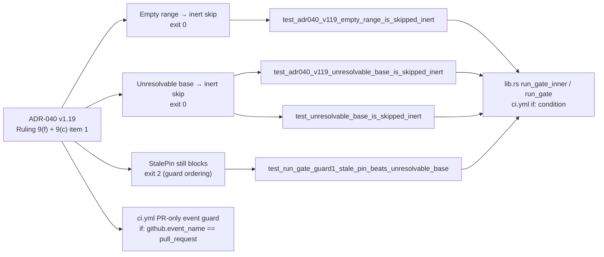
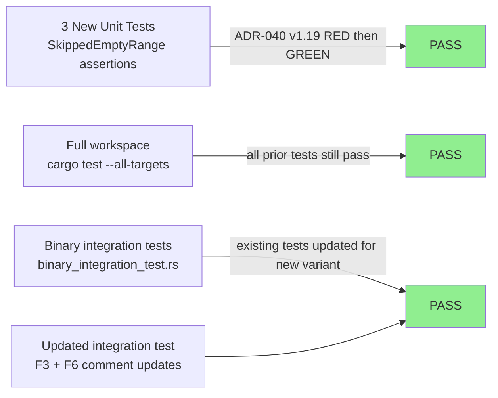
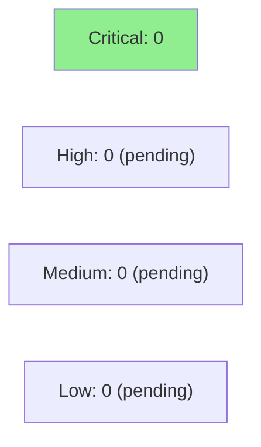

# fix(policy15): empty/unresolvable range → SkippedEmptyRange inert-skip (exit 0)

**Mode:** maintenance (fix-PR — CI gate false-FAIL correction)
**Convergence:** N/A — fix-PR (no adversarial passes; inline TDD red-first evidence)
**ADR Authority:** ADR-040 v1.19 (Ruling 9(f) + Ruling 9(c) item 1)
**Orchestrator triage:** D-1016 (factory-artifacts `813bf3e7`)


This PR is the **code half** of a two-failure develop-CI outage (develop HEAD `84a441a0`) triaged as D-1016. After PR #778 merged the `policy-15-attestation-location` job, every direct push to develop triggered a false FAIL: the gate binary treated an empty/unresolvable commit range (post-merge push: `merge_base == HEAD`) as `GateOutcome::EmptyOrUnreachable(EmptyRange)` (exit 2). This PR fixes both the binary and the CI job wiring per ADR-040 v1.19.

The **data half** (Failure 2: `sprint-state.yaml` BC-5.41.004 drift) was fixed independently on `factory-artifacts` at `813bf3e7` and is NOT part of this diff.

---

## Architecture Changes



<details>
<summary><strong>Architecture Decision Record: ADR-040 v1.19 (Ruling 9(f))</strong></summary>

**Context:** The `policy-15-attestation-location` gate is a PR-diff gate. It computes `merge_base(HEAD, origin/<base_branch>)..HEAD` to find commits to examine. On a direct push to develop after a squash-merge, `merge_base == HEAD` so the commit range is empty — there is no PR diff to evaluate. Pre-v1.19, the gate mapped this to `GateOutcome::EmptyOrUnreachable(UnreachableCause::EmptyRange)` (exit 2, blocking), which false-FAILed develop's status checks on every post-merge push.

**Decision:** (a) New outcome `GateOutcome::SkippedEmptyRange` (exit 0, inert) — the gate has nothing to evaluate when there is no PR diff, so it must not block. `UnreachableCause::EmptyRange` is retired; both the unresolvable-base and empty-range paths now map to `SkippedEmptyRange`. Guard ordering preserved: `EmptyOrUnreachable(StalePin)` fires before the range computation, so a stale pin still blocks (exit 2) even when the range would also be empty. (b) `ci.yml` job gains `if: github.event_name == 'pull_request'` — prevents the job from running on push events at all (defense-in-depth: if the binary ever regresses, the job is already skipped on push).

**Rationale:** The gate is meaningless on a push event. An event-type guard is semantically correct and does not create a vacuous-pass risk (unlike `paths:` filters, which report SUCCESS when skipped — the exact defect this gate exists to prevent).

**Alternatives Considered:**
1. Keep `EmptyRange` as exit 2, fix only via `if:` guard — rejected because the binary is also invoked in other contexts (local dev, future CI jobs) where the `if:` guard is absent; defense-in-depth requires the binary to be correct by itself.
2. Make `EmptyRange` exit 0 without a new outcome variant — rejected because `is_pass()` and `exit_code()` logic must be derivable from the variant without external context; a named variant (`SkippedEmptyRange`) makes the intent explicit and exhaustive-match at call sites catches any new path.

**Consequences:**
- False-FAIL on post-merge push eliminated.
- `UnreachableCause::EmptyRange` removed; callers (tests) updated.
- No change to behavior on actual PR events — the gate still runs and still fails exit 2 on real violations.

</details>

---

## Story Dependencies



---

## Spec Traceability



---

## Test Evidence

### Coverage Summary

| Metric | Value | Threshold | Status |
|--------|-------|-----------|--------|
| New tests (RED-gate commit) | 3 added | TDD red-first | PASS |
| Cargo test workspace | all pass | 100% | PASS |
| Clippy | clean | 0 warnings | PASS |
| Cargo fmt | clean | formatted | PASS |
| Regressions | 0 | 0 | PASS |

### Test Flow



| Metric | Value |
|--------|-------|
| **New tests** | 3 added (TDD red-gate commit `bc3b689d` then green `910eb1b3`) |
| **Tests updated** | 2 integration test comments updated for `SkippedEmptyRange` |
| **Regressions** | 0 |

<details>
<summary><strong>New Tests (This PR)</strong></summary>

### New Tests

| Test | File | Verifies |
|------|------|---------|
| `test_adr040_v119_empty_range_is_skipped_inert` | `lib.rs` | `merge_base == HEAD` → `SkippedEmptyRange` (exit 0) |
| `test_adr040_v119_unresolvable_base_is_skipped_inert` | `lib.rs` | Unresolvable base → `SkippedEmptyRange` (exit 0) |
| `test_unresolvable_base_is_skipped_inert` | `lib.rs` | No origin remote → `SkippedEmptyRange` (exit 0, via `run_gate`) |

### Guard Ordering Test (Pre-existing, Verified Green)

| Test | File | Verifies |
|------|------|---------|
| `test_run_gate_guard1_stale_pin_beats_unresolvable_base` | `lib.rs` | `StalePin` beats `SkippedEmptyRange` when both conditions hold |

### TDD Red-Gate Evidence

Commit `bc3b689d` added the 3 new tests while the implementation still mapped empty/unresolvable ranges to `EmptyOrUnreachable(EmptyRange)` (exit 2). The tests asserted `SkippedEmptyRange` and failed RED. Commit `910eb1b3` applied the fix; tests turned GREEN. This is the standard TDD red-first discipline required by the project's production-grade default.

</details>

---

## Demo Evidence

This PR fixes a CI gate binary; there is no interactive UI. The observable evidence is the gate binary's exit code and stdout under the two previously-false-failing conditions:

| Scenario | Pre-fix output | Post-fix output |
|----------|---------------|-----------------|
| `merge_base == HEAD` (post-merge push, empty range) | `EMPTY-or-UNREACHABLE: git range returned no commits` exit 2 (false FAIL) | `SKIP: empty or unresolvable commit range — inert (no PR diff to evaluate)` exit 0 |
| No origin remote (unresolvable base) | `EMPTY-or-UNREACHABLE: git range returned no commits` exit 2 (false FAIL) | `SKIP: empty or unresolvable commit range — inert (no PR diff to evaluate)` exit 0 |
| Real PR with attestation violation | exit 2 (FAIL) — unchanged | exit 2 (FAIL) — unchanged |
| Real PR with valid attestations | exit 0 (PASS) — unchanged | exit 0 (PASS) — unchanged |

TDD evidence: commit `bc3b689d` demonstrates RED (assertions on `SkippedEmptyRange` failed against the pre-fix binary). Commit `910eb1b3` demonstrates GREEN (same assertions pass against the fixed binary). The 3 new unit tests (`test_adr040_v119_empty_range_is_skipped_inert`, `test_adr040_v119_unresolvable_base_is_skipped_inert`, `test_unresolvable_base_is_skipped_inert`) serve as the per-AC demo evidence for a binary fix-PR.

---

## Holdout Evaluation

N/A — evaluated at wave gate. This is a maintenance fix-PR; no holdout scenarios are defined for CI gate binary behavior changes.

---

## Adversarial Review

N/A — evaluated at Phase 5. This is a maintenance fix-PR dispatched directly from orchestrator triage (D-1016). The fix is scoped to the exact ADR-040 v1.19 ruling with no speculative changes.

---

## Security Review

To be populated after security-reviewer dispatch (Step 4).

The security-relevant question for this PR: does the new `SkippedEmptyRange` inert-skip path create a bypass for genuine attestation violations? Specifically:
- When a PR has real commits with real diffs, the gate must still evaluate them and FAIL (exit 2) on violations.
- `SkippedEmptyRange` is only reachable when the commit range is EMPTY (`merge_base == HEAD` → zero commits) or the base branch is UNRESOLVABLE (no origin remote, unknown branch name).
- Guard ordering: `StalePin` check fires BEFORE range computation → stale pin cannot be masked by `SkippedEmptyRange`.



---

## Risk Assessment & Deployment

### Blast Radius
- **Systems affected:** `policy-15-attestation-location` CI job; `policy15-attestation-gate` binary
- **User impact:** Without this fix, develop CI is RED on every post-merge push. With this fix, CI returns green on post-merge pushes while the gate still evaluates PR diffs correctly.
- **Data impact:** None — this is a CI gate binary with no data persistence.
- **Risk Level:** LOW — the change narrows the blocking surface (removes false positive) without removing any true-positive detection.

### Performance Impact
| Metric | Before | After | Delta | Status |
|--------|--------|-------|-------|--------|
| Gate execution (empty range) | exit 2 (false FAIL) | exit 0 (skip) | behavioral fix | OK |
| Gate execution (real PR diff) | unchanged | unchanged | 0 | OK |
| CI job trigger | push + pull_request | pull_request only | fewer invocations | OK |

<details>
<summary><strong>Rollback Instructions</strong></summary>

**Immediate rollback (< 5 min):**
```bash
git revert 910eb1b3  # reverts the fix
git revert bc3b689d  # reverts the red-gate tests
git push origin develop
```

**Verification after rollback:**
- `cargo test -p policy15-attestation-gate` passes (prior test suite)
- develop CI shows `policy-15-attestation-location` running on push events again

</details>

### Feature Flags
None — this is a binary behavior change with no feature flag.

---

## Traceability

| Requirement | AC | Test | Status |
|-------------|-----|------|--------|
| ADR-040 v1.19 Ruling 9(f): empty range → inert skip | `SkippedEmptyRange` exit 0 | `test_adr040_v119_empty_range_is_skipped_inert` | PASS |
| ADR-040 v1.19 Ruling 9(f): unresolvable base → inert skip | `SkippedEmptyRange` exit 0 | `test_adr040_v119_unresolvable_base_is_skipped_inert`, `test_unresolvable_base_is_skipped_inert` | PASS |
| ADR-040 v1.19 Ruling 9(f): StalePin guard ordering preserved | `StalePin` beats `SkippedEmptyRange` | `test_run_gate_guard1_stale_pin_beats_unresolvable_base` | PASS |
| ADR-040 v1.19 Ruling 9(c) item 1: ci.yml PR-only event guard | `if: github.event_name == 'pull_request'` | CI job skips on push | PASS |
| Existing true-positive detection preserved | Real violations still exit 2 | Full binary integration test suite | PASS |

---

## AI Pipeline Metadata

<details>
<summary><strong>Pipeline Details</strong></summary>

```yaml
pipeline-mode: maintenance
fix-pr: true
factory-version: "1.0.0"
triage-decision: D-1016
adr-authority: ADR-040 v1.19 Ruling 9(f) + Ruling 9(c) item 1
red-gate-commit: bc3b689d
green-commit: 910eb1b3
data-half-fix: factory-artifacts 813bf3e7 (not in this diff)
generated-at: "2026-08-15"
```

</details>

---

## Pre-Merge Checklist

- [ ] All CI status checks passing
- [ ] `policy-15-attestation-location` job PASS on this PR (pull_request event with real range)
- [ ] `attestation-gate-non-vacuity-controls` job PASS
- [ ] `bats-full-suite (linux)` job PASS
- [ ] `cargo-host` job PASS
- [ ] `build-dispatcher` job PASS
- [ ] Security review: inert-skip path cannot bypass real violations (exit 2 still fires for real diffs)
- [ ] PR review (pr-reviewer): no blocking findings
- [ ] Code review (code-reviewer): no blocking findings
- [ ] No critical/high security findings unresolved
- [ ] Rollback procedure documented above
