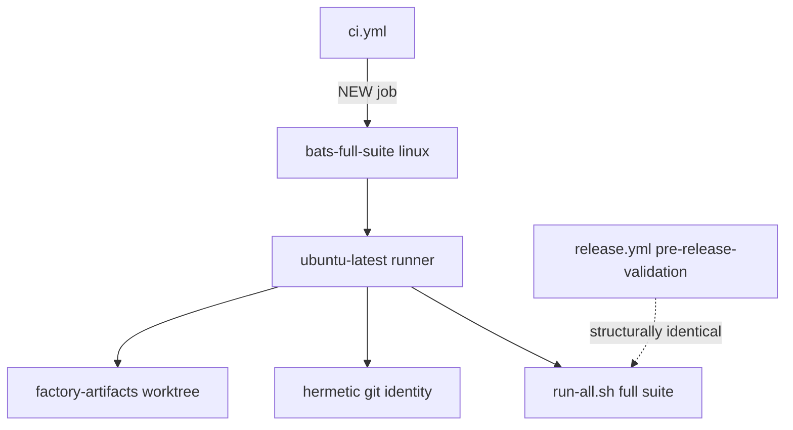
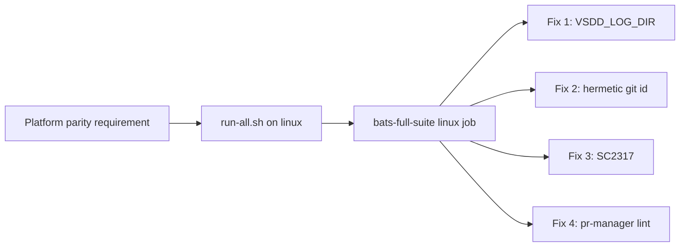
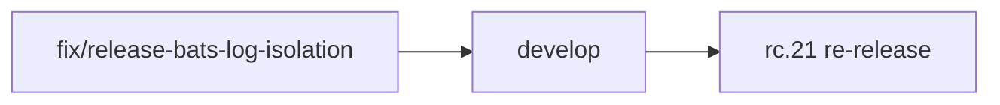

## fix: resolve 4 bats latent defect classes blocking rc.21 release + add linux bats-full-suite CI job

### Summary

The v1.0.0-rc.21 release pipeline (release.yml run [27468463761](https://github.com/Zious/vsdd-factory/actions/runs/27468463761)) failed at "Pre-release Validation" because `release.yml` runs the full `run-all.sh` on Linux while `ci.yml` never did — exposing 4 latent defect classes that accumulated on `develop` since rc.20. This PR fixes all four classes and adds a new `bats-full-suite (linux)` CI job so this class of defect is caught at PR time, not release time.

**No production dispatcher or helper runtime behavior changed.** Only shellcheck directives, test fixtures, docs, and CI configuration are modified.

This PR unblocks the rc.21 re-release.

---

### 4 Fix Classes

#### Fix 1 — VSDD_LOG_DIR isolation for 6 trajectory-tail suites + regression-v1.0 (post-#179/ADR-024)

After PR #179 (ADR-024), the dispatcher's internal log-dir routing sends logs to the worktree-main `.factory/logs` (Level F), not `$WORK/.factory/logs`. The 6 `validate-trajectory-tail-cell-completeness` suites and `regression-v1.0` assumed the old path. Fix: set the ADR-024 Level-A `VSDD_LOG_DIR` env override (the established `emit-event.bats` house pattern) in each affected suite so they point to the correct log directory regardless of where the dispatcher routes.

Files: `plugins/vsdd-factory/tests/validate-trajectory-tail-cell-completeness/*.bats`, `plugins/vsdd-factory/tests/regression-v1.0.bats`

#### Fix 2 — Hermetic git identity isolation for factory-lock-write suite (7 tests)

The `factory-lock-write` suite depended on an ambient `git config user.email` being present. Release CI runners (ubuntu) have no ambient git identity. Fix: inject an isolated `GIT_CONFIG_GLOBAL` with a test-only identity at suite setup; unset-email negative test preserved (verifies the suite doesn't silently swallow the missing-identity case).

Files: `plugins/vsdd-factory/tests/factory-lock-write.bats`

#### Fix 3 — SC2317 shellcheck directives on 3 trap-EXIT cleanup handlers (ubuntu false positive)

Ubuntu's shellcheck emits SC2317 ("unreachable code") on 3 trap-EXIT cleanup handlers in the S-17.03 scripts. This is a shellcheck false positive — the handlers ARE reachable via `trap ... EXIT`. macOS shellcheck does not emit this warning. Fix: scoped `# shellcheck disable=SC2317` directives on the three affected lines.

Files: `plugins/vsdd-factory/bin/factory-lock-acquire-precheck.sh`, `plugins/vsdd-factory/bin/factory-lock-status.sh`, `plugins/vsdd-factory/bin/factory-unlock-decide.sh`

#### Fix 4 — pr-manager.md inline-shell lint (permissions profile gate)

`pr-manager.md` contained an inline backtick `git push ...` span under the `coding` profile. The `coding` profile disallows inline shell spans in agent documentation. Fix: reworded to prose description.

Files: `plugins/vsdd-factory/agents/pr-manager.md`

---

### Structural Meta-Fix — New `bats-full-suite (linux)` CI Job

Added a new `bats-full-suite (linux)` job to `.github/workflows/ci.yml` that:
- Runs on `ubuntu-latest`
- Mounts the `factory-artifacts` worktree
- Sets git identity (matches release runner environment)
- Builds the dispatcher binary
- Runs the full `run-all.sh` on Linux

This job is structurally identical to what `release.yml` does in "Pre-release Validation", so any future Linux-specific bats failures (shellcheck variants, path differences, missing env) are caught at PR time.

---

### Architecture Changes

---

### Spec Traceability

No BCs modified. This fix closes a CI/test coverage gap — the production-grade default requires all CI passes to be reproducible on all supported platforms (CLAUDE.md §Build/Test/Lint). The `bats-full-suite (linux)` job closes the gap between develop CI and release CI.

---

### Story Dependencies

This is an unblocking fix PR. No story dependencies.

---

### Test Evidence

All 3 commits are test/CI/doc-only changes. The critical gate is `bats-full-suite (linux)` — it runs run-all.sh on ubuntu and is the only environment where Fixes 2 (git identity) and 3 (SC2317) can be verified (macOS shellcheck does not emit SC2317; macOS CI runners have ambient git identity).

Existing CI: `cargo fmt --check`, `cargo clippy`, `cargo test --workspace`, `bats-integration` (macOS) — no behavior changes, all expected green.

---

### Holdout Evaluation

N/A — evaluated at wave gate.

---

### Adversarial Review

N/A — evaluated at Phase 5.

---

### Security Review

No security surface changes. No production code modified. Test fixtures and CI configuration only.

---

### Risk Assessment

**Blast radius:** Minimal. No production dispatcher, WASM plugin, hook registry, or runtime helper code modified. Changes are: (a) test file env-var additions, (b) test suite setup/teardown, (c) shellcheck suppression directives on non-production scripts, (d) CI job addition, (e) docs reword.

**Performance impact:** None.

**Rollback:** Trivial — revert the 3 commits.

---

### AI Pipeline Metadata

- Pipeline mode: fix-pr-delivery (brownfield fix, release-unblocking)
- Branch: `fix/release-bats-log-isolation`
- Base: `develop`
- Merge strategy: squash (standard for fix/feature PRs into develop)
- Related release run: [27468463761](https://github.com/Zious/vsdd-factory/actions/runs/27468463761)

---

### Pre-Merge Checklist

- [x] `fix/release-bats-log-isolation` pushed to origin
- [x] PR created with structured description
- [x] Security review: N/A (no production code changes)
- [ ] `bats-full-suite (linux)` green — CRITICAL GATE
- [ ] All other CI checks green
- [ ] pr-reviewer: clean pass
- [ ] Squash-merge to develop + branch deleted
