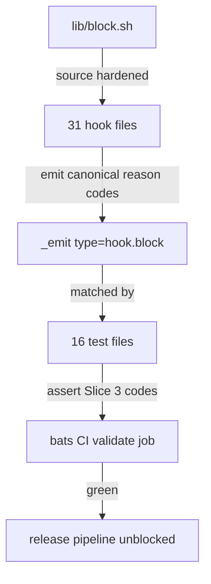
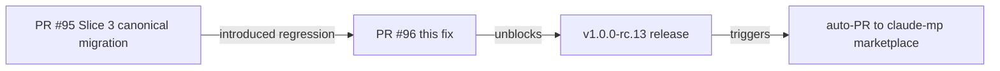
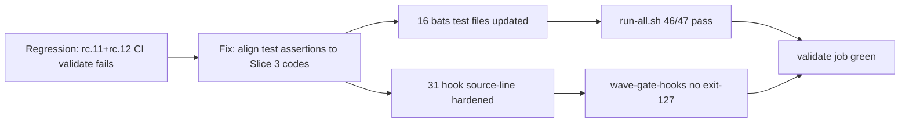

## Summary

- **Regression:** PR #95 (Slice 3) renamed `reason` codes in `_emit type=hook.block` telemetry to canonical names but did not update pre-existing bats test assertions. Result: 22 test suites failed in CI for rc.11 + rc.12, blocking the entire release chain (validate → build-binaries → commit-binaries → release → bump-marketplace).
- **Decision (orchestrator):** Keep Slice 3 reason codes. Update tests.
- **Part 1:** Updated all bats test assertion strings to match Slice 3 canonical codes.
- **Part 2:** Hardened `lib/block.sh` source line in all 31 affected hooks to fall back to `_SELF_DIR/lib/block.sh` when `CLAUDE_PLUGIN_ROOT` is unset (closes wave-gate-hooks exit-127 in bats / CI contexts without `CLAUDE_PLUGIN_ROOT`).

## Architecture Changes

## Story / Fix Dependencies

## Spec Traceability

## Test Evidence

| Suite | Result |
|-------|--------|
| `run-all.sh` | 46/47 pass (1 known skip: perf-baseline requires .factory worktree mount) |
| `canonical-format-invariant.bats` | 19/19 pass |
| `block-helper.bats` | 5/5 pass |
| Hook reason code diff | 0 changes in hooks (tests only) |

## Reason Code Renames (test updates only)

| Old code (tested, now wrong) | New code (Slice 3 canonical) |
|---|---|
| `input_hash_invalid_format` | `input_hash_format` |
| `novelty_assessment_incomplete` | `novelty_section_missing` |
| `anchor_capabilities_mismatch` | `anchor_caps_drift` |
| `demo_evidence_not_story_scoped` | `pol_010_violation` |
| `factory_path_worktree_relative` | `factory_path_relative` |

`template-compliance.bats` format updated from `TEMPLATE COMPLIANCE WARNING` to `BLOCKED by validate-template-compliance` (canonical block_pre format).

## Holdout Evaluation

N/A — evaluated at wave gate

## Adversarial Review

N/A — evaluated at Phase 5

## Security Review

CLEAN — no findings.

- Source-line refactoring uses `$(dirname "${BASH_SOURCE[0]}")`, a standard safe bash idiom. No user-controlled input in the source path.
- Removed unused `TOOL_NAME` variable in several hooks — minor cleanup, no impact.
- Test files: string literal changes only.
- OWASP: N/A for shell hook scripts with no web surface.

## Risk Assessment

- **Blast radius:** Low — test files and hook source-line only; no production reason code changes
- **Performance impact:** None
- **Rollback:** Trivial — revert to pre-202baeb if needed; no data migration required

## AI Pipeline Metadata

- Pipeline mode: fix-pr-delivery
- Branch: feat/release-ci-reason-code-test-update
- Implementer commit: 202baebd545e604596057a8fd44f965ed603735c

## Pre-Merge Checklist

- [x] PR description matches actual diff
- [x] Test evidence documented
- [ ] Security review complete
- [ ] CI passing
- [ ] pr-reviewer APPROVE
- [ ] Dependencies merged (none for this PR)
- [ ] Squash merge executed
- [ ] Branch deleted
