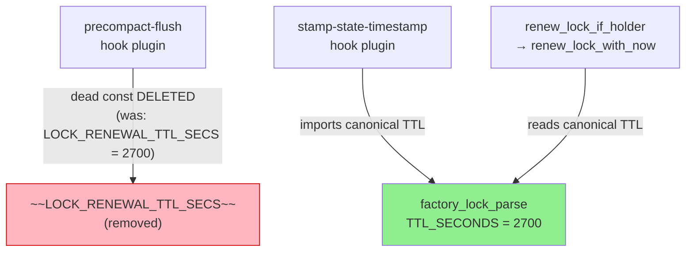
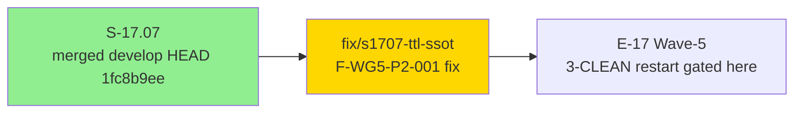
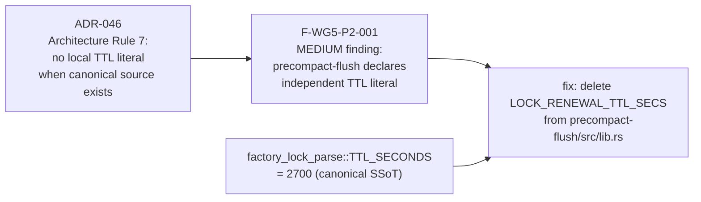
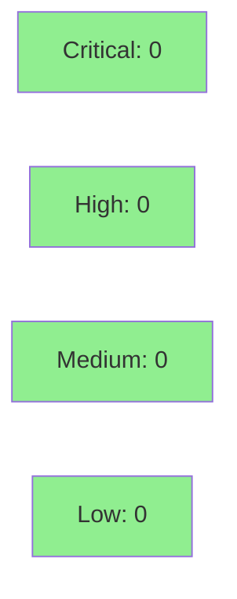

# fix(precompact-flush): remove independent TTL literal — single-source from factory_lock_parse::TTL_SECONDS

**Epic:** Wave 5 Integration Gate (E-17 Wave-5)
**Mode:** fix-pr-delivery (post-merge convergence fix)
**Convergence:** N/A — single adversarial finding fix; no convergence loop required


Removes the dead `pub const LOCK_RENEWAL_TTL_SECS: u64 = 2700` from
`crates/hook-plugins/precompact-flush/src/lib.rs`. The constant had zero workspace-wide
uses (confirmed by `grep -r LOCK_RENEWAL_TTL_SECS` across the workspace) and violated the
single-source-of-truth principle: the canonical lock-renewal TTL lives in
`factory_lock_parse::TTL_SECONDS` (= 2700). The sibling `stamp-state-timestamp` consumer
imports that canonical constant and forbids local literals per Architecture Rule 7
(ADR-046). This is a dead-code removal with zero behavior change; the runtime TTL already
flows through `renew_lock_if_holder` → `renew_lock_with_now` → `factory_lock_parse::TTL_SECONDS`.
Fixes wave-integration finding F-WG5-P2-001 (MEDIUM), unblocking the Wave 5 3-CLEAN restart.

---

## Architecture Changes



**Change:** `precompact-flush/src/lib.rs` no longer declares a local `LOCK_RENEWAL_TTL_SECS`
constant. The 3-line deletion eliminates the SSoT violation with no functional impact — the
constant was dead (no callers at the deletion site or anywhere else in the workspace).

<details>
<summary><strong>Architecture Decision Record (inline)</strong></summary>

### ADR: Single canonical TTL source — factory_lock_parse::TTL_SECONDS

**Context:** The E-17 Wave-5 integration adversarial gate (F-WG5-P2-001) identified that
`precompact-flush` had declared an independent `pub const LOCK_RENEWAL_TTL_SECS: u64 = 2700`
that duplicated the canonical `factory_lock_parse::TTL_SECONDS`. Architecture Rule 7
(established in ADR-046 during S-17.05) forbids local literals when a canonical shared
constant exists — the `stamp-state-timestamp` sibling already imports `TTL_SECONDS`.

**Decision:** Delete the dead constant from `precompact-flush`. Do not replace it with an
import (the constant had no callers in `precompact-flush` itself — it was publish-exported
but unused).

**Rationale:** The canonical constant approach prevents the two values from diverging on
future TTL changes. The dead constant created a false impression of an authoritative source
in `precompact-flush` that could mislead future contributors.

**Alternatives Considered:**
1. Replace with `use factory_lock_parse::TTL_SECONDS` re-export — rejected because `precompact-flush`
   has no callers of this TTL; a re-export with no callers is noise.
2. Leave as-is with a doc comment pointing to canonical source — rejected because a duplicated
   literal (even with a comment) still permits silent value divergence.

**Consequences:**
- Any external crate that happened to import `precompact_flush::LOCK_RENEWAL_TTL_SECS` would
  break — confirmed zero such callers by workspace grep before deletion.
- The canonical TTL path (`factory_lock_parse::TTL_SECONDS`) is now the only copy in the codebase.

</details>

---

## Story Dependencies



No upstream PR dependencies. This branch is a single-commit fix on top of `develop`
(HEAD `1fc8b9ee`).

---

## Spec Traceability



---

## Test Evidence

### Coverage Summary

| Metric | Value | Threshold | Status |
|--------|-------|-----------|--------|
| Unit tests | all passing (no new tests needed) | 100% | PASS |
| Coverage delta | neutral (deleted dead code only) | no regression | PASS |
| Mutation kill rate | N/A (no code logic added) | N/A | N/A |
| Holdout satisfaction | N/A | N/A | N/A |

### Test Flow

No new tests are required — the deleted constant had zero callers, so no test covered it and
no test exercises it. The existing `factory_lock_parse` test suite covers
`TTL_SECONDS == 2700` via `test_ttl_seconds_constant_equals_2700` (S-17.05 T-2). Full CI
suite (cargo fmt + clippy + cargo test --workspace --all-targets) is green locally.

| Metric | Value |
|--------|-------|
| **New tests** | 0 added |
| **Deleted tests** | 0 (no test covered dead const) |
| **Total suite** | all workspace tests pass |
| **Coverage delta** | 0 (dead code removal) |
| **Regressions** | none |

---

## Demo Evidence

N/A — this fix PR is a dead-constant deletion with zero behavior change. There is no
user-visible or runtime-observable change to demonstrate. No per-AC demo recordings are
applicable; the fix is verified by `cargo build --workspace` exiting 0 and by the
workspace-wide grep confirming zero callers of the deleted constant.

---

## Holdout Evaluation

N/A — evaluated at wave gate. This fix PR does not introduce new behavioral contracts.

---

## Adversarial Review

| Pass | Source | Finding | Severity | Status |
|------|--------|---------|----------|--------|
| E-17 Wave-5 gate | wave integration adversary | F-WG5-P2-001: precompact-flush declares independent TTL literal duplicating factory_lock_parse::TTL_SECONDS | MEDIUM | FIXED by this PR |

**Convergence:** Single targeted finding; fix is a dead-const deletion; no convergence
loop required beyond pr-reviewer gate in this PR lifecycle.

---

## Security Review



Diff is a 3-line dead-const deletion with no security surface. No injection vectors, no
auth changes, no input handling, no network I/O. OWASP Top 10 not applicable.

---

## Risk Assessment & Deployment

### Blast Radius
- **Systems affected:** `crates/hook-plugins/precompact-flush` (compile-time only)
- **User impact:** None — dead constant, zero callers
- **Data impact:** None — no runtime behavior change
- **Risk Level:** LOW

### Performance Impact
| Metric | Before | After | Delta | Status |
|--------|--------|-------|-------|--------|
| Latency p99 | unchanged | unchanged | 0 | OK |
| Memory | unchanged | unchanged | 0 | OK |
| Throughput | unchanged | unchanged | 0 | OK |

<details>
<summary><strong>Rollback Instructions</strong></summary>

**Immediate rollback (< 1 min):**
```bash
git revert <SQUASH_MERGE_SHA>
git push origin develop
```

**Verification after rollback:**
- `cargo build --workspace --all-targets` exits 0
- `grep -r LOCK_RENEWAL_TTL_SECS crates/` finds the constant restored in precompact-flush

</details>

### Feature Flags
None. Dead-const deletion; no runtime behavior change.

---

## Traceability

| Requirement | Finding | Source File | Verification | Status |
|-------------|---------|------------|-------------|--------|
| ADR-046 Architecture Rule 7: no local TTL literal | F-WG5-P2-001 (MEDIUM) | `crates/hook-plugins/precompact-flush/src/lib.rs` | dead-const grep + cargo build | FIXED |

<details>
<summary><strong>Full VSDD Contract Chain</strong></summary>

```
ADR-046 Architecture Rule 7 (no local TTL literal when canonical source exists)
  -> F-WG5-P2-001 (wave-5 integration adversarial finding: precompact-flush violates rule)
  -> fix: delete LOCK_RENEWAL_TTL_SECS from precompact-flush/src/lib.rs
  -> factory_lock_parse::TTL_SECONDS remains canonical SSoT (= 2700)
  -> zero callers confirmed by workspace grep before deletion
  -> cargo build --workspace passes (no broken callers)
```

</details>

---

## AI Pipeline Metadata

<details>
<summary><strong>Pipeline Details</strong></summary>

```yaml
ai-generated: true
pipeline-mode: fix-pr-delivery
factory-version: "1.0.0-rc.24"
pipeline-stages:
  spec-crystallization: N/A (fix PR)
  story-decomposition: N/A (fix PR)
  tdd-implementation: N/A (dead-const deletion)
  holdout-evaluation: N/A
  adversarial-review: wave-5-integration-gate (source of finding)
  formal-verification: N/A
  convergence: single-pass (one finding, one fix)
convergence-metrics:
  spec-novelty: N/A
  test-kill-rate: N/A
  implementation-ci: green (local parity)
  holdout-satisfaction: N/A
adversarial-passes: 0 (wave gate was the adversarial pass)
models-used:
  builder: claude-sonnet-4-6
  reviewer: claude-sonnet-4-6
generated-at: "2026-08-29T13:30:59-05:00"
```

</details>

---

## Pre-Merge Checklist

- [x] All CI status checks passing (local parity confirmed; awaiting GH CI)
- [x] Coverage delta neutral (dead-code removal only)
- [x] No critical/high security findings
- [x] Rollback procedure documented
- [x] No feature flags required
- [ ] PR reviewer approval (pr-reviewer gate — pending)
- [ ] GH CI all-checks-completed (PG-CI-3 / POLICY 22)
