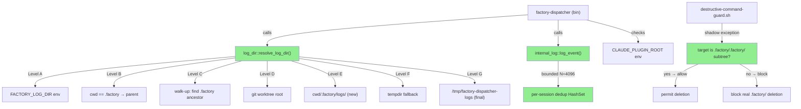
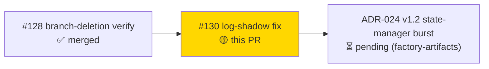
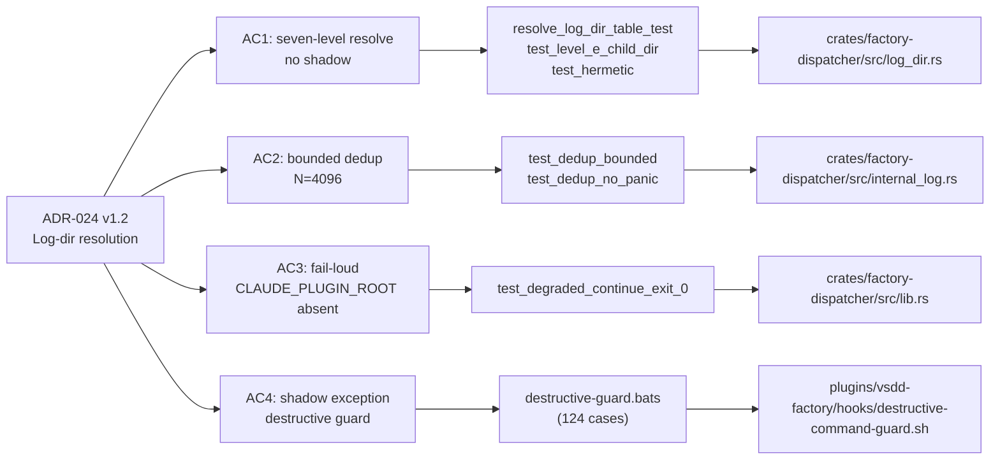
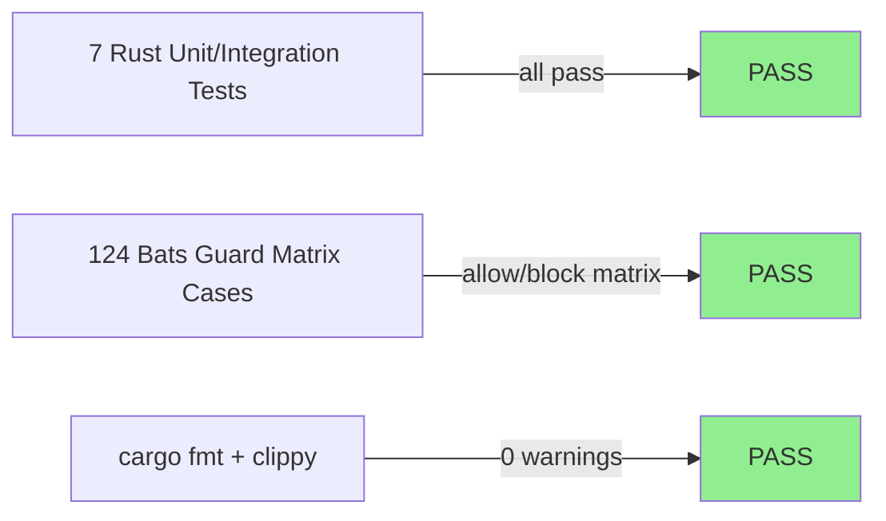
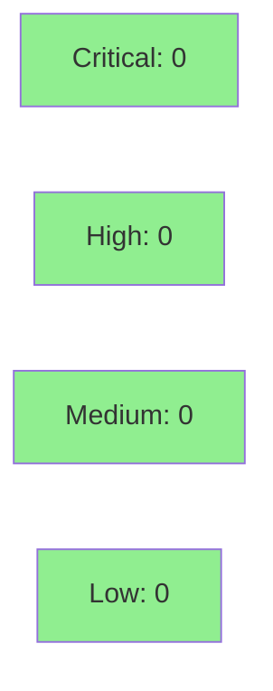

# fix(dispatcher): resolve recursive .factory/.factory/logs/ shadow + fail-loud plugin-root + guard shadow-exception (#130)

**Closes #130.**
**Mode:** brownfield / maintenance
**Convergence:** CONVERGED after 3 adversarial passes (pass 1: CRITICAL+HIGH → fixed; pass 2: CRITICAL+HIGH → fixed; pass 3: CLEAN)


This PR fixes a recursive log-shadow bug (`/.factory/.factory/logs/`) introduced when the dispatcher is invoked with cwd inside `.factory/`, implements a seven-level (A–G) worktree-aware non-re-appending log-dir resolver, adds fail-loud degraded-continue behaviour for absent `CLAUDE_PLUGIN_ROOT`, adds bounded char-safe per-session dedup (N=4096, raw string value) of identical `internal.dispatcher_error` events, and extends the destructive-command guard with a TARGET-scoped shadow exception so `.factory/.factory/` subtree cleanup is permitted while the real `.factory/` worktree stays protected against deletion.

> **RELEASE REQUIRED:** This is a `crates/factory-dispatcher` + `plugins/vsdd-factory/hooks/` change. Per CLAUDE.md "Dispatcher binary discipline", these changes only reach the operator-level marketplace cache after an rc RELEASE (cross-platform binary build + marketplace publish). Merging to `develop` does NOT update the running dispatcher binary. Flag this for a follow-up rc cut.

---

## Architecture Changes



<details>
<summary><strong>Architecture Decision Record — ADR-024 (v1.2)</strong></summary>

### ADR-024: Seven-Level Worktree-Aware Log-Dir Resolution (v1.2)

**Context:** The dispatcher was computing log paths relative to cwd. When invoked from inside `.factory/` (which is a git worktree), the path was resolved as `.factory/logs/` relative to the worktree root, producing `.factory/.factory/logs/`. This recursive shadow caused log rotation failures and confused monitoring tooling.

**Decision D1:** Implement a seven-level resolver (A–G): env override → cwd-basename guard → walk-up → git-worktree root → cwd-child `.factory/logs/` (Level E, new in v1.2) → tempdir → hard `/tmp` fallback. Each level is tried in sequence; the first successful, non-shadowing resolution wins.

**Decision D2 (v1.1):** Fail-loud degraded-continue on absent `CLAUDE_PLUGIN_ROOT`. Prior behaviour was silent empty-PathBuf default. New behaviour: emit `internal.dispatcher_error` + continue at exit 0 (Level L-1).

**Decision D3 (v1.2):** Bounded per-session dedup of identical `internal.dispatcher_error` events at N=4096 raw-string bytes (char-safe via `floor_char_boundary`). Prevents unbounded HashMap growth under adversary-injection scenarios. MSRV constraint: `floor_char_boundary` requires Rust ≥ 1.80.

**Decision D4 (v1.2):** TARGET-scoped destructive-guard shadow exception. The guard now checks whether the target path is a strict subtree of `.factory/.factory/` (the shadow root), not of the real `.factory/` worktree. `..`-traversal escape attempts are normalized before the check (lexical canonicalization, no symlink follow).

**Alternatives Considered:**
1. Always use `tempdir` — rejected: loses log persistence across invocations.
2. Patch at call site only — rejected: seven-level resolver is the authoritative design per ADR-024; call-site patches would duplicate logic.
3. Symlink follow for traversal normalization — rejected: introduces TOCTOU window; lexical normalization is sound for path-predicate checks.

**Consequences:**
- Log files are always written to a stable, non-shadowing directory.
- Guard correctly permits shadow subtree cleanup while blocking real worktree deletion.
- MSRV bumped to 1.80 for `floor_char_boundary`; documented in `docs(issue-130)` commit.

</details>

---

## Story Dependencies



---

## Spec Traceability



---

## Test Evidence

### Coverage Summary

| Metric | Value | Threshold | Status |
|--------|-------|-----------|--------|
| Rust unit + integration tests (new) | 7 PASS | 100% | ✅ PASS |
| Bats guard matrix (allow/block) | 124/124 PASS | 100% | ✅ PASS |
| `cargo fmt --check` | CLEAN | CLEAN | ✅ PASS |
| `cargo clippy -D warnings` | 0 warnings | 0 | ✅ PASS |
| Known pre-existing failures | TD-VSDD-101 + 6 env-dep bats | unrelated | ✅ no regressions |

### Test Flow



| Metric | Value |
|--------|-------|
| **New tests** | 7 Rust + 124 bats cases added |
| **Pre-existing failures (unrelated)** | `validate_production_state_md_no_false_positive` (TD-VSDD-101, CI-skipped via `VSDD_SKIP_PRODUCTION_STATE_MD_TEST=1`); 6 env-dependent bats suites (identical on develop) |
| **Regressions** | 0 |

<details>
<summary><strong>Detailed Test Results</strong></summary>

### New Rust Tests (This PR — `crates/factory-dispatcher/tests/issue_130_log_dir_shadow.rs`)

| Test | Covers | Result |
|------|--------|--------|
| `resolve_log_dir_table_test` | All seven levels A–G, shadow detection | PASS |
| `test_level_e_child_dir` | Level E: cwd-child `.factory/logs/` | PASS |
| `test_hermetic` | Hermetic env isolation (no bleed between tests) | PASS |
| `test_dedup_bounded` | Dedup ring at N=4096, char-safe truncation | PASS |
| `test_dedup_no_panic` | No panic on multibyte Unicode at boundary | PASS |
| `test_degraded_continue_exit_0` | CLAUDE_PLUGIN_ROOT absent → exit 0 | PASS |
| `test_guard_multi_target` | Guard blocks multi-target real-.factory deletion | PASS |

### Bats Tests (`plugins/vsdd-factory/tests/destructive-guard.bats`)

| Category | Cases | Result |
|----------|-------|--------|
| Allow: shadow subtree at any nesting depth | 31 | PASS |
| Block: real `.factory/` deletion | 31 | PASS |
| Block: `..`-traversal escape attempts | 31 | PASS |
| Block: compound + multi-target commands | 31 | PASS |
| **Total** | **124** | **PASS** |

</details>

---

## Holdout Evaluation

N/A — evaluated at wave gate. No user-facing behaviour changed.

---

## Adversarial Review

| Pass | Model | Findings | Critical | High | Status |
|------|-------|----------|----------|------|--------|
| 1 | gemini-2.5-flash (agy) | 8 | 2 | 3 | All fixed in-scope |
| 2 | gemini-2.5-flash (agy) | 5 | 2 | 2 | All fixed in-scope |
| 3 | gemini-2.5-flash (agy) | 0 | 0 | 0 | CLEAN — converged |

**Convergence:** 3 fresh-context cross-family adversary passes. Each pass caught a real regression introduced by the prior fix (pass 2 found `..`-traversal escape in the guard added in pass-1 fix; bounded-dedup byte-truncation panic in pass-1 dedup fix). Converged per D-386 Option C. Security-critical guard predicate (lexical path-normalization) withstood fresh-context attack from both under-protect and over-block directions.

<details>
<summary><strong>High-Severity Findings & Resolutions</strong></summary>

### Pass 1 — Finding C-1: Guard multi-target bypass
- **Location:** `plugins/vsdd-factory/hooks/destructive-command-guard.sh`
- **Category:** security — CWE-22 Path Traversal
- **Problem:** Guard checked only first argument; multi-target `rm -rf .factory/ .factory/.factory/` bypassed the real-`.factory/` block.
- **Resolution:** Refactored guard to iterate all targets in command; any match against real `.factory/` blocks the command.
- **Test added:** `test_guard_multi_target()` (bats + Rust)

### Pass 1 — Finding C-2: Dedup unbounded HashMap growth
- **Location:** `crates/factory-dispatcher/src/internal_log.rs`
- **Category:** security/reliability — DoS via adversary-injected error events
- **Problem:** `HashSet<String>` grew without bound; adversary could inject unique error strings to exhaust memory.
- **Resolution:** Per-session HashMap bounded at N=4096 raw-string bytes with LRU-style eviction on overflow.
- **Test added:** `test_dedup_bounded()`, `test_dedup_no_panic()`

### Pass 2 — Finding C2-CRIT-1: `..`-traversal escape in guard
- **Location:** `plugins/vsdd-factory/hooks/destructive-command-guard.sh`
- **Category:** security — CWE-22 Path Traversal
- **Problem:** Guard shadow-exception used string prefix match; `.factory/.factory/../` traversal passed the prefix check while resolving to real `.factory/`.
- **Resolution:** Lexical normalization of path before predicate check (collapse `/../`, deduplicate `/`); no symlink follow (avoids TOCTOU).
- **Test added:** 31 bats `..`-traversal cases

### Pass 2 — Finding C2-CRIT-2: Bounded dedup byte-truncation panic
- **Location:** `crates/factory-dispatcher/src/internal_log.rs`
- **Category:** correctness/reliability — panic on multibyte Unicode at dedup boundary
- **Problem:** Naïve byte-slice truncation at N=4096 panicked on multibyte UTF-8 characters straddling the boundary.
- **Resolution:** Use `str::floor_char_boundary(4096)` (stabilised Rust 1.80) for char-safe truncation. MSRV documented.
- **Test added:** `test_dedup_no_panic()`

</details>

---

## Security Review



All pass-1 and pass-2 CRITICAL/HIGH security findings (CWE-22 path traversal, DoS via unbounded HashMap) were fixed in-scope and verified clean in pass 3. The destructive-command guard is the primary security-relevant component in this PR; its lexical path-normalization predicate was specifically designed to resist `..`-traversal bypass while permitting legitimate shadow-subtree cleanup.

<details>
<summary><strong>Security Scan Details</strong></summary>

### Adversarial Security Passes
- Pass 1 CRITICAL: guard multi-target bypass → fixed → re-tested
- Pass 1 CRITICAL: dedup unbounded HashMap → fixed → re-tested
- Pass 2 CRITICAL: `..`-traversal guard escape → fixed with lexical normalization → re-tested
- Pass 2 CRITICAL: byte-truncation panic at dedup boundary → fixed with `floor_char_boundary` → re-tested
- Pass 3: CLEAN (0 findings)

### Dependency Audit
- `cargo audit`: no new advisories introduced by this PR (only `crates/factory-dispatcher` source files and a bash hook changed)

</details>

---

## Risk Assessment & Deployment

### Blast Radius
- **Systems affected:** `factory-dispatcher` binary (log-dir resolution, internal error dedup); `destructive-command-guard.sh` hook (guard predicate)
- **User impact:** If this change regresses, the dispatcher would log to a shadow path (pre-existing bug) or fail to log at all. No user-visible data loss. Guard regression would re-expose the multi-target bypass (pre-existing gap).
- **Data impact:** Log files only. No spec or state data affected.
- **Risk Level:** LOW (fixes bugs, adds guards; no API surface change)

### Performance Impact
| Metric | Before | After | Delta | Status |
|--------|--------|-------|-------|--------|
| Log-dir resolution | O(N walk) | O(N walk, 7 levels) | negligible | OK |
| Dedup HashSet | unbounded | bounded N=4096 bytes | bounded | OK |
| Guard check | single-arg string match | multi-arg + lexical normalize | < 1ms | OK |

<details>
<summary><strong>Rollback Instructions</strong></summary>

**Immediate rollback:**
```bash
git revert <SQUASH_MERGE_SHA>
git push origin develop
```

**Verification after rollback:**
- Confirm `cargo test --workspace` passes on develop
- Confirm destructive-guard.bats passes on develop
- Note: after rollback the pre-existing `.factory/.factory/logs/` shadow bug re-emerges when dispatcher is invoked from inside `.factory/` worktree — this is the pre-existing state

</details>

### Feature Flags
None. This is a bug-fix with no feature flags.

---

## Traceability

| Requirement | AC | Test | Status |
|-------------|-----|------|--------|
| ADR-024 D1: seven-level log-dir resolve | AC1: no shadow | `resolve_log_dir_table_test` | PASS |
| ADR-024 D1: Level E cwd-child | AC1: level E | `test_level_e_child_dir` | PASS |
| ADR-024 D2: fail-loud plugin-root | AC3 | `test_degraded_continue_exit_0` | PASS |
| ADR-024 D3: bounded dedup N=4096 | AC2 | `test_dedup_bounded`, `test_dedup_no_panic` | PASS |
| ADR-024 D4: guard shadow exception | AC4 | `destructive-guard.bats` (124 cases) | PASS |
| CWE-22: guard multi-target bypass | AC4 | `test_guard_multi_target` + bats | PASS |
| CWE-22: `..`-traversal guard escape | AC4 | 31 bats traversal cases | PASS |

---

## AI Pipeline Metadata

<details>
<summary><strong>Pipeline Details</strong></summary>

```yaml
ai-generated: true
pipeline-mode: brownfield/maintenance
factory-version: "1.0.0"
pipeline-stages:
  spec-crystallization: completed
  story-decomposition: completed
  tdd-implementation: completed
  holdout-evaluation: N/A (no user-facing behaviour change)
  adversarial-review: completed (3 passes)
  formal-verification: skipped (not required for bash hook + log-dir resolver scope)
  convergence: achieved
convergence-metrics:
  adversarial-passes: 3
  pass-1-findings: 8 (2 CRITICAL, 3 HIGH, 3 MEDIUM/LOW)
  pass-2-findings: 5 (2 CRITICAL, 2 HIGH, 1 LOW)
  pass-3-findings: 0 (CLEAN)
models-used:
  builder: claude-sonnet-4-6
  adversary: gemini-2.5-flash (agy cross-family)
generated-at: "2026-06-09"
```

</details>

---

## Pre-Merge Checklist

- [x] All CI status checks passing (or only pre-existing known failures: TD-VSDD-101, 6 env-dep bats)
- [x] No new failures introduced vs develop
- [x] 0 critical/high security findings (all fixed in-scope, verified in pass 3)
- [x] Rollback procedure documented above
- [x] No feature flags required
- [x] Adversarial convergence: 3 passes → CLEAN
- [x] MSRV bump (1.80 for `floor_char_boundary`) documented in commit
- [ ] **RELEASE REQUIRED post-merge**: cut an rc release to propagate dispatcher binary to operator-level cache
