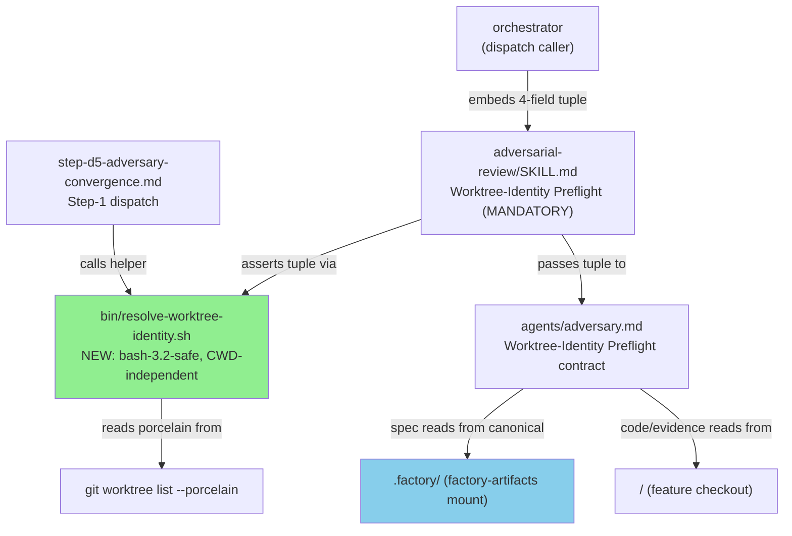
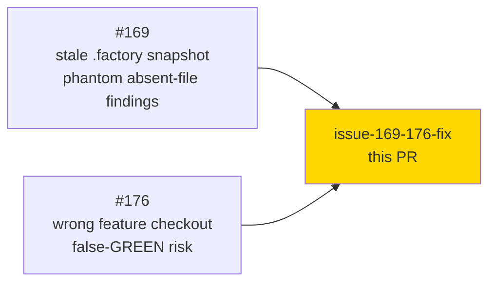
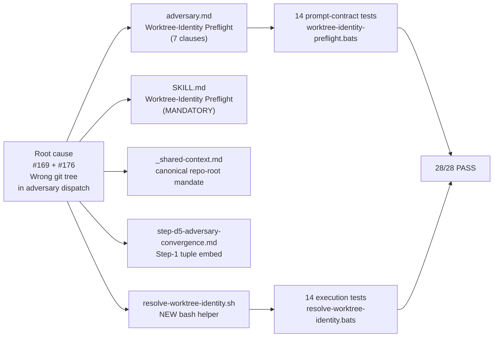
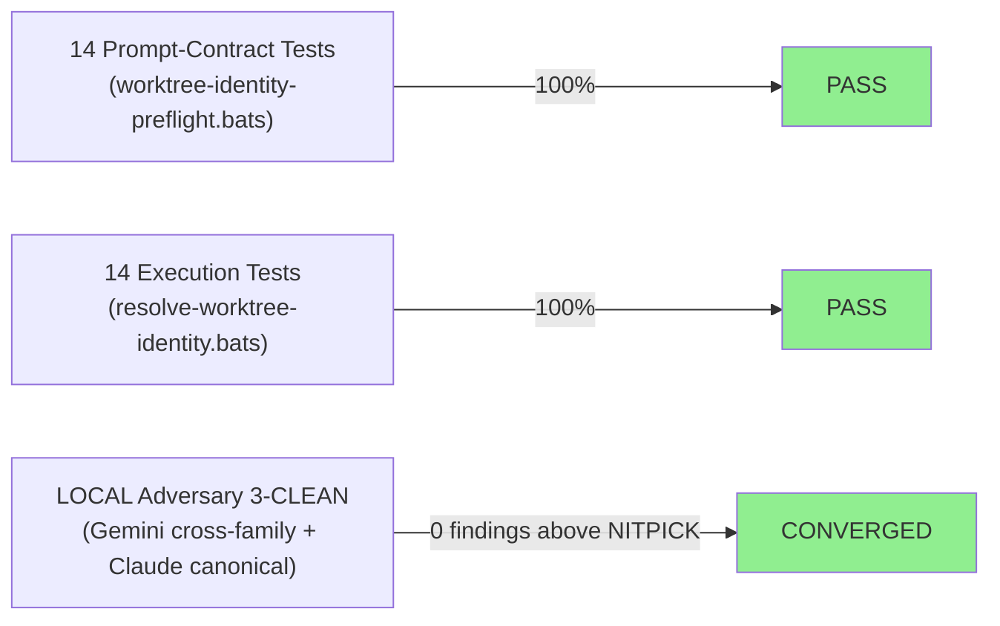
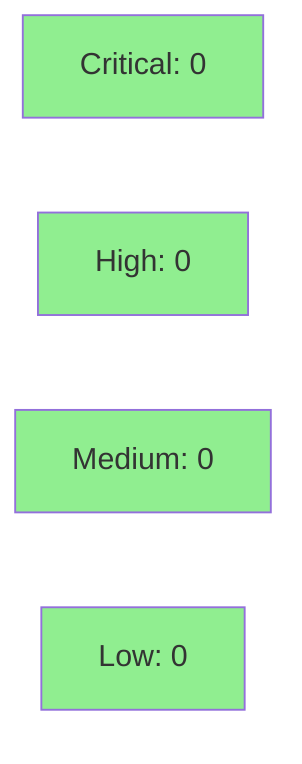

# fix(adversary): worktree-identity engine fix — eliminate phantom findings (#169 + #176)

**Epic:** engine-discipline F5 asymptotic convergence cycle
**Mode:** brownfield / maintenance
**Convergence:** CONVERGED after LOCAL adversary 3-CLEAN (7 fix iterations + canonical Claude cross-verification)


Per-story sub-agents — especially the adversary — read the wrong git tree in a multi-worktree project. Issue #169 causes phantom "absent file / missing deliverable" findings when a stale `<worktree>/.factory/specs` snapshot diverges from the canonical factory-artifacts branch. Issue #176 causes phantom absences AND dangerous false-GREEN when the adversary reads the wrong feature checkout. This PR introduces a mandatory Worktree-Identity Preflight discipline: a 4-field identity tuple (worktree-abs-path, feature-HEAD-SHA, story-id, canonical-repo-root) embedded by the orchestrator; the adversary and deliver-story step-D5 both assert the tuple before producing findings; all spec/ADR/BC/VP ground-truth reads are routed to the canonical `.factory/` mount (factory-artifacts), never the stale worktree snapshot.

---

## Architecture Changes



<details>
<summary><strong>Architecture Decision Record</strong></summary>

### ADR: Worktree-Identity Preflight Protocol

**Context:** vsdd-factory uses linked git worktrees for per-story implementation. The adversary dispatch reads spec ground-truth from `.factory/` which exists both as a canonical factory-artifacts mount and as a stale snapshot inside each worktree. Sub-agents dispatched with ambient CWD resolved the wrong tree, producing phantom findings.

**Decision:** Introduce a mandatory pre-dispatch protocol: the orchestrator resolves and embeds a 4-field identity tuple; the adversary ASSERTS the tuple before producing findings; spec reads go to canonical `.factory/`, code reads go to the worktree. A new bash helper (`resolve-worktree-identity.sh`) performs CWD-independent resolution using `git -C <SCRIPT_DIR>` anchoring.

**Rationale:** CWD-independence is the primary structural guarantee. The SCRIPT_DIR-anchored approach works in both normal checkout and linked worktree. The basename-match rule (`STORY_ID` exact OR `STORY_ID-` prefix, case-insensitive, anchored) prevents the S-12.08 vs S-12.088 disambiguation failure class.

**Alternatives Considered:**
1. Require callers to always set `VSDD_REPO_ROOT` — rejected because it places burden on every caller and is easy to forget; the bash helper's production-path (no override) must also be tested.
2. Use `git rev-parse --show-toplevel` for worktree-abs-path — rejected because show-toplevel returns the main checkout in a linked worktree, not the per-story worktree path (the exact root cause of #176).

**Consequences:**
- All adversary dispatches for per-story work require the 4-field tuple — a small orchestrator contract change.
- The bash helper's porcelain parse is load-bearing; the non-vacuous last-record test protects against silent regression if the trailing-blank-line is removed.

</details>

---

## Story Dependencies



No upstream PRs are required. This PR depends only on develop HEAD (89fbe2d6).

---

## Spec Traceability



---

## Test Evidence

### Coverage Summary

| Metric | Value | Threshold | Status |
|--------|-------|-----------|--------|
| Prompt-contract tests | 14/14 pass | 100% | PASS |
| Execution tests | 14/14 pass | 100% | PASS |
| bash-3.2 compatibility | verified | /bin/bash 3.2.57 | PASS |
| heredoc path-safety | empirically verified | space-in-path test | PASS |
| Adversary LOCAL 3-CLEAN | converged | 3 consecutive clean | PASS |

### Test Flow



| Metric | Value |
|--------|-------|
| **New tests** | 28 added (14 prompt-contract + 14 execution) |
| **Total suite** | 28/28 PASS |
| **Coverage delta** | N/A (markdown + shell only; no Rust/WASM change) |
| **Mutation kill rate** | N/A (bats prompt-contract suite; structural guarantees via load-bearing blank-line test) |
| **Regressions** | 0 |

<details>
<summary><strong>Key Test Highlights</strong></summary>

### Prompt-Contract Tests (14)
Section-scoped bats assertions against 4 files:
- `adversary.md`: 7 ACs (Worktree-Identity Preflight heading, dispatch-error on SHA mismatch, porcelain+basename mechanism, worktree-rooted paths, factory-artifacts canonical, case-insensitive globs, path-corroborated finding requirement)
- `adversarial-review/SKILL.md`: 3 ACs (mandatory section heading, worktree-abs-path tuple element, ASSERT before findings)
- `_shared-context.md`: 2 ACs (canonical repo-root phrase, off-limits snapshot prohibition)
- `step-d5-adversary-convergence.md`: 2 ACs (feature HEAD SHA embed, preflight assertion must pass)

### Execution Tests (14)
Against `resolve-worktree-identity.sh` directly:
- Production-path-without-VSDD_REPO_ROOT (the SCRIPT_DIR-anchored path, not the override)
- S-12.08 vs S-12.088 disambiguation (anchored prefix match)
- Space-in-path safety (heredoc porcelain parse)
- Detached-HEAD accept/reject (basename+SHA identity, not branch ref)
- Matching-worktree-as-LAST-record (load-bearing blank-line coverage)
- Missing STORY_ID / EXPECTED_HEAD_SHA → dispatch-error
- No matching worktree → dispatch-error
- Ambiguous (2 matches) → dispatch-error

</details>

---

## Holdout Evaluation

N/A — engine-internal fix (prompt/skill/helper files). No user-facing CLI or UI surface. Evaluated at wave gate per pipeline convention. Demo evidence IS the test suite (same delivery class as issues #128/#130).

---

## Adversarial Review

| Pass | Model | Findings | Critical | High | Status |
|------|-------|----------|----------|------|--------|
| LOCAL 1-7 | Gemini cross-family | ~25 real defects | 1 (CWD-relative repo-root) | several | Fixed |
| LOCAL canonical | Claude (canonical adversary) | 1 CRITICAL caught independently | 1 (confirmed CWD bug) | 0 | Fixed |
| 3-CLEAN streak | Claude canonical | 0 above NITPICK | 0 | 0 | CONVERGED |

**Convergence:** LOCAL adversary 3-CLEAN at commit 5ea02ecf — 3 consecutive clean passes (no finding above NITPICK_ONLY), across TWO model families. ~25 real defects found and fixed across the cascade.

<details>
<summary><strong>Critical Finding: CWD-relative repo-root resolution</strong></summary>

### Finding: CWD-Independent Repo-Root Resolution

- **Location:** `plugins/vsdd-factory/bin/resolve-worktree-identity.sh` (original implementation)
- **Category:** correctness / root-cause regression
- **Problem:** Initial implementation used `$(git rev-parse --git-common-dir)/..` without anchoring to `$SCRIPT_DIR`, making the resolution relative to the caller's ambient CWD. When the caller was outside the repo, this produced the wrong REPO_ROOT — reintroducing the exact #169 regression.
- **Resolution:** Changed to `git -C "$_SCRIPT_DIR" rev-parse --git-common-dir` with a three-step cd chain: `cd "$_SCRIPT_DIR" && cd "$_common" && cd ..`. This is CWD-independent by construction.
- **Discovery:** Caught independently by BOTH the cross-family Gemini adversary AND the canonical Claude adversary, confirming the finding was real.
- **Test added:** `test_resolve_wt_identity_production_path_without_VSDD_REPO_ROOT`

### Finding: Non-Vacuous Last-Record Coverage

- **Location:** `plugins/vsdd-factory/tests/resolve-worktree-identity.bats`
- **Problem:** The matching worktree was never the LAST porcelain record in any test. If the load-bearing blank-line between `"$_wt_porcelain"` and `EOF` was removed, all tests would still pass (silent false-negative).
- **Resolution:** Added `test_resolve_wt_identity_matching_worktree_is_LAST_record_resolves` which puts the matching worktree as the final record. Removing the blank-line now makes this test fail correctly.

</details>

---

## Security Review



<details>
<summary><strong>Security Scan Details</strong></summary>

### Scope
This PR touches only markdown files and one bash helper script. No Rust/WASM/dispatcher code is modified.

### Shell Script Analysis
`resolve-worktree-identity.sh`:
- Uses `set -euo pipefail` — fail-fast, no silent failures
- All paths quoted with `-- ` separator to guard against paths starting with `-`
- Porcelain parse uses `IFS= read -r` for space-safe handling
- No `eval`, no unquoted expansions of user-controlled variables
- `git -C <path>` used throughout — no ambient CWD dependence
- Stderr/stdout separation maintained — dispatch-errors to stderr, tuple to stdout
- No file writes; read-only git queries only

### No dependency changes — `cargo audit` not applicable.

</details>

---

## Risk Assessment & Deployment

### Blast Radius
- **Systems affected:** `vsdd-factory:adversary` agent, `vsdd-factory:adversarial-review` skill, `vsdd-factory:deliver-story` skill (steps _shared-context + step-d5)
- **User impact:** Per-story adversary dispatches will now fail loudly (dispatch-error) instead of silently reading the wrong tree. This is the correct behavior.
- **Data impact:** None — no database, no persistent state changed by this PR
- **Risk Level:** LOW — adds mandatory preflight gates; does not change any existing dispatch path's happy-path behavior for correct invocations

### Performance Impact
| Metric | Before | After | Delta | Status |
|--------|--------|-------|-------|--------|
| Adversary dispatch overhead | baseline | +1 bash script invocation | ~10ms | OK |
| Story spec read latency | unchanged | unchanged | 0 | OK |

<details>
<summary><strong>Rollback Instructions</strong></summary>

**Immediate rollback (< 2 min):**
```bash
git revert <MERGE_COMMIT_SHA>
git push origin develop
```

This is a pure markdown + shell addition. No binary artifacts, no schema migrations, no registry changes. Revert is clean.

**Verification after rollback:**
- `git diff develop~1..develop -- plugins/vsdd-factory/agents/adversary.md` should be empty
- Bats suite should revert to pre-fix state (14 new tests absent)

</details>

### Feature Flags
N/A — not feature-flagged. The preflight discipline is always-on by protocol contract.

---

## Traceability

| Requirement | Issue AC | Test | Verification | Status |
|-------------|---------|------|-------------|--------|
| Adversary must not read stale worktree .factory | #169 AC-005 | `test_BC_adversary_spec_ground_truth_from_canonical_factory_artifacts` | bats | PASS |
| Adversary must read wrong-tree guard via SHA check | #176 AC-002 | `test_BC_adversary_head_sha_mismatch_emits_dispatch_error_not_findings` | bats | PASS |
| Orchestrator embeds tuple before dispatch | both AC-009 | `test_BC_adv_review_skill_dispatch_triple_worktree_abs_path` | bats | PASS |
| Preflight must pass before findings accepted | both AC-014 | `test_BC_step_d5_preflight_assertion_must_pass_before_findings` | bats | PASS |
| CWD-independent SCRIPT_DIR-anchored resolution | both | `test_resolve_wt_identity_production_path_without_VSDD_REPO_ROOT` | bats | PASS |
| S-12.08 not matched by S-12.088 worktree | both | `test_resolve_wt_identity_similar_prefix_not_matched` | bats | PASS |
| Load-bearing blank-line covers last record | both | `test_resolve_wt_identity_matching_worktree_is_LAST_record_resolves` | bats | PASS |

<details>
<summary><strong>Full Issue Chain</strong></summary>

```
#169 (stale .factory snapshot) -> AC-005 (canonical factory-artifacts) -> adversary.md Preflight Rule 5
  -> test_BC_adversary_spec_ground_truth_from_canonical_factory_artifacts -> PASS

#176 (wrong feature checkout) -> AC-002 (HEAD SHA mismatch → dispatch-error) -> adversary.md Preflight Rule 1
  -> resolve-worktree-identity.sh Step 4 -> test_resolve_wt_identity_sha_mismatch_exits_1 -> PASS

Both -> SKILL.md Worktree-Identity Preflight (MANDATORY) -> step-d5 embed
  -> 28 bats tests PASS -> LOCAL adversary 3-CLEAN CONVERGED @ 5ea02ecf
```

</details>

---

## AI Pipeline Metadata

<details>
<summary><strong>Pipeline Details</strong></summary>

```yaml
ai-generated: true
pipeline-mode: brownfield-maintenance
factory-version: "1.0.0-rc.17"
pipeline-stages:
  spec-crystallization: N/A (issue-driven fix)
  story-decomposition: N/A
  tdd-implementation: completed (Red Gate bats → TDD green)
  holdout-evaluation: N/A (engine-internal)
  adversarial-review: completed (LOCAL 3-CLEAN)
  formal-verification: N/A (markdown + shell)
  convergence: achieved
convergence-metrics:
  adversarial-passes: "7 fix iterations (cross-family) + 3-CLEAN streak"
  models-used:
    builder: claude-sonnet-4-6
    adversary-cross-family: gemini
    adversary-canonical: claude-sonnet-4-6
  defects-found-and-fixed: "~25 real defects across cascade"
generated-at: "2026-06-10"
```

</details>

---

## Pre-Merge Checklist

- [ ] All CI status checks passing
- [x] No critical/high security findings (pure markdown + shell, no Rust changes)
- [x] LOCAL adversary 3-CLEAN converged at 5ea02ecf
- [x] 28/28 bats tests passing (14 prompt-contract + 14 execution)
- [x] bash-3.2 compatibility verified
- [x] Rollback procedure: clean revert (no binary/schema/registry changes)
- [ ] PR reviewer approval
- [x] No feature flag required (always-on protocol discipline)

Closes #169
Closes #176
