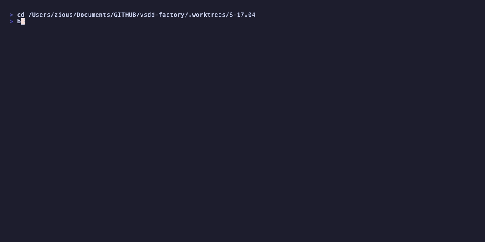

# Demo Evidence — S-17.04

**Story:** S-17.04 — Mid-burst heartbeat renewal wiring (D10 + D13 + D15 + D16 + D17)
**BC gate:** BC-5.40.001 PC4 (mid-burst TTL renewal enforcement)
**ADR:** ADR-025 v1.6 Decision 12

All recordings drive the real dispatcher binary (`target/release/factory-dispatcher`) with the real compiled WASM plugin (`plugins/vsdd-factory/hook-plugins/verify-state-timestamp-refresh.wasm`) via a minimal synthetic registry. No mocks — each scenario exercises the actual WASM decision path.

---

## Coverage Map

| Recording | AC | Scenario | Expected result |
|-----------|-----|---------|-----------------|
| [AC-005-block-stale-timestamp](#ac-005-block-stale-timestamp) | AC-005 / AC-011 | Write with unchanged `timestamp:` | exit 2 + TimestampStale block |
| [AC-003-allow-fresh-timestamp](#ac-003-allow-fresh-timestamp) | AC-003 | Write with advanced `timestamp:` | exit 0 + `guard_ran (continue: advanced)` sentinel |
| [AC-018-absolute-path-block](#ac-018-absolute-path-block) | AC-018 (P0) | Write with absolute `file_path` ending in `/.factory/STATE.md` + stale timestamp | exit 2 + TimestampStale block |
| [AC-006-lock-expiry-stale](#ac-006-lock-expiry-stale) | AC-006 | Lock held, `expires_at` absent from proposed content, timestamp advanced | exit 2 + LockExpiryStale block |

---

## AC-005: Block Stale Timestamp

**File:** `AC-005-block-stale-timestamp.gif` / `.webm`
**AC:** AC-005 (traces to BC-5.40.001 PC4 / ADR-025 Decision 12 §12.2)
**Scenario:** A `Write` tool payload delivers `.factory/STATE.md` content with `timestamp:` byte-identical to the on-disk value (the timestamp was not advanced in this write).

**Expected (and recorded):**
- Exit code: `2` (Block)
- Block reason surfaced in dispatcher stderr: `BLOCKED by verify-state-timestamp-refresh: STATE.md timestamp not advanced in this write. Fix: Update 'timestamp:' to the current UTC time before writing STATE.md. Code: TimestampStale.`
- `blocking_plugins=verify-state-timestamp-refresh` confirmed

---

## AC-003: Allow Fresh Timestamp

**File:** `AC-003-allow-fresh-timestamp.gif` / `.webm`
**AC:** AC-003 (traces to BC-5.40.001 PC4 + ADR-025 Decision 12 §12.2 success path)
**Scenario:** A `Write` tool payload delivers `.factory/STATE.md` content with `timestamp:` advanced (newer than on-disk value). No lock held.

**Expected (and recorded):**
- Exit code: `0` (Continue)
- `guard_ran (continue: advanced)` sentinel visible in dispatcher output — proves the guard executed its full decision logic and deliberately allowed, not that it crashed (which also exits 0 under `on_error=continue`)
- `plugins_run=1` confirms plugin was loaded and invoked

---

## AC-018: Absolute Path Block (P0 fix)

**File:** `AC-018-absolute-path-block.gif` / `.webm`
**AC:** AC-018 (traces to BC-5.40.001 PC4 / ADR-025 §12.7 R6 — absolute-path ends_with trigger)
**Scenario:** A `Write` tool payload has `file_path` set to an absolute path (`/var/folders/…/.factory/STATE.md`) — the exact form Claude Code emits in production. The stale timestamp content is otherwise identical to AC-005.

**Why this matters:** Prior EC-006 stripped a `$CLAUDE_PROJECT_DIR/` env-var prefix as step 1 of canonical-path normalization. The WASI sandbox provides NO environment variables — `std::env::var("CLAUDE_PROJECT_DIR")` always fails inside the WASM runtime. Absolute paths never matched the literal `.factory/STATE.md` equality check. The guard was structurally inert on all real Claude Code writes. Unit tests running in the native environment (where env vars ARE available) did not detect this — this was the root cause that survived 6 prior adversary passes.

**Fix verified:** The v1.6 trigger rule fires when `normalized_path.ends_with("/.factory/STATE.md")` — no env vars needed.

**Expected (and recorded):**
- Exit code: `2` (Block) — absolute path correctly triggers the guard via `ends_with`
- Block reason: `BLOCKED by verify-state-timestamp-refresh: … Code: TimestampStale.`
- The absolute path used is `$WORK/.factory/STATE.md` (a real `mktemp -d` path)

---

## AC-006: Lock-Held, Expires Absent → LockExpiryStale

**File:** `AC-006-lock-expiry-stale.gif` / `.webm`
**AC:** AC-006 / AC-016 (traces to BC-5.40.001 PC4 / ADR-025 Decision 12 §12.2–§12.3)
**Scenario:** On-disk STATE.md has a lock block with a valid `expires_at`. The proposed content advances `timestamp:` but omits the `factory_lock.expires_at` field entirely (absent, not stale). Holder is present — lock is held.

**Expected (and recorded):**
- Exit code: `2` (Block)
- Block reason: `BLOCKED by verify-state-timestamp-refresh: factory_lock.expires_at not refreshed in this write while lock is held. Fix: Run: factory-lock-write.sh renew .factory/STATE.md before writing STATE.md. Code: LockExpiryStale.`
- Demonstrates that absent `expires_at` (not merely byte-identical stale) triggers `LockExpiryStale` — closing the bypass vector where a write omits the field entirely

---

## Toolchain

- **VHS version:** `vhs` at `/opt/homebrew/bin/vhs`
- **Dispatcher:** `target/release/factory-dispatcher` (built from worktree `S-17.04`, commit `8c48f18e`)
- **WASM:** `plugins/vsdd-factory/hook-plugins/verify-state-timestamp-refresh.wasm` (compiled for `wasm32-wasip1`)
- **Driver script:** `docs/demo-evidence/S-17.04/demo-runner.sh` (sets up synthetic `$WORK` with minimal registry, writes STATE.md fixtures, invokes dispatcher via `printf '%s' "$ENVELOPE" | CLAUDE_PLUGIN_ROOT=$WORK CLAUDE_PROJECT_DIR=$WORK factory-dispatcher 2>&1`)
- **Font:** Menlo (system default, `/System/Library/Fonts/Menlo.ttc`)
- **Theme:** Catppuccin Mocha
- **Dimensions:** 1200x600
