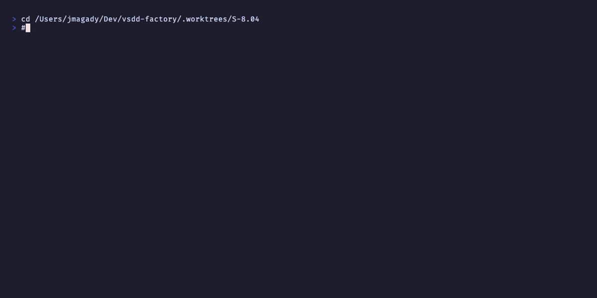

# AC-001: WASM crate exists; registry entry preserved

**Criterion:** WASM crate `crates/hook-plugins/update-wave-state-on-merge/` exists
targeting `wasm32-wasip1`, implements the vsdd_hook_sdk hook interface, builds successfully.
Registry entry uses `plugin = "hook-plugins/update-wave-state-on-merge.wasm"` with
`event = "SubagentStop"`, `priority = 940`, `on_error = "continue"`, `timeout_ms = 10000`.

**Trace:** BC-7.03.083 postcondition 1 (identity & registry binding).

---

## Crate Cargo.toml

File: `crates/hook-plugins/update-wave-state-on-merge/Cargo.toml`

Key fields:

```toml
[package]
name = "update-wave-state-on-merge"
version = "0.0.1"

[lib]
path = "src/lib.rs"

[[bin]]
name = "update-wave-state-on-merge"
path = "src/main.rs"

[features]
default = ["standalone"]
standalone = []

[dependencies]
vsdd-hook-sdk = { path = "../../hook-sdk" }
serde_yaml = { workspace = true }   # pinned 0.9.34 — OQ-002 decision
regex = { workspace = true }
```

The `standalone` feature (default for debug builds) uses WASI `std::fs` file I/O instead
of `vsdd` host functions, enabling `wasmtime run` testing without a dispatcher.
Production builds use `--no-default-features`.

---

## Registry Entry

Lines 943-956 of `plugins/vsdd-factory/hooks-registry.toml`:

```toml
[[hooks]]
name = "update-wave-state-on-merge"
event = "SubagentStop"
plugin = "hook-plugins/update-wave-state-on-merge.wasm"
priority = 940
timeout_ms = 10000
on_error = "continue"

[hooks.capabilities.read_file]
path_allow = [".factory/wave-state.yaml"]

[hooks.capabilities.write_file]
path_allow = [".factory/wave-state.yaml"]
max_bytes_per_call = 65536
```

- `script_path` and `shell_bypass_acknowledged` removed (legacy adapter fields gone).
- `exec_subprocess` capability block removed (no subprocess needed in WASM port).
- `jq` removed from `binary_allow` (YAML serialization is now Rust/serde_yaml).
- Structured `read_file` + `write_file` capability blocks with `path_allow` per
  F-S804-P1-004 (capability TOML schema).

---

## Recording



**Status: PASS**
