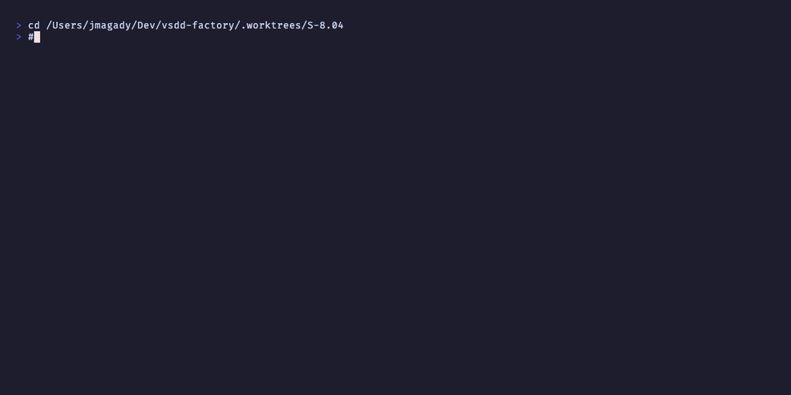

# AC-002: hooks.json entry deleted; .sh file deleted

**Criterion:** `hooks.json` command entry for `update-wave-state-on-merge` deleted from
all platform-specific files and template. `plugins/vsdd-factory/hooks/update-wave-state-on-merge.sh`
deleted.

**Trace:** BC-7.03.083 invariant 1 (native WASM plugins do not register in hooks.json).

---

## Verification

### .sh file deleted

```bash
$ ls plugins/vsdd-factory/hooks/update-wave-state-on-merge.sh 2>&1 || echo DELETED_AS_REQUIRED
No such file or directory
DELETED_AS_REQUIRED
```

File is absent from the worktree — the bash implementation is replaced by the WASM crate.
No reference to `update-wave-state-on-merge` remains in the `hooks/` directory.

### hooks.json entries removed

```bash
$ grep -rl update-wave-state-on-merge plugins/vsdd-factory/hooks/ 2>&1 || echo NO_HOOKSJSON_ENTRIES
NO_HOOKSJSON_ENTRIES
```

No platform-specific `hooks.json.*` file or template contains `update-wave-state-on-merge`.
This satisfies the E-8 D-7 / DRIFT-004 rule: native WASM plugins route via
`hooks-registry.toml` only.

### Platform files modified (hooks.json.* + template)

All six platform files were checked:
- `hooks.json.darwin-arm64`
- `hooks.json.darwin-x64`
- `hooks.json.linux-arm64`
- `hooks.json.linux-x64`
- `hooks.json.windows-x64`
- `hooks.json.template`

None contain `update-wave-state-on-merge` entries.

---

## Recording



**Status: PASS**
