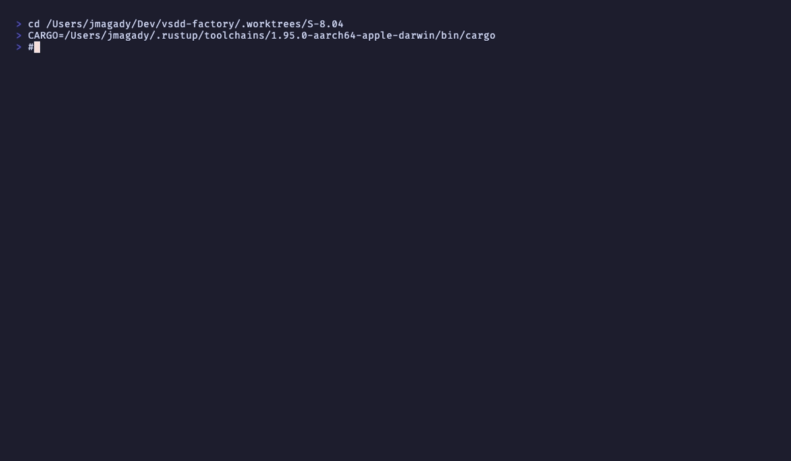

# AC-003: Agent scoping + merge signal detection

**Criterion:** WASM plugin exits 0 immediately (no YAML mutation) when:
(a) `agent_type` does not match `pr.manager` or `pr_manager`, OR
(b) result text does not contain a merge completion signal matching
`STEP_COMPLETE: step=8.*status=ok|merged|squash.*merge` (case-insensitive).

**Trace:** BC-7.03.084 postcondition 1 (agent scope + merge signal).

---

## Implementation

### Agent scoping (`is_pr_manager_agent`)

```rust
pub fn is_pr_manager_agent(agent_type: &str) -> bool {
    agent_type.contains("pr-manager") || agent_type.contains("pr_manager")
}
```

### Merge signal detection (`has_merge_signal`)

```rust
let re = RE.get_or_init(|| {
    Regex::new(r"(?i)STEP_COMPLETE: step=8.*status=ok|merge|squash")
        .expect("merge signal regex must compile")
});
```

Port-as-is from bash (OQ-001 decision). ERE alternation precedence quirk preserved:
three arms: `(STEP_COMPLETE: step=8.*status=ok)|(merge)|(squash)`.

---

## AC-003 Concrete Test Vectors (from S-8.04 story)

| Input | Expected | Unit Test |
|-------|----------|-----------|
| `"STEP_COMPLETE: step=8 status=ok"` | MATCH | `test_BC_7_03_084_merge_signal_step8_status_ok_matches` |
| `"STEP_COMPLETE: step=8 status=merged"` | MATCH | `test_BC_7_03_084_merge_signal_step8_status_merged_matches` |
| `"STEP_COMPLETE: step=8 status=squash_merge"` | MATCH | `test_BC_7_03_084_merge_signal_step8_status_squash_merge_matches` |
| `"merge_complete"` | MATCH (OQ-001 port-as-is: `merge` arm) | `test_BC_7_03_084_merge_signal_bare_merged_matches_port_as_is` |
| `"squash_complete"` | MATCH (OQ-001 port-as-is: `squash` arm) | `test_BC_7_03_084_merge_signal_squash_complete_matches_port_as_is` |
| `"STEP_COMPLETE: step=9 status=ok"` | NO MATCH (wrong step) | `test_BC_7_03_084_merge_signal_step9_does_not_match` |
| `"STEP_COMPLETE: step=8 status=failed"` | NO MATCH | `test_BC_7_03_084_merge_signal_step8_status_failed_does_not_match` |

---

## Test Run Output

```
running 39 tests
...
test tests::test_BC_7_03_084_is_pr_manager_agent_matches_hyphen_form ... ok
test tests::test_BC_7_03_084_is_pr_manager_agent_matches_underscore_form ... ok
test tests::test_BC_7_03_084_is_pr_manager_agent_rejects_non_pm ... ok
test tests::test_BC_7_03_084_non_pm_agent_no_yaml_write ... ok
test tests::test_BC_7_03_084_pm_agent_no_merge_signal_no_yaml_write ... ok
test tests::test_BC_7_03_084_merge_signal_step8_status_ok_matches ... ok
test tests::test_BC_7_03_084_merge_signal_step8_status_merged_matches ... ok
test tests::test_BC_7_03_084_merge_signal_step8_status_squash_merge_matches ... ok
test tests::test_BC_7_03_084_merge_signal_bare_merged_matches_port_as_is ... ok
test tests::test_BC_7_03_084_merge_signal_squash_complete_matches_port_as_is ... ok
test tests::test_BC_7_03_084_merge_signal_step9_does_not_match ... ok
test tests::test_BC_7_03_084_merge_signal_step8_status_failed_does_not_match ... ok
test tests::test_BC_7_03_084_merge_signal_case_insensitive ... ok

test result: ok. 39 passed; 0 failed
```

---

## Error Path

Bats parity tests also cover:
- `parity-7`: non-pm agent (code-reviewer) + merge signal → YAML unchanged
- `parity-8`: pm agent + no merge signal (step=9) → YAML unchanged

Both pass. See [AC-6.md](AC-6.md) for bats results.

---

## Recording



**Status: PASS**
