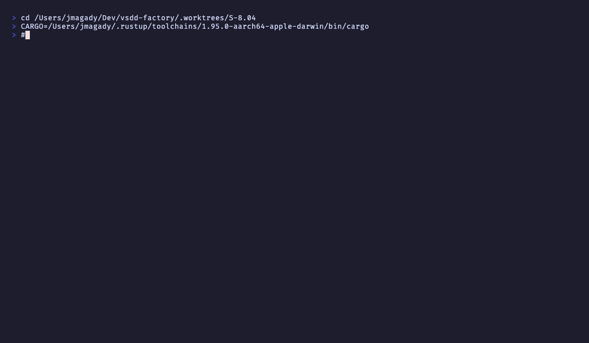

# AC-004: Story ID extract + stories_merged append + YAML write + emit_event

**Criterion:** When agent is pr-manager AND merge signal detected: WASM plugin extracts
story_id (pattern `S-[0-9]+\.[0-9]+` first, `STORY-[0-9]+` fallback). Reads
`.factory/wave-state.yaml` via `vsdd_hook_sdk::host::read_file`. Finds wave containing
story_id. Appends story_id to `stories_merged` if not present. Writes YAML back via
`vsdd_hook_sdk::host::write_file` (4-param form). Emits `hook.action` event with all
required fields. Exits 0.

**Trace:** BC-7.03.085 postcondition 1 (append story to wave_data.stories_merged).

---

## Story ID Extraction

```rust
pub fn extract_story_id(result: &str) -> Option<String> {
    // S-N.NN format preferred (EC-006: first match wins per bash head -1 parity)
    if let Some(m) = re_s.find(result) {
        return Some(m.as_str().to_string());
    }
    // Fallback to STORY-NNN
    re_story.find(result).map(|m| m.as_str().to_string())
}
```

Pattern priority: `S-[0-9]+\.[0-9]+` > `STORY-[0-9]+`.

---

## YAML Append (process_wave_state)

Core mutation logic with injectable callbacks for testability:

```rust
pub fn process_wave_state<R, W>(
    story_id: &str,
    read_yaml: R,   // () -> Option<String>
    write_yaml: W,  // (String) -> ()
) -> WaveStateOutcome
```

Steps:
1. `read_yaml()` → `None` means file absent → `NoOp` (EC-001)
2. `serde_yaml::from_str::<WaveState>` → malformed → `NoOp`
3. Find wave containing `story_id` in `stories` → not found → `NoOp` (EC-002 path)
4. `stories_merged.contains(story_id)` → duplicate → `NoOp`, no emit (EC-003)
5. Append story_id to `stories_merged`
6. `serde_yaml::to_string` → serialize back (key order preserved via IndexMap)
7. `write_yaml(updated_yaml)`

---

## Production write_file Call (main.rs)

```rust
vsdd_hook_sdk::host::write_file(
    ".factory/wave-state.yaml",
    &bytes,
    65536,   // max_bytes (S-8.10 v1.1 AC-1 4-param form)
    10000,   // timeout_ms (matches registry entry)
)
```

---

## emit_event Call Fields (main.rs)

```rust
vsdd_hook_sdk::host::emit_event(
    "hook.action",
    &[
        ("hook",             "update-wave-state-on-merge"),
        ("matcher",          "SubagentStop"),
        ("reason",           "wave_merge_recorded"),
        ("story_id",         story_id),
        ("wave",             wave.as_str()),
        ("total",            &total.to_string()),
        ("merged",           &merged.to_string()),
        ("gate_transitioned",&gate_transitioned.to_string()),
    ],
);
```

---

## Unit Test Results (BC-7.03.085 tests)

```
test tests::test_BC_7_03_085_extract_story_id_s_format ... ok
test tests::test_BC_7_03_085_extract_story_id_story_fallback_format ... ok
test tests::test_BC_7_03_085_extract_story_id_prefers_s_format_over_story_format ... ok
test tests::test_BC_7_03_085_extract_story_id_none_when_absent ... ok
test tests::test_BC_7_03_085_extract_story_id_empty_string_is_none ... ok
test tests::test_BC_7_03_085_process_wave_state_noop_when_yaml_absent ... ok
test tests::test_BC_7_03_085_process_wave_state_appends_story_to_stories_merged ... ok
test tests::test_BC_7_03_085_process_wave_state_appends_to_partial_merged_list ... ok
test tests::test_BC_7_03_085_process_wave_state_noop_when_story_not_in_any_wave ... ok
test tests::test_BC_7_03_085_process_wave_state_noop_on_duplicate_merge ... ok
test tests::test_BC_7_03_085_no_emit_on_duplicate_merge_via_hook_logic ... ok
test tests::test_BC_7_03_085_multiple_waves_story_in_second_wave ... ok
test tests::test_BC_7_03_085_malformed_yaml_returns_noop ... ok
test tests::test_BC_7_03_085_ec001_absent_yaml_is_noop ... ok
test tests::test_BC_7_03_085_ec002_no_story_id_no_mutation ... ok
test tests::test_BC_7_03_085_ec007_process_wave_state_only_writes_yaml_content ... ok
test tests::test_BC_7_03_085_BC_7_03_086_integration_full_merge_flow ... ok
```

---

## Error Path

- EC-001 (absent YAML): `test_BC_7_03_085_process_wave_state_noop_when_yaml_absent` — PASS
- EC-002 (no story ID): `test_BC_7_03_085_ec002_no_story_id_no_mutation` — PASS
- EC-003 (duplicate): `test_BC_7_03_085_process_wave_state_noop_on_duplicate_merge` — PASS
- EC-005 (write failure): `test_BC_7_03_083_ec005_write_failure_still_returns_continue` — PASS

---

## Recording



**Status: PASS**
