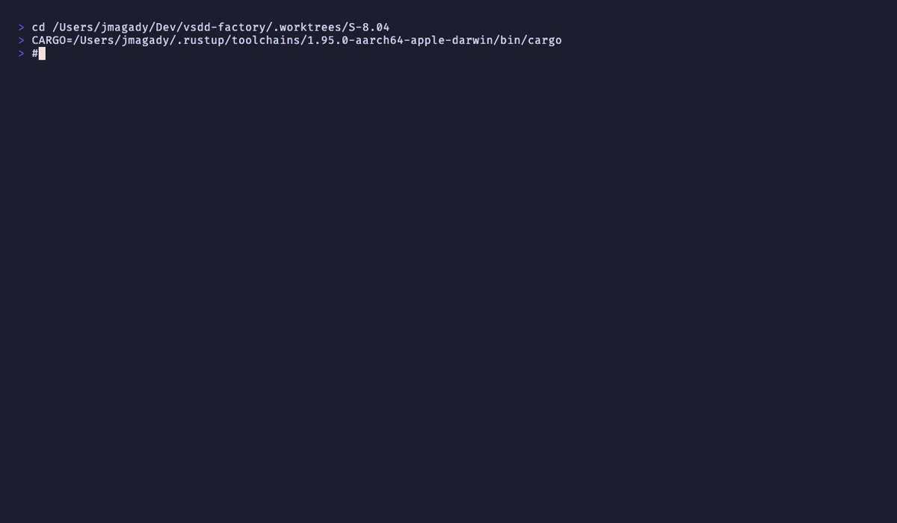

# AC-005: gate_status flip to pending (4-case truth table)

**Criterion:** When all stories in a wave are now in `stories_merged`: WASM plugin sets
`wave_data.gate_status = "pending"` and `state.next_gate_required = wave_name`. Writes
stderr message. Emits event with `gate_transitioned=true`. Exits 0.

**Trace:** BC-7.03.086 postcondition 1 (flips gate_status to pending when wave fully merged).

---

## AC-005 Four-Case Truth Table

Per F-S804-P1-007 (YAML semantic trichotomy):

| Case | YAML representation | Serde `Option<String>` | Action |
|------|---------------------|------------------------|--------|
| 1 | key absent | `None` | flip to "pending" |
| 2 | key present, YAML null/`~` | `None` | flip to "pending" |
| 3 | key present, `"not_started"` | `Some("not_started")` | flip to "pending" |
| 4 | key present, any other string | `Some("...")` | DO NOT flip |

### Rust field declaration

```rust
#[serde(default)]
gate_status: Option<String>,
```

The `#[serde(default)]` attribute ensures both case 1 (key absent) and case 2 (YAML null/`~`)
deserialize as `None`, giving identical behavior.

---

## Gate Flip Logic

```rust
let should_flip = all_merged && matches!(
    state.waves[wave_index].gate_status.as_deref(),
    None | Some("not_started")
);

if should_flip {
    state.waves[wave_index].gate_status = Some("pending".to_string());
    state.waves[wave_index].next_gate_required =
        Some(serde_yaml::Value::String(wave_name.clone()));
}
```

---

## Stderr Reminder (main.rs)

```rust
if *gate_transitioned {
    eprintln!(
        "update-wave-state-on-merge: all stories in {} merged. \
         gate_status → pending.\n  Run the wave integration gate \
         before starting the next wave.",
        wave
    );
}
```

---

## Unit Test Results (BC-7.03.086 tests)

```
test tests::test_BC_7_03_086_gate_flip_when_status_not_started_and_all_merged ... ok
test tests::test_BC_7_03_086_gate_flip_when_status_key_absent ... ok
test tests::test_BC_7_03_086_gate_flip_when_status_yaml_null ... ok
test tests::test_BC_7_03_086_no_gate_flip_when_status_already_set ... ok
test tests::test_BC_7_03_086_integration_all_merged_gate_flip_in_written_yaml ... ok
```

All 5 BC-7.03.086 tests pass.

---

## Error Path (EC-004)

`test_BC_7_03_086_no_gate_flip_when_status_already_set` verifies that `gate_status=completed`
(case 4) does NOT trigger a flip. The story IS appended to `stories_merged`, but
`gate_transitioned` remains `false`. This prevents double-flipping an already-completed gate.

---

## Recording



**Status: PASS**
