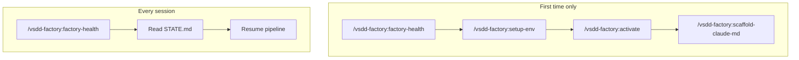

# Getting Started with vsdd-factory

This guide walks you through installing the VSDD plugin, running your first session,
and understanding the core concepts you need before starting a project.

---

## Prerequisites

### Required

- **Claude Code CLI** -- the plugin runs inside Claude Code sessions. Install from
  [claude.ai/code](https://claude.ai/code).
- **git** -- the factory uses git worktrees to isolate pipeline state from your source code.
- **jq** -- JSON processing, used by hooks and bin helpers.
- **yq** -- YAML processing, used by workflow parsing and wave-state queries.

### Optional (for running tests)

- **bats-core** -- the plugin's test suite uses [bats](https://github.com/bats-core/bats-core).
  Install via your package manager (`brew install bats-core` on macOS).

### Language-specific (depends on your target project)

- **Rust projects:** Rust 1.85+, `cargo-clippy`, `cargo-fmt` (nightly), `cargo-mutants`,
  `cargo-fuzz`, Kani verifier
- **TypeScript projects:** Node.js, npm/pnpm, Stryker, fast-check
- **Python projects:** Python 3.11+, Hypothesis, mutmut, Semgrep

You do not need all of these up front. The `/vsdd-factory:setup-env` command checks what is available
and reports what is missing for your target project's language.

---

## Installation

### From the Claude Code plugin marketplace

```shell
/plugin marketplace add drbothen/vsdd-factory
/plugin install vsdd-factory@vsdd-factory
```

This installs the plugin globally. It is available in every Claude Code session.

### Local development mode

If you are working on the plugin itself, or want to test a local copy:

```bash
claude --plugin-dir ./plugins/vsdd-factory
```

This loads the plugin from the local directory instead of the installed marketplace version.

---

## First-time project setup

Run these once when you first connect a project to the VSDD factory.

### 1. Check factory health

```
/vsdd-factory:factory-health
```

Verifies that the `.factory/` git worktree exists and is properly mounted on the
`factory-artifacts` orphan branch. If anything is wrong, it auto-repairs:

- Creates the `factory-artifacts` orphan branch if missing
- Mounts the `.factory/` worktree if missing
- Creates `STATE.md` if missing
- Creates the directory structure (`specs/`, `stories/`, `cycles/`, etc.) if missing

### 2. Check environment

```
/vsdd-factory:setup-env
```

Verifies your toolchain: git configuration, language-specific tools, MCP server
availability, and shell tool versions. Reports what is missing for your project's language.

### 3. Activate the orchestrator

```
/vsdd-factory:activate
```

Sets the VSDD orchestrator as your default agent for this project. The orchestrator drives
the pipeline — it reads workflow data, dispatches specialist agents, and enforces quality
gates. Without activation, you can still use individual skills manually, but the
orchestrator won't coordinate them.

Activation writes to `.claude/settings.local.json` (per-project, gitignored). Teammates
activate individually. To deactivate: `/vsdd-factory:deactivate`.

### 4. Generate project instructions

```
/vsdd-factory:scaffold-claude-md
```

Auto-detects your project's language, build/test/lint commands, git workflow, and key
documentation, then generates a `CLAUDE.md` at the project root. This file gives Claude
Code the context it needs to build and navigate your specific project.

The plugin provides methodology, principles, and rules automatically. The `CLAUDE.md`
covers project-specific context only: toolchain, commands, and references. Re-run anytime
to regenerate.

### 5. (Optional) Wire the project into the observability stack

If you've already installed Docker and plan to use the local Grafana
dashboards, register this project with the stack in one step:

```
/vsdd-factory:onboard-observability
```

This does two things:

1. Runs `factory-obs register` so the project's `.factory/logs/` is
   tailed by the collector (any factory anywhere on the filesystem —
   `~/Dev/foo`, `~/work/bar`, `/opt/team/baz`; the plugin makes no
   parent-directory assumption).
2. Writes the 5 `OTEL_*` env vars to `.claude/settings.local.json`
   so this session's Claude Code OTel telemetry (cost, tokens, tool
   calls) ships to the same Loki / Prometheus.

After onboarding, **restart your Claude Code session** (the OTel env
vars only take effect on start), then run:

```
/vsdd-factory:factory-obs up          # start the stack (no-op if running)
/vsdd-factory:factory-obs dashboard   # open http://localhost:3000
```

Onboarding is idempotent — safe to re-run anytime. If you only need
one half (register-only or telemetry-only), use
`/vsdd-factory:factory-obs register` or `/vsdd-factory:claude-telemetry on`
directly.

Skip this step if you don't want observability — the factory works
fine without it, and all the file-based CLIs (`factory-query`,
`factory-report`, `factory-dashboard`) read the same event log.

---

## Every session

Run these two steps at the start of every Claude Code session.

### 1. Check factory health

```
/vsdd-factory:factory-health
```

Fast and idempotent. Verifies the worktree is mounted and STATE.md exists.

### 2. Read pipeline state

```
Read .factory/STATE.md
```

STATE.md is the single source of truth for where the pipeline left off. It tells you the
current phase, what was completed, and what to do next. Every skill reads it before acting
and updates it after phase transitions.

---

## Session start flow



---

## Understanding the factory worktree

The `.factory/` directory is not an ordinary directory. It is a **git worktree** mounted
on an orphan branch called `factory-artifacts`. This means:

- `.factory/` has its own git history, separate from your `main` and `develop` branches.
- Specs, stories, and pipeline state are version-controlled but never pollute your source
  code branches.
- You commit factory changes with `cd .factory && git add -A && git commit -m "factory(...): ..."`.
- The factory branch has no parent -- it was created with `git checkout --orphan`.

This separation is deliberate. Your source code lives on `develop` (and `main` for releases).
Your pipeline artifacts live on `factory-artifacts`. They share a git repository but have
independent histories.

### What lives in `.factory/`

| Directory | Purpose | Lifecycle |
|-----------|---------|-----------|
| `specs/` | Product brief, domain spec, PRD, BCs, VPs, architecture | Living -- always current truth |
| `stories/` | Story files, epics, dependency graph, sprint state | Accumulating -- grows each cycle |
| `cycles/` | Per-pipeline-run artifacts (adversarial reviews, convergence reports) | Cycle-scoped -- immutable after close |
| `holdout-scenarios/` | Hidden acceptance scenarios for information-asymmetric testing | Living -- some retired after evaluation |
| `semport/` | Semantic porting artifacts from brownfield ingestion | Living |
| `demo-evidence/` | Visual review tracking per story | Accumulating |
| `STATE.md` | Pipeline progress tracker | Critical -- updated at every transition |

### What does NOT live in `.factory/`

Source code. Tests. Build artifacts. These live in your normal branches (`develop`, feature
branches, `main`). The factory holds specs and state, never implementation.

---

## Your first brownfield ingest

If you have an existing codebase you want to analyze before building on it:

```
/vsdd-factory:brownfield-ingest ../path/to/existing-codebase
```

This runs the broad-then-converge analysis protocol:

1. **Step A (Source Acquisition):** Clone or copy the codebase into `.reference/`.
2. **Step B (Broad Sweep):** 7 passes analyzing inventory, architecture, domain model,
   behavioral contracts, NFRs, conventions, and a synthesis.
3. **Step C (Convergence Deepening):** Each pass iterates until novelty decays to NITPICK.
   Domain model and behavioral contracts deepen first (highest value), then the rest.
4. **Step D (Coverage Audit):** Grep-driven verification that all source directories have analysis coverage.
5. **Step E (Extraction Validation):** Behavioral + metric accuracy check against actual source.
6. **Step F (Final Synthesis):** Definitive synthesis incorporating all convergence rounds,
   with a prioritized lessons section (P0/P1/P2/P3 buckets).

The codebase is cloned into `.reference/<project>/` and all analysis outputs go to
`.factory/semport/<project>/`. The analysis feeds directly into Phase 1 spec crystallization.

Expect this to take significant time and token budget for large codebases. The protocol
dispatches subagents for each pass and validates findings with a separate extraction-validation
agent.

---

## Your first greenfield project

If you are starting from scratch with no existing codebase:

### 1. Create a product brief

```
/vsdd-factory:create-brief
```

This runs a guided Q&A session. You describe your product vision, target users, scope,
and constraints. The output is `.factory/specs/product-brief.md`.

### 2. Create a domain specification

```
/vsdd-factory:create-domain-spec
```

Reads the product brief and produces the L2 domain spec: entities, relationships, processes,
invariants, capabilities (CAP-NNN), domain invariants (DI-NNN), and failure modes (FM-NNN).

### 3. Create a PRD

```
/vsdd-factory:create-prd
```

Elaborates the brief and domain spec into testable requirements with behavioral contracts
(BC-S.SS.NNN). Also produces PRD supplements (error taxonomy, interface definitions, NFRs).

### 4. Create architecture

```
/vsdd-factory:create-architecture
```

Designs the system architecture from the PRD and BCs. Makes ADR-style decisions with
rationale. Creates verification properties (VP-NNN) with proof methods and feasibility
assessments.

### 5. Review adversarially

```
/vsdd-factory:adversarial-review specs
```

Spawns an adversary agent (different model family, fresh context) to tear into the specs.
Iterates until novelty decays. Fix findings, re-review, until the adversary can only
produce nitpicks.

### 6. Decompose into stories

```
/vsdd-factory:decompose-stories
```

Breaks the specs into epics, stories, and waves. Each story maps to behavioral contracts
and has acceptance criteria, tasks, and dependency ordering.

### 7. Deliver stories

```
/vsdd-factory:deliver-story STORY-001
```

This dispatches the full TDD pipeline for a single story: worktree creation, stub generation,
test writing, Red Gate verification, implementation, demo recording, and PR creation.

---

## Understanding modes

The VSDD pipeline supports 8 workflow modes:

| Mode | When to use | Entry point |
|------|-------------|-------------|
| **Greenfield** | New project from scratch | `/vsdd-factory:create-brief` |
| **Brownfield** | Existing codebase to extend or rebuild | `/vsdd-factory:brownfield-ingest` |
| **Feature** | Adding to a VSDD-managed project | Orchestrator auto-detects |
| **Maintenance** | Scheduled quality sweeps | `/vsdd-factory:maintenance-sweep` |
| **Discovery** | Autonomous opportunity research | `/vsdd-factory:discovery-engine` |
| **Planning** | Adaptive front-end (runs automatically) | Embedded in greenfield/brownfield |
| **Multi-Repo** | Cross-repo coordination | Auto-detected from `project.yaml` |
| **Code Delivery** | Per-story TDD (sub-workflow) | `/vsdd-factory:deliver-story` |

The pipeline has 8 phases numbered 0-7: Codebase Ingestion, Spec Crystallization, Story Decomposition, TDD Implementation, Holdout Evaluation, Adversarial Refinement, Formal Hardening, and Convergence. Different modes run different subsets of these phases.

You don't need to choose multi-repo upfront — if the architect discovers multi-service topology during Phase 1, the pipeline transitions automatically (with your confirmation).

See [Workflow Modes](workflow-modes.md) for detailed descriptions and [Pipeline Paths](pipeline-paths.md) for all 14 possible routes through the factory.

---

## Next steps

- [Workflow Modes](workflow-modes.md) -- all 8 modes with routing diagram and mode detection logic
- [Pipeline Paths](pipeline-paths.md) -- all 14 paths through the factory with step traces
- [Pipeline Overview](pipeline-overview.md) -- the full phase map with detailed descriptions
- [Configuration](configuration.md) -- directory layout, STATE.md, hook behavior
- [Troubleshooting](troubleshooting.md) -- common issues and fixes
- [Glossary](glossary.md) -- VSDD terminology reference
