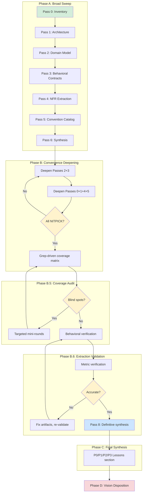

# Phase 0: Brownfield Ingest

Phase 0 extracts a complete semantic understanding of an existing codebase. It produces the knowledge artifacts that feed every downstream phase -- domain models, behavioral contracts, architecture maps, convention catalogs, and a prioritized lessons section that becomes the action backlog for your new project.

## When to Use Phase 0

Run brownfield ingest when you are:

- **Rebuilding** an existing system from scratch in a new language or framework
- **Inheriting** a codebase you did not write and need to understand deeply
- **Porting** behavior from a reference implementation (feeds into gene-transfusion stories)
- **Auditing** what exists before defining what to build next

If you are starting from a blank slate with no reference code, skip to [Phase 1](phase-1-spec-crystallization.md).

## Overview



Phase D (Vision Disposition) is deferred until after a product brief exists. It re-examines every ingested repo through the vision lens to decide what to Model, Reimplement, Enhance, or Leave Behind.

## Prerequisites

Before starting brownfield ingest, verify:

1. **The plugin is installed.** The `vsdd-factory` plugin must be available in your Claude Code session.
2. **Factory health.** Run `/factory-health` to confirm `.factory/` is mounted and STATE.md exists.
3. **Source access.** You need a Git URL or local path to the codebase you want to analyze.

## Step-by-Step Walkthrough

### Source Acquisition

The skill automatically clones or copies the target codebase into `.reference/<project>/`. All analysis reads from this directory.

```
/brownfield-ingest https://github.com/org/repo-name
```

Or for a local path:

```
/brownfield-ingest ../my-existing-project
```

The skill updates `.factory/reference-manifest.yaml` with the URL, commit SHA, and date so the reference can be reconstructed on a new machine.

### Phase A: Broad Sweep (Passes 0-6)

Phase A runs seven sequential passes, each building on the prior. A `codebase-analyzer` subagent is dispatched for each pass.

| Pass | Name | What It Extracts | Output File |
|------|------|-----------------|-------------|
| 0 | Inventory | File tree, dependency graph, tech stack, file priority scores | `<project>-pass-0-inventory.md` |
| 1 | Architecture | Module boundaries, layers, deployment topology, Mermaid diagrams | `<project>-pass-1-architecture.md` |
| 2 | Domain Model | Entities, relationships, value objects, state machines, events | `<project>-pass-2-domain-model.md` |
| 3 | Behavioral Contracts | Draft BCs from tests and code, with HIGH/MEDIUM/LOW confidence | `<project>-pass-3-behavioral-contracts.md` |
| 4 | NFR Extraction | Performance, security, observability, reliability patterns | `<project>-pass-4-nfr-catalog.md` |
| 5 | Convention Catalog | Naming, module organization, error handling, test patterns | `<project>-pass-5-conventions.md` |
| 6 | Synthesis | Cross-reference, gap report, unified knowledge doc | `<project>-pass-6-synthesis.md` |

Pass 2 uses a two-sub-pass approach: 2a extracts structural elements (entities, relationships, value objects), then 2b extracts behavioral elements (operations, business rules, state machines, events).

After Phase A completes, the skill commits: `factory(phase-0): brownfield ingest of <project>`.

### Phase B: Convergence Deepening

Broad passes are necessarily shallow on a large codebase. Phase B iteratively deepens each pass until novelty decays to nitpicks. This is where the real understanding happens.

**Ordering matters.** Passes 2 (Domain Model) and 3 (Behavioral Contracts) deepen first because they are highest-value. After they converge, Passes 0, 1, 4, and 5 deepen -- they benefit from the entity and BC knowledge gained during Pass 2/3 convergence.

#### The Strict-Binary Novelty Protocol

Every deepening round must assess novelty as one of exactly two values:

| Assessment | Meaning | Action |
|---|---|---|
| **SUBSTANTIVE** | New entities, subsystems, contracts, or patterns discovered. Findings change the model. | Another round required. |
| **NITPICK** | Findings are refinements, wording improvements, or confirmations. Nothing changes the model. | Pass has converged. |

**The test:** Would removing this round's findings change how you would spec the system? If yes, SUBSTANTIVE. If no, NITPICK.

Only the literal token `NITPICK` counts as convergence. The orchestrator ignores agent self-declarations like "borderline NITPICK," "effectively converged," or "recommend halting." These phrases mean SUBSTANTIVE for orchestrator purposes.

#### Convergence Bounds

- Minimum 2 deepening rounds per pass before declaring NITPICK
- No fixed maximum. If round N is SUBSTANTIVE, round N+1 launches regardless of any round budget. Empirically, a large multi-tenant system (Vault) needed 62 rounds for Pass 2. Small single-purpose libraries converge in 2-8 rounds.
- All six passes (0-5) must converge independently

#### The Honest Convergence Clause

Every round prompt includes this clause verbatim:

> Honest convergence is required. If you find fewer than 3 substantive items, declare convergence and emit no updated file -- say "converged, no file emitted." Do not invent findings to justify this round's existence. Fabricating findings is strictly worse than stopping.

This counters a known failure mode: agents fabricate findings to justify their existence under pressure to produce SUBSTANTIVE output.

#### Known Round-1 Hallucination Classes

Round 1 outputs are systematically susceptible to five failure modes. Every round 2+ prompt instructs the agent to audit round 1 against these before adding new findings:

1. **Over-extrapolated token lists** -- round 1 claims a set contains items not actually in source
2. **Miscounted enumerations** -- round 1 claims "6 principles" when actual is 7
3. **Named pattern conflation** -- round 1 invents category names not in source
4. **Same-basename artifact conflation** -- round 1 merges two different files that share a filename
5. **Inflated or deflated metrics** -- LOC/file counts derived from estimation rather than `find` + `wc -l`

#### Targeted-Flag Carryover

Each round's "remaining gaps" list is passed verbatim into the next round's prompt. The orchestrator selects targets from the prior round's flags -- the agent must not pick its own targets, which causes topic drift and re-coverage of already-explored areas.

### Phase B.5: Coverage Audit

After all passes reach NITPICK, a coverage audit runs before final synthesis. This step is mandatory even after exhaustive deepening.

**Why B.5 is necessary:** Round-driven deepening selects targets from prior-round flags, which causes topic drift toward repeatedly-covered areas. Entire directories can stay unexamined even when overall round count is high. B.5 is the only check that catches this.

**Method:** The audit is grep-driven, not judgment-driven. It inventories the source tree, greps deep files for references to each package/subsystem, and flags any with zero or minimal hits as a blind spot. The output is a coverage matrix table (package x pass, covered yes/partial/no).

If blind spots are found, surgical per-blind-spot mini-rounds run (one targeted file per blind spot, named `<project>-phase-b5-tr-N.md`). After all mini-rounds land, the audit re-runs to verify they actually closed the gaps.

### Phase B.6: Extraction Validation

After B.5 passes, the `validate-extraction` agent verifies the accuracy of what was extracted. B.5 verified completeness; B.6 verifies correctness.

**The mandatory behavioral-vs-metric split.** Validation runs in two distinct phases:

1. **Behavioral verification** -- sample 20-30% of BCs against actual source code. For each sample, read the cited source line and report CONFIRMED / INACCURATE / HALLUCINATED.
2. **Metric verification** -- independently re-compute every numeric claim in the synthesis using shell commands (`find`, `wc -l`, `grep -c`). Any mismatch is an error regardless of magnitude.

The two phases have different failure modes. Behavioral errors are usually "described the wrong thing." Metric errors are usually "estimated instead of counted." Mixing them hides metric inflation because behavioral sampling naturally skips numeric claims.

Maximum 3 refinement iterations. If inaccuracies are found, the analysis artifacts are fixed and re-validated.

### Phase C: Final Synthesis

After all passes converge, coverage audit passes, and extraction validation passes, a final synthesis incorporates everything:

```
/brownfield-ingest <project>   (this runs automatically as the final step)
```

Output: `.factory/semport/<project>/<project>-pass-8-deep-synthesis.md`

The synthesis includes:
- Complete feature set and bounded context map
- Complexity ranking of subsystems
- Critical design decisions and anti-patterns
- Convergence report (rounds per pass, novelty trajectory)

#### The Mandatory P0/P1/P2/P3 Lessons Section

Every synthesis MUST include a `## Lessons for <target-project>` section organized in four priority buckets. This is the handoff from "what exists in the reference" to "what our project should do about it."

| Bucket | Meaning |
|---|---|
| **P0 -- Correctness gaps** | Must fix before next release. Plugin does not load, behavior is broken, contracts violated. |
| **P1 -- High-ROI improvements** | Proven pattern from reference, small edit cost, measurable behavior improvement. |
| **P2 -- Worth considering** | Plausibly valuable but needs judgment call. Lists trade-offs. |
| **P3 -- Known divergences** | Intentional differences. Just needs documentation so future readers do not mistake them for oversights. |

Each lesson cites: (a) what the target does today, (b) what the reference does, (c) the gap, and (d) specific action items with file paths. Without this section, downstream skills have to re-derive the actionable conclusions.

### Phase D: Vision Disposition (Deferred)

Phase D is not part of the initial brownfield ingest. It runs after a product brief exists, via a separate command:

```
/disposition-pass <project>
/disposition-pass --all --rollup
```

The disposition pass re-examines every ingested repo through the product vision lens and sorts each capability into one of four buckets: **Model** (adopt as-is), **Take but reimplement** (right idea, rebuild cleanly), **Enhance** (take and extend), or **Leave behind** (reject with reason).

The master rollup (`MASTER-DISPOSITION-ROLLUP.md`) tracks the vision-doc SHA for staleness detection. When the vision doc changes materially, dispositions must be re-run.

## Subagent Delivery Protocol

Subagents run in a sandbox whose Write-tool allowlist may not cover the target output directory. The default delivery mode is **inline return**: every subagent returns all deliverables inline, delimited with `=== FILE: <filename> ===` on its own line followed by the complete file content. The orchestrator parses the stream and writes each block to disk.

This is not a fallback -- it is the approved delivery mode. It avoids Write-tool sandbox denials that can cause agents to abort mid-round.

## Artifacts Produced

All artifacts write to `.factory/semport/<project>/`:

| File Pattern | Description |
|---|---|
| `<project>-pass-0-inventory.md` | File tree, dependencies, tech stack |
| `<project>-pass-1-architecture.md` | Module boundaries, Mermaid diagrams |
| `<project>-pass-2-domain-model.md` | Entities, relationships, state machines |
| `<project>-pass-3-behavioral-contracts.md` | Draft BCs with confidence levels |
| `<project>-pass-4-nfr-catalog.md` | Performance, security, observability patterns |
| `<project>-pass-5-conventions.md` | Naming, patterns, anti-patterns |
| `<project>-pass-6-synthesis.md` | Cross-reference, gap report |
| `<project>-pass-N-deep-<name>-rM.md` | Deepening round M for pass N |
| `<project>-coverage-audit.md` | Phase B.5 coverage matrix |
| `<project>-phase-b5-tr-N.md` | Targeted blind-spot mini-rounds |
| `<project>-extraction-validation.md` | Phase B.6 accuracy verification |
| `<project>-pass-8-deep-synthesis.md` | Phase C final synthesis |
| `<project>-pass-9-corverax-disposition.md` | Phase D vision disposition (deferred) |

## The Iron Law

> **NO ROUND COMPLETION WITHOUT HONEST CONVERGENCE CHECK FIRST**

A round that produces padded findings to justify its existence is worse than a round that honestly reports "converged, no file emitted." Fabrication is not convergence, and neither is self-declared "effectively converged" or "borderline NITPICK" -- only the literal token `NITPICK` after honest audit counts.

## Red Flags

These are the rationalization patterns that indicate the protocol is being violated:

| Thought | Reality |
|---|---|
| "This round found nothing new, let me add some refinements" | That is fabrication. Emit "converged, no file emitted" and stop. |
| "The agent said 'effectively converged', that counts" | Strict binary. Only the literal token `NITPICK` counts. |
| "Round 1 already covered this, no need to audit in round 2" | Round 1 outputs are the most hallucination-prone. Audit against the 5 Known Hallucination Classes. |
| "I'll skip B.5 -- all passes reached NITPICK" | B.5 catches topic drift that round-driven deepening cannot. Mandatory. |
| "The metric numbers look right, I can skip Phase 2 of validation" | Metric inflation is the most common silent failure. Always recount with `find` + `wc -l`. |
| "I'll combine two repos into one agent to save dispatches" | Combined agents exhaust context and produce partial results. One agent per project, always. |
| "Phase C synthesis doesn't need the P0/P1/P2/P3 section for this small repo" | Every synthesis needs it. Downstream work reads that section as the backlog. |
| "The agent says the next round will probably be NITPICK, let's stop" | Predicted-NITPICK is systematically unreliable. Run the next round. |

## Example Session

A typical brownfield ingest session for a medium-sized project:

```
> /factory-health
Factory health: OK

> /brownfield-ingest https://github.com/org/payment-service

I'm using the brownfield-ingest skill to run the broad-then-converge
analysis protocol on payment-service.

Phase A: Broad Sweep
  Pass 0 (Inventory): 247 files, 18K LOC, Go + PostgreSQL    [complete]
  Pass 1 (Architecture): 4 layers, 2 bounded contexts        [complete]
  Pass 2 (Domain Model): 23 entities, 8 state machines       [complete]
  Pass 3 (Behavioral Contracts): 67 draft BCs                [complete]
  Pass 4 (NFRs): 12 performance patterns, 8 security         [complete]
  Pass 5 (Conventions): 15 patterns cataloged                 [complete]
  Pass 6 (Synthesis): 4 gaps identified                       [complete]
  Committed: factory(phase-0): brownfield ingest of payment-service

Phase B: Convergence Deepening
  Pass 2 round 1: SUBSTANTIVE (11 new entities from /internal/ledger)
  Pass 3 round 1: SUBSTANTIVE (14 new BCs from test files)
  Pass 2 round 2: SUBSTANTIVE (5 state machines in /internal/reconciliation)
  Pass 3 round 2: NITPICK
  Pass 2 round 3: NITPICK
  Pass 0 round 1: SUBSTANTIVE (missed /cmd/migrate tool)
  Pass 1 round 1: NITPICK
  Pass 4 round 1: SUBSTANTIVE (rate limiting config in /deploy)
  Pass 5 round 1: NITPICK
  Pass 0 round 2: NITPICK
  Pass 4 round 2: NITPICK
  All passes converged.

Phase B.5: Coverage Audit
  Coverage matrix: 3 blind spots (webhooks, idempotency-keys, audit-log)
  Targeted fills: 3 mini-rounds
  Re-audit: PASS

Phase B.6: Extraction Validation
  BCs sampled: 22/81 (27%)
  Confirmed: 20, Inaccurate: 2 (fixed), Hallucinated: 0
  Metrics verified: 8/8 match
  Result: PASS (1 iteration)

Phase C: Final Synthesis
  Written: payment-service-pass-8-deep-synthesis.md
  Lessons: 3 P0, 7 P1, 5 P2, 4 P3

Brownfield ingest complete: payment-service
  Artifacts in .factory/semport/payment-service/
  Use these as inputs for /create-brief and /create-domain-spec.
```

## Troubleshooting

**Sandbox write denials.** If a subagent fails with a Write-tool error, the inline delivery protocol should handle this automatically. If you see `=== FILE: ... ===` delimiters in agent output but no file on disk, the orchestrator's parsing may have failed -- check the agent output and manually save the content.

**Context exhaustion.** If an agent produces truncated or incoherent output, the codebase may be too large for a single pass. The skill handles this by dispatching fresh agents per round, but very large monorepos may need the `--incremental` flag on `/semport-analyze` to process modules individually.

**Combined-repo anti-pattern.** Never combine multiple repos into a single agent invocation. Combined agents exhaust context before completing all projects, producing partial results that must be discarded. When processing multiple repos, launch separate agents (up to 10 concurrent).

**Stale reference.** If the reference codebase has been updated since ingestion, re-run `/brownfield-ingest` with the same path. The skill will detect existing artifacts and offer to resume or start fresh. Check `.factory/reference-manifest.yaml` for the recorded commit SHA.

**Resuming after interruption.** Use the `--resume` flag to continue from the last completed pass or deepening round:

```
/brownfield-ingest payment-service --resume
```

## What Comes Next

After brownfield ingest completes:

- Run `/create-brief` to define the product vision (Phase 1)
- After the brief exists, run `/disposition-pass <project>` to decide what to Model, Reimplement, Enhance, or Leave Behind (Phase D)
- Brownfield artifacts feed directly into `/create-domain-spec` and `/create-prd`
