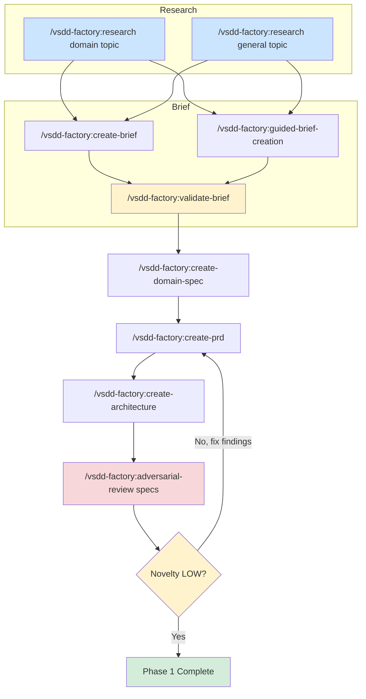

# Phase 1: Spec Crystallization

Phase 1 transforms your product vision into a complete, adversarially reviewed specification set. By the end of this phase you have a product brief, domain model, behavioral contracts, architecture documents, and verification properties -- all stress-tested by a fresh-context adversary.

The spec is more important than the code. If you deleted every line of implementation and regenerated from the spec, the result should be correct.

## When to Use Phase 1

Enter Phase 1 when:

- **After Phase 0** -- you have brownfield ingest artifacts and want to define the new system
- **Greenfield start** -- you have no existing code to analyze and want to build from scratch
- **Vision change** -- the product direction has shifted and specs need to be rebuilt from the new brief

## Overview



### Visual Tooling

The brainstorming, guided-brief-creation, and create-architecture skills support visual tooling for interactive mockups and diagrams. When visual content would help you make decisions, the agent offers the best available tool:

1. **Visual companion** (`/vsdd-factory:visual-companion`) — interactive browser-based mockups. Requires Node.js.
2. **Visual companion excalidraw mode** (`/vsdd-factory:visual-companion` excalidraw) — architecture diagrams, entity relationships, and interactive editing. Requires setup.
3. **Create excalidraw** (`/vsdd-factory:create-excalidraw`) — generate `.excalidraw` files for offline viewing in excalidraw.com or VS Code. Always available.
4. **Mermaid code blocks** — sequence diagrams, state machines
5. **ASCII/text** — simple comparisons and wireframes

The agent auto-detects availability and falls back gracefully. No setup required — just accept when offered.

## The Spec Hierarchy

VSDD uses a four-level specification hierarchy. Each level builds on the one above it:

| Level | Artifact | Lifecycle | Purpose |
|-------|----------|-----------|---------|
| **L1** | Product Brief | Mutable | Human input -- vision, users, scope, constraints |
| **L2** | Domain Specification | Living | Problem-space model -- entities, relationships, invariants |
| **L3** | Behavioral Contracts (BC-S.SS.NNN) | Accumulating | Testable behavior -- preconditions, postconditions, error cases |
| **L4** | Verification Properties (VP-NNN) | Immutable once green | Formal properties -- safety, liveness, invariants proven by tooling |

The contract chain provides full traceability: L1 Brief leads to L2 Capability leads to L3 Behavioral Contract leads to Story AC leads to Test Case leads to Implementation leads to L4 Verification Property leads to Formal Proof.

## Step-by-Step Walkthrough

### Step 1: Research (`/vsdd-factory:research`)

Run as many research sessions as needed before writing the brief. Research comes in two flavors:

**Domain research** investigates the problem space:

```
/vsdd-factory:research domain competitive landscape for CLI AI orchestration tools
/vsdd-factory:research domain user needs for multi-agent workflow automation
```

**General research** investigates technology and implementation options:

```
/vsdd-factory:research Rust workflow engine comparison -- xstate-rs vs saga-rs vs custom
/vsdd-factory:research general security advisories for tokio 1.x
```

Each run spawns the `research-agent` with MCP tool access (Perplexity, Context7, Tavily). Results write to `.factory/specs/vsdd-factory:research/`:

- Domain: `domain-<slug>-<YYYY-MM-DD>.md`
- General: `general-<slug>-<YYYY-MM-DD>.md`

The research index (`RESEARCH-INDEX.md`) tracks all runs. Subsequent skills read this index to avoid asking questions the research already answers.

### Step 2: Product Brief (`/vsdd-factory:create-brief` or `/vsdd-factory:guided-brief-creation`)

The brief is the L1 foundation that everything else builds on.

**Use `/vsdd-factory:create-brief`** for a structured Q&A session. The skill asks questions one at a time across six areas: vision and problem, users and personas, core value proposition, success criteria, constraints, and prior art. It reads existing research to avoid redundant questions.

```
/vsdd-factory:create-brief
```

**Use `/vsdd-factory:guided-brief-creation`** for a more facilitated, conversational approach. This skill draws out your vision through staged elicitation -- understand intent first, then fill sections through conversation, then draft and review. It includes an optional adversarial review of the brief itself.

```
/vsdd-factory:guided-brief-creation
```

Both produce `.factory/specs/product-brief.md` (or `.factory/planning/product-brief.md` for guided creation).

**When brownfield artifacts exist**, the skill reads `.factory/semport/` synthesis files and uses them as starting context. It validates extracted knowledge with you rather than asking from scratch.

### Step 3: Validate Brief (`/vsdd-factory:validate-brief`)

Before proceeding, validate the brief against six checks:

```
/vsdd-factory:validate-brief
```

| Check | What It Catches |
|-------|----------------|
| Structure | Missing required sections (problem, users, scope, success criteria, constraints) |
| Quality | Vague language, unmeasurable success criteria, scope contradictions |
| Bloat | Brief exceeding 500 words in core sections, narrative padding, requirements leakage |
| Implementation leakage | Technology names that do not belong at the brief level (frameworks, databases, infra) |
| Information density | Conversational filler, wordy phrases, hedge words that waste agent context budget |
| Completeness | Placeholder sections, total content under 150 words |

Output: `.factory/planning/brief-validation.md` with per-section PASS/FAIL/WEAK/BLOATED status and a token estimate.

### Step 4: Domain Specification (`/vsdd-factory:create-domain-spec`)

The L2 domain spec models the problem space independent of implementation choices. It bridges the brief (what to build) and the PRD (how it behaves).

```
/vsdd-factory:create-domain-spec
```

The skill uses a two-pass extraction approach, working with you interactively:

**Pass 1 -- Structural extraction** (the nouns): entities, relationships, value objects, enums, ubiquitous language glossary.

**Pass 2 -- Behavioral extraction** (the verbs): processes, domain events, business rules, invariants, state machines.

**Pass 3 -- Context boundaries**: bounded contexts, overlap points, translation at boundaries.

If brownfield ingest artifacts exist in `.factory/semport/`, the skill reads Pass 2 (domain model) and Pass 3 (behavioral contracts) as starting points and validates with you rather than asking from scratch.

Output is always sharded:

```
.factory/specs/domain-spec/
  L2-INDEX.md
  capabilities.md
  entities.md
  invariants.md
  bounded-contexts.md
  ubiquitous-language.md
```

### Step 5: PRD with Behavioral Contracts (`/vsdd-factory:create-prd`)

The PRD transforms the brief and domain spec into testable requirements. This is where behavioral contracts (BCs) are born.

```
/vsdd-factory:create-prd
```

The process:

1. **Identify subsystems** from the brief and domain spec. Each gets a subsystem number (01-99) for BC numbering.
2. **Define sections** within each subsystem (01-99). Each section groups related behaviors.
3. **Write behavioral contracts** (BC-S.SS.NNN) for each section. Every BC must be testable, unambiguous, and complete with preconditions, postconditions, and error cases.
4. **Define error taxonomy** -- domain-specific error codes, severity, recovery strategies.
5. **Define interface contracts** -- public API surface, input/output formats, type definitions.
6. **Classify module criticality** -- CRITICAL/HIGH/MEDIUM/LOW. This determines review depth, test coverage, and holdout scenario density.

Output:

| File | Content |
|------|---------|
| `.factory/specs/prd.md` | Core PRD with subsystem index and requirements |
| `.factory/specs/behavioral-contracts/BC-S.SS.NNN.md` | One file per contract |
| `.factory/specs/behavioral-contracts/BC-INDEX.md` | Contract index with status tracking |
| `.factory/specs/prd-supplements/error-taxonomy.md` | Error codes, categories, recovery |
| `.factory/specs/prd-supplements/interface-definitions.md` | API surface, types |
| `.factory/specs/prd-supplements/module-criticality.md` | Criticality classification |

When reference repos exist, BCs that trace to ingested behavior include a `Source: <project>/<file>:<function>` reference in their Traceability section.

### Step 6: Architecture (`/vsdd-factory:create-architecture`)

Design the system architecture from the PRD and behavioral contracts. Architecture is sharded into numbered section files.

```
/vsdd-factory:create-architecture
```

The process:

1. **Identify architecture sections** based on PRD subsystems. Common sections:
   - ARCH-00: System overview, principles, constraints
   - ARCH-01: Core service architecture
   - ARCH-02: Data layer (models, storage, access patterns)
   - ARCH-03: API layer (endpoints, contracts)
   - ARCH-04: Agent system (if multi-agent)
   - ARCH-05: Workflow engine (if has workflows)
   - ARCH-06: External integrations

2. **Make decisions** using ADR (Architecture Decision Record) style: context, options considered with pros/cons, decision, rationale, consequences.

3. **Define component architecture** with responsibilities, interfaces, data flow, and strictly acyclic dependency direction.

4. **Define purity boundaries** -- pure core (domain logic, validation) vs impure shell (I/O, network, database). This is the most consequential design decision.

5. **Map BCs to components** for traceability.

6. **Define verification properties** (VP-NNN) -- invariants, safety properties, liveness properties. VPs are L4 artifacts: immutable once green.

Output:

| File | Content |
|------|---------|
| `.factory/specs/architecture/ARCH-INDEX.md` | Index linking all sections |
| `.factory/specs/architecture/ARCH-NN-<section>.md` | Per-section architecture |
| `.factory/specs/verification-properties/VP-INDEX.md` | VP index |
| `.factory/specs/verification-properties/VP-NNN.md` | Individual verification properties |

When reference repos exist, ADRs note whether they adopt or diverge from reference approaches: "Reference: payment-service uses event sourcing. We chose CQRS without event sourcing because..."

### Mandatory DTU Assessment

After architecture is produced, the architect runs a mandatory DTU (Digital Twin Universe) assessment. This identifies ALL external service dependencies across six integration surface categories:

1. **Inbound data sources** — APIs polled, feeds consumed, webhooks received
2. **Outbound operations** — notifications, ticketing, payments
3. **Identity & access** — OAuth/OIDC, API key managers, credential stores
4. **Persistence & state** — external databases, caches, message queues
5. **Observability & export** — log aggregators, metrics, tracing
6. **Enrichment & lookup** — threat intel, geocoding, pricing services

The assessment always produces `dtu-assessment.md` — even if the answer is "no external dependencies." This step cannot be skipped. See [Glossary](glossary.md) for DTU and Integration Surface Taxonomy definitions.

### Mandatory CI/CD Setup

After architecture determines the tech stack, the devops-engineer creates CI/CD pipelines:

- `.github/workflows/ci.yml` — lint, test, build on PR
- `.github/workflows/release.yml` — build + publish on tag
- `.github/workflows/security.yml` — weekly audit + PR check
- Branch protection updated to require CI status checks

CI/CD setup is deferred from repo initialization to this point because the language, framework, and deployment topology are unknown until the architect produces the architecture. This step always produces `cicd-setup.md`.

### Self-Review Before Adversarial Review

Each spec creation skill (create-brief, create-prd, create-architecture, create-domain-spec) runs a 4-point self-review before routing to the adversary:

1. **Placeholder scan** — no TBDs, TODOs, or incomplete sections
2. **Internal consistency** — IDs match across files, no contradictions
3. **Scope check** — focused enough for the next pipeline stage
4. **Ambiguity check** — no requirements interpretable two ways

This catches obvious gaps cheaply before spending tokens on the adversarial review loop.

### Anchor Justification Requirement

When creating specs, agents must justify every anchor choice:

- **product-owner:** justifies BC↔capability anchors citing capabilities.md
- **architect:** justifies subsystem assignments and crate ownership
- **story-writer:** justifies story↔subsystem and VP↔story anchors

If an anchor can't be justified against the source-of-truth, the agent stops and flags it rather than guessing. See [Glossary](glossary.md) for Semantic Anchoring definition.

### Step 7: Adversarial Review (`/vsdd-factory:adversarial-review specs`)

The complete spec set is reviewed by the adversary agent in a fresh context window. The adversary has not seen your prior work, explanations, or summaries.

```
/vsdd-factory:adversarial-review specs
```

The adversary reads all spec documents (brief, domain spec, PRD, supplements, BCs, VPs, architecture) and attacks looking for:

- Ambiguous language interpretable multiple ways
- Missing edge cases and implicit assumptions
- Contradictions between spec sections
- Properties marked "testable only" that should be provable
- Purity boundary violations
- Verification tool mismatches

#### The Iron Law

> **NO APPROVAL WITHOUT FRESH-CONTEXT REVIEW FIRST**

Fresh context means the adversary has not seen prior review passes, the author's explanations, or the orchestrator's summary. Loading any of those contaminates the information asymmetry the pattern depends on.

#### Pass Management

- Each review is a numbered pass (ADV-P1, ADV-P2, etc.)
- Minimum 2 passes. The first pass systematically misses things.
- After each pass, novelty is assessed. When findings are refinements rather than gaps, novelty is LOW.
- Maximum 5 passes before escalating to human.
- Findings from prior passes must not be leaked to subsequent adversary instances.

Findings write to `.factory/cycles/<current>/vsdd-factory:adversarial-reviews/`.

## Artifact Traceability

Every artifact traces to its source:

```
L1 Product Brief
  -> L2 Domain Spec Capability (CAP-NNN)
    -> L3 Behavioral Contract (BC-S.SS.NNN)
      -> Story Acceptance Criterion (AC-NNN)
        -> Test Case
          -> Implementation
            -> L4 Verification Property (VP-NNN)
```

You can answer "why does this line of code exist?" by tracing back through the chain to the product brief. You can answer "is this requirement tested?" by tracing forward from the BC to its test case.

## Quality Gate

Phase 1 is complete when:

1. Product brief exists and is validated
2. Domain spec covers the problem space
3. PRD has behavioral contracts across all subsystems
4. Architecture is sharded with ADRs and verification properties
5. Adversarial review has converged (adversary reports LOW novelty after minimum 2 passes)

## Red Flags

| Thought | Reality |
|---|---|
| "I already reviewed this, I can skip the adversary pass" | Self-review is not adversarial review. Dispatch. |
| "The spec is obviously correct, one pass is enough" | Minimum is 2. Round 1 systematically misses things. |
| "Let me summarize the prior pass for the adversary" | That destroys fresh context. Dispatch with only the target artifact. |
| "The adversary found nothing" | Zero findings after a short prompt is a prompt bug, not convergence. Re-dispatch with sharper scope. |
| "This finding isn't really critical, I'll downgrade it" | Severity is the adversary's call, not the orchestrator's. Record as-is. |
| "Novelty is LOW after one pass, we've converged" | Minimum 2 passes. No exceptions. |

## Example Command Sequence

```
/vsdd-factory:research domain competitive landscape for task orchestration
/vsdd-factory:research general Rust async runtime comparison 2026
/vsdd-factory:create-brief
/vsdd-factory:validate-brief
/vsdd-factory:create-domain-spec
/vsdd-factory:create-prd
/vsdd-factory:create-architecture
/vsdd-factory:adversarial-review specs
  # Pass 1: 8 findings (3 critical, 5 high)
  # Fix critical findings in specs
/vsdd-factory:adversarial-review specs
  # Pass 2: 2 findings (both medium -- refinements)
  # Novelty: LOW -- Phase 1 complete
```

## What Comes Next

After Phase 1 completes:

- Run `/vsdd-factory:decompose-stories` to break specs into implementable stories (Phase 2)
- If brownfield ingest was done, run `/vsdd-factory:disposition-pass` before decomposition to inform which stories use gene-transfusion vs from-scratch
