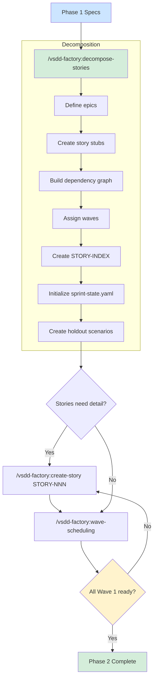

# Phase 2: Story Decomposition

Phase 2 breaks the adversarially reviewed spec set into implementable stories organized by dependency waves. By the end of this phase you have epics, sprint-ready stories, a dependency graph, a wave schedule, and hidden holdout scenarios for quality gates.

## When to Enter Phase 2

Enter Phase 2 when:

- Phase 1 adversarial review has converged (adversary reports LOW novelty)
- All specs are committed to factory-artifacts
- STATE.md reflects Phase 1 completion

## Overview



## Step-by-Step Walkthrough

### Step 1: Decompose Stories (`/vsdd-factory:decompose-stories`)

This is the primary decomposition command. It reads the full spec set and produces all story artifacts in a single pass.

```
/vsdd-factory:decompose-stories
```

**Prerequisites:** The skill reads `.factory/specs/prd.md`, behavioral contracts in `.factory/specs/behavioral-contracts/`, and architecture docs in `.factory/specs/architecture/`. Phase 1 must be complete.

The skill works through seven sub-steps:

#### 1a. Define Epics

Behavioral contracts are grouped into epics -- cohesive chunks of user value. Each epic names its goal, the BCs it covers, the subsystems it touches, and an estimated story count.

Output: `.factory/stories/epics.md`

#### 1b. Create Stories

Each epic is broken into stories. A good story is:

- **Independently deliverable** -- can be merged without waiting on other stories in the same wave
- **Testable** -- has clear acceptance criteria derived from behavioral contracts
- **Right-sized** -- 1-3 days of implementation work (S or M complexity)

Output: `.factory/stories/STORY-NNN.md` (one file per story)

#### 1c. Build Dependency Graph

Stories are analyzed for dependencies: which must complete before others can start, and which are independent. The graph must be acyclic -- circular dependencies are reported and block scheduling.

Output: `.factory/stories/dependency-graph.md`

#### 1d. Assign Waves

Stories are grouped into waves based on dependencies:

| Wave | Contains |
|------|----------|
| Wave 1 | Stories with no dependencies (foundation layer) |
| Wave 2 | Stories that depend only on Wave 1 stories |
| Wave N | Stories that depend only on stories in waves 1 through N-1 |

Output: `.factory/cycles/<current>/wave-schedule.md`

#### 1e. Create Story Index

A master index table tracks every story with its ID, title, epic, wave, status, and dependencies.

Output: `.factory/stories/STORY-INDEX.md`

#### 1f. Initialize Sprint State

A YAML file tracks the runtime state of each story: status (pending/blocked/in-progress/completed), wave assignment, branch name, and worktree path.

Output: `.factory/stories/sprint-state.yaml`

#### 1g. Create Holdout Scenarios

For each wave, hidden acceptance scenarios are created. These are derived from behavioral contracts but phrased from a black-box perspective. The holdout evaluator uses them during Phase 3 wave gates -- it cannot see specs or source code, only the running application and these hidden scenarios.

Output: `.factory/holdout-scenarios/wave-scenarios/` and `.factory/holdout-scenarios/HS-INDEX.md`

#### Reference Repos and Gene Transfusion

When `.factory/reference-manifest.yaml` exists, stories that implement behavior extracted from a reference repo are tagged `implementation_strategy: gene-transfusion` with a reference to the relevant `.factory/semport/<project>/` artifacts. Stories that diverge from reference behavior are tagged `implementation_strategy: from-scratch` with a note explaining the divergence.

### Scope Check

Before decomposing, the skill verifies the PRD describes a single product. If it contains multiple independent products, decomposition stops and recommends splitting the PRD first.

### Plan Failures

Stories are validated against an explicit anti-pattern list. These patterns invalidate a story:

- "TBD", "TODO", or "implement later" in any section
- "Add appropriate error handling" without specifying which errors
- "Write tests for the above" without actual test descriptions
- "Similar to STORY-NNN" without repeating the relevant details
- Acceptance criteria without testable assertions
- File list that says "and other files as needed"
- Tasks that describe what to do without specifying how

### Step 2: Refine Individual Stories (`/vsdd-factory:create-story STORY-NNN`)

After decomposition, individual stories may need more detail before they are sprint-ready. The `/vsdd-factory:create-story` command fleshes out a single story.

```
/vsdd-factory:create-story STORY-001
```

The skill reads the story stub, related behavioral contracts, relevant architecture sections, and dependency stories. It then ensures the story has:

**Acceptance criteria** -- one per behavioral contract, in Given/When/Then format:

```
- [ ] Given a valid workflow ID, when the user requests status,
      then the API returns the current phase and completion percentage
```

**Tasks** -- ordered implementation steps, specific enough that each maps to one or more commits.

**Implementation strategy** -- `from-scratch` or `gene-transfusion`. For gene-transfusion stories, the skill includes specific `.reference/<project>/<file>` paths so the implementer knows exactly which source files to study.

**Dev notes** -- gotchas, quirks, non-obvious decisions the implementer needs to know before starting.

**File list** -- every file this story creates or modifies.

**Complexity estimate** -- S (1-2 files), M (3-5 files), L (6+ files), or XL (should be split).

If a story is rated XL, the skill recommends splitting and asks for your approval.

### Step 3: Wave Scheduling (`/vsdd-factory:wave-scheduling`)

The wave scheduling skill computes the implementation order from the dependency graph, with parallel group sub-partitioning.

```
/vsdd-factory:wave-scheduling
```

The algorithm:

1. **Topological sort** of the dependency graph. Stories with no dependencies go to Wave 1.
2. **Wave assignment** based on dependency resolution order.
3. **Parallel group sub-partitioning** within each wave: max 2 S/M stories per group, max 1 L/XL story per group. Each group gets its own test-writer and implementer sequence.
4. **Pipeline overlap** -- Wave N+1 stubs can start while Wave N implementation is still running, since stubs depend only on types, not implementations.

Output: `wave-schedule.md` with a table showing wave, group, stories, test-writer scope, and implementer scope.

**Failure modes the skill detects:**
- Circular dependencies: reports the exact cycle and stops
- Missing dependency references: flags the missing story and excludes it
- No root stories (all have dependencies): reports "no root stories found" and stops

## Story Format

Every story file (`.factory/stories/STORY-NNN.md`) follows a standard structure:

```markdown
# STORY-NNN: <Title>

## Epic
<Epic reference>

## Description
As a <role>, I want <capability>, so that <value>.

## Acceptance Criteria
- [ ] Given <precondition>, when <action>, then <outcome>

## Behavioral Contracts
- BC-S.SS.NNN: <title>

## Verification Properties
- VP-NNN: <title>

## Tasks
1. <Implementation task>

## Implementation Strategy
from-scratch | gene-transfusion

## Dependencies
- STORY-NNN: <title>

## Wave
<Wave number>

## Dev Notes
<Gotchas, quirks, non-obvious decisions>

## File List
- src/module/file.rs (create)
- tests/module_test.rs (create)
```

## Wave Structure

A wave is a group of stories that can be implemented in parallel because their dependencies are all satisfied by prior waves. Waves enforce a build order:

- Wave 1 stories create the foundation (types, core modules, infrastructure)
- Wave 2 stories build on Wave 1 (features that use the foundation)
- Wave N stories build on all prior waves

Within a wave, stories are sub-partitioned into parallel groups based on size. This allows multiple agents to work concurrently without stepping on each other.

After all stories in a wave are merged to `develop`, a wave gate runs (see [Phase 3](phase-3-tdd-delivery.md)) before the next wave begins.

## Holdout Scenarios

Holdout scenarios are hidden acceptance tests that the holdout evaluator uses during wave gates. They exist to verify that the implementation satisfies the spec from a black-box perspective.

Key properties:

- **Hidden from implementers.** The holdout evaluator cannot see specs, source code, or implementation notes. It sees only the product brief, the public API, and these scenarios.
- **Derived from BCs but phrased differently.** They test the same behavior but from an end-user perspective, catching cases where the implementation satisfies the letter of the BC but not the spirit.
- **Scored 0.0-1.0.** The wave gate threshold is mean >= 0.85 with every critical scenario >= 0.60.
- **Focused on critical paths and edge cases.** Density is proportional to module criticality.

### Self-Review

Both decompose-stories and create-story run self-review checklists before adversarial review:

**decompose-stories:** spec coverage (every BC in a story?), placeholder scan, consistency (IDs match index?), sizing (any story over 13 points?)

**create-story:** completeness (all template sections filled?), consistency (BC refs exist?), testability (every AC testable?), context budget (under 60% of agent context?)

## Quality Gate

Phase 2 is complete when:

1. All stories are created with unique IDs and assigned to waves
2. The dependency graph is acyclic and all dependencies reference existing stories
3. All Wave 1 stories have status `ready` in STORY-INDEX.md
4. Holdout scenarios exist for each wave
5. Sprint state is initialized

## Story Self-Containment Audit

Before marking any story as `ready`, the skill runs a 14-point completeness checklist:

1. Source of truth alignment with architecture docs
2. All deliverable files specified
3. Technical gotchas documented
4. CI/CD workflows complete (if applicable)
5. README / user-facing docs (for tools/libraries)
6. Hosting / infra decisions explicit
7. License stated
8. Generated output specified (if applicable)
9. Test fixtures defined with concrete examples
10. Shell / script rules addressed
11. Rules index complete
12. Internal consistency across all deliverables
13. Project-specific vs generic separation
14. Prerequisites listed

A story that fails this checklist needs refinement via `/vsdd-factory:create-story` before implementation.

## What Comes Next

After Phase 2 completes:

- Run `/vsdd-factory:deliver-story STORY-NNN` for each Wave 1 story to begin Phase 3 implementation
- After all Wave 1 stories are merged, run `/vsdd-factory:wave-gate wave-1` before starting Wave 2
