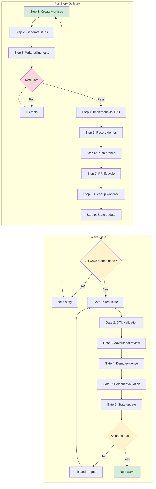

# Phase 3: Test-First Implementation

Phase 3 is where specs become working software. Each story is delivered through a 9-step specialist dispatch that enforces TDD discipline: write failing tests first, verify they fail for the right reasons (the Red Gate), then implement the minimum code to make them pass. After all stories in a wave merge, a six-gate quality check runs before the next wave begins.

This is the most important phase for developers. Everything prior was preparation; everything after is verification.

## When to Enter Phase 3

Enter Phase 3 when:

- All Wave 1 stories have status `ready` in STORY-INDEX.md
- Phase 2 is complete (stories decomposed, waves assigned, holdout scenarios created)
- STATE.md reflects Phase 2 completion

## Overview



## The Iron Law

> **NO IMPLEMENTATION WITHOUT RED GATE VERIFICATION FIRST**

"I already know what the tests will say" is not a Red Gate. The test-writer writes failing tests, you independently verify they fail with assertion errors (not build errors), and only then does the implementer start writing code.

## Per-Story Delivery: The 9-Step Specialist Dispatch

The `/vsdd-factory:deliver-story` skill is a dispatcher, not an implementer. It reads the canonical workflow from `agents/orchestrator/per-story-delivery.md` and delegates each step to a fresh specialist subagent. Single-context delivery is a correctness bug -- a single agent running all 9 steps suffers context exhaustion and loses the specialist discipline.

```
/vsdd-factory:deliver-story STORY-001
```



```mermaid
graph LR
    subgraph "Step 1"
        DE1[devops-engineer]
    end
    subgraph "Step 2"
        TW1[test-writer<br/>Stub Architect]
    end
    subgraph "Step 3"
        TW2[test-writer<br/>Test Writer]
    end
    subgraph "Step 4"
        IMP[implementer]
    end
    subgraph "Step 5"
        DR[demo-recorder]
    end
    subgraph "Step 6"
        IMP2[implementer]
    end
    subgraph "Step 7"
        PM[pr-manager<br/>9-step process]
    end
    subgraph "Step 8"
        DE2[devops-engineer]
    end

    DE1 -->|worktree| TW1
    TW1 -->|stubs| TW2
    TW2 -->|RED GATE| IMP
    IMP -->|green tests| DR
    DR -->|demos| IMP2
    IMP2 -->|pushed| PM
    PM -->|merged| DE2

    style TW2 fill:#f8d7da
    style IMP fill:#d4edda
```

### Step 1: Create Worktree (devops-engineer)

A fresh worktree is created for the story on a feature branch from `develop`.

```bash
# What the devops-engineer does:
git worktree add .worktrees/STORY-001 -b feature/STORY-001-add-workflow-engine develop
```

**Exit condition:** `git worktree list` shows the new worktree on the correct branch.

You can also manage worktrees directly:

```
/vsdd-factory:worktree-manage create STORY-001
/vsdd-factory:worktree-manage list
/vsdd-factory:worktree-manage cleanup STORY-001
```

### Step 2: Generate Stubs (test-writer as Stub Architect)

The test-writer creates compilable stubs matching the story's file list. Function bodies are `todo!()` or `unimplemented!()`. The goal is a codebase that compiles but does nothing.

**Exit condition:** `cargo check` passes inside the worktree. If it fails, a new test-writer is dispatched to fix stubs before proceeding.

Commit: `feat(STORY-001): add module stubs`

### Step 3: Write Failing Tests + Red Gate (test-writer as Test Writer)

The test-writer writes tests for each acceptance criterion and behavioral contract. Every test must fail -- that is the point.

**The Red Gate (mandatory).** After the test-writer returns, the orchestrator independently runs `cargo test` in the worktree and verifies:

1. Tests compile
2. All new tests fail
3. Tests fail with **assertion errors**, not build errors or "not yet implemented" panics
4. Failure messages reference the behavior under test

If the Red Gate fails, a new test-writer is dispatched with narrower scope. The orchestrator does not proceed to implementation until the Red Gate passes.

The Red Gate outcome is recorded in `.factory/stories/red-gate-log.md`.

Commit: `test(STORY-001): add failing tests for BC-1.01.001`

### Verification Discipline

The deliver-story dispatcher never trusts agent reports at face value. After every specialist dispatch:

1. Run the verification command independently (test suite, build, lint)
2. Read the full output — not just the summary
3. Compare against the expected exit condition for that step
4. Only then proceed to the next dispatch

"Agent says all tests pass" is a claim. `cargo test` output showing 34/34 pass is evidence.

### Step 4: Implement via TDD (implementer)

The implementer writes the minimum code to make each failing test pass, one at a time. This is strict TDD -- no code without a covering test.

For each test:
1. Pick the next failing test
2. Write the minimum code to make it pass
3. Run the full suite to verify nothing else breaks
4. Micro-commit: `feat(STORY-001): implement <behavior>`

**Exit conditions:**
- All tests green
- Clippy clean (`cargo clippy -- -D warnings`)
- Format clean (`cargo +nightly fmt --all --check`)
- Zero `todo!()` / `unimplemented!()` in production code

#### Gene Transfusion

When a story has `implementation_strategy: gene-transfusion`, the implementer reads `.factory/semport/<module>/<module>-target-design.md` and the reference source files listed in the story. It uses the translation strategy from semport analysis. Uncertain translations are marked `// SEMPORT-REVIEW` for human inspection.

### Step 5: Record Demos (demo-recorder)

For each acceptance criterion, the demo-recorder captures visual evidence:

- **CLI applications:** Terminal recordings via VHS, `script`, or `asciinema`
- **Web applications:** Screenshots via Playwright MCP tools
- Both success and error paths

Output: `docs/demo-evidence/<STORY-ID>/evidence-report.md` in the story worktree.

**Exit condition:** Every acceptance criterion has at least one demo artifact referenced in the evidence report.

### Step 6: Push Feature Branch (implementer)

The implementer pushes the feature branch to the remote.

**Exit condition:** `git ls-remote origin feature/STORY-001-<desc>` returns the expected SHA.

### Step 7: PR Lifecycle (pr-manager)

The pr-manager runs a full 9-step PR process:

1. Populate PR description from template (summary, BC traceability table, changes, dependency diagram, test plan, TDD evidence)
2. Verify demo evidence exists
3. Create PR via `gh pr create` targeting `develop`
4. Security review (if CRITICAL module)
5. PR reviewer convergence loop
6. Wait for CI
7. Dependency check (all dependency story PRs merged first)
8. Merge (squash merge to `develop`)
9. Report result

The orchestrator delegates this entirely -- it does not compose the PR body or run `gh` commands.

**Exit condition:** PR merged, or a blocker reported that requires human intervention.

### Handling Review Feedback

When implementer or test-writer agents receive review findings, they follow a structured process:

1. **Read completely** before changing anything
2. **Verify correctness** — does the finding apply to this code?
3. **Push back if wrong** — report DONE_WITH_CONCERNS with explanation
4. **Implement if correct** — fix root cause, not symptom
5. **Never blindly implement** — understand WHY before changing

The behavioral contract (BC) is always the source of truth. If a reviewer and a BC disagree, the BC wins.

```
/vsdd-factory:pr-create STORY-001
```

### Step 8: Cleanup (devops-engineer)

The worktree and local branch are removed.

```
/vsdd-factory:worktree-manage cleanup STORY-001
```

**Exit condition:** `git worktree list` no longer shows the worktree; `git branch --list 'feature/STORY-001-*'` returns empty.

### Step 9: State Update

Sprint state and story index are updated to reflect completion. Committed to factory-artifacts: `factory(phase-3): STORY-001 delivered`.

### Agent Status Protocol

All specialist agents (implementer, test-writer, pr-manager) report structured status codes:

| Status | Meaning | Dispatcher action |
|--------|---------|-------------------|
| **DONE** | Work complete, confident | Proceed to next step |
| **DONE_WITH_CONCERNS** | Work complete, doubts remain | Read concerns before proceeding |
| **NEEDS_CONTEXT** | Missing information | Provide context, re-dispatch |
| **BLOCKED** | Cannot complete | Assess: more context, stronger model, or task split |

Never ignore a DONE_WITH_CONCERNS or BLOCKED status. Address the concern before proceeding.

## Context Discipline

Each specialist receives only the files relevant to its task. This prevents context exhaustion and topic drift.

| Specialist | Files Passed |
|---|---|
| devops-engineer | Worktree protocol rules |
| test-writer (stubs) | Story file, dependency-graph.md, api-surface.md, relevant BC files |
| test-writer (tests) | Story file, api-surface.md, test-vectors.md, relevant BC files |
| implementer | Story file, module-decomposition.md, dependency-graph.md, api-surface.md, relevant BC files |
| demo-recorder | Story file, acceptance criteria extract only |
| pr-manager | Story ID, feature branch name, PR template path |

If a story exceeds 60% of the target model's context window, the orchestrator stops and dispatches the story-writer to split it before proceeding.

## Task Sizing Rules

- S/M stories (1-5 points): max 2 stories per agent
- L/XL stories (8-13 points): exactly 1 story per agent
- Never combine "write code" and "run full test suite" in one dispatch
- If an agent times out, dispatch a new agent with narrower scope (do not retry the same prompt)

### Model Selection

The dispatcher uses the least powerful model that can handle each task:

| Task | Model tier |
|------|------------|
| Worktree creation/cleanup | Fast (cheapest) |
| Test stubs | Fast |
| Failing tests | Standard |
| TDD implementation (S/M) | Standard |
| TDD implementation (L/XL) | Capable |
| Demo recording | Fast |
| PR lifecycle | Standard |
| Review triage | Capable |

If an agent reports BLOCKED, re-dispatch with the next tier up — not the same tier.

## Story Split Recovery

When a PR is too large (>500 lines diff), the pr-manager recommends a split:

1. PR is closed with label `split-needed`
2. The worktree is kept -- all work is preserved
3. You approve or reject the split
4. If approved: story-writer splits the story, then per-story delivery resumes on each sub-story
5. If rejected: a note is added to `review-findings.md` and the PR review continues

## Wave Gate

After all stories in a wave are merged to `develop`, the wave gate runs six sequential checks. All must pass before the next wave can begin.

```
/vsdd-factory:wave-gate wave-1
```

### The Iron Law

> **NO WAVE ADVANCE WITHOUT ALL SIX GATES PASSING FIRST**

A gate that was skipped, mocked, or partially verified counts as failed. "Close enough" is not passing.

| Gate | What It Checks | Pass Criteria |
|------|---------------|---------------|
| **1. Test Suite** | `cargo test`, `cargo clippy`, `cargo fmt` on `develop` (not a feature branch -- catches merge-order surprises) | All tests pass, clippy clean, format clean |
| **2. DTU Validation** | CRITICAL/HIGH modules touched by this wave compared against DTU clones | All clones in sync, or SKIP if no DTU-covered modules |
| **3. Adversarial Review** | Fresh-context adversary reviews `git diff <pre-wave>..develop` | No CRITICAL findings. HIGH findings filed as tech debt. |
| **4. Demo Evidence** | Verify demo reports exist for all stories and cover all ACs | All ACs have evidence. Missing triggers `/vsdd-factory:record-demo`. |
| **5. Holdout Evaluation** | Holdout evaluator (cannot see specs or source) runs hidden scenarios | Mean >= 0.85, every critical scenario >= 0.60. No rounding. |
| **6. State Update** | Update sprint-state.yaml and STATE.md | Automatic after gates 1-5 pass |

### When a Gate Fails

If any gate fails, the wave gate stops and reports the blocking issue. Fix the problem and re-run:

```
/vsdd-factory:wave-gate wave-1
```

The gate sequence restarts from Gate 1 because fixes may have introduced regressions. Gate order is load-bearing -- the test suite runs first because everything else assumes it passes.

For Gate 3 (adversarial) failures, fix PRs target `develop` and go through per-story delivery. For Gate 5 (holdout) failures, investigate whether the implementation satisfies the spirit of the BC or only the letter.

### When Implementation Fails

If the implementer hits bugs during TDD, the `/vsdd-factory:systematic-debugging` skill provides a structured 4-phase approach: root cause investigation, pattern analysis, hypothesis testing, and implementation with a failing test. The skill enforces "no fixes without investigation first" and escalates after 3 failed fix attempts (indicating an architectural problem, not a simple bug).

## Red Flags

### Per-Story Delivery

| Thought | Reality |
|---|---|
| "This story is small, one agent can do the whole thing" | Story size is orthogonal to specialist split. Dispatch each step. |
| "I already know what the implementation will look like" | Your knowledge is not a Red Gate. Dispatch the test-writer first. |
| "The test-writer wrote bad tests, I'll fix them myself" | Dispatch a new test-writer with narrower scope. |
| "I'll skip demo-recording and do it after the merge" | Demos are part of the merge gate. Dispatch demo-recorder before pr-manager. |
| "Red Gate failed because the tests are too strict" | Red Gate failure means the test or the contract understanding is wrong. Investigate. |
| "This feels like a lot of context switching" | That is the feature. Fresh context per specialist prevents single-agent drift. |

### Wave Gate

| Thought | Reality |
|---|---|
| "One test failure is flaky, let me just re-run that test" | Flaky tests are findings. Record, fix or quarantine, then re-run Gate 1. |
| "The adversary only found HIGH severity, not blocking" | HIGH without remediation must be filed as tech debt before advancing. |
| "Holdout scored 0.84, basically 0.85" | 0.85 is the threshold. 0.84 fails. No rounding. |
| "I'll advance the wave now and fix Gate 5 later" | Advancing with a failed gate means the next wave builds on unverified ground. |
| "The test suite passed on my branch" | Gate 1 runs on `develop` to catch merge-order surprises. |

## Example: Delivering One Story

```
> /vsdd-factory:deliver-story STORY-003

I'm using the deliver-story skill to dispatch STORY-003 through the
per-story-delivery orchestrator workflow.

Prerequisites: STORY-003 is ready, dependencies STORY-001 and STORY-002 are completed.

Step 1 (devops-engineer): Worktree created
  Path:   .worktrees/STORY-003/
  Branch: feature/STORY-003-add-workflow-engine

Step 2 (test-writer): Stubs generated
  Files: 4 created, cargo check passes

Step 3 (test-writer): Failing tests written
  Tests: 12 new tests for BC-2.01.001 through BC-2.01.004

Red Gate: PASSED
  12/12 tests fail with assertion errors
  0 build errors, 0 "not yet implemented" panics

Step 4 (implementer): TDD implementation
  Micro-commits: 12 (one per test)
  All tests green, clippy clean, fmt clean

Step 5 (demo-recorder): Evidence captured
  4 AC demonstrations (CLI recordings)
  Evidence report: docs/demo-evidence/<STORY-ID>/evidence-report.md

Step 6 (implementer): Branch pushed to origin

Step 7 (pr-manager): PR #47 created and merged
  Title: feat(STORY-003): add workflow engine core
  Target: develop
  Reviews: 1 adversarial pass, 1 code review
  CI: all checks passed

Step 8 (devops-engineer): Worktree cleaned up

Step 9: State updated
  sprint-state.yaml: STORY-003 -> completed
  STORY-INDEX.md: status -> completed

Story STORY-003 delivered:
  Red Gate:       PASSED
  Implementation: 12 micro-commits
  Demos:          4 artifacts
  PR:             #47 merged to develop
  Worktree:       cleaned up

Next: /vsdd-factory:deliver-story STORY-004 or /vsdd-factory:wave-gate wave-1 when all wave stories are complete.
```

## What Comes Next

After all waves complete their gates:

- Run `/vsdd-factory:adversarial-review implementation` for a full-codebase adversarial review (Phase 4)
- If this was the last wave and Phase 4 converges, proceed to Phase 5 (Formal Hardening) and Phase 6 (Convergence)
