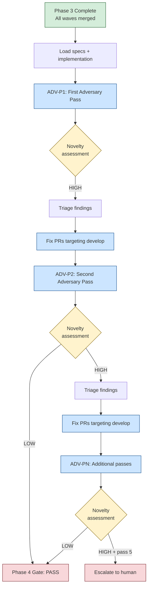

# Phase 4: Adversarial Refinement

## When to Enter Phase 4

Enter Phase 4 after all implementation waves have passed their wave gates in Phase 3. Every story is merged to `develop`, holdout evaluations have passed, and the full test suite is green. The code has survived TDD -- now it faces the gauntlet.

## Overview



## The Iron Law

> NO APPROVAL WITHOUT FRESH-CONTEXT REVIEW FIRST

This is not a guideline. It is the mechanism Phase 4 depends on. Fresh context means the adversary agent has not seen prior review passes, the author's explanations, or the orchestrator's summary. Loading any of those contaminates the information asymmetry the pattern requires.

Self-review does not count as adversarial review. Summarizing prior passes for the adversary destroys the fresh context. Zero findings after a short prompt is a prompt failure, not convergence.

## Full Implementation Review vs. Phase 1 Spec Review

Phase 1 uses `/vsdd-factory:adversarial-review specs` to review specifications before any code is written. Phase 4 uses `/vsdd-factory:adversarial-review implementation` to review the finished codebase against those same specs.

The implementation review is broader. The adversary reads all spec documents first, then reviews source code looking for:

1. **Spec fidelity** -- does the implementation actually satisfy the behavioral contracts, or did the tests encode a misunderstanding?
2. **Test quality** -- are tests actually testing what they claim? Tautological tests? Excessive mocking?
3. **Code quality** -- placeholder comments, generic error handling, hidden coupling, race conditions
4. **Security surface** -- input validation gaps, injection vectors, auth assumptions
5. **Spec gaps** -- implemented behavior not covered by any spec

Run the review:

```
/vsdd-factory:adversarial-review implementation
```

## Information Asymmetry

The adversary agent operates under strict information walls.

**What the adversary receives:**
- All spec documents (product brief, domain spec, PRD, BCs, VPs, architecture)
- Full source code
- Test suite code
- Public API surface

**What the adversary cannot see:**
- Prior review passes (ADV-P1, ADV-P2, etc.)
- Author explanations or rationale
- Orchestrator summaries or decisions
- PR discussion threads
- Implementation notes from `.factory/`

This asymmetry is enforced by the `context: fork` directive in the skill definition. Each pass spawns a fresh agent context with no memory of prior passes.

## Pass Management

Each adversary invocation produces a numbered pass:

- **ADV-P1** -- first pass, broadest findings, typically highest severity
- **ADV-P2** -- second pass after fixes from P1, finds what P1 missed
- **ADV-P3 through ADV-P5** -- diminishing returns, findings become refinements

After each pass, the orchestrator assesses **novelty decay**:

- **HIGH novelty** -- findings are genuinely new gaps, contradictions, or missing behavior. Fix and run another pass.
- **LOW novelty** -- findings are refinements of wording, style preferences, or restatements of prior findings. The adversary has exhausted its ability to find real issues.

The quantitative convergence criteria (from CONVERGENCE.md) define LOW as:
- Novelty score below 0.15 for 2+ consecutive passes
- Median severity below 2.0 and strictly decreasing for 3+ passes
- Average reviewer confidence below 0.55 for 2+ passes

**Minimum passes: 2.** No exceptions. Round 1 systematically misses things. **Maximum passes: 5.** If novelty has not decayed after 5 passes, escalate to the human for judgment.

## Handling Findings

Findings are written to `.factory/cycles/<current>/vsdd-factory:adversarial-reviews/` using the adversarial finding template.

| Finding Severity | Action |
|-----------------|--------|
| **CRITICAL** | Create a fix PR immediately via `/fix-pr-delivery`. Blocks Phase 5. |
| **HIGH** | Fix now or log to tech debt register with `/vsdd-factory:track-debt add`. |
| **MEDIUM** | Fix if effort is low, otherwise log to tech debt. |
| **LOW** | Document in the review findings. No action required. |

The orchestrator must not downgrade severity. Severity is the adversary's call, recorded as-is. If the same finding keeps appearing across passes, it is not fixed -- fix it, then re-run.

When findings point to spec-level flaws (not just code), update the spec first, then the implementation. The spec is the product (SOUL.md principle 3).

## Feedback Integration

Findings route to different phases depending on their nature:

- **Spec-level flaws** -- return to Phase 1 artifacts, update specs, re-review
- **Test-level flaws** -- return to Phase 3a, fix or add tests, verify they fail first
- **Implementation flaws** -- create fix PRs targeting develop
- **New edge cases** -- add to the edge case catalog, write failing tests, implement

The fix delivery flow uses `/fix-pr-delivery`, which is a streamlined version of the standard story delivery. It skips stubs, Red Gate enforcement, and wave gates since those apply to new feature work, not remediation.

## Multi-Model Adversary

For maximum cognitive diversity, the adversary system supports multi-model review. The primary adversary uses one model family, and a secondary adversary from a different family provides a second perspective. Findings from distinct model families carry higher weight for novelty assessment.

Cross-model dynamics:
- **Cross-model unique findings** -- found by Model B but not Model A. High value because they reveal different blind spots.
- **Cross-model confirmed findings** -- same finding from both models. High confidence from independent confirmation.
- **Single-model unique findings** -- found by only one model. Moderate confidence; may be a genuine blind spot or may be hallucinated.

When multi-model adversary is active, both models must independently report cosmetic-only findings before spec convergence is declared.

## Red Flags

Watch for these patterns that indicate the adversarial review process is failing:

| Symptom | Diagnosis |
|---------|-----------|
| "I already reviewed this, I can skip the adversary pass" | Self-review is not adversarial review. Dispatch the adversary. |
| "The spec is obviously correct, one pass is enough" | Minimum is 2. Round 1 systematically misses things. |
| "Let me summarize the prior pass for the adversary" | This destroys fresh context. Dispatch with only the target artifact. |
| "The adversary found nothing" | Zero findings after a short prompt is a prompt bug, not convergence. Re-dispatch. |
| "This finding is not really critical, I will downgrade it" | Severity is the adversary's call. Record as-is. |
| "The same finding keeps appearing" | It keeps appearing because it is not fixed. Fix it, then re-run. |

## Quality Gate

Phase 4 is complete when the adversary reports LOW novelty on the implementation review. Specifically:

- Minimum 2 adversary passes completed
- Latest pass findings are refinements (wording, style), not missing behavior
- All CRITICAL and HIGH findings addressed via fix PRs
- Fix PRs merged to develop and tests passing

Record the gate result in STATE.md via `/vsdd-factory:state-update` and proceed to Phase 5.

## Zero-Findings Warning

If the adversary reports zero findings on its first pass, treat this as suspicious -- not as convergence. See the [Convergence Criteria](../../plugins/vsdd-factory/docs/CONVERGENCE.md) for the zero-findings halt protocol, which requires re-running with explicit engagement verification before accepting.
