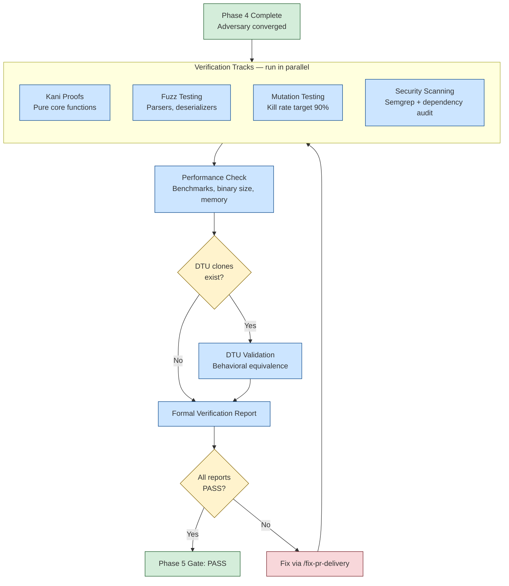

# Phase 5: Formal Hardening

## When to Enter Phase 5

Enter Phase 5 after the adversary converges in Phase 4 -- novelty is LOW, all CRITICAL and HIGH findings are resolved, and the adversary is reduced to nitpicking wording rather than finding real gaps.

## Overview

Phase 5 runs four independent verification tracks plus a performance validation pass. The verification architecture designed in Phase 1b is now executed against the battle-tested implementation.



## Track 1: Kani Proofs

Kani is a model checker for Rust that proves properties hold for all possible inputs within a bounded search space.

```
/formal-verify
```

**What Kani proves:**
- Absence of panics for all valid inputs
- Arithmetic overflow safety
- Array bounds safety
- Invariant preservation across state transitions

**Which modules get proofs:** All modules classified as CRITICAL or HIGH in `.factory/specs/prd-supplements/module-criticality.md`. The classification criteria are detailed in [CONVERGENCE.md](../../plugins/vsdd-factory/docs/CONVERGENCE.md).

Write proof harnesses in `#[cfg(kani)] mod verification` blocks within the module under test. Each harness uses `kani::any()` to generate symbolic inputs and `kani::assume()` to constrain them to valid ranges.

**Pass criteria:** All bounded proofs pass. No counter-examples at any proof depth. Proof core coverage exceeds 75% of the assertion cone-of-influence.

## Track 2: Fuzz Testing

Structured fuzzing with cargo-fuzz finds crashes that tests miss by generating millions of random inputs.

**Targets:**
- Parser inputs (any function accepting `&str` or `&[u8]`)
- Deserialization functions (JSON, YAML, TOML, custom formats)
- State machine transitions
- API request handlers

Create fuzz targets in `fuzz/fuzz_targets/`. Run each target for at least 5 minutes:

```bash
cargo fuzz run <target> -- -max_total_time=300
```

**Pass criteria:** No novel crashes after 5 minutes of continuous fuzzing per target. Coverage of potentially-vulnerable functions (identified by static analysis) has stabilized.

## Track 3: Mutation Testing

cargo-mutants systematically modifies your code to verify the test suite catches real bugs. A surviving mutant means a mutation changed behavior but no test failed -- the test suite has a gap.

```bash
cargo mutants --timeout 60
```

**Pass criteria:** Overall mutation kill rate at least 90%. Kill rate targets vary by module criticality:

| Criticality | Target Kill Rate |
|-------------|-----------------|
| CRITICAL | 95% or higher |
| HIGH | 90% or higher |
| MEDIUM | 80% or higher |
| LOW | 70% or higher |

Surviving mutants are classified into four categories: equivalent mutants (functionally identical behavior), dead code (unreachable paths), insufficient assertions (test executes code but does not verify output), and complex logic (untested conditional). The first two categories are excluded from the kill rate calculation. The latter two require new tests.

## Track 4: Security Scanning

Static analysis with semgrep and dependency auditing catch known vulnerability patterns.

```bash
semgrep --config auto --config p/rust-security src/
cargo audit
cargo deny check
```

**Focus areas:**
- Command injection (CWE-78)
- Path traversal (CWE-22)
- Unsafe code usage
- Cryptographic misuse
- Hardcoded credentials

**Pass criteria:** Zero critical or high findings from semgrep. Zero known CVEs in dependencies.

## Performance Validation

Run after the four verification tracks complete:

```
/perf-check
```

This validates six metrics against budgets defined in `.factory/specs/prd-supplements/performance-budgets.md`:

| Metric | Typical Budget |
|--------|---------------|
| CLI startup time | Under 100ms |
| Binary size (release) | Under 50MB |
| Debug build time | Under 60s |
| Test suite time | Under 120s |
| Benchmark regressions | Under 10% vs baseline |
| Memory (peak RSS) | No unbounded growth |

If no benchmarks exist, `/perf-check` reports that and recommends creating them.

**Artifacts:** `.factory/cycles/<current>/performance-report.md`

## DTU Validation

If Digital Twin Universe clones exist (created via `/dtu-creation` during Phase 1b or Phase 3), run DTU validation to confirm behavioral equivalence between the real implementation and the simplified DTU clones.

```
/dtu-validate
```

DTU clones are minimal, obviously-correct reimplementations of the same behavioral contracts. When both implementations agree, confidence is high. When they diverge, one has a bug.

The comparison harness runs both implementations with the same inputs and reports divergences. Property-based testing (proptest) generates random inputs for broad coverage.

**Pass criteria:** Zero divergences in CRITICAL modules. Any divergence in a CRITICAL module is a blocking finding.

## Purity Boundary Audit

The `purity-check.sh` hook runs automatically on every file edit, but Phase 5 includes an explicit audit: verify that all modules classified as "pure core" in the architecture document remain free of side effects. Side effects that crept into the pure core during implementation are flagged for refactoring.

## Artifacts

Phase 5 produces two primary reports:

- `.factory/cycles/<current>/formal-verification-report.md` -- Kani results, fuzz results, mutation survivors, security findings, and the overall gate verdict
- `.factory/cycles/<current>/performance-report.md` -- benchmark results, budget compliance, regression analysis

## Prerequisites

Verification tools must be installed. Run `/setup-env` to check availability:

```bash
cargo install cargo-kani
cargo install cargo-fuzz
cargo install cargo-mutants
pip install semgrep    # or brew install semgrep
cargo install cargo-deny
```

If a tool is not installed, `/formal-verify` reports which tools are missing and skips that section. It never fails silently.

## Quality Gate

Phase 5 is complete when all verification reports show PASS:

- All Kani proofs pass
- No fuzz crashes
- Mutation kill rate meets criticality-tier targets (90% overall)
- No critical or high security findings
- All performance budgets within tolerance
- DTU validation clean (if DTU clones exist)
- Purity boundaries intact

If any track fails, fix the issue via `/fix-pr-delivery` and re-run the failing track. Findings that require implementation changes route back through Phase 4 (adversarial review of the fix).
