# Pipeline Overview

The VSDD pipeline transforms a product idea into production-ready, formally verified
software through seven phases. Each phase has a defined entry command, produces specific
artifacts, and must pass a quality gate before the next phase begins.

---

## The VSDD pipeline

```mermaid
graph TD
    subgraph "Phase 0: Brownfield Ingest"
        BI["/vsdd-factory:brownfield-ingest"]
        BI --> BA["Phase A:\nBroad Sweep\n(7 passes)"]
        BA --> BB["Phase B:\nConvergence\nDeepening"]
        BB --> BC["Phase C:\nFinal Synthesis"]
        BC --> BV{"Extraction\nValidation"}
    end

    subgraph "Phase 1: Spec Crystallization"
        CB["/vsdd-factory:create-brief"]
        CDS["/vsdd-factory:create-domain-spec"]
        CP["/vsdd-factory:create-prd"]
        CA["/vsdd-factory:create-architecture"]
        AR1["/vsdd-factory:adversarial-review specs"]
        CB --> CDS --> CP --> CA --> AR1
        AR1 -->|"findings"| CP
        AR1 -->|"converged"| P1DONE(("Specs locked"))
    end

    subgraph "Phase 2: Story Decomposition"
        DS["/vsdd-factory:decompose-stories"]
        CS["/vsdd-factory:create-story STORY-NNN"]
        DS --> CS
        CS --> P2DONE(("Stories ready"))
    end

    subgraph "Phase 3: TDD Delivery"
        DEL["/vsdd-factory:deliver-story STORY-NNN"]
        WG["/vsdd-factory:wave-gate wave-N"]
        DEL --> WG
        WG -->|"FAIL"| DEL
    end

    subgraph "Phase 4: Holdout Evaluation"
        HE["/vsdd-factory:holdout-eval"]
    end

    subgraph "Phase 5: Adversarial Refinement"
        AR2["/vsdd-factory:adversarial-review\nimplementation"]
    end

    subgraph "Phase 6: Formal Hardening"
        FV["/vsdd-factory:formal-verify"]
    end

    subgraph "Phase 7: Convergence & Release"
        CC["/vsdd-factory:convergence-check"]
        REL["/vsdd-factory:release"]
        CC -->|"NOT CONVERGED"| AR2
        CC -->|"CONVERGED"| REL
    end

    HE --> AR2 --> FV --> CC

    BV -->|"validated"| CB
    START(("Greenfield")) --> CB
    P1DONE --> DS
    P2DONE --> DEL
    WG -->|"PASS"| HE

    style START fill:#40916c,color:#fff
    style P1DONE fill:#1d3557,color:#fff
    style P2DONE fill:#1d3557,color:#fff
    style REL fill:#40916c,color:#fff
```

---

## Phase 0: Brownfield Ingest

**Goal:** Understand an existing codebase before building specs against it.

**Entry:** `/vsdd-factory:brownfield-ingest <codebase-path>`

The broad-then-converge protocol runs 7 analysis passes (inventory, architecture, domain
model, behavioral contracts, NFRs, conventions, synthesis), then deepens each pass through
iterative rounds until novelty decays to NITPICK. A final synthesis produces a prioritized
lessons document with P0/P1/P2/P3 action items.

An extraction-validation agent independently verifies findings against the actual source
code, using both behavioral judgment (sampling contracts for accuracy) and metric verification
(recounting every numeric claim with `find` + `wc -l`).

**Artifacts:** `.factory/semport/<project>/` -- per-pass analysis docs, deep files, synthesis

**Gate:** Extraction validation passes (all passes converged, metrics verified)

**Skip when:** You are building a greenfield project with no existing codebase to analyze.

---

## Phase 1: Spec Crystallization

**Goal:** Produce the complete specification set that everything else builds from.

**Entry:** `/vsdd-factory:create-brief` (or `/vsdd-factory:research <topic>` for domain investigation first)

This phase walks through five sequential steps:
1. **Product brief** -- guided Q&A capturing vision, users, scope, constraints
2. **Domain specification (L2)** -- entities, relationships, capabilities (CAP-NNN), invariants (DI-NNN)
3. **PRD with behavioral contracts (L3)** -- testable requirements as BC-S.SS.NNN contracts
4. **Architecture with verification properties (L4)** -- system design, ADRs, VP-NNN proof targets
5. **Adversarial spec review** -- fresh-context adversary iterates until novelty decays

The four specification levels form a traceability chain: L1 Brief, L2 Domain, L3 Behavioral
Contracts, L4 Verification Properties. Every lower level traces to the one above.

**Artifacts:** `.factory/specs/` -- product-brief.md, domain-spec/, prd.md, behavioral-contracts/, verification-properties/, architecture/

**Gate:** Adversarial review reaches LOW novelty. Human approves final specs.

**Phase 1 mandatory steps (cannot be skipped):**

- **DTU assessment (P1-06)** — identifies all external service dependencies across 6 integration surface categories. Always produces `dtu-assessment.md`.
- **CI/CD setup (P1-06b)** — creates CI/CD pipelines based on architecture output. Always produces `cicd-setup.md`.
- **Fresh-context consistency audit** — consistency-validator runs with fresh context before the Phase 1 gate to catch structural and semantic drift.

**Phase 1 gate checks (in addition to spec quality criteria):**

- `dtu-assessment.md` exists
- `.github/workflows/ci.yml` exists
- Branch protection requires CI status checks
- All anchors are semantically correct (not just syntactically valid)

---

## Phase 2: Story Decomposition

**Goal:** Break specs into implementable, dependency-ordered stories grouped into waves.

**Entry:** `/vsdd-factory:decompose-stories`

Reads the PRD, BCs, architecture, and VPs. Produces epics (3-7 per PRD), stories with
acceptance criteria tracing to BCs, a dependency graph, and a wave schedule. Also generates
holdout scenarios -- hidden acceptance tests that the builder agents never see, used for
information-asymmetric evaluation in Phase 3.

Individual stories can be refined with `/vsdd-factory:create-story STORY-NNN` to flesh out tasks,
dev notes, and file lists.

**Artifacts:** `.factory/stories/` -- STORY-INDEX.md, STORY-NNN.md, epics.md, dependency-graph.md, sprint-state.yaml; `.factory/holdout-scenarios/`

**Gate:** All Wave 1 stories have status `ready`. Human approves decomposition.

---

## Phase 3: TDD Delivery

**Goal:** Implement stories using strict TDD, one wave at a time.

**Entry:** `/vsdd-factory:deliver-story STORY-NNN` (per story), `/vsdd-factory:wave-gate wave-N` (after all stories in a wave)

For each story, the deliver-story skill dispatches a sequence of fresh specialist subagents:
devops-engineer (worktree), test-writer (stubs + tests), Red Gate verification, implementer,
demo-recorder, PR manager, cleanup. Each agent gets only the minimum context it needs.

After all stories in a wave are merged to `develop`, the wave gate runs six checks:
1. Full test suite passes
2. DTU validation (if critical modules touched)
3. Adversarial review of the wave diff
4. Demo evidence completeness
5. Holdout evaluation (information-asymmetric agent scores hidden scenarios 0.0-1.0)
6. State update

**Artifacts:** Implementation on feature branches, PRs targeting `develop`, `.factory/demo-evidence/`

**Gate:** Wave gate passes (all 6 checks). Mean holdout satisfaction >= 0.85, every critical scenario >= 0.6.

**Pre-Phase 5 gates:**

- **DTU clone existence** — if `dtu-assessment.md` says DTU_REQUIRED: true, clones must be built and validated
- **CI/CD verification** — CI pipeline must exist and run successfully on develop

---

## Phase 5: Adversarial Refinement

**Goal:** Fresh-eyes review of the full implementation.

**Entry:** `/vsdd-factory:adversarial-review implementation`

Spawns an adversary agent from a different model family with a fresh context window. The
adversary reviews spec fidelity, test quality, code quality, and security surface. Findings
must reference specific files and line numbers -- ungrounded findings are discounted.

Iterates until novelty decays (minimum 2 passes, maximum 5). Critical findings generate
fix PRs targeting `develop`.

**Artifacts:** `.factory/cycles/<ver>/vsdd-factory:adversarial-reviews/`

**Gate:** Novelty < 0.15 for 2+ consecutive passes AND median severity below 2.0.

---

## Phase 6: Formal Hardening

**Goal:** Mathematical and empirical verification of the implementation.

**Entry:** `/vsdd-factory:formal-verify`, `/vsdd-factory:perf-check`

- **Kani proofs** for pure core functions (absence of panics, overflow, bounds)
- **Fuzz testing** with cargo-fuzz (parsers, deserializers, state machines)
- **Mutation testing** with cargo-mutants (kill rate targets by module criticality: CRITICAL >= 95%, HIGH >= 90%, MEDIUM >= 80%, LOW >= 70%)
- **Security scanning** with Semgrep (zero critical/high findings required)
- **Performance benchmarks** against budgets defined in specs

**Artifacts:** `.factory/cycles/<ver>/formal-verification-report.md`, performance-report.md

**Gate:** All proofs pass, fuzz campaigns saturated, kill rates met, security scans clean.

**Skip when:** The human operator judges formal verification as disproportionate to the project's risk profile (SOUL.md Principle 8: Pragmatism Over Ceremony).

---

## Phase 7: Convergence and Release

**Goal:** Confirm all five convergence dimensions are satisfied, then release.

**Entry:** `/vsdd-factory:convergence-check`, then `/vsdd-factory:release <version>`

The convergence check evaluates five independent dimensions:

| Dimension | Signal |
|-----------|--------|
| **Spec** | Adversary critiques are nitpicks about wording, not missing behavior |
| **Tests** | Adversary cannot identify meaningful untested scenarios; mutation kill rate met |
| **Implementation** | Adversary is forced to invent problems that do not exist |
| **Verification** | All formal proofs pass, fuzzers find nothing, purity boundaries intact |
| **Holdout** | Mean satisfaction >= 0.85, all critical scenarios >= 0.6, std dev < 0.15 |

If all five dimensions report CONVERGED, the release skill generates a changelog, merges
`develop` to `main` (no fast-forward), tags the version, and creates a GitHub release.

If any dimension is NOT CONVERGED, the report identifies which dimensions failed and
routes work back to the appropriate phase.

**Artifacts:** `.factory/cycles/<ver>/convergence-report.md`, CHANGELOG.md, git tag

**Gate:** All 5 dimensions CONVERGED. Human approves release.

---

## Cross-cutting capabilities

These skills are available at any point in the pipeline:

| Command | Purpose |
|---------|---------|
| `/vsdd-factory:factory-health` | Validate and auto-repair the `.factory/` worktree |
| `/vsdd-factory:setup-env` | Verify toolchain and environment |
| `/vsdd-factory:track-debt add <desc>` | Log a known issue to `.factory/tech-debt-register.md` |
| `/vsdd-factory:track-debt list` | Review current debt items |
| `/vsdd-factory:validate-consistency` | Check for stale references, broken IDs, mismatched counts across specs |
| `/vsdd-factory:spec-drift` | Compare implementation against specs to find divergences |
| `/vsdd-factory:worktree-manage list` | List active git worktrees |
| `/vsdd-factory:next-step` | Read STATE.md and the active workflow, propose the next action |
| `/vsdd-factory:wave-status` | Report wave readiness with recommendations |
| `/vsdd-factory:mode-decision-guide` | Help choose the right operating mode |

---

## When to skip phases

VSDD is designed for production systems where correctness matters. Not every project needs
every phase. The guiding principle is **Pragmatism Over Ceremony** (AGENT-SOUL.md Principle 8):
every rule has a cost, and the human operator is the final authority on ceremony level.

Common shortcuts:

- **Skip Phase 0** if you are building greenfield with no reference codebase.
- **Skip Phase 6 (formal hardening)** for utility modules, prototypes, or low-risk code.
  Document the decision in an ADR.
- **Reduce adversarial passes** for small, well-understood changes. The `/vsdd-factory:quick-dev-routing`
  command identifies changes with zero blast radius that can bypass full adversarial review.
- **Use feature mode** (`/vsdd-factory:mode-decision-guide`) for adding features to an existing
  VSDD-managed project -- it runs a scoped delta analysis instead of full spec crystallization.

The key constraint: any skipped phase must be a conscious, documented decision by the human
operator, not a rationalization by the AI to save effort.
