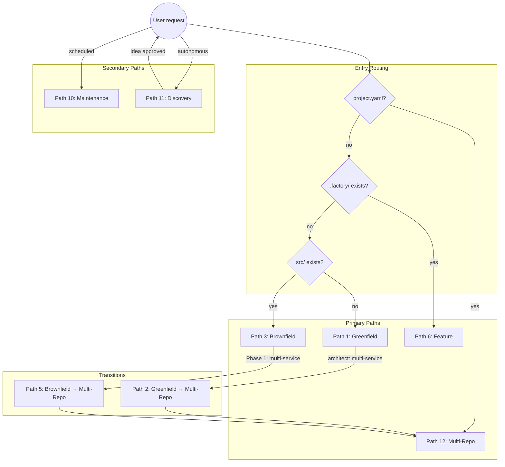

# Pipeline Paths

Every possible route through the VSDD factory, from entry to exit. Use this as the definitive routing reference.

---

## Master Routing Diagram



---

## Path 1: Greenfield (Single-Service)

**Entry:** New project, no existing code, single-service architecture.

**Workflow:** `greenfield.lobster` (72 steps)

```
Planning → Phase 1 (Spec) → Topology Check (single-service) →
Phase 2 (Stories) → Phase 3 (TDD, per-story via code-delivery) →
Phase 4 (Holdout) → Phase 5 (Adversarial) → Phase 6 (Hardening) →
Phase 7 (Convergence) → Release
```

### Step Trace

| Step | Lobster Name | Type | Agent/Skill |
|------|-------------|------|-------------|
| Repo init | `repo-initialization` | skill | `repo-initialization/SKILL.md` |
| Factory health | `factory-worktree-health` | skill | `factory-worktree-health/SKILL.md` |
| CLAUDE.md | `scaffold-claude-md` | skill | `scaffold-claude-md/SKILL.md` |
| State init | `state-initialization` | agent | `state-manager` |
| Planning | `adaptive-planning` | sub_workflow | `planning.lobster` |
| **Phase 1** | `phase-1-spec-crystallization` | skill | `phase-1-spec-crystallization/SKILL.md` |
| Architect review | `architect-feasibility-review` | agent | `architect` |
| PRD revision | `prd-revision` | skill (conditional) | `phase-1-prd-revision/SKILL.md` |
| DTU assessment | `phase-1-dtu-assessment` | agent | `architect` |
| CI/CD setup | `phase-1-cicd-setup` | agent | `devops-engineer` |
| Consistency audit | `phase-1-consistency-audit` | agent | `consistency-validator` |
| Phase 1 gate | `phase-1-gate` | gate | 17 criteria |
| Adversarial review | `phase-1d-adversarial-spec-review` | loop (max 10) | `adversary` + `phase-1d-adversarial-spec-review/SKILL.md` |
| Human approval | `phase-1-human-approval` | human-approval | — |
| **Topology check** | `multi-repo-topology-check` | agent | `orchestrator` |
| **Phase 2** | `phase-2-story-decomposition` | skill | `phase-2-story-decomposition/SKILL.md` |
| Story adversarial | `phase-2-adversarial-review` | loop | `adversary` |
| Phase 2 gate | `phase-2-gate` | gate | 8 criteria |
| Human approval | `phase-2-human-approval` | human-approval | — |
| Preflight | `dx-engineer-preflight` | agent | `dx-engineer` |
| **Phase 3** | `phase-3-per-story-delivery` | loop (per wave, per story) | `code-delivery.lobster` |
| Wave gate | `wave-integration-gate` | compound | Full test suite + adversarial + security |
| Wave approval | `wave-gate` | gate | 8 criteria |
| **Phase 4** | `phase-4-holdout-evaluation` | skill | `phase-4-holdout-evaluation/SKILL.md` |
| **Phase 5** | `phase-5-adversarial-refinement` | loop (max 10) | `adversary` + `adversarial-review/SKILL.md` |
| **Phase 6** | `phase-6-formal-hardening` | skill | `phase-6-formal-hardening/SKILL.md` |
| **Phase 7** | `phase-7-convergence` | skill | `phase-7-convergence/SKILL.md` |
| Convergence gate | `phase-7-gate` | gate | 9 criteria |
| Release | `release` | agent | `devops-engineer` |
| Session review | `session-review` | skill | `session-review/SKILL.md` |

### Gate Criteria

**Phase 1 gate:** All requirements have unique IDs, Provable Properties Catalog covers security boundaries, Purity Boundary Map complete, verification tooling selected, module criticality classified, DTU assessment exists, CI/CD pipelines created.

**Phase 2 gate:** Every BC traces to a story, no placeholder ACs, no circular dependencies, wave assignments respect ordering, holdout scenarios exist.

**Wave gate:** Full test suite passes, adversarial review converged, holdout regression check passed, security review passed.

**Phase 7 gate:** All 7 convergence dimensions CONVERGED, traceability matrix generated.

---

## Path 2: Greenfield → Multi-Repo Transition

**Entry:** Starts as greenfield. During Phase 1, the architect identifies multi-service topology.

**Workflow:** `greenfield.lobster` → `multi-repo.lobster`

```
[Path 1 through Phase 1 human approval] →
Topology Check (multi-service) → Human Confirms →
devops-engineer creates per-service repos + project.yaml →
state-manager migrates specs → STOP greenfield →
multi-repo.lobster takes over
```

### Transition Steps

| Step | Lobster Name | Type | What Happens |
|------|-------------|------|-------------|
| Check topology | `multi-repo-topology-check` | agent | Reads `deployment_topology` from ARCH-INDEX.md |
| Human confirms | `multi-repo-human-confirmation` | human-approval | Approve multi-repo split or force mono-repo |
| Create repos | `multi-repo-transition` | agent | devops-engineer creates per-service repos, generates `project.yaml` |
| Migrate state | `multi-repo-state-migration` | agent | state-manager moves specs to `.factory-project/`, initializes per-repo STATE.md |

After transition, `multi-repo.lobster` runs per-repo Phases 1-7 with cross-repo coordination (see Path 12).

---

## Path 3: Brownfield (Single-Repo)

**Entry:** Existing codebase, no `.factory/` directory.

**Workflow:** `brownfield.lobster` (26 steps) → `greenfield.lobster` sub-workflow

```
Environment Setup → Repo Verify → Factory Worktree → State Init →
Phase 0 (brownfield-ingest) → Phase 0 Gate → Human Approval →
Market Intel → Semport (conditional) → Design System (conditional) →
Transition to Greenfield → [Path 1 from Phase 1 onward]
```

### Step Trace

| Step | Lobster Name | Type | Agent/Skill |
|------|-------------|------|-------------|
| Env setup | `environment-setup` | agent | `dx-engineer` |
| Repo verify | `repo-verification` | agent | `devops-engineer` |
| Factory health | `factory-worktree-health` | skill | `factory-worktree-health/SKILL.md` |
| CLAUDE.md | `scaffold-claude-md` | skill | `scaffold-claude-md/SKILL.md` |
| **Phase 0** | `phase-0-codebase-ingestion` | skill | `phase-0-codebase-ingestion/SKILL.md` |
| Phase 0 gate | `phase-0-gate` | gate | 7 criteria |
| Human approval | `phase-0-human-approval` | human-approval | — |
| Routing | `post-phase-0-routing` | agent | `orchestrator` |
| Market intel | `brownfield-market-intel` | skill | `market-intelligence-assessment/SKILL.md` |
| Semport | `semport-translation` | skill (conditional) | `semport-analyze/SKILL.md` |
| Design system | `brownfield-design-system-extract` | skill (conditional) | `design-system-bootstrap/SKILL.md` |
| Transition | `brownfield-to-greenfield-transition` | agent | `state-manager` |
| **Phases 1-7** | `greenfield-pipeline` | sub_workflow | `greenfield.lobster` |
| Multi-repo check | `multi-repo-handoff-check` | agent | `orchestrator` |
| Multi-repo (conditional) | `multi-repo-pipeline` | sub_workflow | `multi-repo.lobster` |
| Session review | `session-review` | skill | `session-review/SKILL.md` |

---

## Path 4: Brownfield Multi-Repo (project.yaml Exists)

**Entry:** Multiple existing repos, `project.yaml` created manually.

**Workflow:** `multi-repo.lobster` (39 steps)

```
Read project.yaml → Per-repo mode detection → Repo setup →
Per-repo Phase 0 (brownfield repos, parallel) → Project-level synthesis →
Phase 0 gate → Market Intel → Per-repo Phases 1-7 (wave-ordered) →
Cross-repo Integration Gate → Convergence → Release
```

### Per-Repo Mode Classification

| Repo State | Classified Mode |
|-----------|----------------|
| Has source + no project-context.md | Brownfield (Phase 0) |
| Has source + has project-context.md | Feature (skip Phase 0) |
| Empty or nonexistent | Greenfield (skip Phase 0) |
| Role: generated | SDK generation skill |

---

## Path 5: Brownfield → Multi-Repo Discovery

**Entry:** Start brownfield on single repo. Phase 1 architect discovers multi-service topology.

**Workflow:** `brownfield.lobster` → `greenfield.lobster` → `multi-repo.lobster`

```
[Path 3 through Phase 0] → greenfield sub-workflow →
Phase 1 architect sets deployment_topology: multi-service →
[Path 2 transition] → multi-repo.lobster →
brownfield.lobster detects handoff → launches multi-repo.lobster
```

The `multi-repo-handoff-check` step in brownfield.lobster detects that `project.yaml` was created during the greenfield sub-workflow and automatically launches `multi-repo.lobster`.

---

## Path 6: Feature (Standard)

**Entry:** Adding a feature to a project with existing `.factory/` directory.

**Workflow:** `feature.lobster` (82 steps)

```
F1 (Delta Analysis) → F2 (Spec Evolution) → F3 (Incremental Stories) →
F4 (Delta Implementation, per-story via code-delivery) →
F5 (Scoped Adversarial) → F6 (Targeted Hardening) →
F7 (Delta Convergence) → Release
```

### Step Trace

| Phase | Lobster Name | Type | Agent/Skill |
|-------|-------------|------|-------------|
| **F1** | `phase-f1-delta-analysis` | skill | `phase-f1-delta-analysis/SKILL.md` |
| **F2** | `phase-f2-spec-evolution` | skill | `phase-f2-spec-evolution/SKILL.md` |
| F2 adversarial | `f2-adversarial-review` | loop | `adversary` |
| **F3** | `phase-f3-incremental-stories` | skill | `phase-f3-incremental-stories/SKILL.md` |
| **F4** | Per-story delivery | loop (per wave) | `code-delivery.lobster` |
| Wave gate | `wave-integration-gate` | compound | Tests + adversarial + security |
| **F5** | `phase-f5-scoped-adversarial` | loop | `adversary` + `phase-f5-scoped-adversarial/SKILL.md` |
| Holdout | Holdout evaluation | skill | `phase-4-holdout-evaluation/SKILL.md` |
| **F6** | `phase-f6-targeted-hardening` | skill | `phase-f6-targeted-hardening/SKILL.md` |
| **F7** | `phase-f7-delta-convergence` | skill (max 5 cycles) | `phase-f7-delta-convergence/SKILL.md` |
| Release | `release` | agent | `devops-engineer` (MINOR or PATCH) |

---

## Path 7: Feature (Trivial)

**Entry:** Small change that doesn't need full F1-F7.

**Routing:** Detected by `/vsdd-factory:quick-dev-routing` skill within feature.lobster.

```
F1 (Delta Analysis) → Quick-dev routing detects trivial →
F4 (single story) → Regression test → F7 lite → PATCH
```

Skips: F2 (spec unchanged), F3 (no new stories), F5 (no adversarial), F6 (no hardening).

---

## Path 8: Feature (Bug Fix)

**Entry:** Bug report against a VSDD-managed project.

```
F1 (Delta Analysis, bug-fix routing) →
Single fix story → Holdout evaluation →
F5 (Scoped Adversarial) → F6 (Targeted Hardening, optional) →
F7 (Delta Convergence) → PATCH
```

Skips: F2 (spec unchanged by bug), F3 (no new stories needed).

---

## Path 9: Feature (Critical Bug)

**Entry:** Critical/P0 bug requiring expedited fix.

```
F1 (scope) → Single fix story → Mandatory regression test →
F7 lite (convergence check only) → PATCH
```

Expedited flow with minimal gates. The critical path uses config flags within the bug-fix routing, not a structurally distinct lobster branch.

---

## Path 10: Maintenance

**Entry:** Scheduled or on-demand quality sweeps.

**Workflow:** `maintenance.lobster` (34 steps)

```
Environment Setup → 11 Parallel Sweeps → Fix PR Delivery → Report
```

### 11 Sweep Types

| Sweep | Agent | What It Checks |
|-------|-------|---------------|
| 1 | dx-engineer + security-reviewer | Dependency vulnerabilities |
| 2 | technical-writer | Documentation drift |
| 3 | consistency-validator | Pattern inconsistency |
| 4 | holdout-evaluator | Stale holdout scenarios |
| 5 | performance-engineer | Performance regression |
| 6 | dtu-validator | DTU clone fidelity drift |
| 7 | consistency-validator | Spec coherence (33 checks) |
| 8 | orchestrator | Overdue tech debt |
| 9 | accessibility-auditor | Accessibility regression |
| 10 | ux-designer | Design drift (UI products) |
| 11 | orchestrator | Risk & assumption monitoring |

Findings are triaged and routed to fix PRs via `code-delivery.lobster`.

---

## Path 11: Discovery

**Entry:** Autonomous opportunity research.

**Workflow:** `discovery.lobster` (29 steps)

```
Customer Feedback Ingestion → Competitive Monitoring →
Analytics Integration → Intelligence Synthesis →
Idea Scoring (7 dimensions) → Brief Generation →
Route to Pipeline (greenfield or feature)
```

### Step Trace

| Step | Skill | What It Does |
|------|-------|-------------|
| Feedback | `customer-feedback-ingestion/SKILL.md` | Ingest support tickets, reviews, surveys |
| Competition | `competitive-monitoring/SKILL.md` | Track competitor features and gaps |
| Analytics | `analytics-integration/SKILL.md` | Usage data, funnel analysis |
| Synthesis | `intelligence-synthesis/SKILL.md` | Cross-source pattern detection |
| Scoring | `discovery-engine/SKILL.md` | 7-dimension idea evaluation |
| Brief | `guided-brief-creation/SKILL.md` | Auto-generate product brief |

---

## Path 12: Multi-Repo

**Entry:** `project.yaml` exists or greenfield/brownfield transitions to multi-repo.

**Workflow:** `multi-repo.lobster` (39 steps)

```
Read project.yaml → Per-repo mode detection → Compute repo waves →
Per-repo setup → [Per-repo Phase 0 if brownfield] → Project synthesis →
Market Intel → Wave 0 (primary repos) → Contract change detection →
Wave 1+ (consumer repos + SDK generation) →
Cross-repo Integration Gate → Convergence → Release
```

### Cross-Repo Integration Gate

| Step | Agent | What It Checks |
|------|-------|---------------|
| Docker env | devops-engineer | All services start and communicate |
| E2E tests | e2e-tester | Cross-service user journeys |
| Holdout | holdout-evaluator | Cross-repo holdout scenarios |
| Adversarial | adversary | Cross-repo code review |
| Security | security-reviewer | Cross-service attack surface |
| Accessibility | accessibility-auditor | Cross-service a11y |

---

## Path 13: Code Delivery (Sub-Workflow)

**Entry:** Invoked by greenfield, feature, maintenance, and multi-repo for each story.

**Workflow:** `code-delivery.lobster` (22 steps)

```
Create worktree → Generate stubs → Write failing tests →
RED GATE → TDD implementation → Record demos →
Push → PR lifecycle (9 steps) → Merge → Cleanup
```

### Step Trace

| Step | Agent | Exit Condition |
|------|-------|---------------|
| Worktree | devops-engineer | `git worktree list` shows new worktree |
| Stubs | test-writer | Build/compile passes |
| Failing tests | test-writer | Tests compile, all fail with assertion errors |
| **Red Gate** | — | Independent verification: tests correctly red |
| Implement | implementer | All tests green, lint clean, no todo!() |
| Demos | demo-recorder | Every AC has demo artifact |
| Push | implementer | `git ls-remote` shows branch |
| PR | pr-manager | PR merged (or blocker reported) |
| Cleanup | devops-engineer | Worktree removed, branch deleted |

---

## Path 14: Planning (Embedded Front-End)

**Entry:** Runs automatically as first phase of greenfield and brownfield.

**Workflow:** `planning.lobster` (24 steps)

```
Environment Setup → Artifact Detection → Quality Validation →
Gap Identification → Mode Routing → Market Intelligence →
Brief Creation/Validation → Implementation Readiness Check
```

### Step Trace

| Step | Skill/Agent | What It Does |
|------|------------|-------------|
| Env setup | dx-engineer | Toolchain + MCP + model preflight |
| Artifact detection | `artifact-detection/SKILL.md` | Scan for existing specs, stories, code |
| Market intel | `market-intelligence-assessment/SKILL.md` | Market context for brief |
| Brief | `guided-brief-creation/SKILL.md` or `validate-brief/SKILL.md` | Create or validate product brief |
| Readiness | `implementation-readiness/SKILL.md` | Verify all prerequisites met |
| Research | `planning-research/SKILL.md` | Deep research on unknowns |

---

## See Also

- [Workflow Modes](workflow-modes.md) — What each mode does and when to use it
- [Pipeline Overview](pipeline-overview.md) — Phase-by-phase detail with Mermaid diagrams
- [Step Decomposition Standard](../../plugins/vsdd-factory/rules/step-decomposition.md) — How phases are structured internally
