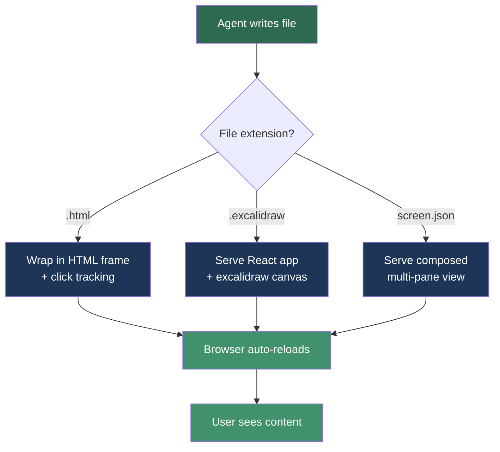
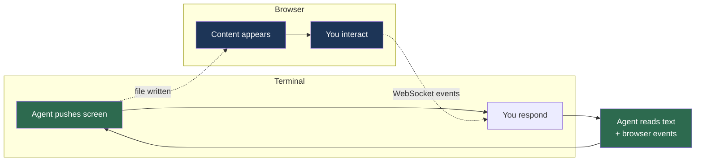

# Visual Companion

The visual companion is a browser-based tool that lets you see mockups, diagrams, and interactive choices while working with Claude in the terminal. When a design question benefits from visual content, the agent offers to show it in your browser.

---

## What It Does

During brainstorming, brief creation, and architecture design, the agent may need to show you visual options — layout comparisons, architecture diagrams, or interactive A/B choices. Instead of describing these in text, it opens a local web page where you can see and interact with the content.

**Two rendering modes:**

- **HTML mockups** — wireframes, layout options, A/B choices with clickable selections. The agent writes HTML content fragments and the server wraps them in a themed frame with click tracking.
- **Excalidraw diagrams** — architecture diagrams, entity relationships, flow charts rendered as interactive canvases. You can drag, resize, add, and modify elements directly in the browser. Your changes sync back automatically.

---

## Prerequisites

- **Node.js 18+** — required to run the local server
- **A modern browser** — Chrome, Firefox, Safari, or Edge

### Optional: Excalidraw support

HTML mockups work immediately. For interactive excalidraw diagrams, run the setup once:

```
/vsdd-factory:visual-companion-setup
```

Or manually:

```bash
cd <plugin-dir>/skills/visual-companion
bash setup.sh
```

This installs React and the excalidraw component (~300KB gzipped) and builds the viewer. Takes about 20 seconds.

### How the server routes content



---

## How It Works

### The interaction loop



1. **The agent offers the companion** — when visual questions are coming up, you'll see:
   > "I can show visual options in a browser for this. Want to try it?"

2. **You accept and open the URL** — the agent starts a local server and gives you a URL like `http://localhost:52341`. Open it in your browser.

3. **Content appears in the browser** — as the agent pushes screens (mockups, diagrams, options), they appear automatically. The page live-reloads when new content arrives.

4. **You interact in the browser, respond in the terminal** — click options, modify diagrams, then tell the agent what you think in the terminal. The agent reads both your terminal message and your browser interactions.

5. **Repeat until done** — the agent pushes new screens as the conversation progresses.

---

## What You See in the Browser

### HTML Mockups

A themed page with a header ("VSDD Visual Companion"), your content in the center, and a selection indicator bar at the bottom. When you click an option, it highlights and the indicator updates.

- **Options** — labeled A/B/C choices you click to select
- **Cards** — visual design cards with images and descriptions
- **Mockups** — wireframe previews of UI layouts
- **Split views** — side-by-side comparisons
- **Pros/Cons** — structured tradeoff displays

### Excalidraw Diagrams

A full excalidraw canvas where you can:
- **Select and move** elements by clicking and dragging
- **Resize** elements by dragging handles
- **Add new elements** using the toolbar (rectangles, arrows, text, etc.)
- **Delete elements** by selecting and pressing Delete/Backspace
- **Pan and zoom** the canvas

Your modifications are saved automatically. The agent reads the updated diagram on its next turn.

### History Sidebar

Click the arrow button on the left edge to open the history sidebar. It shows all past screens — click any one to revisit it. The newest screen is active by default.

### Composed Views

Sometimes the agent shows two screens side-by-side — for example, an architecture diagram next to a component mockup. Both panes are interactive.

---

## When It Activates

The visual companion is used by these skills:
- `/vsdd-factory:brainstorming` — visual options during ideation
- `/vsdd-factory:guided-brief-creation` — product concept visuals
- `/vsdd-factory:create-architecture` — architecture diagrams

It's always optional. If you decline, the agent uses Mermaid diagrams or text descriptions instead.

---

## Troubleshooting

### Server won't start

- **"Node.js is not installed"** — install Node.js 18+ from https://nodejs.org
- **Port already in use** — the server picks a random high port (49152-65535). If it fails, try again — it'll pick a different port.
- **Server starts but URL unreachable** — if you're in a remote/containerized environment, the agent needs to bind to `0.0.0.0` instead of `127.0.0.1`. Ask the agent to restart with `--host 0.0.0.0`.

### Excalidraw not rendering

- **"Excalidraw Viewer Not Installed" message** — run the setup: `/vsdd-factory:visual-companion-setup`
- **Blank canvas** — check browser console for errors. The build may need to be re-run after a Node.js upgrade.

### Page not updating

- **Stale content** — the page should auto-reload via WebSocket. If it doesn't, manually refresh the browser.
- **Server died** — the server auto-exits after 30 minutes of inactivity. The agent restarts it when needed.

### Browser interactions not detected

- **No events file** — interactions are tracked via WebSocket. If the connection drops, interactions aren't recorded. Refresh the page to reconnect.
- **Agent didn't mention your clicks** — tell the agent what you selected in the terminal. Terminal text is always the primary feedback channel.

---

## Privacy

The visual companion runs entirely locally. No data is sent to external servers. Content files are stored in your project's `.factory/visual-companion/` directory (or `/tmp/` if no project directory is specified).

---

## See Also

- [Cross-Cutting Skills](cross-cutting-skills.md) — all available skills including visual tooling
- [Phase 1: Spec Crystallization](phase-1-spec-crystallization.md) — visual tooling during design
