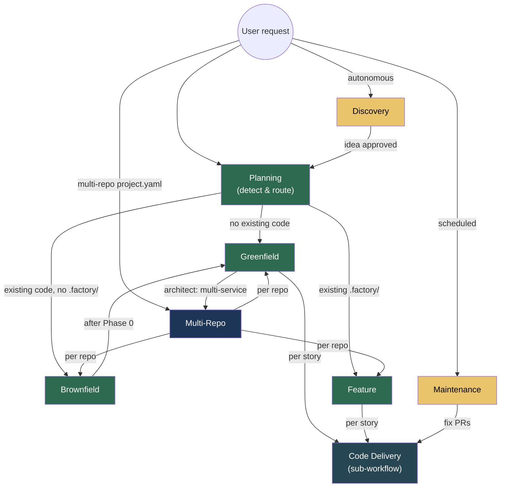

# Workflow Modes

The VSDD factory supports 8 workflow modes. Each mode strings together a different subset of the pipeline phases based on what you're building and what already exists.

---

## Mode Summary

| Mode | When to Use | Phases Run | Steps |
|------|-------------|-----------|-------|
| **Greenfield** | New project, no existing code | 0-7 (skip 0) | 68 |
| **Brownfield** | Existing codebase to extend or rebuild | 0-7 (all) | 24 + greenfield |
| **Feature** | Adding to a VSDD-managed project | F1-F7 (delta phases) | 82 |
| **Maintenance** | Scheduled quality sweeps | Per-sweep | 34 |
| **Discovery** | Autonomous opportunity research | Research → brief | 29 |
| **Planning** | Starting any pipeline run | Detect → route | 24 |
| **Multi-Repo** | Cross-repo coordination | Per-repo pipelines | 39 |
| **Code Delivery** | Per-story TDD (sub-workflow) | Worktree → merge | 22 |

---

## How Modes Relate



---

## Greenfield

**File:** `workflows/greenfield.lobster` (68 steps)

**Use when:** You're building a new product from scratch with no existing codebase.

**What it does:** The full VSDD pipeline. Transforms a product brief into verified, adversarially-reviewed, formally-proven code through all 8 phases:

1. **Planning** — environment setup, market intelligence, brief creation
2. **Phase 1** — Spec crystallization (brief → domain spec → PRD → architecture)
3. **Phase 2** — Story decomposition (PRD → epics → stories → waves → holdout scenarios)
4. **Phase 3** — TDD implementation (per-story delivery via code-delivery sub-workflow)
5. **Phase 4** — Holdout evaluation (hidden acceptance scenarios, different model family)
6. **Phase 5** — Adversarial refinement (fresh-context review until convergence)
7. **Phase 6** — Formal hardening (Kani proofs, fuzz, mutation, security scan)
8. **Phase 7** — Convergence (7-dimensional assessment → release)

This is the reference path — all other modes are subsets or variations.

### Greenfield → Multi-Repo Transition

During Phase 1, the architect analyzes the product's deployment topology. If the architecture requires multiple independent services (different tech stacks, independent release cycles, service-oriented design), the architect sets `deployment_topology: multi-service` in ARCH-INDEX.md.

After Phase 1 architecture (step P1-05), the orchestrator checks this field:
- **`single-service`** — continue with single-repo greenfield
- **`multi-service`** — present the architect's service boundaries to the human for confirmation. If confirmed, devops-engineer creates per-service repos and `project.yaml`, then the pipeline switches to multi-repo mode

This means you don't need to know upfront whether your project is multi-repo. Start with greenfield — the architect will identify it during architecture design and the pipeline will transition automatically.

**Entry:** Start a new session and describe your product idea, or run `/vsdd-factory:create-brief`.

---

## Brownfield

**File:** `workflows/brownfield.lobster` (24 steps + greenfield overlay)

**Use when:** You have an existing codebase you want to analyze, extend, or rebuild using VSDD.

**What it does:** Adds Phase 0 (Codebase Ingestion) before the greenfield pipeline. Phase 0 analyzes the existing code through broad-then-converge analysis:

1. **Phase 0** — Clone/copy codebase, 7 broad passes, convergence deepening, coverage audit, extraction validation, final synthesis
2. **Phases 1-7** — Standard greenfield pipeline, scoped to NEW features only (existing behavior is documented, not reimplemented)

Phase 0 produces a project context document, recovered architecture, convention catalog, and draft behavioral contracts that scope all subsequent phases.

**Entry:** `/vsdd-factory:brownfield-ingest <path-or-url>`

**Key difference from greenfield:** Phase 0 output constrains Phase 1. Specs only cover what's new or changing — existing behavior is inherited from the analysis.

### Brownfield → Multi-Repo

If your existing project is already split across multiple repositories:

1. **Create `project.yaml`** at the project root listing all repos, their paths/URLs, and dependencies
2. The multi-repo workflow detects `project.yaml` and classifies each repo independently — repos with existing source run brownfield (Phase 0), empty repos run greenfield
3. Each brownfield repo runs Phase 0 in parallel, followed by a **project-level synthesis** that merges findings across all repos
4. After Phase 0, the pipeline continues with per-repo Phase 1-7 coordinated by cross-repo gates

If you start brownfield on a **single repo** and the architect discovers multi-service topology during Phase 1, the same greenfield → multi-repo transition applies (see Greenfield section above).

---

## Feature

**File:** `workflows/feature.lobster` (82 steps)

**Use when:** Adding a feature, fixing a bug, or making an enhancement to a project that already has a `.factory/` directory from a prior VSDD pipeline run.

**What it does:** Runs delta phases (F1-F7) that scope all work to changed/new code while regression testing protects existing functionality:

1. **F1: Delta Analysis** — Analyze what changed, scope the feature
2. **F2: Spec Evolution** — Update specs for the delta (new/modified BCs, architecture changes)
3. **F3: Incremental Stories** — Create stories for the delta only
4. **F4: Delta Implementation** — Per-story TDD delivery via code-delivery
5. **F5: Scoped Adversarial** — Adversarial review focused on the delta
6. **F6: Targeted Hardening** — Formal verification on changed modules
7. **F7: Delta Convergence** — Convergence check on the delta

**Routing variants:**
- **Standard feature/enhancement:** F1 → F2 → F3 → F4 → F5 → F6 → F7 → release
- **Trivial change:** F1 → F4 (single story) → regression → F7 lite → PATCH
- **Bug fix:** F1 → single fix story → holdout → F5 → F6 → F7 → PATCH
- **Critical bug fix:** Expedited flow with minimal gates

This is the **steady-state operating mode** — most development work after the initial greenfield/brownfield run uses feature mode.

**Entry:** Describe the feature or bug fix in a session with an existing `.factory/` directory.

---

## Maintenance

**File:** `workflows/maintenance.lobster` (34 steps)

**Use when:** Running scheduled quality sweeps to catch drift, vulnerabilities, and regressions.

**What it does:** 10 independent sweep types that run on a schedule:

| Sweep | What It Checks |
|-------|---------------|
| 1. Dependency audit | Vulnerable dependencies (cargo audit, npm audit) |
| 2. Documentation drift | Docs that don't match current implementation |
| 3. Pattern inconsistency | Code patterns that diverge from conventions |
| 4. Stale holdout scenarios | Holdout scenarios that no longer match BCs |
| 5. Performance regression | Benchmark regressions against baseline |
| 6. DTU fidelity drift | Digital twin universe clones falling out of sync |
| 7. Spec coherence | Spec-level contradictions or gaps |
| 8. Overdue tech debt | Tech debt items past their target resolution date |
| 9. Accessibility regression | A11y violations introduced since last audit |
| 10. Design drift | Token overrides, component misuse, pattern violations |

Each sweep can open fix PRs through the code-delivery sub-workflow automatically.

**Entry:** `/vsdd-factory:maintenance-sweep` or schedule via cron.

---

## Discovery

**File:** `workflows/discovery.lobster` (29 steps)

**Use when:** You want the factory to autonomously research opportunities for new features or product concepts.

**What it does:** Continuously researches and evaluates ideas:

1. **Market intelligence** — Scan competitors, market trends, customer feedback
2. **Idea evaluation** — Score ideas across 7 dimensions (market fit, feasibility, effort, differentiation, risk, evidence strength, strategic alignment)
3. **Brief creation** — Auto-generate product briefs for approved ideas
4. **Routing** — Route approved ideas to the greenfield or feature pipeline

Discovery integrates with customer feedback ingestion, competitive monitoring, and analytics to surface data-driven opportunities.

**Entry:** `/vsdd-factory:discovery-engine` or configure for autonomous operation.

---

## Planning

**File:** `workflows/planning.lobster` (24 steps)

**Use when:** Starting any pipeline run. Planning is the adaptive front-end that routes you to the right mode.

**What it does:**

1. **Environment setup** — Verify toolchain, MCP connections, model availability
2. **Artifact detection** — Scan for existing `.factory/`, `project.yaml`, `src/` directories
3. **Quality validation** — Validate any existing artifacts for completeness
4. **Gap identification** — Find what's missing or stale
5. **Mode routing** — Route to greenfield, brownfield, or feature based on what exists

Supports two entry paths:
- **Collaborative Discovery** — Start from an idea, build the brief interactively
- **Spec Intake** — Start from existing spec documents, validate and route

**Entry:** Planning runs automatically as the first phase of greenfield and brownfield modes.

---

## Multi-Repo

**File:** `workflows/multi-repo.lobster` (39 steps)

**Use when:** Your project spans multiple repositories with dependencies between them.

**What it does:**

1. **Read `project.yaml`** — Manifest defining repos, their relationships, and modes
2. **Compute wave ordering** — Kahn's algorithm for repo-level dependency ordering
3. **Per-repo sub-workflows** — Each repo runs its own greenfield/brownfield/feature pipeline
4. **Cross-repo integration gate** — Docker Compose e2e tests, holdout evaluation, adversarial review, and security scanning across all repos
5. **Coordinated release** — All repos release together after cross-repo convergence

Supports mixed modes (one repo greenfield, another brownfield, another feature). Each repo gets its own `.factory/` directory; project-level coordination artifacts go in `.factory-project/`.

**Entry:** Create a `project.yaml` at the project root and start a session. The orchestrator detects multi-repo mode automatically.

---

## Code Delivery (Sub-Workflow)

**File:** `workflows/code-delivery.lobster` (22 steps)

**Use when:** This is not invoked directly — it's a reusable sub-workflow called by greenfield, feature, maintenance, and multi-repo for each story that needs implementation.

**What it does:** The complete per-story TDD delivery cycle:

1. Create worktree on feature branch
2. Generate compilable stubs
3. Write failing tests (Red Gate)
4. Implement via TDD micro-commits
5. Record per-AC demo artifacts
6. Push and run PR lifecycle (9-step process)
7. AI code review + security review
8. Merge and cleanup worktree

Each step dispatches a fresh specialist subagent to prevent context exhaustion.

**Direct command equivalent:** `/vsdd-factory:deliver-story STORY-NNN`

---

## Mode Detection Logic

The orchestrator detects which mode to use based on what exists:

```
Has project.yaml?
  → YES: Multi-repo mode

Has .factory/ with completed pipeline?
  → YES + feature request: Feature mode
  → YES + bug fix: Feature mode (bug-fix routing)
  → YES + maintenance scheduled: Maintenance mode

Has src/ but no .factory/?
  → YES: Brownfield mode

Nothing exists?
  → Greenfield mode

Human says "research opportunities"?
  → Discovery mode
```

Human override always takes priority. See `/vsdd-factory:mode-decision-guide` for edge cases.

---

## See Also

- [Pipeline Overview](pipeline-overview.md) — Phase-by-phase detail with Mermaid diagrams
- [Getting Started](getting-started.md) — Installation and first session
- [Configuration](configuration.md) — `.factory/` directory layout
- [Agents Reference](agents-reference.md) — All 33 specialist agents
