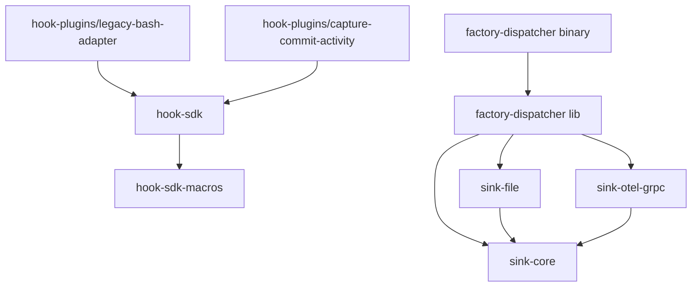
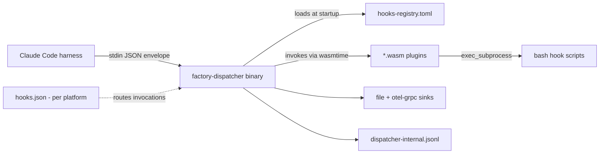

# Pass 0: Inventory — vsdd-factory

**Date:** 2026-04-25
**Project root:** `/Users/jmagady/Dev/vsdd-factory`
**Released version:** `1.0.0-beta.4` (commit `1907d8f`, 2026-04-25)
**Self-referential note:** vsdd-factory IS the project being onboarded — engine and product share the same repo.

## 1. Tech Stack

### Subsystem A — Rust hook dispatcher (`crates/`, `Cargo.toml`)
- **Language:** Rust 2024 edition (`rust-toolchain.toml` pins; `rust-version = "1.95"`).
- **Build system:** Cargo workspace (`resolver = "2"`).
- **Test framework:** Built-in `cargo test` (`#[test]`, `#[tokio::test]`); `bats` for shell-side integration; `trybuild` for proc-macro tests.
- **WASM runtime:** `wasmtime = "44.0"` + `wasmtime-wasi = "44.0"` (WASI preview-1; preview-2 explicitly out of scope per ADR-003).
- **Async runtime:** `tokio = "1"` (`current_thread` flavor in dispatcher main; `spawn_blocking` for wasmtime calls).
- **Plugin target triple:** `wasm32-wasip1`.
- **Key workspace deps (pinned in `Cargo.toml` `[workspace.dependencies]`):**
  - `serde = 1.0` + `serde_json = 1.0` + `toml = 0.8` (config + payload encoding)
  - `anyhow = 1.0` + `thiserror = 2.0` (error handling — `thiserror` for crate APIs, `anyhow` for boundaries)
  - `tracing = 0.1` + `tracing-subscriber = 0.3` (structured logging)
  - `clap = 4` (CLI; not heavily used at root)
  - `chrono = 0.4`, `regex = 1`, `uuid = 1` (utility)
  - `proc-macro2 = 1.0` + `quote = 1.0` + `syn = 2.0` (proc-macro plumbing for `#[hook]`)
  - `opentelemetry-proto = 0.31` (`gen-tonic` + `logs`) + `tonic = 0.14` + `tokio-stream = 0.1` (S-1.9 OTLP/gRPC sink)
  - `tempfile = 3`, `filetime = 0.2`, `wat = 1` (test scaffolding)
- **Release profile:** `opt-level = 3`, `lto = "thin"`, `codegen-units = 1`, `strip = "symbols"`.

### Subsystem B — VSDD pipeline plugin (`plugins/vsdd-factory/`)
- **Manifest format:** `.claude-plugin/plugin.json` v1 (Claude Code plugin schema).
- **Plugin version:** `1.0.0-beta.4`.
- **Marketplace declaration:** `.claude-plugin/marketplace.json` (root) — single plugin entry pointing at `./plugins/vsdd-factory`.
- **Workflow data format:** Lobster (`.lobster` files) — YAML under the hood. Parsed by `bin/lobster-parse <file> '<jq-expr>'`.
- **Skill / agent / template format:** Markdown with YAML frontmatter (`name:`, `description:`, optional `tools:`, `model:`, `color:`, `argument-hint:`).
- **Hook scripts:** Bash shebang `#!/bin/bash`, `set -euo pipefail`, `jq` for stdin payload parsing.
- **Hook dispatch:** Rust `factory-dispatcher` binary (per-platform), invoked by Claude Code's `hooks.json`. Bash hooks run via `legacy-bash-adapter.wasm` (which `exec_subprocess` shells out to bash).

## 2. Re-derived Metrics (independent recount with `find` + `wc -l`)

### Rust workspace
| Metric | Value | Method |
|---|---|---|
| Total Rust LOC | **10,226** | `find crates -name '*.rs' -exec wc -l {} +` |
| Total Rust files | **41** | `find crates -name '*.rs' -type f \| wc -l` |
| Total `#[test]`/`#[tokio::test]` annotations | **180** | `grep -c '#\[test\]\|#\[tokio::test\]' \| awk` |

### Per-crate LOC (Rust)
| Crate | LOC | Role |
|---|---|---|
| `factory-dispatcher` | **6,377** | Binary + library; routing, executor, host fns, internal log, sinks loader |
| `sink-otel-grpc` | 1,134 | OTLP/gRPC log forwarder (S-1.9) |
| `hook-sdk` | 954 | `#[hook]` macro entry, `HookPayload`/`HookResult`, host bindings |
| `sink-file` | 881 | Daily-rotated JSONL append sink (S-1.8 default) |
| `hook-plugins` (combined) | 409 | `legacy-bash-adapter` + `capture-commit-activity` workspace members |
| `sink-core` | 367 | `Sink` trait, `SinkEvent`, `RoutingFilter` |
| `hook-sdk-macros` | 104 | proc-macro for `#[hook]` |
| **Total** | **10,226** | |

### Plugin layer (`plugins/vsdd-factory/`)
| Metric | Value | Method |
|---|---|---|
| `SKILL.md` files | **119** | `find skills -name 'SKILL.md' \| wc -l` |
| Top-level skill directories | 119 | `ls skills \| wc -l` (1:1 with `SKILL.md`) |
| Total markdown files in `skills/` | 581 | (skill body + step files + helpers) |
| Skill subdirectories | 1,270 | (deep tree of `steps/`, `templates/`, `examples/`) |
| Agent files (`agents/*.md` + `orchestrator/*.md`) | **43** | 33 top-level + 10 orchestrator subagent docs |
| Top-level agent identities | **34** | 33 `*.md` files + 1 `orchestrator/` directory |
| Hook scripts (top-level `hooks/*.sh`) | **44** | bash hooks |
| Hooks-registry entries | **45** | `grep -c '^\[\[hooks\]\]' hooks-registry.toml` |
| Templates | 108 (`*.md`/`*.yaml`/`*.tape` etc.) | `find templates -type f` reports 135 incl. subdirs (e.g., `design-system/`) |
| Slash command files (`commands/`) | 110 | every command is a `.md` file |
| Workflow files (`workflows/*.lobster` + `workflows/phases/*.lobster`) | 16 | 8 top-level + 8 phase sub-flows |
| Test files (`tests/`) | 71 | mix of `.bats` and helpers |

### Other notable size/age signals
- `CHANGELOG.md` — 215,328 bytes (~215KB; 4,000+ lines of release history back to v0.x).
- `Cargo.lock` — 83KB (regular Rust workspace lockfile).
- `target/` is gitignored (build artifacts).
- `.factory/specs/` — 8 design docs (1 v1.0 master + 7 from 2026-04-13).
- `.factory/plans/` — 4 plans from 2026-04-13.
- `.factory/stories/v1.0/` — `EPIC.md` + 41 stories (`S-0.1` through `S-5.7`).
- `docs/guide/` — 30 reference docs (phase overviews, configuration, troubleshooting).
- `docs/lessons-learned/` — 1+ files (notably `wave-gate-bookkeeping.md`).
- `.reference/` — contains earlier ingest of *external* reference repos (claude-code, superpowers); ignored for this analysis.
- `.factory/semport/` — earlier Phase 0 artifacts of *reference* repos; not authoritative for vsdd-factory itself.

## 3. File Manifest (highest-priority files)

| Path | Type | Priority | LOC | Purpose |
|---|---|---|---|---|
| `crates/factory-dispatcher/src/main.rs` | Entry | **P0** | 236 | CLI entry: stdin → registry → routing → execute → exit code |
| `crates/factory-dispatcher/src/lib.rs` | API | P0 | 50 | Re-exports `engine`, `executor`, `host`, `internal_log`, `invoke`, `payload`, `plugin_loader`, `registry`, `routing`, `sinks`; declares `HOST_ABI_VERSION = 1` |
| `crates/factory-dispatcher/src/registry.rs` | Domain | P0 | 573 | `Registry`, `RegistryEntry`, `Capabilities`, `OnError`, `RegistryDefaults`, schema-v1 validation |
| `crates/factory-dispatcher/src/routing.rs` | Logic | P0 | 265 | `match_plugins`, `group_by_priority`, `PluginOutcome` |
| `crates/factory-dispatcher/src/executor.rs` | Logic | P0 | 403 | Tier-by-tier parallel execution, `PluginOutcome`, `TierExecutionSummary`, `block_intent` |
| `crates/factory-dispatcher/src/invoke.rs` | Runtime | P0 | 805 | wasmtime store setup, WASI ctx, `_start` invocation, `PluginResult::{Ok,Timeout,Crashed}`, `STDERR_CAP_BYTES = 4096` |
| `crates/factory-dispatcher/src/engine.rs` | Runtime | P0 | 142 | `build_engine`, `EpochTicker` (10ms cadence), `timeout_ms_to_epochs` |
| `crates/factory-dispatcher/src/internal_log.rs` | Telemetry | P0 | 507 | Daily-rotated JSONL writer, 30-day retention, 17 event-type constants |
| `crates/factory-dispatcher/src/payload.rs` | Domain | P0 | 178 | `HookPayload` (dispatcher-side; `event_name` with `hook_event_name` alias) |
| `crates/factory-dispatcher/src/host/mod.rs` | API | P0 | 224 | `HostContext`, `setup_linker`, `codes::*` (negative i32 host errors) |
| `crates/factory-dispatcher/src/host/exec_subprocess.rs` | Security | P0 | ~600 | Capability gates: `binary_allow`, `shell_bypass_acknowledged`, setuid refusal, bounded timeout/output |
| `crates/factory-dispatcher/src/host/{read_file,env,emit_event,log,context_fns,memory}.rs` | Host fns | P0 | ~1500 combined | Bounded read, allow-listed env, event emission, log levels, context getters, guest-memory bounds checking |
| `crates/factory-dispatcher/src/plugin_loader.rs` | Runtime | P1 | small | `PluginCache::get_or_compile` (per-invocation Module cache) |
| `crates/factory-dispatcher/src/sinks/{mod,router}.rs` | Telemetry | P1 | ~500 | `SinkRegistry::load`, `submit_all`, `flush_all`, `shutdown_all`; routes file + otel-grpc |
| `crates/hook-sdk/src/lib.rs` | API | P0 | 59 | `HookPayload`, `HookResult`, `HOST_ABI_VERSION = 1`, re-exports `#[hook]` macro |
| `crates/hook-sdk/src/{payload,result,host,ffi,__internal}.rs` | API | P0 | ~900 combined | SDK types + host fn shims that plugins import |
| `crates/hook-sdk-macros/src/lib.rs` | Codegen | P1 | 104 | `#[hook]` proc-macro: emits `_start` + JSON deserialize + panic boundary |
| `crates/hook-plugins/legacy-bash-adapter/src/lib.rs` | Plugin | P0 | ~250 | Reads `plugin_config.script_path`, `exec_subprocess`-es bash, maps exit code → `HookResult` |
| `crates/hook-plugins/capture-commit-activity/src/lib.rs` | Plugin | P1 | ~150 | Native WASM port (S-3.1, in flight) |
| `crates/sink-core/src/lib.rs` | API | P0 | 367 | `Sink` trait (`accepts`, `submit`, `flush`, `shutdown`), `SinkEvent`, `RoutingFilter` (allow-then-deny) |
| `crates/sink-file/src/lib.rs` | Driver | P0 | 881 | Daily-rotated JSONL, mpsc-bounded queue (default 1000), `{date}/{name}/{project}` placeholders |
| `crates/sink-otel-grpc/src/lib.rs` | Driver | P0 | 1134 | OTLP/gRPC log forwarder, dedicated `current_thread` runtime on its own OS thread |
| `Cargo.toml` | Config | P0 | 60 | Workspace member list, edition 2024, `[workspace.dependencies]` pins, release profile |
| `plugins/vsdd-factory/.claude-plugin/plugin.json` | Manifest | P0 | 17 | Plugin name, version `1.0.0-beta.4`, description, repo |
| `.claude-plugin/marketplace.json` | Manifest | P0 | 24 | Marketplace owner + plugin entry pointing at `./plugins/vsdd-factory` |
| `plugins/vsdd-factory/hooks-registry.toml` | Routing | P0 | 914 | 45 entries; all currently routed through `legacy-bash-adapter.wasm` |
| `plugins/vsdd-factory/hooks/hooks.json` | Manifest | P0 | 95 | Bash-hook routing table (legacy v0.79.x layout, currently active alongside dispatcher) |
| `plugins/vsdd-factory/hooks/hooks.json.template` | Manifest | P0 | 89 | Template — placeholder `{{PLATFORM}}` + `{{EXE_SUFFIX}}`; activate skill picks variant |
| `plugins/vsdd-factory/hooks/hooks.json.{darwin-arm64,darwin-x64,linux-x64,linux-arm64,windows-x64}` | Manifest | P0 | 5 files | Per-platform expansions of template, committed by CI |
| `plugins/vsdd-factory/hooks/dispatcher/bin/<platform>/factory-dispatcher[.exe]` | Binary | P0 | 5 dirs | Per-platform compiled dispatcher; committed at release time |
| `plugins/vsdd-factory/hooks/*.sh` | Hooks | P0 | 44 files | Each is a discrete behavioral contract (gate / capture / validator) |
| `plugins/vsdd-factory/agents/*.md` | Identity | P0 | 33 files + orchestrator/ | Each declares `name:` frontmatter — agent ID for orchestrator dispatch |
| `plugins/vsdd-factory/skills/*/SKILL.md` | Procedure | P0 | 119 files | Each is a named procedure invokable as `/vsdd-factory:<skill-name>` |
| `plugins/vsdd-factory/workflows/*.lobster` + `phases/*.lobster` | Workflow | P0 | 16 files | Top-level mode flows (greenfield/brownfield/feature/...) + 8 phase sub-flows |
| `plugins/vsdd-factory/templates/*` | Template | P1 | 108+ files | Output-shape templates referenced by skills |
| `plugins/vsdd-factory/bin/*` | Tool | P1 | 12 binaries | `emit-event`, `factory-dashboard`, `factory-obs`, `factory-query`, `factory-replay`, `factory-report`, `factory-sla`, `lobster-parse`, `multi-repo-scan`, `research-cache`, `wave-state`, `compute-input-hash` |
| `.factory/legacy-design-docs/2026-04-24-v1.0-factory-plugin-kit-design.md` | Design | P0 | ~1500 | The v1.0 master design — most authoritative intent doc; ADRs, host ABI, sink schema |
| `.factory/stories/v1.0/EPIC.md` + `S-*.md` | Backlog | P0 | 42 files | Decomposed v1.0 stories with dependency tiers |
| `CHANGELOG.md` | History | P0 | ~4000 lines | Authoritative shipped-state truth |
| `README.md` | Docs | P1 | 15KB | Project overview |
| `docs/guide/*.md` | Docs | P1 | 30 files | Reference docs for users and contributors |

## 4. Dependency Graph

### Cargo workspace dependency direction

- `factory-dispatcher` depends on all three sink crates (file + otel-grpc + core).
- Plugins (`hook-plugins/*`) depend only on `hook-sdk`; they never link the dispatcher.
- `hook-sdk` depends on `hook-sdk-macros` (proc-macro crate).
- No circular deps. `sink-core` is a leaf for the sink half; `hook-sdk` is a leaf for the SDK half.

### Inter-subsystem coupling (Rust ↔ plugin layer)

- Coupling point: plugin layer's `hooks.json.<platform>` references `${CLAUDE_PLUGIN_ROOT}/hooks/dispatcher/bin/<platform>/factory-dispatcher[.exe]` — the activate skill writes this in.
- `hooks-registry.toml` lives in the plugin layer but is parsed by the Rust dispatcher; it is the bridge between the two halves.
- The legacy-bash-adapter is itself a Rust-compiled WASM plugin that shells out to bash hooks via `exec_subprocess`.

## 5. Entry Points

### Rust subsystem
| Entry point | File | Trigger |
|---|---|---|
| `factory-dispatcher` binary | `crates/factory-dispatcher/src/main.rs` | Spawned by Claude Code per hook event; reads stdin JSON envelope; exits 0 (continue) or 2 (block) |
| Library API | `crates/factory-dispatcher/src/lib.rs` | Integration tests + future-host embedding consume re-exported types |
| `vsdd-hook-sdk` library | `crates/hook-sdk/src/lib.rs` | Cargo dep for plugin authors; macro `#[hook]` is the user-facing surface |
| `legacy-bash-adapter.wasm` | `crates/hook-plugins/legacy-bash-adapter/src/lib.rs` (entry: `#[hook] pub fn on_hook`) | Loaded by dispatcher when registry entry's `plugin = "hook-plugins/legacy-bash-adapter.wasm"` |
| `capture-commit-activity.wasm` | `crates/hook-plugins/capture-commit-activity/src/lib.rs` (entry: `#[hook]`) | S-3.1 native port (in flight, not yet swapped into registry) |

### Plugin layer
| Entry point | File | Trigger |
|---|---|---|
| Slash commands | `plugins/vsdd-factory/commands/*.md` (110 files) | User types `/vsdd-factory:<command>` in Claude Code |
| Skills (procedures) | `plugins/vsdd-factory/skills/*/SKILL.md` (119 dirs) | Invoked by user, agents, or other skills |
| Agents (sub-personas) | `plugins/vsdd-factory/agents/*.md` (34 identities) | Spawned by orchestrator (or other agents) via Agent tool |
| Orchestrator (main-thread agent) | `plugins/vsdd-factory/agents/orchestrator/orchestrator.md` | Default after `/vsdd-factory:activate`; reads workflow `.lobster` files |
| Bash hooks | `plugins/vsdd-factory/hooks/*.sh` (44 files) | Invoked indirectly via legacy-bash-adapter on PreToolUse/PostToolUse/SubagentStop/Stop |
| Bin tools | `plugins/vsdd-factory/bin/*` (12 executables) | Invoked from agents, skills, hooks (e.g., `bin/emit-event`, `bin/lobster-parse`) |

### Workflows
| Workflow file | Used by | Trigger |
|---|---|---|
| `workflows/greenfield.lobster` | orchestrator | New product brief → release |
| `workflows/brownfield.lobster` | orchestrator | Existing codebase ingest + greenfield overlay |
| `workflows/feature.lobster` | orchestrator | Steady-state F1–F7 deltas |
| `workflows/maintenance.lobster` | orchestrator | Dependency bumps, doc sweeps |
| `workflows/discovery.lobster` | orchestrator | Pre-brief problem-space research |
| `workflows/planning.lobster` | orchestrator | Sprint and wave planning |
| `workflows/multi-repo.lobster` | orchestrator | Cross-repo coordination |
| `workflows/code-delivery.lobster` | per-story sub-flow | Invoked from phase-3 |
| `workflows/phases/phase-{0..7}-*.lobster` | sub-flows | Each implements one VSDD phase |

## 6. Important Read-Only Inputs

- `.factory/legacy-design-docs/2026-04-24-v1.0-factory-plugin-kit-design.md` — the master design doc; all v1.0 work derives from it. ADRs 001–005, host ABI catalog, sink config schema.
- `.factory/stories/v1.0/EPIC.md` + `S-*.md` — the decomposition; each story has acceptance criteria.
- `CHANGELOG.md` — authoritative truth for what has actually shipped (down to commit-level detail).
- `README.md` — high-level project description; less authoritative than CHANGELOG.
- `.factory/STATE.md` — runtime state file (small; 664 bytes).
- `rust-toolchain.toml`, `.gitignore`, `LICENSE` (MIT).

## 7. State Checkpoint
```yaml
pass: 0
status: complete
files_scanned: ~150 (sampled across 41 Rust files + plugin tree spot-checks)
total_rust_loc: 10226
total_rust_tests: 180
total_skills: 119
total_agents: 34
total_top_level_bash_hooks: 44
total_hooks_registry_entries: 45
total_workflow_files: 16
total_templates: 108
total_commands: 110
timestamp: 2026-04-25
next_pass: 1
```

## Novelty Assessment

| Field | Value |
|-------|-------|
| **Pass** | 0 |
| **Novelty score** | SUBSTANTIVE — first broad sweep on this repo |
| **Trajectory** | First sweep; no prior baseline exists. Every recount, file manifest entry, and dependency edge is new analytic input. Future deepening rounds will re-derive novelty against this baseline. |
| **Verdict** | FINDINGS_REMAIN — broad sweep is foundational; passes 1–6 plus any deepening rounds will continue. CONVERGENCE_REACHED is not declarable until Phase B convergence loops complete. |
