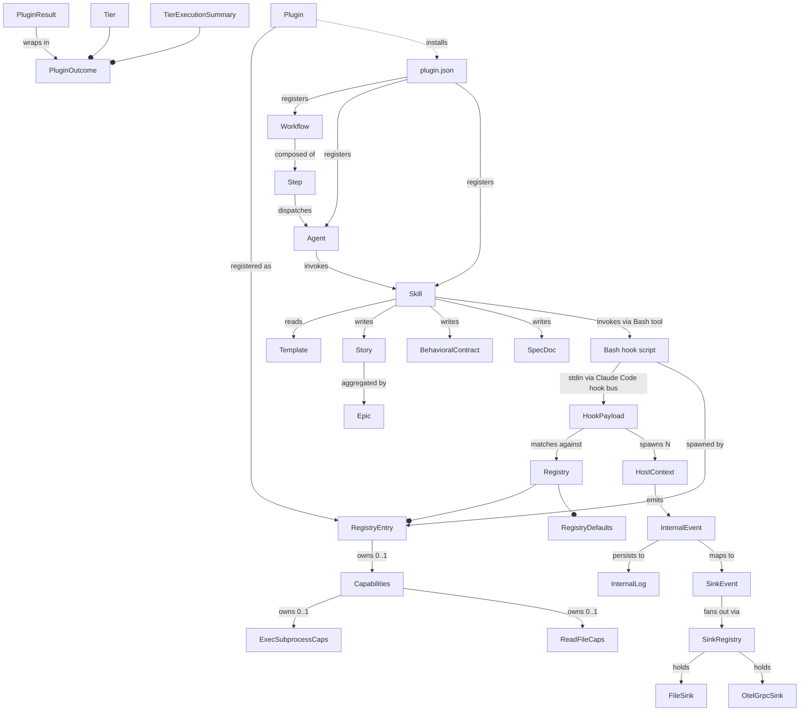
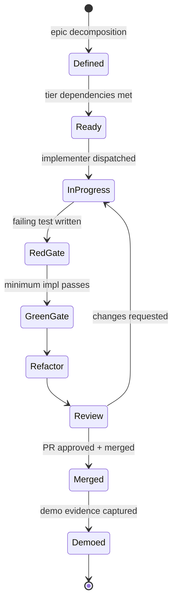

# Pass 2: Domain Model — vsdd-factory

**Date:** 2026-04-25
**Reads:** Pass 0 inventory + Pass 1 architecture + Rust source for Subsystem A entities; markdown frontmatter + workflow YAML + design doc for Subsystem B entities.
**Two-pass extraction:** 2a (structural) followed by 2b (behavioral).

The vsdd-factory domain has TWO entity halves that occasionally cross-reference each other but otherwise operate in separate ubiquitous-language clusters. **Half A** is the dispatcher's runtime entities (Hook, Plugin, Sink, Event). **Half B** is the orchestration framework's process entities (Workflow, Skill, Agent, Story, BehavioralContract). Both are first-class — neither is a subset of the other.

## 2a. Structural Extraction

### Half A — Dispatcher runtime entities (from Rust source)

#### Entity: HookPayload
- **File:** `crates/factory-dispatcher/src/payload.rs`, `crates/hook-sdk/src/payload.rs` (mirrored)
- **Fields:** `event_name: String` (with `#[serde(alias = "hook_event_name")]`), `tool_name: String` (default empty), `session_id: String` (required, non-empty), `tool_input: serde_json::Value`, `tool_response: Option<Value>`, plus dispatcher-injected `dispatcher_trace_id: String` and per-plugin-spliced `plugin_config: serde_json::Value`.
- **Invariants:** `event_name` must be non-empty (validated at parse). `session_id` must be non-empty. `dispatcher_trace_id` is a UUID v4 generated per invocation.
- **Lifecycle:** built once per stdin envelope, cloned per plugin (with per-plugin `plugin_config` spliced), serialized to wasm-bound JSON before invocation.

#### Entity: Registry (`hooks-registry.toml` parsed)
- **Aggregate root:** `Registry { schema_version: u32, defaults: RegistryDefaults, hooks: Vec<RegistryEntry> }`.
- **Invariants:** `schema_version == 1` (REGISTRY_SCHEMA_VERSION). Each `tool` regex must compile at load time. `serde(deny_unknown_fields)` for top-level + `RegistryEntry` + `Capabilities` + `RegistryDefaults`.
- **File:** `crates/factory-dispatcher/src/registry.rs`.

#### Entity: RegistryEntry (the "Hook" in the domain)
- **Fields:** `name: String`, `event: String` (e.g., "PostToolUse"), `tool: Option<String>` (regex), `plugin: PathBuf`, `priority: Option<u32>` (default 500), `enabled: bool` (default true), `timeout_ms: Option<u32>` (default 5000), `fuel_cap: Option<u64>` (default 10_000_000), `on_error: Option<OnError>`, `capabilities: Option<Capabilities>`, `config: toml::Value` (default empty table — passed through to plugin as `plugin_config`).
- **Identity:** `name` is the unique key within a registry.
- **Relationships:** owns 0–1 `Capabilities`; references one `.wasm` file via `plugin` path (resolved against the registry file's parent dir at load time).

#### Value object: OnError
- Enum: `Continue` (default) | `Block`. `serde(rename_all = "snake_case")`.

#### Value object: RegistryDefaults
- `timeout_ms: u32 = 5_000`, `fuel_cap: u64 = 10_000_000`, `on_error: OnError = Continue`, `priority: u32 = 500`.

#### Aggregate: Capabilities (deny-by-default)
- `exec_subprocess: Option<ExecSubprocessCaps>` — binary_allow, shell_bypass_acknowledged (Option<String>), cwd_allow, env_allow.
- `read_file: Option<ReadFileCaps>` — path_allow.
- `env_allow: Vec<String>` — env-var names plugin may read via `vsdd::env`.
- **Identity:** scoped to the parent `RegistryEntry`.

#### Entity: HookPayload-derived match (transient)
- Result of `match_plugins(registry, payload) -> Vec<&RegistryEntry>` filtered by: `enabled` AND `event == payload.event_name` AND (`tool` is None OR regex matches `payload.tool_name`).

#### Entity: Tier (transient ordering aggregate)
- Built by `group_by_priority(registry, matched) -> Vec<Vec<&RegistryEntry>>`. Stable sort on `(priority, original_index)`. Within tier: registry order preserved.

#### Entity: PluginResult
- Sum type:
  - `Ok { exit_code: i32, stdout: String, stderr: String, elapsed_ms: u64, fuel_consumed: u64 }`
  - `Timeout { cause: TimeoutCause::{Epoch | Fuel}, stderr: String, elapsed_ms, fuel_consumed }`
  - `Crashed { trap_string: String, stderr: String, elapsed_ms, fuel_consumed }`
- **Invariant:** stderr truncated to `STDERR_CAP_BYTES = 4096` with explicit `(stderr truncated)` marker.
- **File:** `crates/factory-dispatcher/src/invoke.rs`.

#### Entity: PluginOutcome
- `{ plugin_name: String, plugin_version: String, on_error: OnError, result: PluginResult }`.
- File: `crates/factory-dispatcher/src/executor.rs`.

#### Entity: TierExecutionSummary
- `{ per_plugin_results: Vec<PluginOutcome>, total_elapsed_ms: u64, block_intent: bool, exit_code: i32 }`.
- **Invariant:** `exit_code == 2` iff `block_intent == true`; else 0.

#### Entity: HookResult (plugin-emitted, SDK-defined)
- Sum type, serialized with `#[serde(tag = "outcome", rename_all = "snake_case")]`:
  - `Continue` → JSON `{"outcome":"continue"}` → exit 0
  - `Block { reason: String }` → `{"outcome":"block","reason":...}` → exit 2
  - `Error { message: String }` → `{"outcome":"error","message":...}` → exit 1
- File: `crates/hook-sdk/src/result.rs`.

#### Entity: HostContext (per-invocation)
- Carries: `plugin_name`, `plugin_version`, `plugin_root: PathBuf`, `session_id`, `dispatcher_trace_id`, `capabilities: Capabilities`, `cwd: PathBuf`, `env_view: HashMap<String, String>`, `events: Arc<Mutex<Vec<InternalEvent>>>`, `internal_log: Option<Arc<InternalLog>>`.
- File: `crates/factory-dispatcher/src/host/mod.rs`.

#### Entity: InternalEvent
- `{ type_: String, ts: String (ISO-8601 with offset), ts_epoch: i64, schema_version: u32 (= 1), dispatcher_trace_id: Option<String>, session_id: Option<String>, plugin_name: Option<String>, plugin_version: Option<String>, fields: Map<String, Value> (flattened) }`.
- **Type vocabulary (17 constants):** `dispatcher.started`, `dispatcher.shutting_down`, `plugin.loaded`, `plugin.load_failed`, `plugin.invoked`, `plugin.completed`, `plugin.timeout`, `plugin.crashed`, `internal.capability_denied`, `internal.host_function_panic`, `internal.sink_error`, `internal.sink_queue_full`, `internal.sink_circuit_opened`, `internal.sink_circuit_closed`, `internal.dispatcher_error`, plus `plugin.log` and arbitrary plugin-emitted `<event_type>` from `emit_event`.
- File: `crates/factory-dispatcher/src/internal_log.rs`.

#### Entity: InternalLog (writer)
- `log_dir: PathBuf`. Daily-rotated filename `dispatcher-internal-YYYY-MM-DD.jsonl` derived from event ts. Best-effort writes (never panic, never propagate). 30-day retention via `prune_old`.

#### Entity: SinkEvent (sink-side projection)
- Transparent wrapper around `Map<String, Value>`. Reserved fields: `type`, `ts`, `ts_epoch`, `schema_version`. Flat JSON serialization.
- File: `crates/sink-core/src/lib.rs`.

#### Entity: Sink (trait-bounded contract)
- Trait `Sink: Send + Sync`. Methods: `name`, `accepts(&SinkEvent) -> bool`, `submit(SinkEvent)` (must not block), `flush() -> anyhow::Result<()>`, `shutdown()`.

#### Entity: SinkConfigCommon
- `{ name: String, enabled: bool (default true), routing_filter: Option<RoutingFilter>, tags: BTreeMap<String, String> }`.

#### Value object: RoutingFilter
- `{ event_types_allow: Vec<String>, event_types_deny: Vec<String> }`. Allow-then-deny semantics: empty allow = pass-through; non-empty allow = whitelist; deny applied after.

#### Entity: FileSink (driver)
- `{ name, enabled, path_template, queue_depth (default 1000), routing_filter, tags }`. Path placeholders: `{date}`, `{name}`, `{project}`. Daily-rotation by date stamp. mpsc-bounded queue. Failures recorded in `Mutex<Vec<SinkFailure>>`.

#### Entity: SinkFailure
- `{ path: PathBuf, reason: String, ts: String }`. Drained by integration code (S-4.4 wires this into `internal.sink_error`).

#### Entity: OtelGrpcSink (driver)
- `{ endpoint (default `http://localhost:4317`), batch_size (default 100), batch_interval_ms, queue_depth (default 1000), tags, routing_filter }`. Owns a dedicated `std::thread` running a `current_thread` tokio runtime.

#### Entity: SinkRegistry
- Holds `Vec<Box<dyn Sink>>`. Built from `ObservabilityConfig::sinks` array-of-tables. `submit_all` fan-outs to each sink whose `accepts` returns true. Unknown driver types (e.g., `datadog`, `honeycomb`, `http` — not yet shipped) are warned to stderr and skipped.

#### Entity: Module/PluginCache (transient)
- `PluginCache::new(engine)` builds an in-process cache keyed by absolute plugin path. `get_or_compile` returns a cached `wasmtime::Module` or compiles + inserts. Per-invocation cache only (dispatcher process is short-lived).

#### Entity: Engine + EpochTicker
- `wasmtime::Engine` configured with `epoch_interruption(true)` + `consume_fuel(true)` + `wasm_reference_types(true)`. `EpochTicker` is a dedicated OS thread that bumps `engine.increment_epoch()` every `EPOCH_TICK_MS = 10`. Cooperative-stop drop semantics.

### Half B — Orchestration framework entities (from markdown + workflow YAML + design docs)

#### Entity: Plugin (Claude Code marketplace plugin)
- **Manifest:** `plugins/vsdd-factory/.claude-plugin/plugin.json` — `{ name, description, version, author, homepage, repository, license, keywords }`.
- **Identity:** `name: "vsdd-factory"`, version-stamped at `1.0.0-beta.4`.

#### Entity: Marketplace
- `.claude-plugin/marketplace.json` — owner + plugin entries. Repo can host its own marketplace.

#### Entity: Agent
- **Frontmatter:** `name: <id>`, `description:`, optional `tools: [Read, Grep, Glob, ...]`, `model: opus|sonnet`, `color: red|green|...`, `argument-hint:`.
- **34 identities:** orchestrator + accessibility-auditor, adversary, architect, business-analyst, code-reviewer, codebase-analyzer, consistency-validator, data-engineer, demo-recorder, devops-engineer, dtu-validator, dx-engineer, e2e-tester, formal-verifier, github-ops, holdout-evaluator, implementer, performance-engineer, pr-manager, pr-reviewer, product-owner, research-agent, security-reviewer, session-reviewer, spec-reviewer, spec-steward, state-manager, story-writer, technical-writer, test-writer, ux-designer, validate-extraction, visual-reviewer.
- **Special:** orchestrator is the only agent set as default by `/vsdd-factory:activate`.

#### Entity: Skill
- **Format:** directory under `skills/`, contains `SKILL.md` (frontmatter: `name`, `description`, optional `argument-hint`).
- **Composition:** many skills include `steps/` subdirectories with sub-step markdown, and reference templates under `${CLAUDE_PLUGIN_ROOT}/templates/`.
- **119 skills covering:** activate/deactivate, brownfield-ingest, create-architecture/brief/domain-spec/excalidraw/prd/story, decompose-stories, deliver-story, factory-{dashboard,health,obs}, holdout-eval, formal-verify, phase-{0..7,f1..f7}, release, scaffold-claude-md, sdk-generation, semport-analyze, state-burst, state-update, traceability-extension, validate-{brief,consistency,template-compliance,workflow}, wave-{gate,scheduling,status}, worktree-manage, etc.

#### Entity: Workflow (Lobster YAML)
- **Format:** `.lobster` files under `workflows/` (8 top-level modes) and `workflows/phases/` (8 phase sub-flows).
- **Schema:** `workflow: { name, description, version, defaults: { on_failure, max_retries, timeout }, cost_tracking?, steps: [ ... ] }`.
- **Step shape:** `{ name, type, agent, depends_on?, on_failure?, max_retries?, timeout? }`.
- **Helper:** `bin/lobster-parse <file> '<jq-expr>'` (workflows are YAML interrogated via jq).

#### Entity: Template
- 108+ files under `templates/`. Most are markdown skeletons; some are YAML configs (`*-config-template.yaml`, `*-config.yaml`); a few are scripts/specs (`demo-playwright-template.spec.ts`, `verify-sha-currency.sh`, `demo-tape-template.tape`).

#### Entity: Story
- `.factory/stories/v1.0/S-N.M-<slug>.md`. Frontmatter-less; section-driven (Goal, Acceptance criteria, Tasks, Definition of done, etc.).
- **Identity:** `S-<phase>.<seq>` (e.g., S-1.2, S-3.1).
- **Tier mapping:** S-0.x = Tier A (infrastructure prep), S-1.x = Tier B (dispatcher foundation), S-2.x = Tier C (legacy adapter + release prep), S-2.8 = Tier D (beta.1 gate), S-3.x = Tier E (native ports), S-4.x = Tier E (sinks), S-4.8 = Tier F (rc.1 gate), S-5.x = Tier G (new events + docs), S-5.7 = Tier H (1.0 gate).

#### Entity: Epic
- `.factory/stories/v1.0/EPIC.md`. Aggregates the 41 stories with explicit dependency tiers.

#### Entity: BehavioralContract (BC)
- Format defined by `templates/behavioral-contract-template.md`. Identity: `BC-S.SS.NNN` (4-level hierarchy per DF-035) or `BC-AUDIT-NNN` for recovered/draft BCs.
- Not yet fully populated for vsdd-factory itself; populating them is the *purpose* of this Phase 0 ingestion.

#### Entity: SpecDoc
- `.factory/specs/<date>-<slug>-design.md`. Strongly date-stamped. The 2026-04-24 v1.0 doc is the design master.

#### Entity: Plan
- `.factory/plans/<date>-<slug>.md`. Less rigorous than specs; smaller artifacts.

#### Entity: WorkflowState (`.factory/STATE.md`)
- Small (664 bytes). Holds current phase, wave, mode, blockers.

#### Entity: Hook (bash script — Subsystem B view)
- 44 top-level `*.sh` scripts. Each script reads stdin JSON via `jq`, performs gate or capture, exits 0/2.
- Categories:
  - **Gates (PreToolUse):** block-ai-attribution, brownfield-discipline, destructive-command-guard, factory-branch-guard, protect-bc, protect-vp, protect-secrets, red-gate.
  - **Capture (PostToolUse):** capture-commit-activity, capture-pr-activity, check-factory-commit.
  - **Validators (PostToolUse on Edit|Write or all tools):** convergence-tracker, purity-check, regression-gate, validate-* family (24 validators).
  - **Lifecycle (SubagentStop / Stop):** track-agent-{start,stop}, handoff-validator, pr-manager-completion-guard, update-wave-state-on-merge, validate-pr-review-posted, session-learning, warn-pending-wave-gate.
  - **Other:** verify-git-push, verify-sha-currency.

#### Entity: Event (logical — emitted via `bin/emit-event` from bash hooks; or via `emit_event` host fn from WASM plugins)
- **Examples:** `commit.made`, `pr.merged`, `hook.block`, `tool.error`, `session.started`, `session.ended`, `worktree.removed`, `internal.*`, `dispatcher.*`, `plugin.*`.
- **Persistence:** internal-log JSONL + sink fan-out (file + otel-grpc).

### Relationships (cross-half)



### Bounded contexts

| Context | Scope | Ubiquitous language |
|---|---|---|
| **Dispatch** | factory-dispatcher binary + crates/ | Hook = registry entry; Plugin = WASM module; Event = InternalEvent/SinkEvent; Result = PluginResult/HookResult; Trace = dispatcher_trace_id |
| **Plugin authoring** | hook-sdk + hook-plugins/ | Hook = `#[hook]` function; Payload = HookPayload; Result = HookResult; Host fn = capability-gated import |
| **Sink pipeline** | sink-core + sink-file + sink-otel-grpc | Sink = driver; Event = SinkEvent; Filter = RoutingFilter; Failure = SinkFailure |
| **Orchestration** | agents/ + skills/ + workflows/ + templates/ | Agent = persona; Skill = procedure; Step = workflow node; Mode = top-level workflow file |
| **Process / governance** | .factory/ | Story = decomposed unit of work; BC = behavioral contract; Spec = design doc; Plan = lightweight plan; State = STATE.md; Wave = grouped delivery batch |

## 2b. Behavioral Extraction

### Operations

#### Subsystem A — dispatcher operations

| Operation | Module | Inputs | Outputs | Side effects |
|---|---|---|---|---|
| Parse stdin envelope | payload::HookPayload::from_reader | stdin bytes | HookPayload OR PayloadError | none |
| Load registry | registry::Registry::load | path | Registry OR RegistryError | reads file; resolves relative plugin paths |
| Match plugins | routing::match_plugins | Registry, HookPayload | Vec<&RegistryEntry> | none (pure) |
| Group by priority | routing::group_by_priority | Registry, matched | Vec<Vec<&RegistryEntry>> (tiers) | none (pure) |
| Build engine | engine::build_engine | () | wasmtime::Engine | enables epoch + fuel |
| Start epoch ticker | engine::EpochTicker::start | Engine | EpochTicker | spawns OS thread bumping epoch every 10ms |
| Compile/cache plugin | plugin_loader::PluginCache::get_or_compile | path | Module OR PluginLoadError | compiles WASM (~ms cost) |
| Execute tiers | executor::execute_tiers | ExecutorInputs, Vec<Vec<&RegistryEntry>> | TierExecutionSummary | spawns tokio tasks; emits lifecycle events |
| Invoke plugin | invoke::invoke_plugin | Engine, Module, HostContext, payload, limits | PluginResult OR InvokeError | runs WASM; reads stdin; captures stdout/stderr; classifies trap |
| Emit lifecycle event | executor::emit_invoked / emit_lifecycle | InternalLog, ctx, entry, result | () | appends JSONL line; never panics |
| Fan out event | sinks::SinkRegistry::submit_all | SinkEvent | () | per-sink try_send; non-blocking |

#### Subsystem A — host function operations (callable from plugins)

| Host fn | Capability | Inputs | Outputs | Failure mode |
|---|---|---|---|---|
| `vsdd::log` | always | level (u32), msg ptr+len | () | swallowed |
| `vsdd::emit_event` | always | type ptr+len, fields ptr+len (length-prefixed pairs) | () | reserved fields filtered out |
| `vsdd::session_id` | always | out ptr+cap | u32 (bytes written) | 0 if no fit |
| `vsdd::dispatcher_trace_id` | always | out ptr+cap | u32 | 0 if no fit |
| `vsdd::plugin_root` | always | out ptr+cap | u32 | 0 if no fit |
| `vsdd::plugin_version` | always | out ptr+cap | u32 | 0 if no fit |
| `vsdd::cwd` | always | out ptr+cap | u32 | 0 if no fit |
| `vsdd::env` | env_allow | name ptr+len, out ptr+cap | i32 (bytes written) OR codes::CAPABILITY_DENIED (-1) OR codes::INVALID_ARGUMENT (-4) | denial event emitted |
| `vsdd::read_file` | read_file (path_allow) | (StoreData-typed linker stub returns CAPABILITY_DENIED in invoke.rs; full impl in host/read_file.rs) | i32 | denial event |
| `vsdd::exec_subprocess` | exec_subprocess (binary_allow + shell_bypass + cwd_allow + env_allow + setuid refusal) | cmd, args, stdin, timeout_ms, max_output_bytes, result_buf | i32 (bytes written) OR negative error code | denial / TIMEOUT (-2) / OUTPUT_TOO_LARGE (-3) / INVALID_ARGUMENT (-4) / INTERNAL_ERROR (-99) |

#### Subsystem B — orchestration operations (skill-level)

Each skill's `SKILL.md` declares its procedure; many cite a Quality Gate section with explicit acceptance criteria. Sample of high-traffic skills:

| Skill | Procedure summary |
|---|---|
| `activate` | Detect platform → write `hooks.json.<platform>` → verify dispatcher binary → persist `activated_platform` in `.claude/settings.local.json` → set orchestrator as default agent |
| `brownfield-ingest` | Phase A 7-pass broad sweep → Phase B convergence deepening (strict-binary novelty) → Phase B.5 coverage audit → Phase B.6 extraction validation → Phase C final synthesis |
| `create-prd` | Iterate from idea-brief → PRD master + 4 supplements (NFR catalog, error taxonomy, interface defs, test vectors) |
| `create-story` | Decompose epic/PRD into stories using 4-level BC hierarchy; emit per-story BC-S.SS.NNN identifiers |
| `deliver-story` | Per-story TDD: red gate → green gate → refactor → review → demo → merge |
| `wave-gate` | Validate wave-gate completeness, write checklist, gate next wave |
| `release` | Bump version → release workflow → CI builds → bot commits binaries + plugin.json/marketplace.json |

### Business rules (cross-cutting invariants)

| Rule | Source | Enforcement |
|---|---|---|
| **Parallel within tier, sequential between tiers** | design doc Q3, executor.rs | tokio spawn_blocking per plugin in tier; tier `await` joins before next tier; emits lifecycle in fan-out order |
| **Plugin failure does not block other plugins** | design doc, executor.rs | each plugin runs in its own wasmtime Store; tokio panic isolation |
| **`on_error = "block"` records intent but does not abort tier** | design doc Q3 resolution, executor.rs:plugin_requests_block | `block_intent = true` is recorded; remaining plugins still fire; final exit_code = 2 |
| **Capability denial returns negative code AND emits denial event** | design doc, host/exec_subprocess.rs:emit_denial | every cap-gated host fn does both |
| **shell_bypass_acknowledged required for shell interpreters** | design doc Q4, exec_subprocess.rs:is_shell + SHELL_NAMES | bash, sh, zsh, pwsh, fish, csh, tcsh, ksh refused without ack |
| **Setuid/setgid binaries refused categorically (Unix)** | design doc Q4, exec_subprocess.rs:refuse_setuid | hard refusal regardless of allow-list |
| **Always-on dispatcher self-telemetry** | design doc Q6 Option B, internal_log.rs | `dispatcher-internal-YYYY-MM-DD.jsonl` written regardless of sink config |
| **Daily rotation by event ts, not "now"** | internal_log.rs:date_stamp | filename derived from `event.ts[..10]` so test-injected timestamps work |
| **30-day retention default** | internal_log.rs:DEFAULT_RETENTION_DAYS = 30 | `prune_old(30)` called at dispatcher start |
| **stderr truncated to 4 KiB with explicit marker** | invoke.rs:STDERR_CAP_BYTES = 4096 | `…(stderr truncated)` appended on overflow |
| **Sink submit must not block** | sink-core::Sink trait doc | every driver uses bounded mpsc + try_send |
| **Sink failure isolated to that sink** | design doc, sinks/mod.rs | other sinks unaffected; failure recorded in driver's Mutex<Vec<SinkFailure>>; pending S-4.4 wires `internal.sink_error` |
| **Schema-version mismatch is a hard error** | registry.rs:validate, sinks::from_config | refuse to load anything other than 1 |
| **Unknown sink driver is warned + skipped** | sinks::from_config | not a hard error; allows forward-declaration of pending S-4.x drivers |
| **Activation required after install** | CHANGELOG migration notes, activate skill | binary path + hooks.json depend on platform; activation skill is the only writer |
| **Per-plugin `plugin_config` spliced per invocation** | executor.rs | even with same .wasm file, each registry entry sees only its own config (multi-instance legacy-bash-adapter pattern) |
| **dispatcher_trace_id propagation** | main.rs (inject) + internal_log + emit_event | every event carries it; full causal chain reconstructible |
| **Plugin-config strip on bash bridge** | legacy-bash-adapter | `plugin_config` set to Null before re-serializing payload to bash (bash hooks predate the field) |

### State machines

#### Plugin invocation outcome
```mermaid
stateDiagram-v2
    [*] --> Loading
    Loading --> Compiling: cache miss
    Loading --> Instantiating: cache hit
    Compiling --> Instantiating
    Compiling --> Crashed: PluginLoadError
    Instantiating --> Running: linker + WASI ready
    Instantiating --> Crashed: linker / WASI build fails
    Running --> OkExit0: _start returns Ok(())
    Running --> OkExitN: I32Exit(n)
    Running --> TimeoutEpoch: Trap::Interrupt
    Running --> TimeoutFuel: Trap::OutOfFuel
    Running --> Crashed: other Trap
    OkExit0 --> [*]
    OkExitN --> [*]
    TimeoutEpoch --> [*]
    TimeoutFuel --> [*]
    Crashed --> [*]
```

#### Build → release → activate → dispatch flow (cross-subsystem lifecycle)

```mermaid
stateDiagram-v2
    [*] --> Develop
    Develop --> CI_Test: PR opened
    CI_Test --> CI_Test: green tests
    CI_Test --> Tag: bump-version + chore commit (CHANGELOG)
    Tag --> ReleaseBuild: tag pushed
    ReleaseBuild --> BinaryBundle: 5-platform CI matrix produces binaries
    BinaryBundle --> BotCommit: bot commits binaries + atomic plugin.json/marketplace.json bump
    BotCommit --> Marketplace: tagged release available
    Marketplace --> Install: /plugin install
    Install --> Activate: /vsdd-factory:activate
    Activate --> Dispatch: hooks.json.<platform> in place; binary verified
    Dispatch --> Dispatch: per Claude Code hook event
    Dispatch --> [*]: deactivation or session end
```


#### Story lifecycle (Subsystem B)


### Domain events (catalog — derived from internal_log.rs constants + bash hooks + design doc)

| Event | Producer | Field semantics |
|---|---|---|
| `dispatcher.started` | dispatcher main | dispatcher_version, host_abi_version, platform, pid, registry_path, loaded_plugin_count |
| `dispatcher.shutting_down` | dispatcher (declared, not yet emitted in main) | reserved |
| `plugin.loaded` | plugin_loader (declared) | wasm_path, plugin_name |
| `plugin.load_failed` | plugin_loader (declared) | wasm_path, error |
| `plugin.invoked` | executor::emit_invoked | event, plugin_name, plugin_version |
| `plugin.completed` | executor::emit_lifecycle | exit_code, elapsed_ms, fuel_consumed, stderr (if non-empty) |
| `plugin.timeout` | executor::emit_lifecycle | cause (epoch/fuel), elapsed_ms, fuel_consumed, stderr |
| `plugin.crashed` | executor::emit_lifecycle | trap, elapsed_ms, fuel_consumed, stderr |
| `plugin.log` | host::log + invoke.rs::log shim | level (trace/debug/info/warn/error), message |
| `internal.capability_denied` | host::* on cap denial | function, reason, command/variable/path (per cap) |
| `internal.host_function_panic` | host (declared) | function, message |
| `internal.sink_error` | sinks (S-4.4 pending) | sink_name, reason |
| `internal.sink_queue_full` | sinks (S-4.4 pending) | sink_name, dropped_event_type |
| `internal.sink_circuit_opened` | sinks (S-4.4 pending) | sink_name, failure_count |
| `internal.sink_circuit_closed` | sinks (S-4.4 pending) | sink_name, recovery_ts |
| `internal.dispatcher_error` | dispatcher main `emit_dispatcher_error` | message |
| `commit.made` | bash hook capture-commit-activity (PostToolUse:Bash) | commit_sha, branch, message |
| `pr.merged` | bash hook capture-pr-activity | pr_number, repo |
| `hook.block` | bash hooks block-* / protect-* | hook, matcher, reason, command |
| `tool.error` | (declared in design Phase 5; not yet wired) | tool, exit_code, error |
| `session.started` | (declared Phase 5) | session_id, agent, dep checks |
| `session.ended` | (declared Phase 5) | duration, cost |
| `worktree.removed` | (declared Phase 5) | path |

## 3. Ubiquitous language glossary

| Term | Definition |
|---|---|
| **Dispatcher** | The compiled Rust binary `factory-dispatcher` that Claude Code invokes per hook event |
| **Plugin** (Half A) | A WASM module loaded by the dispatcher; subject of a registry entry |
| **Hook** (Half A) | Synonymous with "registry entry" — the routing record |
| **Hook** (Half B) | A bash script in `plugins/vsdd-factory/hooks/*.sh` |
| **Sink** | A configured observability driver instance (file, otel-grpc, future http/datadog/honeycomb) |
| **Tier** | A priority cohort of registry entries that run in parallel |
| **HOST_ABI_VERSION** | The frozen 1 contract between dispatcher and SDK |
| **dispatcher_trace_id** | UUID v4 per dispatch invocation; correlates every emitted event |
| **block_intent** | Aggregated "any plugin asked to block under on_error=block" → exit code 2 |
| **legacy-bash-adapter** | The migration-window WASM plugin that shells out to existing bash hooks |
| **shell_bypass_acknowledged** | Required justification string when allowing shell interpreters in exec_subprocess |
| **Activate** | Per-project opt-in; writes platform-specific hooks.json + flips orchestrator default |
| **Orchestrator** | Main-thread agent set as default after activation; reads workflows; never produces artifacts |
| **Skill** | Named procedure under `skills/<name>/SKILL.md`; invokable as `/vsdd-factory:<name>` |
| **Agent** | Sub-persona under `agents/<name>.md`; spawned via Agent tool |
| **Workflow** | A `.lobster` YAML file with steps; orchestrator reads it as data |
| **Story** | A decomposed unit of work, identified `S-<phase>.<seq>` |
| **Wave** | A grouped delivery batch of stories |
| **BC** | Behavioral Contract; identified `BC-<S>.<SS>.<NNN>` (4-level) or `BC-AUDIT-<NNN>` for recovered |
| **Tier (story)** | Dependency batch in the epic (A through H for v1.0) |
| **Brownfield ingest** | Phase 0 ingestion procedure for existing codebases — what this analysis is |
| **Semport** | "Semantic port" — translation procedure for porting code between languages |
| **VSDD** | Verified Spec-Driven Development — the methodology this product implements |
| **Wave gate** | Quality gate at end of each wave; validates story completeness |
| **Convergence** | Iterative deepening until novelty becomes NITPICK |
| **Strict-binary novelty** | Findings are SUBSTANTIVE or NITPICK; nothing in between |

## 4. State Checkpoint
```yaml
pass: 2
status: complete
files_scanned: ~30 Rust source files (deep) + 10 plugin-layer manifests/skills/agents/workflows + design doc cross-ref
entities_extracted_half_a: 22 (Rust runtime: HookPayload, Registry, RegistryEntry, OnError, Capabilities, Tier, PluginResult, PluginOutcome, TierExecutionSummary, HookResult, HostContext, InternalEvent, InternalLog, SinkEvent, Sink (trait), SinkConfigCommon, RoutingFilter, FileSink, SinkFailure, OtelGrpcSink, SinkRegistry, Engine+EpochTicker)
entities_extracted_half_b: 13 (Plugin manifest, Marketplace, Agent, Skill, Workflow, Template, Story, Epic, BC, SpecDoc, Plan, WorkflowState, HookScript)
business_rules_documented: 17 cross-cutting invariants
domain_events_cataloged: 22 event types
state_machines_drawn: 3 (plugin invocation; build→release→activate→dispatch; story lifecycle)
timestamp: 2026-04-25
next_pass: 3
```

## Novelty Assessment

| Field | Value |
|-------|-------|
| **Pass** | 2 |
| **Novelty score** | SUBSTANTIVE — first domain model extraction for this repo |
| **Trajectory** | First sweep. 35 entities (22 Half A + 13 Half B) catalogued from scratch. 17 business rules and 22 domain events derived. State machines for invocation, lifecycle, and story flow newly drawn. No prior pass-2 artifact existed. |
| **Verdict** | FINDINGS_REMAIN — Half B entities (BC, Story, Epic) are sparse on field-level invariants; deepening rounds will sharpen ubiquitous language. CONVERGENCE_REACHED is not declarable until Phase B convergence loops complete. |
