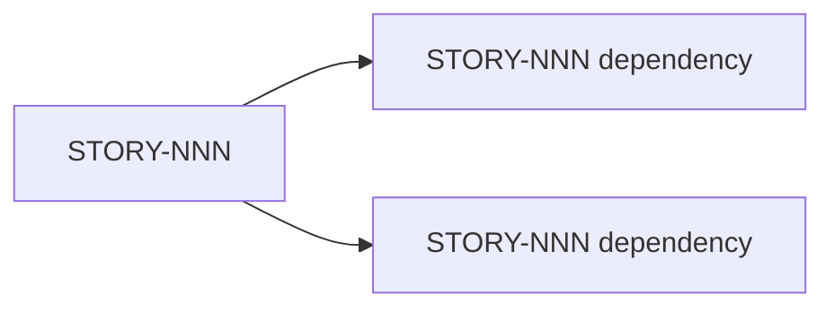

# Create Pull Request

Generate a structured PR for a completed story.

## Templates

Read and follow the output format in:
- `${CLAUDE_PLUGIN_ROOT}/templates/pr-description-template.md` — PR body structure with mermaid diagrams and traceability

## Input

`$ARGUMENTS` — story ID (e.g., `STORY-001`)

## Process

### 1. Gather Context

- Read `.factory/stories/STORY-NNN.md` for story details
- Read the story's behavioral contracts
- Get the diff: `git diff develop...HEAD` (in the story worktree)
- Count tests added/modified

### 2. Generate PR Body

```markdown
## Summary

**Story:** STORY-NNN — <title>
**Epic:** <epic name>
**Wave:** <wave number>

<1-3 sentence description of what this PR delivers>

## Behavioral Contracts

| Contract | Status |
|----------|--------|
| BC-S.SS.NNN: <title> | ✅ Implemented + tested |

## Changes

<File-level summary of what changed and why>

## Dependency Diagram



## Test Plan

- [ ] All unit tests pass (`cargo test`)
- [ ] Clippy clean (`cargo clippy -- -D warnings`)
- [ ] Format clean (`cargo +nightly fmt --all --check`)
- [ ] BC traceability verified (each BC has a test)
- [ ] No `todo!()` in production code

## TDD Evidence

<N> micro-commits showing test-first progression:
1. `test: add failing tests for <BC>`
2. `feat: implement <behavior>`
3. ...
```

### 3. Create PR

```bash
gh pr create \
  --title "feat(STORY-NNN): <story title>" \
  --body "<generated body>" \
  --base develop
```

### 4. Report

Tell the user the PR URL and next steps (review, holdout evaluation if wave complete).
