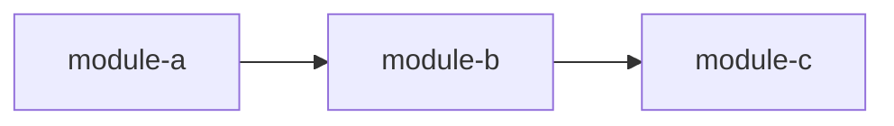

# Module Criticality Classification: [Product Name]

## Tier Definitions

| Tier | Mutation Kill Rate Target | Description | Examples |
|------|--------------------------|-------------|----------|
| **CRITICAL** | >= 95% | Core business logic, security boundaries, data integrity | Authentication, payment processing, state machines |
| **HIGH** | >= 90% | Important functionality with significant user impact | API handlers, validation, data transformation |
| **MEDIUM** | >= 80% | Supporting functionality, utilities | Logging, formatting, configuration parsing |
| **LOW** | >= 70% | Infrastructure, glue code, generated code | Build scripts, boilerplate, wrappers |

## Module Inventory (Recommended)

<!-- v1.1: Added for quick reference. One-line per module. -->

- **[module-name]** — [one-line description of what this module does]

## Module Classification

| Module | Path | Tier | Rationale | Kill Rate Target | VP Count |
|--------|------|------|-----------|-----------------|----------|
| [module name] | [file/module path] | CRITICAL | [why this tier] | >= 95% | [n] |
| [module name] | [file/module path] | HIGH | [why this tier] | >= 90% | [n] |
| [module name] | [file/module path] | MEDIUM | [why this tier] | >= 80% | [n] |
| [module name] | [file/module path] | LOW | [why this tier] | >= 70% | [n] |

## Per-Module Risk Assessment (Recommended)

<!-- v1.1: Added for richer criticality analysis beyond tier assignment. -->

| Module | Tier | Blast Radius | Security Sensitivity | Implementation Complexity | Test Priority |
|--------|------|-------------|---------------------|--------------------------|--------------|
| [module name] | CRITICAL | [high/medium/low] | [high/medium/low/none] | [high/medium/low] | [P0/P1/P2] |

## Classification Summary

| Tier | Module Count | Percentage |
|------|-------------|------------|
| CRITICAL | [n] | [pct]% |
| HIGH | [n] | [pct]% |
| MEDIUM | [n] | [pct]% |
| LOW | [n] | [pct]% |
| **Total** | **[n]** | **100%** |

## Dependency Graph — Build Order (Recommended)

<!-- v1.1: Added for implementation planning. Mermaid or text format. -->

## Implementation Priority Order (Recommended)

<!-- v1.1: Numbered list of modules in recommended build order. -->

1. [module-name] — [why this should be built first]
2. [module-name] — [depends on #1]

## Cross-Cutting Concerns by Tier (Recommended)

<!-- v1.1: Maps shared concerns to tiers for consistent implementation. -->

| Concern | CRITICAL modules | HIGH modules | MEDIUM/LOW modules |
|---------|-----------------|-------------|-------------------|
| Error handling | [approach] | [approach] | [approach] |
| Logging | [approach] | [approach] | [approach] |
| Authentication | [approach] | [approach] | [approach] |

## Anti-Patterns to Explicitly Not Port (Conditional — brownfield only)

<!-- v1.1: Guardrails for brownfield projects migrating from existing codebases. -->

- [Anti-pattern from source codebase] — [why it shouldn't be carried forward]
