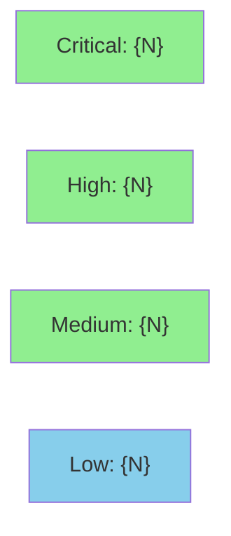

# [{story_id}] {story_title}

**Epic:** {epic_id} — {epic_title}
**Mode:** {greenfield | brownfield | feature | maintenance}
**Convergence:** {CONVERGED | OVERRIDDEN} after {N} adversarial passes


{one-paragraph description of what this PR delivers}

---

## Architecture Changes

```mermaid
graph TD
    {existing_component_A}["{component_A}"] -->|calls| {existing_component_B}["{component_B}"]
    {new_component}["{new_component_name}"] -.->|new dependency| {existing_component_B}
    style {new_component} fill:#90EE90
```

<details>
<summary><strong>Architecture Decision Record</strong></summary>

### ADR: {decision_title}

**Context:** {why this decision was needed}

**Decision:** {what was decided}

**Rationale:** {why this option was chosen}

**Alternatives Considered:**
1. {alternative_1} — rejected because: {reason}
2. {alternative_2} — rejected because: {reason}

**Consequences:**
- {positive_consequence}
- {trade_off_or_risk}

</details>

---

## Story Dependencies

```mermaid
graph LR
    {dep_story_1}[{DEP-STORY-1}<br/>{dep_1_status_icon} {dep_1_status}] --> {this_story}[{THIS-STORY}<br/>{this_status_icon} this PR]
    {dep_story_2}[{DEP-STORY-2}<br/>{dep_2_status_icon} {dep_2_status}] --> {this_story}
    {this_story} --> {blocked_story_1}[{BLOCKED-STORY-1}<br/>{blocked_1_status_icon} {blocked_1_status}]
    style {this_story} fill:#FFD700
```

---

## Spec Traceability

```mermaid
flowchart LR
    BC[{bc_id}<br/>{bc_title}] --> AC1[{ac_id_1}<br/>{ac_title_1}]
    BC --> AC2[{ac_id_2}<br/>{ac_title_2}]
    AC1 --> T1[{test_name_1}]
    AC2 --> T2[{test_name_2}]
    T1 --> S1[{src_file_1}]
    T2 --> S1
```

---

## Test Evidence

### Coverage Summary

| Metric | Value | Threshold | Status |
|--------|-------|-----------|--------|
| Unit tests | {unit_count}/{unit_total} pass | 100% | {unit_status} |
| Coverage | {coverage_pct}% | >80% | {coverage_status} |
| Mutation kill rate | {kill_rate}% | >90% | {mutation_status} |
| Holdout satisfaction | {satisfaction} | >0.85 | {holdout_status} |

### Test Flow

```mermaid
graph LR
    Unit["{unit_count} Unit Tests"]
    Integration["{integration_count} Integration"]
    E2E["{e2e_count} E2E"]
    Holdout["{holdout_count} Holdout"]
    Formal["Formal Verification"]

    Unit -->|{unit_pct}% coverage| Pass1["PASS"]
    Integration -->|{integration_pct}%| Pass2["PASS"]
    E2E --> Pass3["PASS"]
    Holdout -->|{satisfaction} satisfaction| Pass4["PASS"]
    Formal -->|{proof_count} proofs| Pass5["PASS"]

    style Pass1 fill:#90EE90
    style Pass2 fill:#90EE90
    style Pass3 fill:#90EE90
    style Pass4 fill:#90EE90
    style Pass5 fill:#90EE90
```

| Metric | Value |
|--------|-------|
| **New tests** | {N} added, {N} modified |
| **Total suite** | {N} tests PASS in {N}s |
| **Coverage delta** | {old_pct}% -> {new_pct}% ({delta}) |
| **Mutation kill rate** | {kill_rate}% |
| **Regressions** | {0 / list} |

<details>
<summary><strong>Detailed Test Results</strong></summary>

### New Tests (This PR)

| Test | Result | Duration |
|------|--------|----------|
| `{test_name_1()}` | PASS | {N}s |
| `{test_name_2()}` | PASS | {N}s |

### Coverage Analysis

| Metric | Value |
|--------|-------|
| Lines added | {N} |
| Lines covered | {N} ({X}%) |
| Branches added | {N} |
| Branches covered | {N} ({X}%) |
| Uncovered paths | {list or "none"} |

### Mutation Testing

| Module | Mutants | Killed | Survived | Kill Rate |
|--------|---------|--------|----------|-----------|
| {module_1} | {N} | {N} | {N} | {X}% |
| {module_2} | {N} | {N} | {N} | {X}% |

</details>

---

## Holdout Evaluation

| Metric | Value | Threshold |
|--------|-------|-----------|
| Mean satisfaction | **{0.XX}** | >= 0.85 |
| Std deviation | {0.XX} | < 0.15 |
| Must-pass minimum | {0.XX} | >= 0.6 |
| Scenarios evaluated | {N} | >= 5 |
| **Result** | **{PASS / FAIL}** | |

<details>
<summary><strong>Per-Scenario Satisfaction Scores</strong></summary>

| Scenario | Category | Priority | Satisfaction | Confidence |
|----------|----------|----------|-------------|------------|
| HS-001 | happy-path | must-pass | {0.XX} | {0.XX} |
| HS-002 | edge-case | should-pass | {0.XX} | {0.XX} |
| HS-003 | error-handling | must-pass | {0.XX} | {0.XX} |

</details>

---

## Adversarial Review

| Pass | Model | Findings | Critical | High | Status |
|------|-------|----------|----------|------|--------|
| 1 | GPT-5.4 | {N} | {N} | {N} | Fixed |
| 2 | GPT-5.4 | {N} | {N} | {N} | Fixed |
| 3 | Gemini 3.1 Pro | {N} | {N} | {N} | {Fixed / Cosmetic only} |

**Convergence:** Adversary forced to hallucinate after pass {N}

<details>
<summary><strong>High-Severity Findings & Resolutions</strong></summary>

### Finding 1: {title}
- **Location:** `{file:line}`
- **Category:** {spec-fidelity | test-quality | code-quality | security}
- **CWE:** {CWE-XXX if security}
- **Problem:** {description}
- **Resolution:** {what was changed}
- **Test added:** `{test_name()}`

### Finding 2: {title}
...

</details>

---

## Security Review



<details>
<summary><strong>Security Scan Details</strong></summary>

### SAST (Semgrep)
- Critical: {N} | High: {N} | Medium: {N} | Low: {N}
- {summary of any findings and their resolutions}

### Dependency Audit
- `cargo audit` / `npm audit`: {CLEAN / N advisories}
- {details of any dependency advisories}

### Formal Verification

| Property | Method | Status |
|----------|--------|--------|
| {invariant_1} | Kani | VERIFIED |
| {invariant_2} | proptest (10K cases) | VERIFIED |
| {property_1} | cargo-fuzz (5 min) | CLEAN |

</details>

---

## Risk Assessment & Deployment

### Blast Radius
- **Systems affected:** {list}
- **User impact:** {description if failure occurs}
- **Data impact:** {description}
- **Risk Level:** {LOW / MEDIUM / HIGH}

### Performance Impact
| Metric | Before | After | Delta | Status |
|--------|--------|-------|-------|--------|
| Latency p99 | {N}ms | {N}ms | {delta} | {OK / WARNING} |
| Memory | {N}MB | {N}MB | {delta} | {OK / WARNING} |
| Throughput | {N} ops/s | {N} ops/s | {delta} | {OK / WARNING} |

<details>
<summary><strong>Rollback Instructions</strong></summary>

**Immediate rollback (< {N} min):**
```bash
git revert {COMMIT_SHA}
git push origin develop
```

**If feature-flagged:**
```bash
# Disable feature flag
{command to disable flag}
# Monitor: expect ~{N} minute recovery
```

**Verification after rollback:**
- {check_1}
- {check_2}

</details>

### Feature Flags
| Flag | Controls | Default |
|------|----------|---------|
| {flag_name} | {description} | {off} |

---

## Traceability

| Requirement | Story AC | Test | Verification | Status |
|-------------|---------|------|-------------|--------|
| {FR-001} | {AC-001} | `{test_name()}` | {KANI / proptest / N/A} | PASS |
| {FR-002} | {AC-002} | `{test_name()}` | {KANI / proptest / N/A} | PASS |

<details>
<summary><strong>Full VSDD Contract Chain</strong></summary>

```
{FR-001} -> {VP-001} -> {TALLY-abc123} -> {test_name()} -> {src/file.rs:42} -> ADV-PASS-3-OK -> KANI-PASS
{FR-002} -> {VP-002} -> {TALLY-def456} -> {test_name()} -> {src/file.rs:55} -> ADV-PASS-2-FIXED -> KANI-PASS
```

</details>

---

## AI Pipeline Metadata

<details>
<summary><strong>Pipeline Details</strong></summary>

```yaml
ai-generated: true
pipeline-mode: {greenfield | brownfield | feature | maintenance}
factory-version: "1.0.0"
pipeline-stages:
  spec-crystallization: completed
  story-decomposition: completed
  tdd-implementation: completed
  holdout-evaluation: completed
  adversarial-review: completed
  formal-verification: {completed | skipped}
  convergence: achieved
convergence-metrics:
  spec-novelty: {0.XX}
  test-kill-rate: {XX}%
  implementation-ci: {0.XX}
  holdout-satisfaction: {0.XX}
  holdout-std-dev: {0.XX}
adversarial-passes: {N}
total-pipeline-cost: ${amount}
models-used:
  builder: claude-sonnet-4-6
  adversary: gpt-5.4
  evaluator: gpt-5.4
  review: gemini-3.1-pro
generated-at: "{ISO-8601 timestamp}"
```

</details>

---

## Pre-Merge Checklist

- [ ] All CI status checks passing
- [ ] Coverage delta is positive or neutral
- [ ] No critical/high security findings unresolved
- [ ] Rollback procedure validated
- [ ] {Feature flag configured (if applicable)}
- [ ] {Human review completed (if autonomy level requires)}
- [ ] {Monitoring alerts configured (if production-impacting)}
