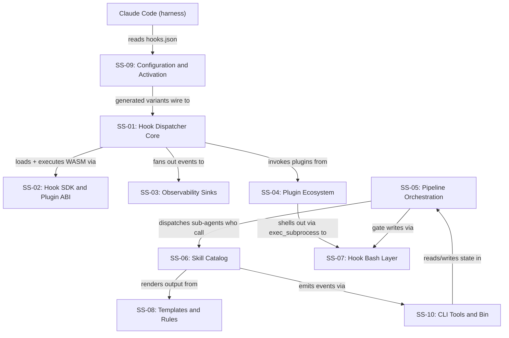

# Architecture Index: vsdd-factory

> **Context Engineering:** This is a lightweight index (~350 tokens). Agents load
> ONLY the section files they need. See the Document Map for per-section consumer
> guidance.

## Document Map

| Section | File | Primary Consumer | Purpose |
|---------|------|-----------------|---------|
| SS-01 Hook Dispatcher Core | SS-01-hook-dispatcher.md | implementer, story-writer | Module catalog, host fns, sandbox model, Rust crates |
| SS-02 Hook SDK and Plugin ABI | SS-02-hook-sdk.md | implementer, plugin authors | SDK API, manifest schema, capability declarations |
| SS-03 Observability Sinks | SS-03-observability-sinks.md | implementer, story-writer | Sink drivers, fan-out, OTLP/file sink contracts |
| SS-04 Plugin Ecosystem | SS-04-plugin-ecosystem.md | implementer, story-writer | legacy-bash-adapter, capture-commit-activity, Tier E/F lifecycle plugin crates |
| SS-05 Pipeline Orchestration | SS-05-orchestration.md | orchestrator, story-writer | Agents, Lobster workflows, pipeline phase structure |
| SS-06 Skill Catalog | SS-06-skill-catalog.md | story-writer, skill authors | 119 skills, SKILL.md contract, output routing |
| SS-07 Hook Bash Layer | SS-07-hook-bash.md | implementer, formal-verifier | 44 bash hooks, registry bindings, exit code semantics |
| SS-08 Templates and Rules | SS-08-templates-rules.md | story-writer, implementer | 108 templates, 9 rules, template compliance contracts |
| SS-09 Configuration and Activation | SS-09-config-activation.md | implementer, story-writer | hooks.json variants, activation skill, CI platform config |
| SS-10 CLI Tools and Bin | SS-10-cli-tools.md | implementer, story-writer | 12 bin tools, 110 slash-command bindings |

### Future Sections (Deferred)

The following cross-cutting documents were planned but are currently deferred.
The per-subsystem SS-NN files above collectively cover their content:

| Deferred File | Covered By |
|---------------|-----------|
| system-overview.md | ARCH-INDEX §Subsystem Registry + §Component Dependency Map |
| module-decomposition.md | SS-01..SS-10 section files + §Subsystem Registry |
| dependency-graph.md | §Component Dependency Map (Mermaid) in this file |
| api-surface.md | SS-01-hook-dispatcher.md, SS-02-hook-sdk.md |
| verification-architecture.md | VP-INDEX.md + SS-07-hook-bash.md |
| purity-boundary-map.md | SS-01..SS-04 section files (purity notes per module) |
| tooling-selection.md | VP-INDEX §Kani Upgrade Candidates + §Property-Test Upgrade Candidates |
| verification-coverage-matrix.md | VP-INDEX §Full Index (scope column = module mapping) |

## Cross-References

| If you need... | Read these together |
|----------------|-------------------|
| BC renumbering mapping | Subsystem Registry below (SS-NN → BC-S range) |
| Implementation plan for a module | SS-NN section file for that subsystem + §Subsystem Registry |
| Verification plan for a module | VP-INDEX.md + SS-07-hook-bash.md (for hook VPs) |
| Story decomposition input | SS-NN section files for relevant subsystems + §Component Dependency Map |

## Subsystem Registry

> **Source of truth** for subsystem names and IDs. BC frontmatter `subsystem:`,
> BC-INDEX subsystem column, story `subsystems:` fields, and PRD subsystem
> references MUST all use the exact Name from this table.

| SS-ID | Name | Section File | Implementing Modules / Folders | BC-S Prefix | BCs | Phase |
|-------|------|--------------|-------------------------------|-------------|-----|-------|
| SS-01 | Hook Dispatcher Core | SS-01-hook-dispatcher.md | `crates/factory-dispatcher/src/{main,registry,routing,executor,invoke,engine,plugin_loader,payload}.rs` | BC-1 | 101 | Phase 1 |
| SS-02 | Hook SDK and Plugin ABI | SS-02-hook-sdk.md | `crates/hook-sdk/`, `crates/hook-sdk-macros/` | BC-2 | 24 (includes 2 new D-183 BCs: BC-2.02.011 host::write_file, BC-2.02.012 HookPayload SubagentStop fields) | Phase 1 |
| SS-03 | Observability Sinks | SS-03-observability-sinks.md | `crates/sink-core/`, `crates/sink-file/`, `crates/sink-otel-grpc/`, `crates/factory-dispatcher/src/{internal_log,sinks}.rs` | BC-3 | 51 | Phase 1 |
| SS-04 | Plugin Ecosystem | SS-04-plugin-ecosystem.md | `crates/hook-plugins/legacy-bash-adapter/`, `crates/hook-plugins/capture-commit-activity/`, `crates/hook-plugins/capture-pr-activity/` [PLANNED S-3.02], `crates/hook-plugins/block-ai-attribution/` [PLANNED S-3.03], `crates/hook-plugins/session-start-telemetry/` [PLANNED S-5.01], `crates/hook-plugins/session-end-telemetry/` [PLANNED S-5.02], `crates/hook-plugins/worktree-hooks/` [PLANNED S-5.03], `crates/hook-plugins/tool-failure-hooks/` [PLANNED S-5.04] | BC-4 | 30 | Phase 1 |
| SS-05 | Pipeline Orchestration | SS-05-orchestration.md | `plugins/vsdd-factory/agents/`, `plugins/vsdd-factory/workflows/*.lobster`, `plugins/vsdd-factory/workflows/phases/` | BC-5 | 646 | Phase 1 |
| SS-06 | Skill Catalog | SS-06-skill-catalog.md | `plugins/vsdd-factory/skills/` (119 skills, 581 markdown files) | BC-6 | 585 | Phase 1 |
| SS-07 | Hook Bash Layer | SS-07-hook-bash.md | `plugins/vsdd-factory/hooks/*.sh` (44 scripts), `plugins/vsdd-factory/hooks-registry.toml` | BC-7 | 196 | Phase 1 |
| SS-08 | Templates and Rules | SS-08-templates-rules.md | `plugins/vsdd-factory/templates/` (108 files), `plugins/vsdd-factory/rules/` (9 files) | BC-8 | 218 | Phase 1 |
| SS-09 | Configuration and Activation | SS-09-config-activation.md | `plugins/vsdd-factory/hooks/hooks.json*`, `plugins/vsdd-factory/.claude-plugin/plugin.json`, `ci/platforms.yaml`, `scripts/generate-registry-from-hooks-json.sh` | BC-9 | 5 | Phase 1 |
| SS-10 | CLI Tools and Bin | SS-10-cli-tools.md | `plugins/vsdd-factory/bin/` (12 tools), `plugins/vsdd-factory/commands/` (110 files), `scripts/` | BC-10 | 58 | Phase 1 |

**Total BCs: 1,914 (per BC-INDEX)** (remaining span cross-cutting test scaffolding in `crates/factory-dispatcher/tests/` — assigned to SS-01 via proximity).

### Subsystem Registry Design Notes

The 10-subsystem layout reflects two first-class groups:

- **SS-01 through SS-04** are **Subsystem A** (Rust compiled artifacts). They share one Cargo workspace, one release binary per platform, and the WASM plugin ABI contract.
- **SS-05 through SS-10** are **Subsystem B** (VSDD orchestration framework). They share one plugin manifest, one marketplace entry, and the Lobster workflow format.

**Deviations from the suggested 10-subsystem template:**

- SS-05 was renamed from "Pipeline Orchestration" to "Pipeline Orchestration" — kept, but agents were moved in (34 agents belong here alongside workflows because agents are the steps' executors; splitting them would orphan the orchestrator).
- SS-06 "Skill Catalog" is the largest single BC surface (585 BCs as of v1.0.0-beta.6; see Subsystem Registry table for current count). It is intentionally a standalone subsystem because skills have independent behavioral contracts per skill (each SKILL.md is a discrete unit of behavior).
- SS-09 "Configuration and Activation" is narrower than the suggested name — it covers only the activation plumbing and CI variant generation, not general config. `hooks-registry.toml` routing lives in SS-07 (Hook Bash Layer) because it is the routing table for that layer.
- SS-10 merges "CLI Tools" and "Bin" because all 12 bin tools are CLI-invocable and the commands/ slash-command bindings are just thin wrappers around skills.

## Component Dependency Map

**Strict dependency direction:** data flows down (CC → SS09 → SS01 → SS02/SS03/SS04 → SS07). The orchestration stack (SS-05/06/07/08/10) is a separate plane. SS-07 sits at the intersection: bash hooks are invoked by both SS-04 (via legacy-bash-adapter) and SS-05/SS-06 (as gates on tool use).

## Cross-Cutting Concerns

| Concern | Owner | Mechanism |
|---------|-------|-----------|
| Observability (always-on) | SS-03 | `dispatcher-internal-YYYY-MM-DD.jsonl` independent of sink config (ADR-007) |
| Capability enforcement | SS-01 | Deny-by-default; cap-gated host fns emit denial event + return code |
| Schema versioning | SS-01, SS-09 | `schema_version = 1` on all TOML configs; mismatch = hard error |
| Trace correlation | SS-01 | `dispatcher_trace_id` (UUID v4) propagated on every emitted event |
| Platform selection | SS-09 | Activation skill copies `hooks.json.<platform>` (ADR-009) |
| Error non-blocking | SS-01 | Registry/payload/engine errors → `internal.dispatcher_error` → exit 0 |
| Bash hook compatibility | SS-04 | `legacy-bash-adapter.wasm` via `exec_subprocess` (ADR-012) |
| Secrets protection | SS-07 | `protect-secrets.sh` PreToolUse gate + env_allow deny-by-default |

## Architecture Decisions

| ID | Decision Summary | Subsystems | File |
|----|-----------------|------------|------|
| ADR-001 | Compiled Rust dispatcher per platform | SS-01, SS-09 | decisions/ADR-001-rust-dispatcher.md |
| ADR-002 | WASM (wasmtime) plugin ABI | SS-01, SS-02, SS-04 | decisions/ADR-002-wasm-plugin-abi.md |
| ADR-003 | WASI preview 1 for v1.0; preview 2 deferred | SS-02, SS-04 | decisions/ADR-003-wasi-preview1.md |
| ADR-004 | TOML for all configuration files | SS-01, SS-09 | decisions/ADR-004-toml-config.md |
| ADR-005 | Multi-sink observability natively in dispatcher | SS-01, SS-03 | decisions/ADR-005-multi-sink-observability.md |
| ADR-006 | HOST_ABI_VERSION as separate semver constant | SS-01, SS-02 | decisions/ADR-006-host-abi-version.md |
| ADR-007 | Always-on dispatcher self-telemetry | SS-01, SS-03 | decisions/ADR-007-always-on-telemetry.md |
| ADR-008 | Parallel-within-tier, sequential-between-tier execution | SS-01 | decisions/ADR-008-parallel-within-tier.md |
| ADR-009 | Activation-skill-driven platform binary selection | SS-09 | decisions/ADR-009-activation-platform-selection.md |
| ADR-010 | StoreData-typed linker for host functions (invoke.rs pattern) | SS-01, SS-02 | decisions/ADR-010-storedata-linker.md |
| ADR-011 | Dual hooks.json + hooks-registry.toml during migration | SS-07, SS-09 | decisions/ADR-011-dual-hook-routing-tables.md |
| ADR-012 | Legacy-bash-adapter as universal current router | SS-04, SS-07 | decisions/ADR-012-legacy-bash-adapter-router.md |
| ADR-013 | Cycle-keyed adversarial review structure | SS-05, SS-06 | decisions/ADR-013-adversarial-review-structure.md |

## Phase 1.4 BC Renumbering Map

This table enables downstream Phase 1.4 migration from `BC-AUDIT-NNN` to `BC-S.SS.NNN`.

| Subsystem | Name | Pass-0 source files | Approx BC-AUDIT range | Target BC-S prefix |
|-----------|------|--------------------|-----------------------|-------------------|
| SS-01 | Hook Dispatcher Core | pass-3-behavioral-contracts.md, pass-3-behavioral-contracts-deep-r1.md | BC-AUDIT-001 – BC-AUDIT-086 | BC-1 |
| SS-02 | Hook SDK and Plugin ABI | pass-3-behavioral-contracts.md (hook-sdk section) | BC-AUDIT-087 – BC-AUDIT-111 | BC-2 |
| SS-03 | Observability Sinks | pass-3-behavioral-contracts.md (sink-core, sink-file, sink-otel-grpc) | BC-AUDIT-112 – BC-AUDIT-161 | BC-3 |
| SS-04 | Plugin Ecosystem | pass-3-behavioral-contracts.md (hook-plugins section) | BC-AUDIT-162 – BC-AUDIT-191 | BC-4 |
| SS-05 | Pipeline Orchestration | pass-3-deep-agents.md, pass-3-deep-workflows.md | BC-AUDIT-787 – BC-AUDIT-1003 | BC-5 |
| SS-06 | Skill Catalog | pass-3-deep-skills-batch-1.md, batch-2.md, batch-3.md | BC-AUDIT-192 – BC-AUDIT-744 | BC-6 |
| SS-07 | Hook Bash Layer | pass-3-deep-hooks.md | BC-AUDIT-1004 – BC-AUDIT-1179 | BC-7 |
| SS-08 | Templates and Rules | pass-3-deep-templates-tools-rules.md (templates + rules) | BC-AUDIT-1180 – BC-AUDIT-1309 | BC-8 |
| SS-09 | Configuration and Activation | pass-3-behavioral-contracts.md (activation, CI config) | BC-AUDIT-744 – BC-AUDIT-763 | BC-9 |
| SS-10 | CLI Tools and Bin | pass-3-deep-templates-tools-rules.md (bin tools + commands) | BC-AUDIT-1310 – BC-AUDIT-1452 | BC-10 |
