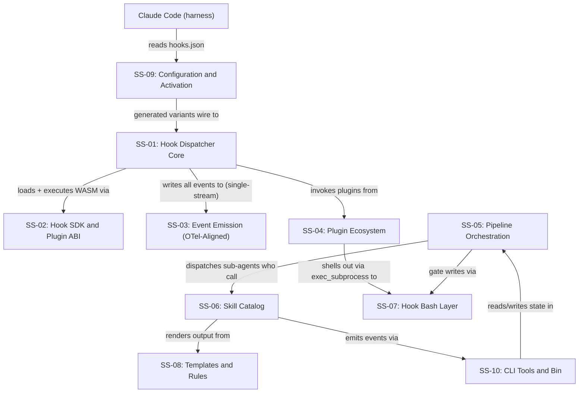

# Architecture Index: vsdd-factory

> **D-443(b)(i) + D-444(e)(ii) documentary-historical exemption (per D-414(c)):** Pre-v1.87-cohort changelog entries (ARCH v1.60..v1.86) are documentary-historical-exempt per D-414(c); the sample-vs-exhaustive flag introduced at pass-62 fix burst (D-442(c)) applies forward-only from ARCH v1.87+. Do NOT retroactively annotate or rewrite pre-v1.87 changelog entries.

> **Context Engineering:** This is a lightweight index (~350 tokens). Agents load
> ONLY the section files they need. See the Document Map for per-section consumer
> guidance.

## Document Map

| Section | File | Primary Consumer | Purpose |
|---------|------|-----------------|---------|
| SS-01 Hook Dispatcher Core | SS-01-hook-dispatcher.md | implementer, story-writer | Module catalog, host fns, sandbox model, Rust crates |
| SS-02 Hook SDK and Plugin ABI | SS-02-hook-sdk.md | implementer, plugin authors | SDK API, manifest schema, capability declarations |
| SS-03 Event Emission (OTel-Aligned) | SS-03-event-emission.md | implementer, story-writer | Single-stream FileSink, OTel schema, host enrichment, write-failure cascade. Old file SS-03-observability-sinks.md is SUPERSEDED (see ADR-015). |
| SS-04 Plugin Ecosystem | SS-04-plugin-ecosystem.md | implementer, story-writer | legacy-bash-adapter, capture-commit-activity, Tier E/F lifecycle plugin crates |
| SS-05 Pipeline Orchestration | SS-05-orchestration.md | orchestrator, story-writer | Agents, Lobster workflows, pipeline phase structure |
| SS-06 Skill Catalog | SS-06-skill-catalog.md | story-writer, skill authors | 120 skills, SKILL.md contract, output routing |
| SS-07 Hook Bash Layer | SS-07-hook-bash.md | implementer, formal-verifier | 44 bash hooks, registry bindings, exit code semantics |
| SS-08 Templates and Rules | SS-08-templates-rules.md | story-writer, implementer | 108 templates, 9 rules, template compliance contracts |
| SS-09 Configuration and Activation | SS-09-config-activation.md | implementer, story-writer | hooks.json variants, activation skill, CI platform config |
| SS-10 CLI Tools and Bin | SS-10-cli-tools.md | implementer, story-writer | 12 bin tools, 110 slash-command bindings |
| Verification Architecture | verification-architecture.md | formal-verifier, architect, story-writer | VP catalog by subsystem; proof method coverage totals; P0/P1 priority lists (Kani/proptest upgrade candidates); purity boundary; risk mitigations. Derived from VP-INDEX. v1.11 (S-19.07-LOCAL-ADV-P2 state-manager: cumulative via 3f821d35 v1.8→v1.10 pass-1 POLICY 9 + e7c30f4c v1.10→v1.11 pass-2 F-P2-001 re-propagation; VP-095 title+proof_method corrected to v1.3 form. [Prior v1.8 — D-782 pass-28 fix burst; VP-096 catalog row exclusive form.]) \| v1.12 (2026-08-30 validation-integrity-layer1 F2 POLICY 9: VP-102/103/104/105/106 added to §SS-01 + §SS-04 catalogs; unit-test 47→51 + integration 33→34 + Total 101→106) \| v1.13 (2026-08-30 consistency-audit F2 fix: VP-105 SS-04 row title + BC source corrected to v1.1 verbatim; input-hash cfb38c7→0e8390c) \| v1.17 (2026-09-01 S-25.01 adversary pass 11 F-P11-001 HIGH fix — architect `e070941a`, state-manager pointer sync D-1144: §SS-01 Provable Properties Catalog VP-108 row title/BC-anchor corrected to derive from VP-108.md v1.5 SoT H1 "Marker Lifecycle Audited Events — Write and Clear Path Emission Correctness"; BC-anchor corrected to BC-1.18.001 §PC4 + BC-1.18.003 §PC1/PC3/PC4/PC5 + BC-3.08.001 Events 9-10; description-only, no VP count/arithmetic change, §1/§3/§4 totals remain 108/unit-test 53. This Document Map pointer had lagged the file's actual version since v1.13 — intermediate v1.14/v1.15/v1.16 syncs were not recorded here, a pre-existing pointer-staleness gap not introduced this burst — now caught up to current). |
| Verification Coverage Matrix | verification-coverage-matrix.md | formal-verifier, story-writer | VP-to-module coverage table; per-subsystem tool breakdown; grand total arithmetic invariant (106 VPs). Derived from VP-INDEX §Full Index scope column. v1.8 (S-19.07-LOCAL-ADV-P2 state-manager: cumulative via 3f821d35 v1.5→v1.7 pass-1 POLICY 9 + e7c30f4c v1.7→v1.8 pass-2 F-P2-001 re-propagation; VP-095 SS-04 row corrected to v1.3 form + §3 U/I correction. [Prior v1.5 — D-782 pass-28 fix burst; VP-096 SS-04 row exclusive form.]) \| v1.9 (2026-07-29 D-943: VP-097 SS-01 row title corrected verbatim) \| v1.10 (2026-08-30 validation-integrity-layer1 F2 POLICY 9: VP-102/103/104/105/106 added; Grand Total U 47→51 + I 33→34 + Total 101→106) \| v1.11 (2026-08-30 consistency-audit F2 fix: VP-105 SS-04 row title + BC source corrected to v1.1 verbatim; input-hash cfb38c7→0e8390c) \| v1.15 (2026-09-01 S-25.01 adversary pass 11 F-P11-001 HIGH fix — architect `e070941a`, state-manager pointer sync D-1144: SS-01 module table VP-108 row title/BC-anchor corrected to derive from VP-108.md v1.5 SoT H1 "Marker Lifecycle Audited Events — Write and Clear Path Emission Correctness"; BC-anchor corrected to BC-1.18.001 §PC4, BC-1.18.003 §PC1/PC3/PC4/PC5, BC-3.08.001 Events 9-10; description-only, no VP count/arithmetic change, per-tool 5+5+53+34+10+1=108 and per-subsystem 42+5+14+16+13+5+12+1=108 remain VERIFIED. This Document Map pointer had lagged the file's actual version since v1.11 — intermediate v1.12/v1.13/v1.14 syncs were not recorded here, a pre-existing pointer-staleness gap not introduced this burst — now caught up to current). |

### Future Sections (Deferred)

The following cross-cutting documents were planned but are currently deferred.
The per-subsystem SS-NN files above collectively cover their content:

| Deferred File | Covered By |
|---------------|-----------|
| system-overview.md | ARCH-INDEX §Subsystem Registry + §Component Dependency Map |
| module-decomposition.md | SS-01..SS-10 section files + §Subsystem Registry |
| dependency-graph.md | §Component Dependency Map (Mermaid) in this file |
| api-surface.md | SS-01-hook-dispatcher.md, SS-02-hook-sdk.md |
| purity-boundary-map.md | SS-01..SS-04 section files (purity notes per module) |
| tooling-selection.md | VP-INDEX §Kani Upgrade Candidates + §Property-Test Upgrade Candidates |

## Cross-References

| If you need... | Read these together |
|----------------|-------------------|
| BC renumbering mapping | Subsystem Registry below (SS-NN → BC-S range) |
| Implementation plan for a module | SS-NN section file for that subsystem + §Subsystem Registry |
| Verification plan for a module | VP-INDEX.md + SS-07-hook-bash.md (for hook VPs) |
| Story decomposition input | SS-NN section files for relevant subsystems + §Component Dependency Map |

## Subsystem Registry

> **Source of truth** for subsystem names and IDs. BC frontmatter `subsystem:`,
> BC-INDEX subsystem column, story `subsystems:` fields, and PRD subsystem
> references MUST all use the exact Name from this table.

BC counts are shown by **authoritative subsystem** (BC frontmatter `subsystem:` field), not by directory location.

| SS-ID | Name | Section File | Implementing Modules / Folders | BC-S Prefix | BCs | Phase |
|-------|------|--------------|-------------------------------|-------------|-----|-------|
| SS-01 | Hook Dispatcher Core | SS-01-hook-dispatcher.md | `crates/factory-dispatcher/src/{main,registry,routing,executor,invoke,engine,plugin_loader,payload}.rs, host/{mod,exec_subprocess,read_file,memory,path_util}.rs` | BC-1 | 118 (117 by directory + 1 reanchored: BC-7.06.001 frontmatter subsystem=SS-01 per F-P1-006; +1 BC-1.16.001 D-694 git_context injection) | Phase 1 |
| SS-02 | Hook SDK and Plugin ABI | SS-02-hook-sdk.md | `crates/hook-sdk/`, `crates/hook-sdk-macros/` | BC-2 | 26 (includes 2 D-183 BCs: BC-2.02.011 host::write_file, BC-2.02.012 HookPayload SubagentStop fields; +1 D-219 BC-2.02.013 host::run_subprocess — WITHDRAWN D-224; +1 D-321 BC-2.06.001 SDK semver bump) | Phase 1 |
| SS-03 | Event Emission (OTel-Aligned) | SS-03-event-emission.md | `crates/sink-core/` (FileSink; Router/SinkRegistry deprecated), `crates/sink-file/`, `crates/factory-dispatcher/src/{host/emit_event,internal_log,sinks}.rs` (`sink-otel-grpc/` deprecated Wave 1) | BC-3 | 56 (51 prior + 1 Phase 1b BC-3.05.004 v2 schema validation per ADR-015 D-15.1 (OQ-1 resolved in SS-03-event-emission.md) + 1 F2 pass-1 fix burst BC-3.08.001 async-semantics event catalog; +3 D-625 reconcile to BC-INDEX v3.06 ground truth) | Phase 1 |
| SS-04 | Plugin Ecosystem | SS-04-plugin-ecosystem.md | `crates/hook-plugins/legacy-bash-adapter/`, `crates/hook-plugins/capture-commit-activity/`, `crates/hook-plugins/capture-pr-activity/` [PLANNED S-3.02], `crates/hook-plugins/block-ai-attribution/` [PLANNED S-3.03], `crates/hook-plugins/session-start-telemetry/` [PLANNED S-5.01], `crates/hook-plugins/session-end-telemetry/` [PLANNED S-5.02], `crates/hook-plugins/worktree-hooks/` [PLANNED S-5.03], `crates/hook-plugins/tool-failure-hooks/` [PLANNED S-5.04], `crates/hook-plugins/validate-per-story-adversary-convergence/` [PLANNED], `crates/hook-plugins/validate-artifact-path/`, `crates/hook-plugins/validate-factory-path-staging/` [PLANNED S-21.01] | BC-4 | 45 (+1 D-321 BC-4.09.001; +3 D-340 BC-4.10.001/002 + BC-4.11.001; +5 D-362 BC-4.12.001-005 resolver platform; +3 D-625 reconcile to BC-INDEX v3.06 ground truth including BC-4.13.001/BC-4.14.001/BC-4.15.001; +2 to true count 45 per D-1151 S-15.03 spec-audit remediation — BC-4.16.001/BC-4.17.001/BC-4.18.001 already counted, drift traced to stale parenthetical arithmetic not row omission) | Phase 1 |
| SS-05 | Pipeline Orchestration | SS-05-orchestration.md | `plugins/vsdd-factory/agents/`, `plugins/vsdd-factory/workflows/*.lobster`, `plugins/vsdd-factory/workflows/phases/` | BC-5 | 661 (648 by directory + 4 reanchored: BC-8.29.001/002/003 + BC-8.30.002 frontmatter subsystem=SS-05; files remain in ss-08/ per POLICY 1; +3 D-625 reconcile to BC-INDEX v3.06 ground truth; +6 to true count 661 per D-1151 S-15.03 spec-audit remediation, literal grep-verified against BC-INDEX v5.41) | Phase 1 |
| SS-06 | Skill Catalog | SS-06-skill-catalog.md | `plugins/vsdd-factory/skills/` (120 skills, 582 markdown files) | BC-6 | 590 (+1 D-340 BC-6.22.001 relocate-artifact skill; +3 D-625 reconcile to BC-INDEX v3.06 ground truth including BC-6.23.001/BC-6.24.001/BC-6.25.001; +1 D-1131 BC-6.28.001 wrap-skill CAP-040; +1 D-1132 wrap skill SKILL.md added S-24.01 MERGED PR #802 9ab5a6f6) | Phase 1 |
| SS-07 | Hook Bash Layer | SS-07-hook-bash.md | `plugins/vsdd-factory/hooks/*.sh` (44 scripts), `plugins/vsdd-factory/hooks-registry.toml`, `crates/hook-plugins/block-ai-attribution/` (PreToolUse + PostToolUse arms) | BC-7 | 201 (199 by directory − 1 reanchored: BC-7.06.001 is in ss-07/ but frontmatter subsystem=SS-01 per F-P1-006; +2 F-block-ai-attribution-message-file-arm: BC-7.03.094/095; +3 D-625 reconcile to BC-INDEX v3.06 ground truth including BC-7.07.001/BC-7.07.002) | Phase 1 |
| SS-08 | Templates and Rules | SS-08-templates-rules.md | `plugins/vsdd-factory/templates/` (108 files), `plugins/vsdd-factory/rules/` (9 files) | BC-8 | 222 (218 by directory − 4 reanchored: BC-8.29.001/002/003 + BC-8.30.002 frontmatter subsystem=SS-05; files remain in ss-08/ per POLICY 1; +8 D-625 reconcile to BC-INDEX v3.06 ground truth) | Phase 1 |
| SS-09 | Configuration and Activation | SS-09-config-activation.md | `plugins/vsdd-factory/hooks/hooks.json*`, `plugins/vsdd-factory/.claude-plugin/plugin.json`, `ci/platforms.yaml`, `scripts/generate-registry-from-hooks-json.sh` | BC-9 | 6 (+1 F2 pass-1 fix burst BC-9.01.006 envelope-sync invariant) | Phase 1 |
| SS-10 | CLI Tools and Bin | SS-10-cli-tools.md | `plugins/vsdd-factory/bin/` (12 tools), `plugins/vsdd-factory/commands/` (110 files), `scripts/` | BC-10 | 59 (+1 to true count 59 per D-1151 S-15.03 spec-audit remediation, literal grep-verified against BC-INDEX v5.41 — includes BC-10.13.001) | Phase 1 |

**Total BCs: 1,997 (per BC-INDEX v5.50 `total_bcs` frontmatter field, the authoritative count per CLAUDE.md Architectural Authority item 7; corrected from a stale 1,973 citing an out-of-date BC-INDEX v3.42 — architect, S-25.02 F2 burst, 2026-09-05, fixing a `validate-count-propagation` drift block encountered while inserting the ADR-051 row below).** Cross-subsystem file placements (POLICY 1 append-only): BC-7.06.001 in ss-07/ → SS-01 (F-P1-006 reanchor); BC-8.29.001/002/003 + BC-8.30.002 in ss-08/ → SS-05 (historical allocation). The total is invariant under both directory-based and frontmatter-based tallying. **NOTE — per-subsystem row counts in the Subsystem Registry table above were NOT individually re-reconciled against BC-INDEX v5.50 in this burst** (this headline-total fix only resolves the specific `validate-count-propagation` drift blocking this burst's write; a full per-subsystem count audit against BC-INDEX v5.50's §Summary table is a separate consistency-validator task, flagged in the companion S-25.02 F2 architecture-delta doc and this burst's report to the orchestrator).

**Renumbering history — BC-1.12.008 → BC-3.05.004 (D-311/D-312):** BC-1.12.008 was originally proposed as an SS-01 routing target in D-311; renumbered to BC-3.05.004 (SS-03) in D-312 corrigendum per POLICY 1 ID-collision rule (BC-3.05.001/002/003 already existed as brownfield BCs authored by codebase-analyzer on 2026-04-25; BC-3.05.004 was the next free slot). Consequence: SS-01 has +4 Phase 1a additions (BC-1.12.001–BC-1.12.004) and +4 Phase 1b additions (BC-1.12.005/006/007/009; no BC-1.12.008 ID exists). SS-03 has +1 Phase 1b addition (BC-3.05.004 v2 schema validation per ADR-015 D-15.1). OQ-W16-012 filed-and-resolved in D-312.

### Subsystem Registry Design Notes

The 10-subsystem layout reflects two first-class groups:

- **SS-01 through SS-04** are **Subsystem A** (Rust compiled artifacts). They share one Cargo workspace, one release binary per platform, and the WASM plugin ABI contract.
- **SS-05 through SS-10** are **Subsystem B** (VSDD orchestration framework). They share one plugin manifest, one marketplace entry, and the Lobster workflow format.

**Deviations from the suggested 10-subsystem template:**

- SS-05 was renamed from "Pipeline Orchestration" to "Pipeline Orchestration" — kept, but agents were moved in (34 agents belong here alongside workflows because agents are the steps' executors; splitting them would orphan the orchestrator).
- SS-06 "Skill Catalog" is the largest single BC surface (585 BCs as of v1.0.0-beta.6; see Subsystem Registry table for current count). It is intentionally a standalone subsystem because skills have independent behavioral contracts per skill (each SKILL.md is a discrete unit of behavior).
- SS-09 "Configuration and Activation" is narrower than the suggested name — it covers only the activation plumbing and CI variant generation, not general config. `hooks-registry.toml` routing lives in SS-07 (Hook Bash Layer) because it is the routing table for that layer.
- SS-10 merges "CLI Tools" and "Bin" because all 12 bin tools are CLI-invocable and the commands/ slash-command bindings are just thin wrappers around skills.

## Component Dependency Map

```mermaid
graph TD
    CC["Claude Code (harness)"]
    SS09["SS-09: Configuration and Activation"]
    SS01["SS-01: Hook Dispatcher Core"]
    SS02["SS-02: Hook SDK and Plugin ABI"]
    SS03["SS-03: Event Emission (OTel-Aligned)"]
    SS04["SS-04: Plugin Ecosystem"]
    SS05["SS-05: Pipeline Orchestration"]
    SS06["SS-06: Skill Catalog"]
    SS07["SS-07: Hook Bash Layer"]
    SS08["SS-08: Templates and Rules"]
    SS10["SS-10: CLI Tools and Bin"]

    CC -->|"reads hooks.json"| SS09
    SS09 -->|"generated variants wire to"| SS01
    SS01 -->|"loads + executes WASM via"| SS02
    SS01 -->|"writes all events to (single-stream)"| SS03
    SS01 -->|"invokes plugins from"| SS04
    SS04 -->|"shells out via exec_subprocess to"| SS07
    SS05 -->|"dispatches sub-agents who call"| SS06
    SS05 -->|"gate writes via"| SS07
    SS06 -->|"renders output from"| SS08
    SS06 -->|"emits events via"| SS10
    SS10 -->|"reads/writes state in"| SS05
```

**Strict dependency direction:** data flows down (CC → SS09 → SS01 → SS02/SS03/SS04 → SS07). The orchestration stack (SS-05/06/07/08/10) is a separate plane. SS-07 sits at the intersection: bash hooks are invoked by both SS-04 (via legacy-bash-adapter) and SS-05/SS-06 (as gates on tool use).

## Cross-Cutting Concerns

| Concern | Owner | Mechanism |
|---------|-------|-----------|
| Observability (single-stream) | SS-03 | `events-YYYY-MM-DD.jsonl` — all lifecycle + domain events (ADR-015). Debug file `dispatcher-internal-*.jsonl` opt-in via `VSDD_DEBUG_LOG=1`; ADR-007 amended. |
| Capability enforcement | SS-01 | Deny-by-default; cap-gated host fns emit denial event + return code |
| Schema versioning | SS-01, SS-09, SS-03 | per-config: `hooks-registry.toml` schema_version=2 (post-ADR-019; v1→v2 hard-error, no compat shim); `observability-config.toml` schema_version=2 (post-ADR-015 D-15.1; v1→v2 hard-errors with migration hint per BC-3.05.004 PC4); other TOML configs schema_version=1; mismatch = hard error per DI-014 |
| Trace correlation | SS-01 | `trace_id` (UUID v4) propagated on every emitted event (renamed from `dispatcher_trace_id` per DI-017 / ADR-015 v1.7) |
| Platform selection | SS-09 | Activation skill copies `hooks.json.<platform>` (ADR-009) |
| Error non-blocking | SS-01 | Registry/payload/engine errors → `internal.dispatcher_error` → exit 0 |
| Bash hook compatibility | SS-04 | `legacy-bash-adapter.wasm` via `exec_subprocess` (ADR-012) |
| Secrets protection | SS-07 | `protect-secrets.sh` PreToolUse gate + env_allow deny-by-default |

## Architecture Decisions

| ID | Decision Summary | Subsystems | File |
|----|-----------------|------------|------|
| ADR-001 | Compiled Rust dispatcher per platform | SS-01, SS-09 | decisions/ADR-001-rust-dispatcher.md |
| ADR-002 | WASM (wasmtime) plugin ABI | SS-01, SS-02, SS-04 | decisions/ADR-002-wasm-plugin-abi.md |
| ADR-003 | WASI preview 1 for v1.0; preview 2 deferred | SS-02, SS-04 | decisions/ADR-003-wasi-preview1.md |
| ADR-004 | TOML for all configuration files | SS-01, SS-09 | decisions/ADR-004-toml-config.md |
| ADR-005 | Multi-sink observability natively in dispatcher — **SUPERSEDED by [ADR-015](decisions/ADR-015-single-stream-otel-schema.md)** | SS-01, SS-03 | decisions/ADR-005-multi-sink-observability.md |
| ADR-006 | HOST_ABI_VERSION as separate semver constant | SS-01, SS-02 | decisions/ADR-006-host-abi-version.md |
| ADR-007 | Always-on dispatcher self-telemetry — **AMENDED by [ADR-015](decisions/ADR-015-single-stream-otel-schema.md)** | SS-01, SS-03 | decisions/ADR-007-always-on-telemetry.md |
| ADR-008 | Parallel-within-tier, sequential-between-tier execution | SS-01 | decisions/ADR-008-parallel-within-tier.md |
| ADR-009 | Activation-skill-driven platform binary selection | SS-09 | decisions/ADR-009-activation-platform-selection.md |
| ADR-010 | StoreData-typed linker for host functions (invoke.rs pattern) | SS-01, SS-02 | decisions/ADR-010-storedata-linker.md |
| ADR-011 | Dual hooks.json + hooks-registry.toml during migration | SS-07, SS-09 | decisions/ADR-011-dual-hook-routing-tables.md |
| ADR-012 | Legacy-bash-adapter as universal current router | SS-04, SS-07 | decisions/ADR-012-legacy-bash-adapter-router.md |
| ADR-013 | Cycle-keyed adversarial review structure | SS-05, SS-06 | decisions/ADR-013-adversarial-review-structure.md |
| ADR-014 | Tier-2 native WASM migration (latency-primary gate + bundle-size advisory + 30MB hard kill-switch) | SS-02, SS-04, SS-07 | decisions/ADR-014-tier-2-native-wasm-migration.md |
| ADR-015 | Single-stream OTel schema + producer-side enrichment — **ACCEPTED 2026-05-04; supersedes ADR-005, amends ADR-007** | SS-01, SS-03 | decisions/ADR-015-single-stream-otel-schema.md |
| ADR-016 | Artifact path registry as single source of truth for `.factory/` canonical paths — **ACCEPTED 2026-05-07; D-340 F2** | SS-04, SS-06 | decisions/ADR-016-artifact-path-registry-sot.md |
| ADR-017 | Per-story adversarial convergence gate — three-perimeter model and WASM hook phasing — **ACCEPTED 2026-05-07; D-340 F2** | SS-04, SS-05 | decisions/ADR-017-per-story-adversary-phasing.md |
| ADR-018 | WASM-plugin Context Resolvers — design and layering for factory-agnostic runtime context injection via sandboxed WASM-plugin resolvers — **ACCEPTED 2026-05-07; D-362 F2-amendment** | SS-01, SS-04 | decisions/ADR-018-wasm-plugin-context-resolvers.md |
| ADR-019 | Plugin Async Semantics Belong at the Registry Layer — hard cut to registry-layer `async: bool` per-plugin field; envelope uniformly synchronous; dispatcher partition (sync_group/async_group); CI lint `on_error=block ⇒ async=false` — **ACCEPTED 2026-05-07; F2 async-semantics; v1.8 (F2 pass-6 fix burst close: §Consequences inline 100ms parenthetical removed; cites DI-019 by reference; F-P6-005 closed)** | SS-01, SS-07, SS-09 | decisions/ADR-019-plugin-async-semantics-at-registry-layer.md |
| ADR-020 | Dispatcher Latency Budget Classes — defines Class A (binary-spawn current model, p95 ≤ 1500ms) and Class B (daemon-mode target, TBD); AC-016 in S-15.01 is anchored to Class A; S-15.02 escalation path for Class B — **ACCEPTED 2026-05-08; F5 pass-1 path-A; v1.0; rationale clarification F-P3-006 last_amended 2026-05-08** | SS-01 | decisions/ADR-020-dispatcher-latency-budget-classes.md |
| ADR-021 | WASM Plugin Cargo-Audit Integration Sandboxing — Option (b) bash pre-commit cache script + WASM reader hybrid; no D-337 exemption required (bash is data-provisioning tooling not a hook plugin); cache at `.factory/hooks/cargo-audit-cache.json`; WASM hook reads via `host::read_file`; cache-age warning + absent-file advisory (non-blocking) — **ACCEPTED 2026-05-15; S-15.03 wave M3 ADR batch; gates S-15.15 Part C (TD #74 Option b)** | SS-04, SS-07 | decisions/ADR-021-wasm-cargo-audit-sandboxing.md |
| ADR-022 | Hook Plugin Access to Current Adversary Pass Context — Option (c) pointer file at `.factory/current-adversary-pass.txt`; state-manager writes single-line integer (pass N, no trailing newline) at every Commit A; `validate-closes-completeness` reads via `host::read_file`; absent-file = non-blocking advisory; invalid-content = hard block — **ACCEPTED 2026-05-15; S-15.03 wave M3 ADR batch; gates S-15.13 Phase 2** | SS-04, SS-05 | decisions/ADR-022-hook-current-pass-context-discovery.md |
| ADR-023 | validate-trajectory-tail-cell-completeness cycle-conditional STATE.md Block-arm site model — Option (c) cycle-conditional: PC1/PC2 (Last Updated cell + Session Resume Section 1) always-Block on all cycles; PC3/PC4/PC5 (Phase Progress row, Concurrent Cycles row, Current Phase Steps rows) Block only when `per_pass_trajectory: true` in active cycle INDEX.md (F5-style per-pass cycles); milestone/story-delivery cycles omit flag (absence = false); INDEX.md cycle guard via path-component-walk; human-authorized un-seal of BC-5.39.009 SEALED D-522 — **ACCEPTED 2026-05-30; D-525 human-authorized; un-seal of BC-5.39.009 v1.8→v1.9; gates S-15.17** | SS-04, SS-05 | decisions/ADR-023-trajectory-tail-cell-completeness-cycle-conditional-site-model.md |
| ADR-024 | Dispatcher log-dir worktree-aware resolution, CLAUDE_PLUGIN_ROOT fail-loud contract, resolver WASM plugin path resolution, internal-error dedup, and destructive-guard shadow exception — 7-level resolution order (VSDD_LOG_DIR override → FACTORY_ROOT override → basename-is-.factory guard → walk-up ancestor → cwd-child .factory dir exists → git-worktree-main-root subprocess [200ms timeout] → cwd fallback); fail-loud-but-continue on absent CLAUDE_PLUGIN_ROOT; per-session dedup of `internal.dispatcher_error` (fixed-cap HashSet<u64>, cap 1024, bounded raw Value::as_str() at 4096-byte char-safe ceiling per v1.2 amendment); shadow exception in destructive-op guard uses lexical path-normalization predicate per v1.2 amendment; **v1.3 (S-18.14/D-676): Decision 1 Addendum — relative `plugin` paths in resolvers-registry.toml MUST resolve against path.parent() (CLAUDE_PLUGIN_ROOT), NOT process CWD — closes root cause of 8,560 resolver.load_error / 0 successful loads since rc.21; applies to `load_registry` + single production `get_or_compile` call site; Decision 5 — `dispatcher.started` MUST include `log_dir` from InternalLog::log_dir(); v1.4 (S-18.14 pass-1 adversary fix burst): §Decision 5 §Purity Boundary phantom `InternalLog::write_started` reference corrected to actual emission anchors; SS-04 advisory resolved NO: subsystem set remains SS-01/SS-03/SS-07; v1.5 (S-18.14 pass-2 adversary fix burst): §Decision 1 Addendum step 5 corrected — false 'two call sites' claim removed; ONE production `get_or_compile` call site in `load_registry` (TD-VSDD-060 sibling-sweep confirmed); `fail_closed` divergence is in post-call error `match`; `registry.rs::resolve_plugin_paths` / BC-1.01.004 proven precedent cross-referenced** — **ACCEPTED 2026-06-09; AMENDED v1.2 2026-06-10 (post-merge adversary convergence: dedup hash input bounded + guard predicate corrected + spec-drift process note); PR #179 squash-merged 89fbe2d6; issue #130 DELIVERED/MERGED; AMENDED v1.3 2026-06-22 (S-18.14 resolver WASM path + log_dir observability); AMENDED v1.4 2026-06-22 (S-18.14 pass-1 adversary fix burst: F-1 phantom method anchor corrected; F-5 SS-04 advisory resolved NO); AMENDED v1.5 2026-06-22 (S-18.14 pass-2 adversary fix burst: F-1 single call site corrected + BC-1.01.004 precedent cross-reference); **AMENDED v1.6 2026-06-22 (S-18.14 pass-4 adversary fix burst: F-2 §Files-to-change resolver_loader.rs row stale plural 'at all call sites' swept — reworded to single-production-call-site framing; sibling-sweep confirmed no other normative plural call-site framings); AMENDED v1.7 2026-06-22 (S-18.14 pass-7 adversary fix burst: F-1 Decision 5 'absolute path' guarantee made satisfiable — InternalLog::log_dir() is verbatim accessor with no absoluteness normalization; multiple resolution branches can return relative paths; made-it-true option (a): absolutization at emission site in main.rs via std::path::absolute() [stable Rust 1.79, toolchain 1.95.0] with unwrap_or_else fallback to verbatim; InternalLog::log_dir() unchanged; Decision 1 Addendum step 2 is_relative() guard made normative to mirror registry.rs::resolve_plugin_paths / BC-1.01.004 proven pattern — not relying on PathBuf::join absolute-replacement semantics which differ on Windows); requires rc release for operator-level cache**; **AMENDED v1.8 2026-06-22 (S-18.14 pass-9 adversary fix burst: F-1 BLOCKER §Decision 1 Addendum step 2 rationale corrected — v1.7 O-3 amendment introduced inverted is_relative() claim; correct Rust semantics: Path::is_relative() = !Path::is_absolute(); Windows \\foo has is_relative()=true (not false as previously stated); explicit guard and bare PathBuf::join produce behaviorally identical results on all platforms; genuine guard justification: sibling-consistency with registry.rs::resolve_plugin_paths (BC-1.01.004) + intent-clarity; false 'Windows portability requires guard vs bare join' claim removed; correct semantics per TD-VSDD-091); AMENDED v1.9 2026-06-22 (S-18.14 pre-ready hardening burst: A-1 phantom `toml_path` anchor corrected — `load_registry` param is `path: &Path`; steps 1/2/5 use `path.parent()` via alias `let toml_parent = path.parent()`; A-2 None-arm handling: `if let Some(base) = toml_parent { ... }` with explicit None-arm pass-through, matching registry.rs:354; A-4 §Files-to-change `resolver_loader.rs` row corrected `toml_path.parent()` → `path.parent()` + None-arm guard; p12-O1 §Decision 5 builder-chain `.with_field("log_dir", log_dir_abs.display().to_string())` made explicit — fragile `.to_string_lossy().as_ref()` form prohibited); **AMENDED v1.10 2026-06-22 (S-18.14 pass-18 fix burst: F-1 MAJOR POLICY 5: §Decision 1 Addendum step 1 phantom `, ...` parameter list removed — normative text cited `pub fn load_registry(&self, path: &Path, ...)` implying additional parameters; ground truth: exactly ONE parameter `path: &Path`; corrected citation: `pub fn load_registry(&self, path: &Path) -> Result<...>`; 'verified' attestation updated; sibling-sweep: zero additional `, ...`-in-paramlist normative sites; O-1: ADR-024 row v1.3 summary segment `toml_path.parent()` corrected to `path.parent()` for cross-cell consistency)** | SS-01, SS-03, SS-07 | decisions/ADR-024-dispatcher-log-dir-resolution-and-plugin-root-fail-loud.md |
| ADR-030 | pr-manager merge-operation integrity enforcement — three-component mechanical enforcement for D-749 (stale-HEAD READY verdict race) and D-750 (release-PR squash-merge not mechanically enforced): (1) `pr-manager-completion-guard.wasm` SubagentStop advisory gate — READY verdict lacking `covered_sha` emits `READY_SHA_MISSING` advisory (`on_error="continue"` advisory-block-mode via stdout outcome; priority=920); (2) `bin/check-stale-verdict.sh` — compares `covered_sha` against live `gh pr view --json headRefOid`; exits STALE_READY_VERDICT on drift; orchestrator MUST invoke before any READY-verdict merge; fail-closed on gh failure; (3) `bin/enforce-merge-strategy.sh` — wraps `gh pr merge`; forces `--merge` for `^release/v` branches; exits RELEASE_PR_SQUASH_FORBIDDEN on `--squash`/`--rebase` attempt; (4) `release-branch-guardrail.yml` adjudicated NOT extendable (`pull_request` events carry no `merge_method` field); **Alternatives rejected:** Option B blocking SubagentStop stale-check rejected (broad `binary_allow` + fail-closed on gh auth destroys pr-manager output); Option C bash hook command-content match rejected (fragile); Option D prompt-only rejected per F-P2-002 (LLM prompt-spec unenforceable by bats); normative twin BC-5.42.001; CAP-033; rationale roots D-749+D-750+F-P2-002 — **ACCEPTED 2026-07-06; ADR-030 v1.0; E-19 adv-P3 F-P3-015 close-out; SS-04 (WASM plugin crate) + SS-05 (pr-manager agent domain) + SS-07 (hooks-registry SubagentStop entry) + SS-10 (bin tools); v1.1 2026-07-08 D-775: F-W1V-001..004 adjudications — bin/ path confirmed (orchestrator-invoked SS-10 CLI, precedent factory-lock-write.sh/factory-cas-push.sh); positional signatures adopted (spec-wins; T-003/T-004 assert); READY_SHA_FETCH_FAILED + READY_SHA_MISSING named codes adopted; CHECK_STALE_VERDICT_ERROR retained for EC-003 + unclassified arms; exit 1 adopted (S-19.01 AC-002/RG-003); v1.2 2026-07-08 D-776: F-P22-003 Decision 1 TOML tool filter ^Agent → ^Agent$ (fully-anchored singleton form per S-19.04 D-f convention; prevents substring match on AgentX-style tool names); v1.3 2026-07-08 D-777: F-P23-001 canonical TOML descriptor rewritten to live-registry shape — on_error="continue" advisory-block-mode via stdout outcome; priority=920; tool=/tier= fields REMOVED (not present in live SubagentStop entries); F-P22-003 superseded (^Agent$ was anchoring a field that doesn't exist); v1.4 2026-07-11 D-829: §D3 governed-pass-through wrapper contract (arch-wrapper 447bff71; S-19.01 F-P7-001)** | SS-04, SS-05, SS-07, SS-10 | decisions/ADR-030-pr-manager-merge-operation-integrity-enforcement.md |
| ADR-031 | E-21 factory state data-loss hardening — nested-worktree path exclusivity protection model: (1) INV-E21-001 two-layer defense — new `validate-factory-path-staging` WASM PreToolUse guard on `^Bash$` (Layer 1: blocks git add of .factory/ paths on product branches; S-21.01) + skill-doc merge pre-check BC-5.43.001 (Layer 2: git diff --name-only HEAD..<target> halts on .factory/ path); (2) crate naming MANDATORY: validate-factory-path-staging NOT validate-artifact-path (existing validate-artifact-path.wasm is Edit/Write/MultiEdit guard for BC-4.11.001 — functionally disjoint; Decision 3); (3) INV-E21-002+INV-E21-004 skill-doc (BC-6.26.001: absolute write-path anchoring + worktree teardown preflight; SS-06; S-21.04); (4) INV-E21-003 skill-doc (BC-6.27.001: 5-step factory-side PR restore + dispatch-preamble ASSERT branch==factory-artifacts; SS-06; S-21.05); (5) INV-E21-005 skill-doc (BC-5.44.001: post-rebase diff-integrity gate before force-push; SS-05; S-21.02); (6) INV-E21-006 skill-doc — Decision 8 (v1.1): BC-6.10.002 amendment — pr-manager post-create baseRefName assertion + post-merge ancestry guard; CAP-038; S-21.03; (7) CAP-034..CAP-038 allocated (5 CAPs; count corrected from 4 at v1.2); (8) Layer-2 live surface = ad-hoc orchestrator/operator git pull/merge Bash on the main product checkout (operational; not documented in any single agent protocol file; server-side origination is the primary Layer-2 threat vector: contributor PR adding .factory/-pathed files merged server-side bypasses Layer-1 entirely, next git pull delivers tracked content); enforcement site = per-story-delivery.md §Main-Checkout Sync Protocol constraint (S-21.01 Layer-2 deliverable alongside WASM crate); Layer-1 scope narrow (git add/stage only; no extension to pull/merge); prior EMPTY-host framing [v1.2] retracted at ADR-031 v1.3; ARCH-INDEX SS-04 stale [PLANNED] on validate-artifact-path/ corrected; (9) Layer-1 TARGET-AWARE extension (v1.5; S-21.01 pass-5; human-approved 2026-07-23): git -C <path> / git -c core.worktree=<path> add forms branch-detect in target dir when <path> names a .factory-class directory (block product branch / pass factory-artifacts / fail-open on error); state-manager canonical git -C .factory workflow preserved; **AMENDED v1.9 2026-07-25 (F-S2104-P1-007 fix burst — architect): §Context Issue #523 provenance corrected — git worktree add does NOT populate a shadow .factory/ directory because .factory/ is gitignored on the product branch; the shadow directory is created by the errant CWD-relative Write itself; gitignored-shadow false-negative mechanism preserved as correct root cause (BC-6.26.001 Invariant 5). ARCH-INDEX v3.29→v3.30**; **AMENDED v1.10 2026-07-25 (F-S2104-P2-002/F-S2104-P2-003/F-S2104-P2-004 fix burst — architect commit 9dfb6121): §Decision 2 write-path/staging-path scope boundary documented (§Write Discipline PC1 and Layer-1 git-staging guard are complementary, non-overlapping surfaces); §Decision 4 PC2c cross-reference added (BC-6.26.001 PC2c fail-closed covered by step-g-cleanup.md §G.1 PC2c HALT clause); four-site sibling sweep re-run against correct file set (step-*.md) with literal grep stdout — F-P1-008 CLOSED-AGAINST-FALSE-PREMISE correction. ARCH-INDEX v3.30→v3.31**; **AMENDED v1.11 2026-07-25 (F-S2104-P5-001 fix burst — architect commit 7862b490): §INV-E21-004 + §Decision 4 PC2 updated with full BC v1.7 4-step chain (existence pre-test [ -e ] step 1, symlink-at-path [ -L ] step 2, non-directory branch PC2b, find trailing-slash step 3, any-nonzero PC2c); class-sweep stdout clean. ARCH-INDEX v3.31→v3.32**; **AMENDED v1.12 2026-07-25 (F-S2104-P6-005 adjudication — architect commit 24c25b9c): F-005 ADJUDICATION Option A — AC-008 executor-side verification upheld; F-P2-007 qualified (verification-and-delegation is NOT co-location; caller-side PRIMARY assignment in ADR §Rationale preserved; executor verify-before-execute obligation is a separate delegation layer). BC-6.26.001 v1.8 Precondition 3 (executor-side verification) + Invariant 2 extension acknowledged. ARCH-INDEX v3.32→v3.33**; **AMENDED v1.13 2026-07-25 (F-P10-005 fix burst — architect commit 3192a208): §Decision 4 five-surface enumeration updated (devops-engineer + adversary + adversarial-review added per BC-6.26.001 v1.11 Precondition 3 + Invariant 5/AC-009). ARCH-INDEX v3.33→v3.34**; **AMENDED v1.14 2026-07-28 (F-S2104-P25-M03 fix — architect): §Decision 1 lead-in corrected five→six invariants (INV-E21-006 appended at v1.1 not swept; TD-VSDD-060 count sweep — all other lead-ins CORRECT). §Consequences #5 DEFERRED tracking note added (BC-5.44.001 v1.3 + S-21.02 v1.1 version-pinned cite; POLICY 19/TD-VSDD-091; E-21 W2 wave gate). ARCH-INDEX v3.35→v3.36**; **AMENDED v1.15 2026-07-28 (F-S2104-P26-H02 three retracted BC-6.26.001 mechanism claims corrected — architect; D-938): §Decision 1 INV-E21-004 step-2 rationale — retracted 'POSIX find without -H/-L returns empty output, falsely authorizing teardown + rm -rf destroys symlink target' replaced with verified mechanism (trailing-slash form dereferences symlink-to-directory via POSIX pathname resolution → out-of-scope traversal; rm -rf removes only symlink entry, not target). §Decision 1 step-3 — 'trailing slash — defense-in-depth' removed (trailing slash dereferences rather than protects; [ -L ] guard is the actual protection). §Decision 4 PC2 step-2 rationale — retracted 'POSIX find without -H/-L returns empty for symlinks → false PC2a escape' replaced with verified dereference/out-of-scope-traversal mechanism. All consistent with BC-6.26.001 v1.12 (six body sites corrected) + v1.13 (seventh site EC-005). [ -L ] guard placement and all PC2a/PC2b/PC2c routing unchanged. ARCH-INDEX v3.36→v3.37** | SS-04, SS-05, SS-06 | decisions/ADR-031-e21-factory-state-data-loss-hardening.md |
| ADR-032 | verify-state-timestamp-refresh — Edit/MultiEdit payload-targeted timestamp enforcement: Decision 1 — for Edit/MultiEdit, scan new_string values for top-level `timestamp:` OR `factory_lock:` fields; if neither is set in any new_string (payload-neutral — neither field), return `Continue` after skipping the timestamp and lock-expiry checks (Steps 4–7; AC-020 sentinel emitted); Decision 2 — Write tool path unchanged (full Steps 4–8 apply unconditionally); Decision 3 — lock-expiry check (Step 7) fires when `sets_timestamp==true` (always, regardless of `sets_factory_lock` — enforces PC4: timestamp-advancing Edit must also renew `factory_lock.expires_at` in same payload; Block(LockExpiryStale) if stale) OR when `sets_factory_lock==true` without `sets_timestamp` (Step 7 only; skip Steps 4–6); payload-neutral Edits skip Steps 4–7; Step 7 wrapped in `if sets_factory_lock \|\| sets_timestamp`; Decision 4 — new `pub fn new_string_sets_field(new_string: &str, field_key: &str) -> bool` helper (NEW function; 0 matches in crates/ pre-implementation); Decision 5 — AC-020 added to guard_logic function docstring `# BC traces` list. Second deliverable: AC-021 PostToolUse advisory sentinel per Bash git-commit events on factory-artifacts worktree; HEAD vs HEAD^ STATE.md `timestamp:` comparison via dispatcher-injected payload.extra['git_context'] fields (exec-free WASM; ADR-032-AC021-prereq; `on_error=continue`; no sidecar file). 11 tests (4 Red Gates + 7 regression guards). D-866 root-cause; Implementer Work Spec included. ADR-025 §12.2/§12.3 superseded-in-part for payload-neutral Edit/MultiEdit (ADR-025 amended to v1.24). **ACCEPTED 2026-07-20 (strict 3-CLEAN: passes 9/10/11 at bc7f6d8b; D-869); ADR-032 v1.1. AMENDED v1.2 2026-07-20 (F-ADR032-P2 fix burst — architect): §Consequences lock-held path payload size clarified + Third Deliverable added (factory_lock: placement mandate immediately after timestamp: line, not at frontmatter end); §Source/Origin ADR-025 scope annotation corrected — TimestampStale gated on sets_timestamp only, LockExpiryStale gated on (sets_timestamp OR sets_factory_lock); AC-021 redesigned using git show HEAD:STATE.md via exec_subprocess (replaces speculative old_content field; ground-truth per payload.rs HookPayload struct); Test #9 mandates timestamp: "NEW" in new_string (combined factory_lock + timestamp advance); §Status heading neutralized to "### Status". ADR-025 amended to v1.21 in lock-step (§12.3 scope-split). Closes F-ADR032-P1-009 + F-ADR032-P2-001 through F-ADR032-P2-006. ADR-032 v1.2. AMENDED v1.3 2026-07-20 (F-ADR032-P3 fix burst — architect): 7 findings closed (architect self-review during fix burst 3; F-ADR032-P3-001..007 set was NOT from any adversary pass; adversary pass-3 finding set is P3B — F-ADR032-P3B-001..003 — closed at v1.4); AC-021 broadened from Write-only to ^(Edit\|Write\|MultiEdit)$ + read_file capability + HEAD comparison gating; 2 volatile line pins removed ((line 7) + lines ~207–223); §Rationale 'symmetric' heading corrected; Decision 5 AC-020 insertion target corrected to guard_logic # BC traces list after AC-019; 'pre-burst reference' replaced with last-committed HEAD cite; Changelog volatile line pins removed; Required new tests 'minimum 9' → 'minimum 10'. Closes F-ADR032-P3-001..F-ADR032-P3-007. ADR-032 v1.3. AMENDED v1.4 2026-07-20 (F-ADR032-P3 second fix burst — architect): 3 additional findings closed per adversary pass 3; F-ADR032-P3B-001 HIGH: AC-021 re-scoped from per-write Edit\|Write\|MultiEdit trigger to per-commit Bash trigger on factory-artifacts worktree — plugin compares HEAD vs HEAD^ STATE.md timestamps via `git -C .factory show HEAD:STATE.md` and `git -C .factory show HEAD^:STATE.md` using exec_subprocess (no read_file capability required; both versions read from git object store; BC-5.41.003 PC1 scope restriction does not apply); F-ADR032-P3B-002 MEDIUM: Decision 1 + Decision 5 AC-020 text + §Source/Origin payload-neutral definition corrected — payload-neutral condition is NEITHER `timestamp:` NOR `factory_lock:` in any `new_string` (v1.3 text only required `timestamp:` to be absent; a factory_lock:-only payload is not payload-neutral; Decision 3 still runs Step 7 for such payloads); F-ADR032-P3B-003 LOW: drifted PLACEMENT MANDATE doc comment removed from `crates/factory-lock/src/lib.rs` `acquire_lock` function (burst-2 drifted duplicate of normative mandate in ADR Third Deliverable). ADR-025 amended to v1.22 in lock-step (§12.3 first-sentence correction). Closes F-ADR032-P3B-001..F-ADR032-P3B-003. ADR-032 v1.4. ARCH-INDEX v3.14→v3.15. AMENDED v1.5 2026-07-20 (F-ADR032-P4 fix burst — architect): 6 findings closed per adversary pass 4. F-ADR032-P4-001: this ARCH-INDEX row refreshed — Decision 1 two-field payload-neutral condition (timestamp: OR factory_lock:); Decision 5 guard_logic function docstring; AC-021 exec-free mechanism (ADR-032-AC021-prereq); ADR-025 v1.22. F-ADR032-P4-002: Option A ruling — AC-021 exec-free: dispatcher injects head_state_timestamp + head_parent_state_timestamp into git_context (ADR-032-AC021-prereq in invoke.rs); WASM reads payload fields; exec_subprocess removed; BC-5.41.003 PC1 unconditionally preserved. F-ADR032-P4-003: dissolved by Option A (host-side factory_dir). F-ADR032-P4-004: evidence block verbatim stdout corrected (4 matches: 954/976/1065/1087); line pins removed. F-ADR032-P4-005: AC-020 renamed timestamp-neutrality → payload-neutrality. F-ADR032-P4-006: v1.4 finding IDs renamed P3B; clarifying sentence added. Closes F-ADR032-P4-001..F-ADR032-P4-006. ADR-032 v1.5. AMENDED v1.6 2026-07-20 (architect self-review during fix burst 4): 8 findings closed. Note: F-ADR032-P5-001..008 set was architect self-review, NOT from adversary pass 5; no adversary pass 5 ran; P5 prefix retained for append-only ID stability. F-ADR032-P5-001+P5-006: guard_logic docstring update split Part 1 (module //! step 3a) + Part 2 (guard_logic function # BC traces AC-020). F-ADR032-P5-002: Third Deliverable item 2 comment replaced with implementation checklist. F-ADR032-P5-003: test #11 Red Gate YES (Block(TimestampStale) pre-fix); four Red Gate tests; §Status updated. F-ADR032-P5-004: AC-021 two pre-conditions (is_factory_artifacts_commit; state_md_in_commit); prereq deliverable extended. F-ADR032-P5-005: Third Deliverable awk front==1 gate + insertion guard. F-ADR032-P5-007: Decision 1 vacuous parenthetical deleted. F-ADR032-P5-008: AC-021 explicit registry stanza added. Closes F-ADR032-P5-001..F-ADR032-P5-008. ADR-032 v1.6. AMENDED v1.7 2026-07-20 (provenance correction — orchestrator-verified via dispatcher-log session audit): v1.3 and v1.6 attributions corrected — F-ADR032-P3-001..007 was architect self-review during fix burst 3 (not adversary findings); F-ADR032-P5-001..008 was architect self-review during fix burst 4 (no adversary pass 5 ran); P5 prefix retained for append-only ID stability. No normative content changed. ADR-032 v1.7. ARCH-INDEX v3.17→v3.18. **AMENDED v3.19 [UNAUTHORIZED shadow-chain burst; no adversary pass 6 ran; see D-868] (2026-07-20):** F-ADR032-P6-001..P6-008 (content pending adversarial verification) — stateless discriminator (git symbolic-ref HEAD); to_json() explicit mandate; async = false restored; BC traces Steps 4–8; dispatcher emission tests; Decision 1 phrasing. ADR-032 v1.8. ARCH-INDEX v3.18→v3.19. **AMENDED v3.20 [UNAUTHORIZED shadow-chain burst; no adversary pass 7 ran; see D-868] (2026-07-20):** F-ADR032-P7-001..P7-007 (content pending adversarial verification) — dropped factory-artifacts branch discriminator field (worktree separation; Pre-condition 2 sufficient); prereq three fields not four; priority 155→159 (155 occupied by validate-stable-anchors); §Source/Origin Continue phrasing corrected; step-numbering scheme annotations (Decisions 1, 3, 5); AC-020 entry byte-identical across Decision 5 and Work Spec Part 2; dispatcher-side tests minimum 3 + Test 1 known timestamp + Test 3 negative branch; async = false rationale corrected (explicitness/parity). ADR-032 v1.9. ARCH-INDEX v3.19→v3.20. **AMENDED v1.10 (2026-07-20):** P6/P7 provenance relabel burst (orchestrator-verified, D-868): F-ADR032-P6-001..P6-008 and F-ADR032-P7-001..P7-007 attribution corrected to UNAUTHORIZED shadow-chain bursts (no adversary pass 6 or pass 7 ran; prefixes retained for append-only ID stability; content pending adversarial verification). Freeze commit 87745b8e human-authorized. No normative ADR content changed. ADR-032 v1.9→v1.10. ARCH-INDEX relabeled v3.20. **AMENDED v1.11 2026-07-20 (F-ADR032-P6R fix burst 5 — architect):** F-ADR032-P6R-001 (HIGH): AC-021 evidence block grep command corrected — `grep -n "^priority = " ... \| grep -E "15[0-9]"` replaced with `grep -nE '^priority = (15[0-9]\|160)$'`; true stdout unchanged (12 matches; 159 unoccupied confirmed). F-ADR032-P6R-002 (HIGH): §Consequences Negative bullet (c) + Pre-condition 1 corrected — `detect_git_commit_event` is a heuristic qualifying ANY Bash command containing "git"+" commit"+".factory"; develop-branch commits mentioning ".factory" can trigger spurious advisory fires; advisory keys off factory-artifacts worktree HEAD; Option (a) accepted-with-disclosure; emitted message MUST describe factory-artifacts HEAD state. F-ADR032-P6R-003 (MEDIUM): Decision 1 + Decision 3 "(code-inline numbering)" annotations at "Step 8" corrected — code-inline scheme ends at Step 7; corrected to "payload-scan step (inserted after code-inline Step 3)". F-ADR032-P6R-004 (LOW): §Source/Origin ADR-025 reference updated v1.22→v1.23. ADR-025 amended to v1.23 in lock-step. ADR-032 v1.10→v1.11. ARCH-INDEX v3.20→v3.21. **AMENDED v1.12 2026-07-20 (F-ADR032-P7R fix burst 6 — architect):** fail-open bullet corrected (develop-branch Bash CAN qualify Pre-condition 1 — advisory-only bounded); ADR-025 §12.2 annotation bumped to v1.24 two-field definition; ARCH-INDEX current-state "immediately" phrasing corrected + v1.22→v1.24 cite; v1.11 changelog Step-8 false claim corrected via v1.12 append. ADR-025 v1.23→v1.24 in lock-step. ADR-032 v1.11→v1.12. ARCH-INDEX v3.21→v3.22.** **AMENDED v1.13 2026-07-20 (D-869 acceptance burst — state-manager):** ADR-032 ACCEPTED 2026-07-20; strict 3-CLEAN convergence (passes 9/10/11 CLEAN B0/H0/M0/L0 at bc7f6d8b); §Status updated proposed→accepted; no Decision or Work Spec content changed. ARCH-INDEX v3.23→v3.24. **AMENDED v1.14 2026-07-21 (PR #742 security-review follow-up — architect):** §Consequences Negative timestamp-deletion sub-case explicit disclosure added (CWE-693 LOW, accepted-with-disclosure; Finding 3 from PR #742 fresh-eyes review + security-review adjudication 2026-07-21). Append-only; no normative Decision or Work Spec content changed. ARCH-INDEX v3.24→v3.25. | SS-04, SS-05 | decisions/ADR-032-verify-state-timestamp-refresh-edit-payload-targeted-enforcement.md |
| ADR-036 | compute-input-hash binary version authority, algorithm migration, and invariant-11 extension: Decision 1 — DEV algorithm (commit e628b884, temp-file raw-byte accumulation) is the canonical algorithm; CACHE binary's `echo -n "$CONCAT"` trailing-newline-stripping is a correctness defect per issue #637; raw-byte hashing is the only semantically stable definition; Decision 2 — bootstrap migration: copy DEV binary (`plugins/vsdd-factory/bin/compute-input-hash`) to CACHE path (`~/.claude/plugins/cache/claude-mp/vsdd-factory/1.0.0-rc.23/bin/compute-input-hash`) to unify enforcement without rc.24 release; verify with `cmp` exit 0; Decision 3 — mandatory invocation after migration: `plugins/vsdd-factory/bin/compute-input-hash`; binary divergence check via `cmp` required before any new hash computation; `--version` flag follow-up required; Decision 4 — invariant-11 algorithm-divergent extension: third classification for hashes legitimately computed by a superseded binary version; distinct from stale (inputs changed) and fabricated (never computed from actual inputs); no PROVENANCE-BREAK annotation needed; remedy is recompute with authoritative binary; Decision 5 — E-19/E-21 remediation sequence: (1) prerequisite: §Decision 2 `cmp` exit 0; (2) per-story single-file `--update` invocations only (D-936 forbids `--scan --update`); (3) E-21 stories requiring update: S-21.01/02/03/05/06 (stale-by-content) + S-21.07 (CACHE-correct → unified `88fc803`); S-21.04 already DEV-correct (`47a65c9`) → no change; (4) E-19 nine stories recompute + STORY-INDEX three-way equality sync; (5) Arm B2 (S-19.02/S-19.04/S-19.07 catalog↔blockquote) resolved in same sweep; Ruling on four pass-29/30 annotations: `1acf3c6` is algorithm-divergent (CACHE binary correctly computes it for S-21.04 current inputs), NOT fabricated; PROVENANCE-BREAK annotations at STORY-INDEX.md:727, VP-INDEX.md:8, STATE.md:134, STATE.md:226 are factually incorrect and must be corrected to `[ALGORITHM-DIVERGENT per ADR-036 §Decision 4]`; BC-5.39.010 PROVENANCE-BREAK annotation on `1acf3c6` (if present) is also incorrect — routed to product-owner. **ACCEPTED 2026-08-03; ADR-036 v1.0.** | SS-07, SS-10 | decisions/ADR-036-compute-input-hash-binary-version-authority-and-algorithm-migration.md |
| ADR-037 | input-hash stable-input constraint — volatile cycle artifacts and catalog indexes must not be story hash inputs: Decision 1 — `inputs:` is a drift-detection mechanism, not a provenance log; a file belongs in `inputs:` only if a content change after story-authoring would require spec re-examination; Decision 2 — volatile artifact patterns MUST NOT appear in story `inputs:` arrays: `.factory/cycles/**/{decision-log,lessons,burst-log}.md`, `.factory/STATE.md`, `.factory/cycles/**/STATE.md`, `STORY-INDEX.md`, `BC-INDEX.md`, `ARCH-INDEX.md`; Decision 3 — provenance of specific D-NNN/L-NNN entries that informed a story belongs in `closes:`, `last_amended:`, and story body — not in `inputs:`; Decision 4 — BC-5.39.010 Class B MUST add volatile-input precondition (routed to product-owner): if `inputs:` contains §Decision 2 patterns, emit ADVISORY "Story [ID] has volatile inputs per ADR-037 §Decision 2 — three-way equality unsatisfiable until inputs corrected; Class B BLOCK suspended" and skip three-way equality check; Decision 5 — remediation sequence for 77 affected stories (originally 19 v1.0; expanded to 78 v1.1 by full-corpus re-derivation; S-21.07 remediated in pass-5 burst reducing to 77 v1.2): story-writer removes volatile entries; state-manager recomputes per-story hashes via `plugins/vsdd-factory/bin/compute-input-hash` `--update` single-file invocations (D-936 forbids `--scan --update`); S-19.01 stored hash `0ad9c4b` MUST NOT be corrected before story-writer removes `lessons.md` from its `inputs:` — correcting under pre-remediation semantics stores a hash that breaks again at the next lesson append; Decision 6 — `input-hash` field within a story file is NOT excluded from that file's content hash when the story is listed as an input to another story; full-file content hashing is correct for story-to-story spec dependencies; Decision 7 — frozen `adv-cycle-pass-N.md` and wave plan files are write-once by construction; 23 stories referencing only frozen artifacts are stable and require no remediation (corpus-verified 2026-08-05). Empirically demonstrated in D-952 burst: S-19.01 stored hash `0ad9c4b` → recomputed `242af2f` after lesson append to brownfield `lessons.md`. **ACCEPTED 2026-08-04; ADR-037 v1.0. AMENDED 2026-08-05 (D-956 S-21.07 pass-5 record burst — state-manager): Decision 5 roster corrected 19→78 affected stories; S-21.07 volatile ARCH-INDEX.md input discharged in same burst. ADR-037 v1.1. AMENDED 2026-08-05 (F-S2107-P6-006 + F-S2107-P6-011 pass-6 fix burst — architect): S-21.07 removed from roster (already remediated); union 78→77; ARCH-INDEX leg 63→62; modified[] ordering fixed. ADR-037 v1.2. AMENDED 2026-08-06 (F-S2107-P7-018 pass-7 fix burst — architect): corpus re-derivation predicate corrected to `is_volatile_path` exact-match semantics; ARCH-INDEX grep added `$` end-anchor; ARCH-INDEX leg 62→61; de-duplicated union 77→76 (production predicate); S-8.10 identified as TD-VSDD-091 defect (line-pinned `ARCH-INDEX.md:75`), in remediation roster but excluded from predicate count; total remediation scope 77 (76 predicate + S-8.10); PC40 exact-equality ruling: no BC amendment required. Routing: story-writer removes S-8.10 malformed entry. ADR-037 v1.3.** | SS-05, SS-10 | decisions/ADR-037-input-hash-stable-input-constraint-volatile-artifacts-excluded.md |
| ADR-039 | Validator failure policy for resource exhaustion — per-plugin `failure_policy` field, fail-closed default for authorization-class validators, safe migration ordering: Decision 1 — `on_error` (crash behavior) and `failure_policy` (resource-exhaustion behavior) are separate non-unified axes; `failure_policy = "fail-closed" \| "fail-open"` as new per-plugin TOML field orthogonal to `on_error`; absent = fail-open (backward compatible during migration window); Decision 2 — per-plugin scope (not global); validator-class write-gating plugins MUST receive `failure_policy = "fail-closed"` after calibration, bifurcated by adapter class per v1.8 amendment (§AMD-001): native-WASM (validate-cross-site-correspondence, fuel-axis calibration sufficient) vs legacy-bash-adapter.wasm-hosted (validate-factory-path-root, validate-input-hash, validate-template-compliance, validate-wave-gate-prerequisite, validate-pr-merge-prerequisites — fuel-axis calibration necessary but NOT sufficient; host-wall-clock-timeout-axis (timeout_ms) calibration additionally required, since their bash subprocess is invisible to the WASM fuel counter per ADR-042 §Decision 3 class (b)); advisory-class plugins remain fail-open; Decision 3 — hard migration ordering constraint: four phases: (P1) schema extension, enforcement unchanged; (P2) near-term mitigations; (P3) per-plugin calibration bifurcated by adapter class — native-WASM: fuel-cap at p99×1.5 against production-scale corpus (lessons.md ≥4000 lines (D-442(e) hard limit; soft limit is 3500), STATE.md, decision-log.md, ≥574 KB fixture); legacy-bash-adapter.wasm-hosted: additionally timeout_ms at p99_ms×2.0 against the same corpus (v1.8 amendment); explicit self-lock statement for the two PreToolUse ^Agent$ gates (validate-wave-gate-prerequisite, validate-pr-merge-prerequisites) — fail-closed MUST NOT be applied on fuel_cap sufficiency alone; (P4) fail-closed annotation atomic with calibrated fuel_cap (and, for legacy-bash-adapter.wasm-hosted plugins, timeout_ms) — no half-state on either axis; lessons.md validators blocked until D-442(e) budget calibrated; Decision 4 — fuel budgeting: Option A static per-plugin cap max(p99×1.5, 50M) required for migration (native-WASM plugins); parallel host-wall-clock-timeout-axis formula timeout_ms ≥ max(p99_ms×2.0, 30_000) for legacy-bash-adapter.wasm-hosted plugins (v1.8 amendment; v1.9: reframed as local calibration policy validated by observed false-timeout rate, not an SRE-standard formula — closest published analogue AWS Agentic AI Lens 2-3×p95; 30s floor documented as cold/loaded-CI cushion); Option B size-proportional base+k×input_bytes preferred long-term; RegistryDefaults fixed `fuel_cap = 10_000_000` wrong shape for O(n)-in-input validators; D-442(e) line-count constraint is symptom not solution; Decision 5 — near-term mitigations (M2 delivered S-21.07 as a1-production-scale bats scenario fixture commit e94767bc, 576,396 bytes; M1 fuel-headroom warning pending): (M1) fuel-headroom warning on `Ok` path when `fuel_consumed > 0.9 × cap`; (M2) ≥574 KB production-scale fixture — delivered; CWE-636 defect persists until Phase 4; Decision 6 — verification requirement (Envoy #38801 lesson): behavioral tests MUST assert observed block outcome — four required cases: exhaustion+fail-closed→block; exhaustion+fail-open→advisory; `on_error` independence; crash-vs-exhaustion distinct paths; `fail_closed_timeout_with_on_error_continue_is_open` test MUST be revised not deleted when Phase 4 ships. CWE-636 primary / CWE-390 secondary. Extends ADR-035 §Decision 5. Adjudicates F-S2107-P7-010 (HIGH), F-S2107-P7-011 (HIGH), F-S2107-P7-015 (MEDIUM). **PROPOSED 2026-08-06; ADR-039 v1.0. AMENDED 2026-08-06 (v1.1 — architect): Context + Decision 3 expanded with observational evidence — PostToolUse blocks on ARCH-INDEX.md during authoring session confirm self-lock hazard is already live for today's fail-closed validators (validate-factory-path-root, validate-input-hash, validate-template-compliance, on_error=block); Phase 3-before-Phase 4 ordering constraint strengthened from precautionary to response-to-active-failure. ADR-039 v1.1. AMENDED 2026-08-16 (v1.2 — architect; ratification prep): internal v1.0 body reference inconsistency resolved (§Consequences "Status as of v1.0" heading + §Status "ADR-039 v1.0" cite corrected); implementation status updated — Phase 1 (S-21.10) delivered, Phase 2 (Mitigation 1 fuel-headroom warning) in progress on fix/fuel-exhaustion-fail-loud, Phase 3+4 (S-21.11) queued; Decision 5 S-21.07 aspiration note corrected (S-21.07 PR #776 shipped without Decision 5 mitigations). Status section records FINALIZED FOR RATIFICATION without self-ratifying. ADR-039 v1.2. AMENDED 2026-08-16 (v1.3 — architect; pre-ratification research reconciliation): (1) fuel-default corrected 10M→20M per ADR-042 §Decision 2 in Decision 3 (Phase 4 no-half-state constraint), Decision 4 (constant + body), and Rationale §per-plugin-scope; SHAPE argument (fixed-vs-size-proportional) fully preserved; (2) Decision 4 Option A reworded — load-bearing guarantee is sufficiency for largest known live input + production-scale corpus; p99×1.5 reframed as headroom floor heuristic (calibrated risk parameter, not SRE standard); hard-block boundary note added (p99.9/observed-max for validators where exhaustion = unconditional block); (3) CWE taxonomy enriched — CWE-755 (Improper Handling of Exceptional Conditions) lineage added: CWE-755 → CWE-703 → CWE-636 in Context and Source; (4) §Consequences (Negative) — absent-annotation = fail-open footgun documented as residual risk; follow-up hardening story S-21.16 cited (CI lint + global-default flip post-migration). Status PROPOSED / ratification-pending — v1.3 is the version for human ratification. ADR-039 v1.3. **RATIFIED 2026-08-16 (v1.3) by human via orchestrator (POLICY 22 ratification-channel; D-1022): status proposed→ratified.** **CITATION ERRATUM 2026-08-17 (v1.4 — architect; F-S2111-P1-008): §Decision 5 "Task #33" citation corrected — no Task #33 in S-21.07 (22 tasks; task 12 deferred); Mitigation 2 (≥574 KB fixture) delivered as a1-production-scale bats scenario fixture (commit e94767bc, 576,396 bytes). §Implementation Status Phase 2 corrected. No decision semantics altered. Status RATIFIED. ADR-039 v1.4.** **ANCHOR ERRATUM 2026-08-17 (v1.5 — architect; F-S2111-P2-005): frontmatter `subsystems_affected` corrected [SS-01, SS-05] → [SS-01, SS-07]; `hooks-registry.toml` owned by SS-07 "Hook Bash Layer" per §Subsystem Registry; SS-05 "Pipeline Orchestration" not touched by this ADR. Non-load-bearing anchor correction; no decision semantics altered; status RATIFIED. ADR-039 v1.5.** **NARRATIVE COUNT ERRATUM 2026-08-17 (v1.6 — architect; F-S2111-P3): §Rationale, §Alternatives A, and §Consequences cited stale "52 existing plugin entries" / "52 plugins" / "52 entries" from initial v1.0 draft. Live hooks-registry.toml now contains 76 [[hooks]] entries. Three occurrences reconciled to "existing plugin entries (currently 76)". No decision, threshold, or policy content changed; status remains RATIFIED. ADR-039 v1.6.** **CORPUS-FLOOR ERRATUM 2026-08-18 (v1.7 — architect; F-S2111-P12-001): §Decision 4 calibration corpus first bullet corrected — "lessons.md at ≥3000 lines (current soft limit)" contradicted §Decision 3 (D-442(e) hard limit = 4000 lines) and mis-labelled soft limit as 3000 (it is 3500 per D-442(e)); also inconsistent with BC-1.03.017 Precondition 2 v1.7 and S-21.11 AC-007 v1.10. Bullet updated to "lessons.md at ≥4000 lines (D-442(e) hard limit; soft limit is 3500)". No decision semantics altered; status remains RATIFIED. ADR-039 v1.7.** **FUEL-VS-EPOCH AXIS BIFURCATION AMENDMENT 2026-08-18 (v1.8 — architect; F-S2111-P13-001, architect-CONFIRMED HIGH): §Decision 1/2/3/4 amended — fuel-cap calibration is genuinely sufficient for only one of the six named plugins (validate-cross-site-correspondence, native-WASM); the other five are hosted by hook-plugins/legacy-bash-adapter.wasm, whose bash subprocess execution is invisible to the WASM fuel counter (ADR-042 §Decision 3 class (b)) — their real exhaustion axis is epoch/timeout_ms. New epoch-axis calibration formula added to §Decision 4 (timeout_ms ≥ max(measured_p99_ms × 2.0, 30_000)); explicit self-lock statement added to §Decision 3 for the two PreToolUse ^Agent$ gates. See §AMD-001 for the full before/after table. **This IS a substantive Decision-content amendment and REQUIRES human ratification under POLICY 22 before Phase 3/4 proceeds for the five legacy-bash-adapter.wasm-hosted plugins.** Status: v1.7 base RATIFIED; v1.8 delta PROPOSED / RATIFICATION-PENDING. ADR-039 v1.8.** **RATIFICATION + FOUR-CORRECTION FOLD-IN 2026-08-18 (v1.9 — architect; F-S2111-P13-001 research validation): AMD-001 RATIFIED by human this session (POLICY 22); independent Perplexity sonar-deep-research + docs.rs/wasmtime/46.0.2 verification confirmed the fuel-vs-epoch premise verbatim with four advisory corrections folded in: (1) terminology swept "epoch interruption"/"epoch axis" → "host wall-clock timeout" throughout §Decision 1-4/§AMD-001 (timeout_ms field name and TimeoutCause::Epoch code identifier unchanged); mechanism-precision paragraph added citing the real enforcement point (exec_subprocess.rs::run()'s Instant-based poll+kill, not wasmtime epoch interruption); (2) p99_ms×2.0 multiplier reframed as local calibration policy validated by observed false-timeout rate, not SRE-standard (closest published analogue: AWS Agentic AI Lens 2-3×p95); (3) 30_000ms floor documented as cold/loaded-CI cushion, not latency-derived; (4) new break-glass requirement added to §Decision 3 for the two PreToolUse ^Agent$ gates, named follow-up S-21.17 (new, not yet authored). New §AMD-002 filed PROPOSED / NOT RATIFIED (architect self-verification, not one of the four research corrections): legacy-bash-adapter's exec_subprocess call uses a fixed BASH_TIMEOUT_MS=60_000 constant independent of the registry's calibrated timeout_ms — Phase 3 calibration has no live enforcement target for these five plugins until wired; named follow-up S-21.18 (new, not yet authored); does not block Phase 3 calibration but MUST be resolved (or its residual risk explicitly accepted) before Phase 4's fail-closed flip is treated as fully protective. BC-1.03.017 v1.9→v1.10 (parallel terminology sweep + AMD-002 cite, same burst). ADR-039 v1.9.** **AMD-002 RATIFICATION + S-21.11 NO-SPLIT DECISION 2026-08-19 (v1.10 — architect; two human decisions this session, POLICY 22 ratification-channel): (A) §AMD-002 RATIFIED, corroborated by independent code-review verification against live source (BASH_TIMEOUT_MS=60_000 confirmed hardcoded in legacy-bash-adapter/src/lib.rs; registry timeout_ms confirmed to only set the wasm epoch deadline in invoke.rs, never bounding the bash child) — the v1.9 "ADR-025 §Decision 18" corroboration citation was WRONG (unrelated factory-artifacts lock/lease decision) and is retracted; corrected corroboration is ADR-039's own v1.8 §AMD-001 → v1.9 §Decision 4 mechanism-precision self-correction history. Blast radius reframed: the unwired-constant defect applies to all ~37 legacy-bash-adapter.wasm-routed hooks-registry.toml entries (live grep-confirmed), not only the five §Decision 2 plugins (those five remain the correct calibration-and-flip subset for S-21.11); a hooks-registry.toml header-comment drift is noted (documents 35 legacy-bash-adapter entries, live count is 37) — flagged for a future maintenance sweep, NOT corrected in this burst. (B) Human decided S-21.11 is NOT split: it absorbs the break-glass mechanism (prior follow-up name S-21.17, now retired as a separate story) and the AMD-002 exec_subprocess wiring fix (prior follow-up name S-21.18, now retired as a separate story) into its own unified scope, alongside per-plugin timeout_ms calibration and the gated fail-closed flip — all four elements deliver as ONE story. Hard intra-story ordering constraint documented: the break-glass commit MUST land before, or atomically with, the fail-closed-flip commit for validate-wave-gate-prerequisite and validate-pr-merge-prerequisites (self-lock prevention — a PreToolUse ^Agent$ block on either gate would prevent the Agent dispatches needed to fix it). Break-glass minimum-viable definition specified concretely in §Decision 3 (environment-variable override VSDD_BREAK_GLASS_GATE_BYPASS, consulted before the gate's block decision, human-operator-only — set via direct shell access, not through any Agent-gated path — every activation audited via a break_glass.activated dispatcher-internal JSONL event) — sufficient for story-writer to derive ACs without a further design pass. BC-1.03.017 v1.10→v1.11 (architect-applied, same burst; Traceability-row citation sweep only, redirecting S-21.17/S-21.18 cites to S-21.11 — no PC/Precondition content altered). ADR-039 v1.10.** **MECHANISM-ADJUDICATION AMENDMENT 2026-08-19 (v1.11 — architect; S-21.11 v2.0 adversarial pass-1 BLOCKER F-S2111V2-P1-001): §Decision 1's on_error/failure_policy table amendment corrected — TimeoutCause::Epoch is a GUEST-side wasmtime trap only and cannot fire while the guest is blocked inside exec_subprocess, so a legacy-bash-adapter.wasm-hosted plugin's bash-subprocess timeout never produces Timeout{cause:Epoch}; it produces a clean PluginResult::Ok{exit_code:1} (HookResult::Error) that plugin_fail_closed's Crashed\|Timeout match never catches, even under on_error="block" — this was an internal contradiction with §Decision 4's own v1.9 mechanism-precision correction, now reconciled. New §AMD-003 (PROPOSED / RATIFICATION-PENDING, POLICY 22): plugin_fail_closed (or its replacement) MUST additionally return true for on_error=Block + PluginResult::Ok{exit_code != 0} — a strict superset of the current Crashed\|Timeout rule, closing both the bash-adapter-timeout leg (F-001) and the generic HookResult::Error fail-open leg (F-005, ruled IN SCOPE for S-21.11 under the same fix per the production-grade-default principle) in one mechanism, without a new PluginResult variant. Directive for product-owner/story-writer (BC-1.03.017 PC-set extension, BC-1.03.018 EC-005 tier-premise correction — the two PreToolUse ^Agent$ gates are priority 130 vs 120, i.e. DIFFERENT execute_tiers tiers per group_by_priority, not the SAME tier as EC-005 currently states; the two-separate-audit-events outcome is unaffected because execute_tiers has no early-return between tiers — and S-21.11 AC-013 scope extension) recorded in the mechanism-adjudication memo. Status: v1.10 base RATIFIED; v1.11 delta (§AMD-003) RATIFIED 2026-08-19 (D-1041, POLICY 22 ratification-channel). ADR-039 v1.12.** **INDEX-ROW SWEEP 2026-08-19 (state-manager; D-1042, S-21.11 v2.2 pass-2 remediation, POLICY 8/index-parity, F-S2111V2-P2-002 residual): this ARCH-INDEX row's own Status sentence had not been swept forward with the ADR body's v1.11→v1.12 self-correction — row previously cited stale "v1.11 delta (§AMD-003) PROPOSED / RATIFICATION-PENDING pending human review"; corrected to RATIFIED, matching the ADR body's own v1.12 §Status (D-1041 ratification) and frontmatter `status: ratified` verbatim. No Decision content altered; index-row-only sweep. ADR-039 v1.12.** **ERRATUM-ROW SWEEP 2026-08-19 (state-manager; D-1043, S-21.11 v2.3 pass-3 remediation): ADR-039 v1.12→v1.13, §Erratum E-005 — architect narrowed §AMD-003's "Precise rule (normative)" paragraph from the overbroad negation form (`NOT Ok{exit_code:0}`, which forced `Timeout+on_error=Block+failure_policy=FailOpen→block`, contradicting §Decision 1 axes-independence and reintroducing a CWE-636 self-lock) to the explicit two-condition narrow form (`on_error==Block AND result is Ok{exit_code!=0,..}`, additive-only to the unchanged `Crashed\|Timeout` leg). `status: ratified` preserved — per §Erratum E-005's own "Ratification note," POLICY 22 re-ratification is NOT required for this erratum: the decision itself (option (b), narrow Ok-only extension) was already ratified at v1.11/D-1041; this is a wording/formalization correction confined to one paragraph, not a change to decision content. Index-row-only sweep; no Decision content altered by this row edit. ADR-039 v1.13.** **SUBSYSTEMS-AFFECTED SWEEP 2026-08-20 (v1.14 — state-manager; D-1057, S-21.11 operator-directed SIZING-OVERRIDE + Phase-2 6-seam re-decomposition, dispatch audit finding 1.3): frontmatter `subsystems_affected` was `[SS-01, SS-07]`, under-scoped against this ADR's own §AMD-002 amendment (RATIFIED v1.10), which mandates a host-to-guest wiring change spanning `crates/hook-sdk/src/payload.rs` (SS-02) and `crates/hook-plugins/legacy-bash-adapter/src/lib.rs` (SS-04) in addition to `factory-dispatcher` (SS-01) and the validator plugin corpus (SS-07); corrected `[SS-01, SS-02, SS-04, SS-07]`, matching the delivering split seams' own `subsystems:` frontmatter (S-21.19 [SS-01]; S-21.20 [SS-01]; S-21.21 [SS-01, SS-02, SS-04, SS-07]; S-21.22 [SS-01, SS-07]; S-21.23 [SS-01]; S-21.24 [SS-01, SS-07]). This row's own Subsystems column swept to match. No Decision/Context/Consequences prose changed — frontmatter-only parity fix, same burst as the S-21.11 split registration (see `.factory/planning/S-21.11-decomposition-plan.md`, decision-log.md D-1057). ADR-039 v1.14.** **HEADROOM-WARNING WORDING ERRATUM 2026-08-20 (v1.15 — architect; D-1059, S-21.25 adversarial pass-1 F-S2125-P1-006, LOW, orchestrator-dispatched, brownfield cycle v1.0-brownfield-backfill): §Decision 5 Mitigation 1's mandated verbatim WARN message string corrected `"...plugin consumed ≥90% of budget..."` → `"...plugin consumed >90% of budget..."`, matching the mitigation's own strict trigger predicate (`fuel_consumed > 0.9 × cap`; BC-1.03.019 PC2 exact-90% boundary control does NOT fire). No decision semantics, threshold value, or normative prescription altered — message-string inequality symbol only; same non-decision-content erratum category as E-001..E-005 (no POLICY 22 re-ratification required). See §Erratum E-006. Status remains RATIFIED. ADR-039 v1.15.** **AMD-004 + DECISION-4 TARGET-STATISTIC AMENDMENT 2026-08-22 (v1.16 — architect; D-1069, Wave-7 pre-TDD adversary pass-1 findings across S-21.20/S-21.21/S-21.22/S-21.23, three-question architect adjudication memo relayed via orchestrator, RATIFIED by human this session, POLICY 22 ratification-channel): (1) NEW §AMD-004 (RATIFIED — Q3 of the adjudication memo, S-21.23 finding F-S2123-P1-001 HIGH): §Decision 3's mandatory `break_glass.activated` Audit bullet is strengthened with a fail-closed-on-audit-failure requirement — the dispatcher's general-purpose `InternalLog::write` audit sink is deliberately best-effort (swallows I/O errors; silently no-ops on its mount-gate skip, both paths indistinguishable from a genuine write), which at the break-glass call site reproduces exactly the silent-approval state the Audit bullet forbids, one layer down. New rule: the override MUST NOT be applied unless the audit write is confirmed durably written via the new, additive `InternalLog::write_checked` tri-state method; on failure or mount-gate skip, the underlying gate's block decision stands. (2) §Decision 4 amended in place (erratum-class, no separate POLICY 22 re-ratification — Q2 of the adjudication memo, S-21.22 finding F-S2122-P1-002 HIGH): the `fuel_cap` calibration-statistic target corrected from the ambiguous `measured_p99×1.5` to the already-intended `observed_max×1.5`; the pre-existing `50_000_000` floor is now explicitly framed as an inclusive FLOOR beneath the `observed_max×1.5` TARGET, not the target itself; new `PRACTICAL_FUEL_CEILING = 500_000_000` upper-bound trigger defined (see new §Erratum E-007) — a fuel_cap larger than this ceiling signals a miscalibrated validator requiring redesign, not further headroom. Same-burst sibling propagation: BC-1.03.017 v1.19→v1.20 (Precondition 3's `fuel_cap` axis corrected + new Precondition 6 machine-checkable calibration-sufficiency gate applicable to all six §Decision 2 fail-closed validators) and BC-1.03.018 v1.1→v1.2 (new PC11 + Invariant 7 audit-durability-gates-suppression control + EC-007, implementing §AMD-004). ADR-039 v1.16.** **SEVENTH-VALIDATOR ROADMAP EXTENSION 2026-09-04 (v1.17 — architect; D-1161, S-25.04 F2 architecture decisions): §Decision 2's six-validator exhaustion-leg roadmap (validate-cross-site-correspondence, validate-factory-path-root, validate-input-hash, validate-template-compliance, validate-wave-gate-prerequisite, validate-pr-merge-prerequisites) is extended additively to a seventh entry — the new validate-factory-path-staged (BC-4.16.002, SS-04/CAP-034) PostToolUse `^Bash$` companion validator, registered under the human-ratified BROAD trigger scope (unconditional git-index/branch check on every completed Bash dispatch, no command-text pre-filter). Additive registration only — no existing Decision-2 entry's calibration status, fuel_cap, or timeout_ms changes; no re-ratification of the prior six required. Status remains RATIFIED. ADR-039 v1.17.** | SS-01, SS-02, SS-04, SS-07 | decisions/ADR-039-validator-failure-policy-resource-exhaustion-fail-closed.md |
| ADR-044 | Split-topology flip-sequencing — the enforcement-active wiring commit is capstone-owned, not core-decision-story-owned, when an atomicity-critical story is partitioned across independently-mergeable sub-stories: the commit that wires any `execute_tiers`/`execute_tier` block-decision site to consult `.failure_policy` for a `Timeout` outcome is owned by the LAST-landing story in the split (S-21.24), not the story authoring the underlying decision-function logic (S-21.19); S-21.19 authors+unit-tests the 3-arg `plugin_fail_closed` extension and `PluginOutcome.failure_policy` field as a standalone, never-wired-in-this-story pure function (inert data plumbing, does not trip PC11's live-tree detector); S-21.24's new Task 0 performs the actual wiring, strictly after all five `on_error=block` plugins are already annotated (S-21.24 `depends_on` all five sibling seams by construction); AC-002's bats fixture-registry dispatch leg and AC-011's TC-12 integration-mirror leg move with the wiring to S-21.24. Adjudicates BLOCKER F-S2119-P1-001 (S-21.19 pre-TDD adversarial pass-1: the approved 6-seam split of CONVERGED S-21.11 placed enforcement-active wiring in wave 6 while the 5 plugin annotations landed downstream in waves 7-8, opening a multi-wave CWE-636 fail-open window contradicting BC-1.03.017 v1.18 Invariant 7 + PC8/PC11's mechanical-un-mergeability guarantee). Makes "annotate before flip" hold by wave-schedule construction alone — no same-commit choreography required. Extends ADR-039 §Decision 3 (Phase 4 enforcement-flip mechanism). Full per-story change-list: `.factory/planning/S-21.11-decomposition-plan.md` §8. **RATIFIED 2026-08-20; ADR-044 v1.0.** **ADDENDUM 2026-08-22 (v1.1 — architect; D-1069, Q1 of the Wave-7 pass-1 three-question adjudication memo, S-21.21 finding F-S2121-P1-002 HIGH, RATIFIED by human this session via orchestrator relay, Option A selected): v1.0's single `plugin_fail_closed` ruling bundled TWO orthogonal predicates into one deferred-to-S-21.24 function — the `failure_policy`/`Timeout` exhaustion axis (§Decision 3 Phase 4 of ADR-039, trips PC11) and AMD-003's `on_error==Block && Ok{exit_code!=0}` error-exit axis (PC13, trips nothing in PC11) — manufacturing a false wave-8 dependency for S-21.21's own AC-013b/AC-013c end-to-end legs, which need only the error-exit axis wired live. RATIFIED split: `plugin_fail_closed_on_exhaustion(result, on_error, failure_policy)` (the exhaustion axis, governing PC1/PC2/PC3/PC5/PC6/PC10/PC11; wiring UNCHANGED, capstone-owned, still deferred to S-21.24) and `plugin_fail_closed_on_error_exit(result, on_error)` (PC13's `on_error==Block && Ok{exit_code!=0}` case; wireable immediately, now OWNED BY S-21.21 at wave 7 — requires reopening CONVERGED S-21.19 (3-CLEAN at wave 6, D-1065) to add the wiring task; the exhaustion axis's deferral to S-21.24 is UNCHANGED and remains this ADR's core v1.0 ruling). BC-1.03.017 v1.19→v1.20 Architecture Anchors sibling propagation (function-split citation) same burst. ADR-044 v1.1.** **CORRECTION 2026-08-22 (v1.2 — architect; D-1071, Wave-7 pass-2/R1 adversary round, findings F-S2119-R1-001 HIGH + F-S2121-P2-001 HIGH, independently caught by two fresh-context adversary passes): the v1.1 Addendum's item 2 read `on_error==Block && (Crashed \| Timeout)` EXTENDED to also cover `Ok{exit_code!=0}` — wording that INCLUDED `Timeout` in the error-exit leg's scope, directly contradicting that same item's own next sentence ("references neither `.failure_policy` nor `Timeout`") and BC-1.03.017 v1.20 Architecture Anchors + decomposition-plan.md §8.7, both of which scope `plugin_fail_closed_on_error_exit` to `Crashed \| Ok{exit_code!=0}` ONLY. Corrected in place: item 2 now reads `on_error==Block && Crashed` (unchanged, live today) EXTENDED to `Ok{exit_code!=0}` (PC13) — `Timeout` explicitly and unconditionally OUT OF SCOPE for this function, governed exclusively by the exhaustion leg (item 1) via `.failure_policy`. No change to item 1 or to any other ADR-044 ruling; restores internal consistency with content already ratified in the v1.1 Addendum, ADR-039, and BC-1.03.017 v1.20 — introduces no new decision, does not require separate POLICY 22 re-ratification (erratum-equivalent, same non-re-ratification category as ADR-039's E-001..E-007 precedent). ADR-044 v1.2.** **CORRECTION 2026-08-22 (v1.3 — architect; D-1073, Wave-7 pass-3 adversary round, finding F-S2121-P3-001 HIGH, verified against S-21.21): the v1.1/v1.2 Addendum's literal-replacement wording for the wave-7 error-exit wiring step (S-21.21 replaces the retained 2-arg `plugin_fail_closed` call with `plugin_fail_closed_on_error_exit`) opened a HIGH fail-open window — the retained call is the ONLY live disjunct that re-catches `Timeout` via `.failure_policy` until S-21.24's wave-8 wiring lands, so a literal replacement at wave 7 would strip `Timeout` coverage for one full wave with no disjunct catching it. Corrected: the wave-7 wiring step is now ADDITIVE — S-21.21 RETAINS the existing 2-arg `plugin_fail_closed` call and ADDS `plugin_fail_closed_on_error_exit` alongside it (OR-combined), not a replacement. S-21.24's wave-8 step gains a MIGRATION sub-task: in the SAME commit that adds `plugin_fail_closed_on_exhaustion`, REMOVE the now-redundant retained 2-arg call. New Invariant (v1.3, closes F-S2121-P3-001): at every commit from S-21.19's merge through S-21.24's merge, the live block-decision call site blocks `Timeout` under `on_error=Block` via SOME disjunct — the retained 2-arg call through wave 7, `plugin_fail_closed_on_exhaustion` from S-21.24's single migration commit onward — no commit in the range fails open on `Timeout{Fuel\|Epoch}`. No change to item 1 (exhaustion axis, still capstone-owned/S-21.24) or to the wave-8-strictly-last ordering; only the wave-7 wiring mechanism (additive, not replacing) and the wave-8 mechanism (wiring + migration, same commit) are corrected. Erratum-equivalent, same non-re-ratification category as the v1.2 correction. ADR-044 v1.3.** | SS-01 | decisions/ADR-044-split-topology-enforcement-flip-capstone-ownership.md |
| ADR-045 | Stable-anchor cross-reference architecture — eliminate load-bearing inline version pins, adopt the Doorstop fingerprint/suspect-link model, and build an AST-based residual validator to close Wave-7 version-pin convergence churn by construction: Decision 1 (proposed) — replace inline `BC vN.NN` and `ADR §Decision N vN.NN` version-pin cites in story bodies / BCs / ADRs with stable fingerprint anchors (function/invariant name, heading text) that survive spec versioning without per-cite updates; Decision 2 (proposed) — introduce a suspect-link validator (AST-based, modeled on Doorstop fingerprint/suspect-link architecture) that detects stale cites by document fingerprint comparison rather than version-string grep; Decision 3 (proposed) — establish a corpus-migration epic to retroactively replace all existing version-pin cites with stable-anchor form across Wave-7 stories, BCs, and ADRs. Root cause: four straggler failure modes observed in Wave-7 passes 4–9 (line-wrap blindness, anchor-interposed pins, live-vs-historical ambiguity, detector-regex gaps) are all variants of the same structural defect — grep-based validators cannot match patterns spanning physical lines or anchor-interposed cites. Extends ADR-039 §Decision 3. Addresses Wave-7 passes 4–9 convergence floor (D-1075–D-1081). Research grounded in `.factory/research/wave7-xref-consistency-research.md`. **PROPOSED 2026-08-24; ADR-045 v1.0. HUMAN RATIFICATION REQUIRED via POLICY 22 channel. POLICY 7/8/14/17/19 amendments deferred to ratification burst.** | SS-01, SS-04, SS-05, SS-07 | decisions/ADR-045-stable-anchor-cross-reference-architecture.md |
| ADR-047 | INDETERMINATE Outcome Model — First-Class Cannot-Complete Outcome, Durable Mutation Marker, and Next-Advance Gate: Decision 1 (trichotomy) — dispatcher outcome space expands from binary PASS/FAIL to PASS/FAIL/INDETERMINATE, where INDETERMINATE = "plugin invoked but cannot determine whether the artifact is valid" (fuel exhaustion Trap::OutOfFuel, epoch timeout Trap::Interrupt, OutputTooLarge host-sentinel + exit_code=0 + fail-closed); Decision 2 (failure_policy reuse) — INDETERMINATE behavior conditioned on existing ADR-039 `failure_policy` field: FailClosed → block + write marker; FailOpen → advisory-only, no marker; NO new `on_indeterminate` field; Decision 3 (single durable marker) — `.factory/unvalidated-mutation.marker` TOML file (fields: timestamp, plugin_name, artifact_path, cause{fuel\|epoch\|output-too-large}, trace_id) written atomically via rename; single-marker policy; Decision 4 (next-advance gate) — `validate-unvalidated-mutation-marker` PreToolUse `^Agent$` WASM plugin blocks Agent dispatch while marker exists (exit_code=2), passes when absent (exit_code=0); gate itself failure_policy=fail-open; manual `rm` escape hatch; Decision 5 (clear protocol) — marker deleted only when same plugin+artifact subsequently produces PASS; FAIL preserves marker; idempotent deletion; Decision 6 (OutputTooLarge detection) — `host_output_too_large_seen: bool` per-invocation StoreData flag; MUST be reset to false BEFORE each guest invocation (prevents N cross-contaminating N+1); checked after Ok return + exit_code=0 for FailClosed classification; Decision 7 (backward-compat) — ~76 existing fail-open plugins unaffected; canonical test `test_BC_1_18_004_fail_open_default_preserves_advisory_behavior` MUST NOT be deleted; Decision 8a (partitioned rollout) — Cohort A (Layer 1): bounded-input validators only (validate-wave-gate-prerequisite, validate-factory-path-staging, validate-cross-site-correspondence); large-artifact validators (validate-burst-log-structure, regression-gate, convergence-tracker) remain fail-open until Layer 2 sharding bounds their inputs; Decision 8b (Layer 2/3 future phases) — artifact sharding and bounded-window validation ratified as Layer 2 (S-25.02) and Layer 3 (S-25.03); Decision 9 (extended gate scope — human ratification amendment) — gate covers BOTH durable-propagation paths: (a) `^Agent$` PreToolUse dispatch (Arm 1) blocks all Agent dispatches while marker exists; (b) `^Bash$` PreToolUse dispatch matching `\bgit\b.*\b(commit\|push)\b` (Arm 2 — added by D9 human ratification amendment) blocks git commit/push Bash dispatches while marker exists; non-matching Bash dispatches (status/log/diff/fetch) proceed unconditionally; manual `rm .factory/unvalidated-mutation.marker` unblocks both arms simultaneously; no Layer 1.5 backlog story registered — Bash arm delivered in S-25.01 alongside Agent arm. BC-1.18.002 and VP-105 anchor both arms per ADR-047 §Decision 9 (v1.1 — human ratification amendment). Implementation note: distinguish fuel vs epoch via `Trap::OutOfFuel` vs `Trap::Interrupt` downcast (NOT get_fuel()==0); Trap is `#[non_exhaustive]` — wildcard match arm required. Prior art: Saltzer&Schroeder fail-safe defaults; NIST SP 800-53 SA-8(23)/(24); OWASP Fail-Securely; SMT-LIB UNKNOWN; CWE-754/400. **ACCEPTED — Human-Ratified 2026-08-30; ADR-047 v1.4 (v1.4 amendment, D-1157, 2026-09-03: TD-VSDD-060 sibling-sweep factual correction — Decision 8a's `validate-factory-path-staging` Cohort A-immediate characterization corrected from 'EFFECTIVE-NOW'/reachable-NOW to 'ASSIGNED-NOW'/CODE-reachable-unit-tested; the fail-closed bit is safely SET but produces ZERO current production enforcement effect (PreToolUse `^Bash$` registration, PostToolUse-only marker-write path per BC-1.18.001 INV4, `on_error=continue`, absent from ADR-039 §Decision 2 six-validator roadmap); routed from pr-reviewer's fresh-eyes MAJOR finding on PR #807, human-directed, NOT a design/security-model change; zero-enforcement gap anchored to new follow-up story S-25.04). PARTIALLY SUPERSEDED BY ADR-048 (D-1136; 2026-08-31): §Decision 4 fail-open-on-crash gate posture replaced by block_if_marker + marker TTL 86400s + ungated-escape invariant; §Decision 4 sub-clause only — ADR-047 trichotomy / marker / gate scope / rollout partition remain ACCEPTED.** **ERRATUM 2026-09-04 (v1.5 — architect; D-1161, S-25.04 F2 architecture elaboration): §Decision 8a's 'Known Gap' paragraph's 'artifact-write side' phrasing describing option (a)'s companion validator is corrected to point to BC-4.16.001 as validate-factory-path-staging's authoritative behavior (a narrow git-staging exclusivity guard, NOT a content validator); the Known Gap's closure is identified as the new PostToolUse detective-mirror companion validate-factory-path-staged (BC-4.16.002, SS-04/CAP-034), registered under the human-ratified BROAD trigger scope (unconditional git-index/branch check on every completed Bash PostToolUse dispatch, no command-text pre-filter). Not a POLICY 22 design/security-model change — no decision content, threshold, or normative prescription altered, consistent with ADR-039's own erratum precedent. ADR-047 v1.5.** **ADDENDUM 2026-09-05 (v1.6 — architect; S-25.02 F2 architecture-elaboration burst, co-amended alongside new ADR-051): §Decision 8a's Cohort B table plugin-name erratum corrected — the non-existent `validate-burst-log-structure` is now `validate-burst-log` (its `^(Edit\|Write\|MultiEdit)$` PostToolUse arm only; its separate `^Bash$` arm is an unrelated git-commit chain-detection gate, out of Cohort B scope). Not a POLICY 22 change — no decision content, threshold, or normative prescription altered. ADR-047 v1.6.** | SS-01, SS-03, SS-04, SS-07 | decisions/ADR-047-indeterminate-outcome-model-durable-mutation-marker-next-advance-gate.md |
| ADR-048 | Fail-Closed-But-Recoverable Gate (block_if_marker + TTL + recovery model + audited clears): Decision 1 (block_if_marker) — new on_error value; natively checks marker existence+TTL on gate-plugin crash: crash+marker+non-expired→BLOCK, crash+no-marker-or-expired→ALLOW; extends ADR-039 two-axis model with third on_error value (conditional block); replaces D-1135 fail-open-on-crash ratification; Decision 2 (marker TTL 86400s) — adds expires_at field to marker TOML (stamped at creation); TTL=86400s (24h, UNVALIDATED_MUTATION_MARKER_TTL_SECONDS in indeterminate_marker.rs); distinct from factory_lock keep-alive TTL (2700s in renew_lock_with_now); expired marker treated as absent by both plugin (normal path, auto-delete) and native crash check; backward-compat: old markers without expires_at treated as non-expired (conservative); Decision 3 (amended v1.1 — recovery model): 4-tier recovery: T1 re-validate via Edit/Write (inherently ungated; Edit/Write ≢ ^Agent$\|^Bash$; holds even through gate-plugin crash); T2 TTL deadman (no dispatch); T3 human out-of-band rm (never intercepted by PreToolUse gate — human's own shell is outside dispatcher mediation); agent-tool rm (T4) de-sanctioned — NOT a sanctioned escape; may be blocked on crash path — ACCEPTABLE because agent's T1 recovery is unaffected; shared-crate/native rm-filter rejected as unnecessary + unsound (Rice's theorem: mv/truncate/python os.remove evade any rm-specific filter; same undecidable class as BC-1.18.002 §out-of-scope); VP-107 amended to verify T1 only (Edit/Write not matched by either gate arm); recoverability invariant: T1/T2/T3 independent — no single failure mode disables all three; Decision 4 (NEW — audited clear event + TTL-loudness): marker.cleared event emitted on every clear path: clear_mode ∈ {REVALIDATED, TTL_EXPIRED, OPERATOR_OVERRIDE}; actor_type ∈ {validator, deadman, operator}; trace_id links to originating plugin.indeterminate; plugin_name, artifact_path, reason (mandatory for OPERATOR_OVERRIDE, null otherwise), timestamp; REVALIDATED emitted from delete_marker_if_pass; TTL_EXPIRED emitted from TTL auto-delete branch (TTL-loudness — previously silent); OPERATOR_OVERRIDE reconciled retroactively via RAW_DELETE_DETECTED (marker absent + unmatched plugin.indeterminate → infer operator out-of-band rm; best-effort FileSink read); emission via FileSink/InternalLog; ninth dispatcher domain event (BC-3.08.001 enumeration seven→eight→nine; PO + test-writer downstream sweep REQUIRED); proportionality: no signed digests/dual-control — cooperating-agent threat model; GitHub branch-protection + factory-artifacts worktree provide VCS-layer tamper-evidence. Prior art: NIST AU-3/AU-9/AU-10, PCI-DSS 10.2, circuit-breaker reset, EDR Restore, Google break-glass, LOTO/e-stop. **Decision 4 v1.2 amendment (S-25.01 LOCAL adversary pass 2 F-P2-002 HIGH + F-P2-003 MED):** TTL_EXPIRED and OPERATOR_OVERRIDE emission moved from the WASM gate plugin to dispatcher-native code (new `check_and_clear_expired_marker` + `reconcile_raw_delete` in indeterminate_marker.rs), mirroring the already-correct REVALIDATED architecture — the `emit_event` host ABI's RESERVED_FIELDS enrichment makes it structurally impossible for a WASM plugin to emit an event carrying a foreign (marker-owned) trace_id/plugin_name; `evaluate_gate` (WASM) is simplified to a pure marker-presence check with no TTL logic. Supersedes ADR-047 §Decision 4 (fail-open-on-crash gate posture) + D-1135 (fail-open ratification). **Decision 4 v1.3 amendment (S-25.01 LOCAL adversary pass 3 F-P3-001 MEDIUM + F-P3-002 LOW):** emission-mechanism precision correction — Events 8/9 emission (`emit_indeterminate`, `emit_marker_cleared`, `check_and_clear_expired_marker`, `reconcile_raw_delete`) now routes through `HostContext::emit_internal` (the same dual-sink helper every sibling BC-3.08.001 dispatcher-native event already uses), not a raw `InternalLog::write`; `reconcile_raw_delete`'s bounded scan target corrected to `dispatcher-internal-{date}.jsonl` (the only sink unconditionally durable in every production dispatcher run) — not a literal `events-{date}.jsonl`, pending S-4.07's Router/FileSink wiring; new fourth `clear_mode = "SUPERSEDED"` / `actor_type = "system"` closes the cross-pair marker-overwrite false-`OPERATOR_OVERRIDE`-attribution gap. **Decision 4 v1.4 amendment (S-25.01 adversary pass 6 F-P6-001 MEDIUM):** reconciliation-premise correction — new dispatcher-native audit event `marker.written` (BC-3.08.001 Event 10), emitted by `write_indeterminate_marker`'s caller ONLY immediately after the atomic write returns `Ok(())`, never before, never on write failure; `reconcile_raw_delete`'s OPERATOR_OVERRIDE scan retargets from unmatched `plugin.indeterminate` (unsound — fires for every INDETERMINATE outcome regardless of whether a marker was ever written) to unmatched `marker.written` (sound by construction), closing a false-attribution gap reachable via a PreToolUse fail-closed INDETERMINATE (marker write is PostToolUse-only) or a PostToolUse marker-write I/O failure. **Decision 4 v1.5 amendment (S-25.01 adversary pass 9 F-P9-001 MEDIUM):** SUPERSEDED emission-point correction, symmetric with the v1.4 marker.written fix — `emit_superseded_if_cross_pair` was emitting `marker.cleared(SUPERSEDED, system)` for the OLD pair UNCONDITIONALLY, BEFORE `write_indeterminate_marker` attempted the overwrite it describes; if that write then returned `Err(_)` (EC-007, swallowed best-effort), the OLD marker was still durably present and still enforcing, yet a SUPERSEDED record had already falsely claimed it was overwritten — a fabricated audit record (NIST AU-3/AU-10), the un-swept sibling of the v1.4 `marker.written` "emit only after `Ok(())`" discipline. Fix: `emit_superseded_if_cross_pair`'s call relocates to inside `write_indeterminate_marker`'s `Ok(())` arm, alongside the (unchanged) `emit_marker_written` call; on `Err(_)`, NEITHER event is emitted. No new event, field, or `clear_mode` value — emission-point fix only; closes the emit-after-success class for §Decision 4 (only two write-tied events exist: `marker.written` and `marker.cleared(SUPERSEDED)`, both now governed by the identical rule). **ACCEPTED — Human-Ratified 2026-09-01** (POLICY 22; ADR-048 v1.6, amended 2026-09-01/2026-09-03 — v1.1 HIGH-1 resolution; v1.2 emission-point correction (D-1139); v1.3 emission-mechanism precision correction + SUPERSEDED clear_mode (D-1140); v1.4 reconciliation-premise correction (D-1141); v1.5 SUPERSEDED emission-point correction (D-1142); v1.6 TD-VSDD-060 sibling-sweep factual correction (D-1157, 2026-09-03) — 5 loci that mislabeled `validate-factory-path-staging`'s Cohort A-immediate assignment as EFFECTIVE-NOW/reachable-NOW corrected to ASSIGNED-NOW/CODE-reachable-unit-tested (frontmatter historical Prior text, the Decision-4-v1.4-origin body paragraph, the Decision 4 v1.4 section, the Consequences section, and the Adjudication History v1.4-origin entry); new Adjudication History entry anchors the zero-enforcement gap to follow-up story S-25.04; pure factual correction, NOT a POLICY 22/design-substance change — INDETERMINATE classification and Event 8 emission remain independent of `on_error` per ADR-039 §Decision 1 axes-independence). | SS-01, SS-04, SS-07 | decisions/ADR-048-fail-closed-but-recoverable-gate-block-if-marker-crash-policy-marker-ttl-deadman-and-ungated-escape-invariant.md |
| ADR-049 | `last_amended` Write-Path Durable Fix — Current-Entry-Only Scalar Plus Existing `changelog:` Sequence: S-15.03 Phase A design + AC-002 validator-compatibility audit for the D-1149 durable-fix follow-up. Audit findings: (1) F-P4-004 block-scalar-indicator bug is already fixed in `frontmatter.rs::collect_block_scalar_body`; (2) Class E1/E2 (`arm_e`) never fires on any of the 5 target index/state files — `dispatch.rs::is_frontmatter_parity_target` explicitly excludes BC-INDEX.md/STORY-INDEX.md/VP-INDEX.md and never admits ARCH-INDEX.md/STATE.md; (3) ARCH-INDEX.md/BC-INDEX.md/VP-INDEX.md already carry a live `changelog:` sequence, inert to every current reader; (4) count-propagation and changelog-monotonicity hooks are unaffected; (5) validate-state-structure and verify-factory-lock are unaffected; (6) `compute-input-hash` hashes full file content (not `last_amended` specifically) — the one-time migration requires a standard `--update`/`--scan` resync for dependents. **ACCEPTED — Human-Ratified 2026-09-02 (POLICY 22).** Decision: `last_amended:` becomes CURRENT-ENTRY-ONLY (single-line quoted scalar, never bracket-wrapped) on all 5 files; the outgoing entry is prepended to `changelog:` (ARCH-INDEX/BC-INDEX/VP-INDEX today; STORY-INDEX.md gains `changelog:`, completing the D-448(b)/D-414(c) deferral; STATE.md relies on its existing body-level `## Decisions Log`/`## Phase Progress` instead of a frontmatter `changelog:`); D-1149 sidecars FROZEN (not folded back); AC-006 migration/rotation tool is a Rust `bin/` binary (POLICY 21) that also remediates the D-1144 unescaped-quote defect on BC-INDEX.md/ARCH-INDEX.md/STATE.md in the same pass. Selects S-15.03 Option 2 (`changelog:` sequence) over Option 1 (block scalar on `last_amended` itself, also found viable but higher surface area) and over stop-accumulating. | SS-04, SS-05, SS-06, SS-10 | decisions/ADR-049-last-amended-write-path-durable-fix-current-entry-plus-changelog-sequence.md |
| ADR-050 | CI Darwin-Leg Source-Build Discipline for Registry-Schema Forward Compatibility: `bats-darwin-leg-macos` (`.github/workflows/ci.yml`) currently copies the COMMITTED, release-cadence-stale bundled darwin binary for its T-001 dispatcher setup step, instead of a PR-source-built one — any PR that adds a new registry-schema `on_error`/`failure_policy` enum variant (e.g. S-25.01's ADR-048 §Decision 1 `block_if_marker`) alongside its first consuming registry entry deterministically fails this leg (`unknown variant` TOML parse error), because the stale binary predates the new variant and `OnError`'s `Deserialize` has no `#[serde(other)]` fallback. Decision 1 — `bats-darwin-leg-macos` gains `needs: build-dispatcher` and downloads the ALREADY-BUILT, currently-unconsumed `factory-dispatcher-darwin-{arm64,x64}` `actions/upload-artifact` produced by `ci.yml`'s existing `build-dispatcher` matrix job (built from THIS PR's own source, zero extra CI compute) instead of copying `plugins/vsdd-factory/hooks/dispatcher/bin/darwin-*/factory-dispatcher`. Decision 2 — a separate, narrow "bundle smoke-test" step (`--version` on the COMMITTED binary, asserting clean exit) is added to preserve a minimal committed-artifact-integrity signal without coupling it to registry-schema compatibility. Decision 3 — establishes the general forward-compatibility principle that future PRs may land a new registry-schema value AND its first consuming registry entry in the SAME PR with no interim/staged/weakened value and no two-phase landing choreography, since CI now always validates a PR's own freshly-built dispatcher against its own registry. Explicitly rejects staging the two new S-25.01 registry entries at an already-supported interim `on_error` value (`"continue"` reproduces the exact D-1135 fail-open-on-crash CWE-636 gap ADR-048 was human-directed to reverse; `"block"` reproduces the unconditional self-lock posture ADR-048's own Alternatives Considered section already rejected) — both interim options force a security-posture compromise this CI-sequencing fix avoids entirely. Confirmed via direct inspection that `release.yml`'s "Pre-release Validation" job runs `ubuntu-latest` only — no macOS/bash-3.2 validation exists anywhere in the release pipeline today, so `bats-darwin-leg-macos` is currently the only (and, per its own header comments, incidentally rather than by design) exerciser of the committed darwin bundle. **ACCEPTED — Human-Ratified 2026-09-03 (POLICY 22; D-1158); architect determination per `determination-S2501-block-if-marker-bundle-sequencing.md`; implementation routed to devops-engineer, landing concurrently on `feature/S-25.01` to unblock PR #807's `bats-darwin-leg-macos` CI failure.** | SS-01, SS-07 | decisions/ADR-050-ci-darwin-leg-source-build-discipline-for-registry-schema-forward-compatibility.md |
| ADR-051 | Layer-2 Two-Mechanism Size-Triggered Shard Rotation — Cycle Append-Logs and BC-INDEX Structured-Catalog Sharding: per D-1166 human widest-scope decision, S-25.02 covers BOTH (A) a new native (non-WASM) PreToolUse shard-cap gate in the dispatcher (`crates/factory-dispatcher/src/shard_manager.rs`, no new crate, no HOST_ABI_VERSION bump) rotating the four cycle append-logs (decision-log.md, burst-log.md, lessons.md, session-checkpoints.md) via stable-current-filename addressing + block-and-retry roll-before-write (resolving the structural gap that `HookResult`'s Continue/Block/Error-only contract cannot transparently redirect writes), AND (B) BC-INDEX.md two-level structured-catalog sharding — B1 (frontmatter `changelog:` array rotation reusing the already-shipped `rotate_changelog`, `crates/last-amended-migrate/src/rotate.rs`, per ADR-049 §Decision 6) plus B2 (per-subsystem `### SS-NN` body-table sharding addressed via the existing BC-S-Prefix→SS-NN mapping, no new addressing scheme). Shard-cap formula `shard_cap_bytes <= (PRACTICAL_FUEL_CEILING / WORST_CASE_FUEL_PER_BYTE) - MAX_SINGLE_RECORD_BYTES - SAFETY_MARGIN` calibrated via a synthetic harness (owned by performance-engineer at F4) grounded in ADR-042's measured 53.18 fuel/byte linear model; provisional illustrative cap ~49,152 bytes at today's 10M-effective DEFAULT_FUEL_CAP. Identifies a mandatory one-time backfill-split of the four already-oversized append-log files (5–19× over the illustrative cap) as a required BC-authorship input, not previously in the story draft. Resolves OQ-2 (two different addressing mechanisms for the two artifact shapes), OQ-3 (`/compact-state` gets shard-awareness for free via the native gate), OQ-4 (synthetic harness + provisional constants), OQ-5 (co-amended into ADR-047 v1.5→v1.6 same burst — corrected non-existent `validate-burst-log-structure` to actual `validate-burst-log`). Assessed and REJECTED a split-to-follow-up-story proposal for BC-INDEX sharding (kept fully in scope) because B1/B2 both reuse existing primitives/addressing schemes rather than inventing new architecture. **PROPOSED — pending F2 human ratification (POLICY 22).** | SS-01, SS-04, SS-07 | decisions/ADR-051-layer-2-two-mechanism-size-triggered-shard-rotation-append-logs-and-bc-index-sharding.md |
| ADR-046 | PostToolUse hook-authored STATE.md wall-clock stamping (timestamp + lock keep-alive) — move `timestamp:` and `factory_lock.expires_at` from agent-authored to hook-authored so agents never manage them and cannot get them wrong: Decision 1 — new native WASM PostToolUse plugin `stamp-state-timestamp` (SS-04) that unconditionally re-stamps `timestamp:` to `chrono::Utc::now()` on every qualifying Edit/Write/MultiEdit to `.factory/STATE.md`, and conditionally renews `factory_lock.expires_at` to `now + TTL_SECONDS` (the same non-configurable 2700s constant sourced from `factory-lock-write.sh`/BC-5.40.001 Invariant 2, not reinvented) — gated on the writer's resolved git identity matching the recorded `factory_lock.holder` (mirrors `verify-factory-lock`'s existing self-held comparison; closes a holder-identity gap present in today's manual renewal flow, where neither `factory-lock-write.sh renew` nor the guard being retired checks who is renewing); Decision 2 — retire (deregister, not merely relax) `verify-state-timestamp-refresh` in full, since its two enforcement arms (timestamp staleness, lock-expiry staleness) become structurally unreachable once the stamper ships and it has no third function; Decision 3 — both halves ship in one release, never split. Scope boundary: lock acquire/release/CAS-push semantics stay with `factory-lock-write.sh`/the agent — only the mid-burst keep-alive renewal moves to the hook. Proposes companion amendments to BC-5.40.001 (PC4 actor reassignment) and a new BC-4.17.001 for the plugin; confirms BC-6.23.001 (acquire/release only) is unaffected. **RATIFIED 2026-08-25; current version per ADR-046 frontmatter (tail records bump history).** BC-5.39.001 3-CLEAN spec-convergence gate IN PROGRESS since ratification: 24 passes run, 6 genuine findings fixed (F-P10-001/F-P13-001/F-P15-001/F-P18-001 HIGH, F-P21-001/F-P23-001 MED), streak reached 1/3 at pass-24. **Pass-25 (2026-08-26) FINDINGS (2), both fixed, streak RESET 1/3→0/3:** F-P25-001 MED — Invariant/§Decision 1/File-Change Plan corrected: `renew_lock_if_holder`'s own independent `flp::parse_factory_lock(content)` parse at the holder-present step yields a `LockState` (crate `factory-lock-parse`), NOT a `FactoryLock` (the distinct struct in crate `factory-lock`, produced only by `factory_lock::parse_lock`) — closes the O-P24-001 LOW type-provenance nit tracked since pass-24, now escalated and RESOLVED. F-P25-002 MED — File-Change Plan's implementing-story anchor resolved from "[pending]"/S-17.05-unlisted to the confirmed story S-17.05 (`stamp-state-timestamp-hook`, E-17 Wave 5, 8pts, `tdd_mode: strict`), consistent across ADR-046 and both companion BCs (BC-4.17.001, BC-7.07.001). **Pass-26 (2026-08-26) FINDINGS (1) MED, fixed, streak REMAINS 0/3 (already reset at pass-25 — this finding does not reset an already-0/3 streak further):** F-P26-001 MED (POLICY 14/17/6) — the File-Change Plan's own ARCH-INDEX sync-instruction row (this very row) had drifted stale, still directing a bump to "v1.10"/pass-21 after the pass-25 architect edit had already advanced the ADR to v1.11 — a sibling-instruction-row sweep gap (TD-VSDD-060-class), not a defect in the row's history content; resolved by rewriting the row to direct v1.12, self-consistent with the version this revision produces. 2 LOW observations recorded non-blocking: O-P26-001 (BC-7.07.001 `status:active` carries not-yet-implemented ADR-046 amendment invariants — judged WORKING-AS-DESIGNED spec-leading-code per S-17.05 anchor, no BC edit) and O-P26-002 (`[process-gap]` SS-07 "Hook Bash Layer" label an increasing misnomer as native-WASM hook plugins accrete — deferred, anchored future ARCH-INDEX subsystem-label review). **Pass-27 (2026-08-26): ADR-046 UNCHANGED — VERDICT FINDINGS (3), all BC-only (F-P27-001 HIGH §Story Anchor sibling-sweep gap, F-P27-002/F-P27-003 MED status/lifecycle + inputs: completeness, all fixed same-burst on BC-5.40.001/BC-7.07.001); no ADR-046 touch this pass, row not bumped.** **Pass-28 (2026-08-26) FINDINGS (2: 1 HIGH + 1 MED), both fixed, streak REMAINS 0/3 (already reset at pass-25 — these findings do not reset an already-0/3 streak further):** F-P28-001 HIGH (POLICY 18) — ADR-046's own `inputs:` omitted `crates/factory-lock-parse/src/lib.rs` despite the entire F-P25-001/v1.11 correction resting on that crate, and omitted `.factory/specs/behavioral-contracts/ss-07/BC-7.07.001.md` despite it already being named in this ADR's own Source/Origin § alongside three sibling BCs that ARE in `inputs:`; BC-7.07.001's own v1.29 disposition also falsely claimed "mirroring sibling BC-4.17.001's input set" (BC-4.17.001 did not yet have the crate) — resolved: `inputs:` completed (architect, ADR-046); `crates/factory-lock-parse/src/lib.rs` added independently to BC-4.17.001's own `inputs:` (product-owner, F-P28-001(a)); BC-7.07.001's false mirroring claim corrected in place (product-owner, F-P28-001(b)). F-P28-002 MED (POLICY 17/4) — BC-7.07.001's own v1.29 status-flip rationale falsely claimed BC-4.17.001 also carries `status: active` (FALSE — BC-4.17.001 is correctly `draft`, its own base story S-17.05 not yet shipped); corrected in place to stand on BC-7.07.001's own shipped-precompact-flush-base grounds alone (product-owner). 2 LOW observations recorded: O-P28-001 (stale `FactoryLock` type-name cite survives in PRESERVED HISTORICAL dated changelog entries only — live body correct across all three artifacts; accepted per convention, no fix) and O-P28-002 (`[process-gap]`, 3+ RECURRENCE — this very row's self-referential version-bump directive had gone stale a third time; **ROOT-CAUSE FIXED**: the row is now a version-stable instruction reading ADR-046's live frontmatter `version:` field at bump time, rather than embedding a literal target number, structurally preventing recurrence — codified in lessons.md). **Pass-29 (2026-08-26) FINDINGS (3: 1 HIGH + 2 MED), 0 LOW observations, all fixed, streak REMAINS 0/3 (already reset at pass-25 — these findings do not reset an already-0/3 streak further):** F-P29-001 HIGH (POLICY 4) — this ADR self-contradicted on `rewrite_expires_at`'s home crate: one locus (F-P10-001's own v1.8 citation) correctly placed it at `crates/factory-lock/src/lib.rs`'s `renew_lock_with_now` Step 5, but two OTHER loci (the Companion Amendment 2 PC4-reconciliation bullet and the v1.8 Changelog entry's own closing sentence) wrongly located it inside `factory-lock-write.sh` (bash) — resolved by attributing `rewrite_expires_at` to its correct Rust home at both loci while keeping `factory-lock-write.sh`'s `_update_expires_at` as the correctly-attributed bash-side precedent; a full-document sweep confirmed these were the only two mis-attributing loci; sibling BC-4.17.001's PC4 independently mirrored the identical correction. F-P29-002 MED (POLICY 18) — BC-5.40.001's `inputs:` frontmatter omitted 5 load-bearing code files (a de-scoped straggler of the pass-28 POLICY 18 sweep, which covered BC-7.07.001 and BC-4.17.001 but never BC-5.40.001 itself); resolved by adding the 5 files. F-P29-003 MED (POLICY 17/14) — BC-7.07.001's `modified:` array re-regressed O-P27-001's ordering fix (the v1.30 edit appended its new entry directly above the entry it was correcting rather than at the true top); resolved by reordering the entire array to strict descending-chronological. Adversary's novelty assessment: the behavioral core (write-composition, five-outcome table, identity-gating, event-sourcing) is verified CLEAN and stable across three consecutive passes (27, 28, 29) — this pass's findings are confined to the metadata/hygiene layer, one genuinely new defect class (F-P29-001) plus two partial-fix regressions of the immediately-prior pass's own fixes (F-P29-002, F-P29-003); recorded as a `[process-observation]` in lessons.md, anchored for human decision on convergence strategy, not resolved this burst. Fresh pass-30 is the documented NEXT action toward literal 3-CLEAN. **Pass-30 (2026-08-26) FINDINGS (2: 1 HIGH + 1 MED), 0 LOW observations, all fixed via COMPREHENSIVE per-dimension sweeps (not spot-fixes), streak REMAINS 0/3 (already reset at pass-25 — these findings do not reset an already-0/3 streak further):** F-P30-001 HIGH (POLICY 14/17) — BC-4.17.001's and BC-5.40.001's `modified:` frontmatter arrays were both ordered ASCENDING (oldest at top) while their own Changelog tables were correctly ordered DESCENDING (newest at top) — a POLICY 14 parity mismatch that F-P29-003's fix corrected only on sibling BC-7.07.001, never swept to these two; resolved by product-owner reordering BOTH arrays to strict descending-chronological, verified against a full 3-BC cluster parity audit (version/Changelog-head/modified-head/last_amended-prefix/`inputs:`-completeness/§Story-Anchor-cardinality) confirming BC-7.07.001 was already clean and required no edit. F-P30-002 MED (POLICY 18) — this ADR's own `inputs:` omitted 6 load-bearing files it makes exact current-state claims against: `crates/factory-dispatcher/src/invoke.rs` and `crates/factory-dispatcher/src/host/exec_subprocess.rs` (§Decision 2/F-005 config-scope-equivalence + §Context WASI-clock claims), `plugins/vsdd-factory/tests/verify-state-timestamp-refresh.bats` + `plugins/vsdd-factory/tests/validate-state-structure/pass-real-state-md-snapshot.bats` (Consequences/Negative + Source/Origin "Tests requiring rewrite" claims), `.factory/stories/S-17.05-stamp-state-timestamp-hook.md` (File-Change Plan's S-17.05 row content claim), and `.factory/policies.yaml` (Companion Amendments 5/6 quote its POLICY 19 `scope:` array) — architect ran a MANDATORY complete inputs-completeness audit of the full document body (not a spot sweep, per explicit task direction that pass-28's own sweep had missed the first two) and added all six; explicitly rejected as non-load-bearing padding: `STORY-INDEX.md`, `ARCH-INDEX.md` (already covered by `traces_to:`), `ci.yml` (cited only as a proposed future location). Adversary's novelty assessment this pass: **NO spec-vs-code contradictions found** — the behavioral core, write-composition table, five-outcome table, identity-gating logic, event-sourcing struct-variant, type-provenance (`LockState` vs `FactoryLock`), §Story Anchor/Traceability parity, and POLICY 19 anti-volatile-pin all re-verified CLEAN with zero regression; both findings this pass are pure metadata-parity, not substance. The pass-30 remediation technique switched from single-locus spot-fixes (passes 27-29 each shed a partial-fix regression of the immediately-prior pass's own fix) to COMPREHENSIVE per-dimension sweeps — reordering ALL BC `modified:` arrays cluster-wide and auditing EVERY ADR-cited file rather than only the flagged locus — recorded as a convergence-strategy lesson; if pass-31 is clean, this technique is what closed the metadata layer. ADR-046 v1.14→**v1.15**; BC-4.17.001 v1.14→v1.15; BC-5.40.001 v1.12→v1.13; BC-7.07.001 UNCHANGED at v1.31. **Pass-31 (2026-08-26): ADR-046 UNCHANGED — VERDICT FINDINGS (2 MED), all BC-only (F-P31-001 BC-5.40.001 `inputs:` completeness, F-P31-002 BC-7.07.001 PC3 cross-reference retarget, both fixed same-burst; comprehensive cross-anchor + spec-inputs audits additionally found+fixed 3 audit-extra stragglers); no ADR-046 touch this pass, row not bumped.** **Pass-32 (2026-08-26): ADR-046 UNCHANGED — VERDICT FINDINGS (1 HIGH), BC-only (F-P32-001 BC-7.07.001 `modified:`-array-head-omission, THIRD recurrence, CODIFIED as a mandatory 4-leg head==version self-check); no ADR-046 touch this pass, row not bumped.** **Pass-33 (2026-08-26) FINDINGS (1 MED) + 2 audit-extra stragglers, all fixed, streak REMAINS 0/3 (already reset at pass-25 — this finding does not reset an already-0/3 streak further):** F-P33-001 MED (POLICY 18) — ADR-046's own `inputs:` omitted `crates/hook-sdk/src/result.rs`, cited by exact path in §Context's central `HookResult`/PostToolUse-vs-PreToolUse feasibility claim; a MANDATORY GREP-COMPLETE mechanical inputs-completeness audit (not a read-through, per explicit task direction that passes 28/30/31 had each still shed exactly one straggler despite believing themselves complete) enumerated every file-path-shaped token in the document body via targeted `grep -noE` sweeps and found exactly one further genuine omission of the same parity-gap character: `.factory/specs/behavioral-contracts/ss-04/BC-4.17.001.md` (cited ~20 times, never in `inputs:` despite three sibling companion BCs already present) — both added (architect). The same sweep's mandatory bracket-balance verification of ADR-046's own `last_amended` field found a latent pre-existing defect: the v1.14 `[Prior:` nesting bracket opened but never closed across the v1.13→v1.15 lineage — closed by adding one trailing `]`. Adversary novelty assessment: absent this one item the set would be CLEAN — all other dimensions explicitly confirmed clean. CODIFIED this burst `[codified][process-gap]`: inputs-completeness audits MUST be GREP-COMPLETE mechanical file-path-token enumeration, NOT human read-throughs — joins the version-stable-directive (O-P28-002) and 4-leg-parity (D-1089) codifications as the third convergence-technique discipline this cycle produced. ADR-046 v1.15→**v1.16**; BC-4.17.001/BC-5.40.001/BC-7.07.001 UNCHANGED at v1.15/v1.14/v1.33. Adding BC-4.17.001.md to ADR-046's own `inputs:` extends the `[D-1082]` 4-artifact cyclic-hash tangle with a new mutual edge — settled, cross-referenced, NOT reopened/force-converged. Fresh pass-34 is the documented NEXT action toward literal 3-CLEAN. **Pass-34 through pass-42 (2026-08-27): ADR-046 UNCHANGED across all nine passes** — pass-34/36/38/41/42 CLEAN (streak progressed 0/3→1/3→[reset]→0/3→1/3→[reset]→0/3→1/3→2/3 across the full run, see decision-log.md D-1091..D-1099 for per-pass detail); pass-35/37/39/40 found findings, all BC-only (F-P35-001/F-P35-002 on BC-4.17.001/BC-5.40.001; F-P37-001 on BC-4.17.001/BC-5.40.001; F-P39-001/F-P40-001 on BC-4.17.001) — no ADR-046 touch across any of these nine passes, row not bumped. **Pass-43 (2026-08-27, the CONVERGENCE pass) FINDINGS (2 MED) + 2 observations (1 fixed, 1 informational), streak RESETS 2/3→0/3 (4th reset this session, the 2nd reset at a provenance/traceability perimeter rather than the behavioral core):** F-P43-002 (MED, POLICY 4 / cross-reference integrity) — Companion Amendment 3's closing sentence referred to "The BC's existing AC-018" as though AC-018 were a normative section of BC-7.07.001 itself; BC-7.07.001 has no Acceptance Criteria section at all — AC-018 is in fact `.factory/stories/S-18.04a-precompact-flush-sh-core.md`'s own story-level acceptance criterion, tracing to BC-7.07.001's Postcondition 3 case 5 / Invariant 3 step 4. Resolved by architect: the sentence now reads "S-18.04a's AC-018 (...; BC-7.07.001 Postcondition 3 case 5 / Invariant 3 step 4) is otherwise unchanged" — same meaning preserved, correct owning artifact named, anchored at a locus that actually exists in BC-7.07.001's live body; product-owner mirrored the identical correction into BC-7.07.001's own v1.34 narrative same-burst. F-P43-001 (MED, POLICY 18) was BC-only (capabilities.md missing from all three companion BCs' `inputs:` despite verbatim CAP-031/CAP-032 citation, plus a mandatory grep-complete inputs audit — the BCs' own inputs arrays had never been mechanically audited, only the ADR's, per D-1090's original scope — that audit additionally found 3 more genuinely-missing files in BC-5.40.001: `factory-lock-write.sh`, `verify-git-push.sh`, and the `integration_t006_no_output_too_large.rs` test file); fixed same-burst by product-owner, no ADR-046 change required. O-P43-001 (LOW) — BC-4.17.001 Invariant 6's stale BC-to-BC version pin `(see BC-5.40.001 v1.5 Invariant 1)` stripped to the stable anchor `(see BC-5.40.001 §Invariant 1)`; BC-only, fixed. O-P43-002 (informational) — no ADR-046 content implicated; recorded for completeness only, no action required. Adversary's novelty assessment: the behavioral core (write-composition, five-outcome table, identity-gating, event-sourcing) remains verified CLEAN and stable; this pass's findings are confined entirely to the provenance/cross-reference perimeter (a dangling label plus an inputs-completeness gap), not a substantive defect in the design itself — the streak reset is real per BC-5.39.001's literal-3-CLEAN discipline, but qualitatively closer to the pass-35/pass-37 citation-accuracy class than the pass-39 data-destructive class. ADR-046 v1.16→**v1.17** (F-P43-002 fix only); BC-4.17.001/BC-5.40.001/BC-7.07.001 all also bumped this burst (v1.19→v1.20, v1.16→v1.17, v1.33→v1.34 respectively). Fresh pass-44 is the documented NEXT action, starting a new streak toward literal 3-CLEAN against the newly-frozen set (ADR-046 v1.17 + BC-4.17.001 v1.20 + BC-5.40.001 v1.17 + BC-7.07.001 v1.34). **Pass-44 through pass-45 (2026-08-27): ADR-046 UNCHANGED across both passes** — pass-44 found ONE non-blocking LOW observation (O-P44-001, BC-5.40.001-only, illustrative-quote misattribution, FIXED via governance election, streak STAYS 0/3); pass-45 returned VERDICT CLEAN (zero findings, zero observations, at any severity — the cleanest pass this gate had produced through 45 passes), streak ADVANCES 0/3→1/3; no ADR-046 touch either pass, row not bumped. **Pass-46 (2026-08-27) FINDINGS (2 MED), both fixed, streak RESETS 1/3→0/3 (5th reset this session):** F-P46-002 (MED, POLICY 4, cross-reference integrity) — ADR-046's own "BC-5.40.001 Invariant 2/AC-007" cross-reference (§Rationale, §Source/Origin) mis-scoped AC-007 as though it were a normative acceptance-criterion section of BC-5.40.001 itself — BC-5.40.001 has no Acceptance Criteria section at all, the same fact this ADR's own pass-43 fix (F-P43-002) already established for BC-7.07.001/AC-018; AC-007 is in fact S-17.01's story-level acceptance criterion. A companion fabricated "verbatim quote" ("MUST NOT be overridden via environment or arguments," not present anywhere in the repository) was also corrected. A MANDATORY EXHAUSTIVE AC-reference audit (grep-complete sweep of every `AC-[0-9]+` token) confirmed these were the only two mis-scoped/fabricated loci; the two AC-018 loci elsewhere in the document were already correct from pass-43. Resolved by architect: both AC-007 loci re-anchored to S-17.01's AC-007 / BC-5.40.001 Invariant 2's actual verbatim text. F-P46-001 (MED, POLICY 4) was BC-only (BC-4.17.001 Invariant 5's un-caveated byte-range headline, the last un-swept locus of the pass-39/40 arm-split class, fixed by product-owner via a mandatory exhaustive byte-range/body-confinement locus audit); no ADR-046 change required for this finding. Adversary's novelty assessment: both findings are unswept-sibling instances of already-codified discipline classes (arm-parity/byte-range arm-scope; AC-owning-artifact cross-reference), not a new discipline class; the behavioral core remains independently re-verified CLEAN for the 20th consecutive pass (since pass-27) — this pass's findings are confined entirely to the provenance/cross-reference/citation-accuracy perimeter. ADR-046 v1.17→**v1.18** (F-P46-002 fix only); BC-4.17.001 also bumped this burst (v1.20→v1.21). **Pass-47 (2026-08-27): ADR-046 UNCHANGED — VERDICT FINDINGS (1 MED), BC-only (F-P47-001 BC-4.17.001 Invariant 3's own AC-007 cross-reference mis-scoped, the direct cluster-sibling of pass-46's F-P46-002, fixed same-burst via a mandatory CLUSTER-WIDE exhaustive live-body AC-reference audit across all three companion BCs — the AC-attribution class is now confirmed DRAINED cluster-wide, spanning passes 43/46/47); no ADR-046 touch this pass, row not bumped.** **Pass-48 (2026-08-27) FINDINGS (1 MED + 1 LOW observation), both fixed same-burst, streak STAYS 0/3:** F-P48-001 (MED, POLICY 4, false-fabrication provenance claim) — ADR-046's own v1.18 disposition prose (frontmatter `last_amended` nested v1.18 entry + Changelog v1.18 row) falsely claimed the quote "MUST NOT be overridden via environment or arguments" was fabricated ("not present anywhere in this repository"), on the strength of a `grep -rn` sweep mis-scoped to `.factory/` only (never searched `plugins/`); a TRUE repo-wide grep this pass found it verbatim-present in `plugins/vsdd-factory/bin/factory-lock-write.sh`'s `TTL_SECONDS` header comment (an ADR-046 `inputs:`-listed file) — the phrase was INHERITED, not fabricated. Resolved by architect: both v1.18 loci corrected to state accurate provenance and the mis-scoping root cause; the live-body §Rationale correction itself (AC-007 re-attributed to S-17.01, BC-5.40.001 Invariant 2 quoted verbatim) was independently re-verified accurate and left UNCHANGED. O-P48-001 (LOW, POLICY 4, under-inclusive exhaustive-enumeration claim, BC-only) — BC-7.07.001's Description used "only" to enumerate exit-0 conditions, omitting Precondition 4's worktree-discovery-failure/split-tree-mismatch paths and Postcondition 9's hook-crash path; a mandatory within-artifact sweep additionally found Postcondition 8's own closing sentence restating the identical under-inclusive list. Fixed by product-owner: Description and Postcondition 8 both expanded to the full enumeration; no ADR-046 change required for this item. Both items are the third/fourth/fifth instances of the recurring META pattern (pass-37 F-P37-001, pass-44 O-P44-001) that a remediation's OWN disposition/summary prose is itself attack surface — CODIFIED as the twelfth (VERBATIM-ABSENCE claims require a true repo-wide grep, scope stated explicitly) and thirteenth (SUMMARY-ENUMERATION claims must match the normative body, within-artifact sibling-swept) convergence-technique disciplines. The behavioral core remains independently re-verified CLEAN for the 22nd consecutive pass (since pass-27) — neither item touches it. ADR-046 v1.18→**v1.19** (F-P48-001 fix only); BC-7.07.001 also bumped this burst (v1.34→v1.35, O-P48-001). Input-hash recomputed (cyclic-hash TD [D-1082] settled, NOT reopened): BC-7.07.001 `d4b0881`→`f4ecc70` (settled), ADR-046 `6110700`→`1e9016d` (1-hop residual accepted). Fresh pass-49 is the documented NEXT action, starting a new streak toward literal 3-CLEAN against the newly-frozen set (ADR-046 v1.19 + BC-4.17.001 v1.22 + BC-5.40.001 v1.18 + BC-7.07.001 v1.35). **Pass-49 (2026-08-27) FINDINGS (1 MED) + 6 audit-extra cluster-wide inputs stragglers, all fixed, streak STAYS 0/3 (already at floor from pass-46's reset):** F-P49-001 (MED, POLICY 18, inputs:-completeness) — ADR-046's own v1.19 disposition prose (F-P48-001's AC-007 re-attribution) quoted S-17.01's AC-007 verbatim in §Rationale/§Source-Origin without adding S-17.01 to `inputs:` — a fresh citation-without-input straggler CREATED by the pass-46/48 AC-007 re-attribution edits, not a pre-existing gap. A mandatory grep-complete inputs RE-AUDIT (triggered by this finding, per the newly-codified CITATION→INPUT PARITY discipline, fourteenth) additionally found this ADR's own §Companion Amendment 3 citing S-18.04a verbatim since pass-43 without S-18.04a in `inputs:` — 1 more ADR straggler. Fixed by architect: both S-17.01 and S-18.04a added to `inputs:`. ADR-046 v1.19→**v1.20**. Product-owner's own CLUSTER-WIDE grep-complete inputs re-audit across all three companion BCs (same discipline) found 5 more: BC-4.17.001 (+S-17.01 Invariant 3, +BC-1.17.001 Invariant 5); BC-5.40.001 (+S-19.08 VP-attribution); BC-7.07.001 (+`factory-lock-write.sh` PC4/Architecture-Anchors, +BC-7.07.002 Related-BCs) — 7 total citation-without-input stragglers drained cluster-wide this burst. CODIFIED as the fourteenth convergence-technique discipline: CITATION→INPUT PARITY — any body edit that ADDS a verbatim citation/quote of a source file/story MUST add that source to `inputs:` in the SAME burst; the grep-complete inputs audit is point-in-time, so a run of body-evolving bursts can re-open the gap even after a prior audit passed clean, mandating a periodic CLUSTER-WIDE re-audit after any such run. Behavioral core re-confirmed CLEAN for the 23rd consecutive pass (since pass-27) — this finding is confined entirely to the inputs-completeness perimeter. Input-hash recomputed (cyclic-hash TD [D-1082], all four cluster artifacts edited same burst): ADR-046 `1e9016d`→`a07142a` (1-hop residual accepted), BC-7.07.001 `f4ecc70`→`e2062c6` (SETTLED). BC-INDEX v5.13→v5.14 (BC-4.17.001/BC-5.40.001/BC-7.07.001 rows). **Pass-50 (2026-08-27): ADR-046 UNCHANGED** — VERDICT FINDINGS (2 MED), both BC/STORY-INDEX-only (F-P50-001 POLICY 4, a ~48-pass-old false-'verified present in STORY-INDEX' traceability defect, closed via S-17.05 STORY-INDEX registration, state-manager; F-P50-002 POLICY 18, inputs:-completeness extended to exact-path story citations, closed via `inputs:` completion on all 3 companion BCs, product-owner); no ADR-046 touch this pass, row not bumped. **Pass-51 (2026-08-27) FINDINGS: NO BLOCKER/HIGH/MED findings, 1 LOW observation (O-P51-001, POLICY 4, illustrative-enumeration imprecision):** §Decision 5's illustrative "analogous to T-001/T-002/T-003/T-004/T-007" VP-rows disposition enumeration was imprecise — T-002/T-003 are BC-5.40.001's staleness-BLOCK tests with no stamper analog (never migrated), and T-005 was omitted despite being migrated — corrected to "T-001/T-004/T-005/T-007" per BC-4.17.001's own authoritative migrated-analog basis. Fixed by architect same-burst (governance election, streak at floor 0/3 — fixing costs nothing). **BC-5.39.001 3-CLEAN streak STAYS 0/3** (a spec edit supersedes pass-51's clean-of-blockers result; fresh 3-clean count begins at pass-52). Behavioral core re-confirmed CLEAN for the 25th consecutive pass (since pass-27) — the cleanest pass this gate has produced since the last clean streak. ADR-046 v1.20→**v1.21**. **Pass-52 (2026-08-27): ADR-046 UNCHANGED — VERDICT CLEAN, zero findings at any severity; streak ADVANCES 0/3→1/3, the first clean pass against the O-P51-001-corrected set; no ADR-046 touch, row not bumped.** **Pass-53 (2026-08-27): ADR-046 UNCHANGED — VERDICT CLEAN, zero findings at any severity; streak ADVANCES 1/3→2/3, the second consecutive clean pass; 1 non-blocking descriptive item (O-P53-DESC-NOOP, BC-only) considered and ACCEPTED, not fixed; no ADR-046 touch, row not bumped.** **Pass-54 (2026-08-27, the CONVERGENCE pass) FINDINGS (1 MED), fixed, streak RESETS 2/3→0/3 (2nd reset at a convergence pass, parallel to pass-43):** F-P54-001 (MED, POLICY 15 spec-vs-code + POLICY 4 internal-consistency) — this ADR systematically mis-cited `verify-state-timestamp-refresh`'s own module-doc step numbers at 4 loci (lock-expiry arm labeled "Step 7" instead of "Step 8"; timestamp arm labeled "Steps 4-6" instead of "Steps 4-7"), plus an internal §Context("Steps 4-8")/§Decision-5(through Step 7) inconsistency; ground-truth confirmed against the module's own doc comment ("skip Steps 4-7; proceed to Step 8"); substance correct (both arms retired), only numbering wrong. Fixed by architect at all 4 loci (§Context item 2, §Rationale, §Decision 3, §Decision 5); within-artifact sweep + cross-BC check found no further recurrence. Behavioral core re-confirmed CLEAN for the 28th consecutive pass (since pass-27). ADR-046 v1.21→**v1.22**. Input-hash recomputed (cyclic-hash TD [D-1082] — confirmed SETTLED, unchanged at `cb428ff`, no drift). **Pass-55 (2026-08-27): ADR-046 UNCHANGED — VERDICT CLEAN, zero findings at any severity, the first independent re-derivation of the sixteenth discipline (STEP-NUMBER CITATION) since its own codifying fix; streak ADVANCES 0/3→1/3; no ADR-046 touch, row not bumped.** **Pass-56 (2026-08-27) FINDINGS (1 MED) — F-P56-001, FIXED (whole class), streak RESETS 1/3→0/3 (7th reset this session, but the MOST SUBSTANTIVE finding of the effort — a genuine spec-vs-code BEHAVIORAL divergence, not a citation/provenance-layer defect):** ADR-046 and both companion BCs mischaracterized an empty-string/absent/explicit-`null` `holder` sub-field as equivalent to the pre-existing 0th case (silent `NoOp`), grounded in a false "inherited from `renew_lock`'s presence-precheck" claim. CODE-VERIFIED FALSE by direct inspection (architect): `crates/factory-lock-parse/src/lib.rs`'s `parse_factory_lock` returns `Ok(None)` ONLY for a fully-absent-or-fully-null block with no sub-fields; an empty-string or absent `holder` with other sub-fields present returns `Err(MalformedLockBlock)` — mapped by `renew_lock_with_now` to `Err(LockError::Malformed)`, case 1, never `NoOp`; `has_factory_lock_key`'s presence pre-check never inspects `holder`'s value. Fixed by architect at both loci (§Decision 1(b) Holder-present-check bullet + canonical five-case table's 0th-case parenthetical); BC-4.17.001 and BC-7.07.001 mirrored the identical correction (product-owner), with BC-7.07.001 requiring a 2nd round (v1.38→v1.39) to catch a THIRD degenerate sub-case (explicit `holder: null` YAML token, EC-009 straggler + new EC-011). ADR-046 v1.22→**v1.23**. Input-hash recomputed (cyclic-hash TD [D-1082] — ADR-046 `cb428ff`→`3335ad4`, 1-hop residual accepted; NOT reopened; not re-chased). **NEXT: fresh pass-57** against the newly-frozen set (ADR-046 v1.23 + BC-4.17.001 v1.25 + BC-5.40.001 v1.20 + BC-7.07.001 v1.39), starting a new streak at 0/3, applying all sixteen prior codified convergence-technique disciplines proactively from the start, plus the newly-codified seventeenth discipline (0TH-CASE/NO-OP CLAIM VERIFICATION) this pass introduces. **Pass-57 through pass-61 (2026-08-27): ADR-046 UNCHANGED across all five passes** — passes 57/60/61 CLEAN (streak progressed 0/3→1/3→2/3; row not bumped); passes 58/59 FIX BURSTS on companion BCs only. **Pass-62 (2026-08-27) FINDINGS (1 MED) — F-P62-001, FIXED (structural, TD-VSDD-059):** THIS ARCH-INDEX row own headline marker "ADR-046 v1.18 as of this row" was stale by 5 revisions (live v1.23; cell tail recorded v1.22->v1.23 at pass-56); NEW LOCUS of O-P28-002 class, FALSIFYING its "version-stable by construction" claim. Fixed: headline rewritten to "current version per ADR-046 frontmatter (tail records bump history)", eliminating sweep-every-touch recurrence. ADR-046 v1.23 UNCHANGED; frozen set UNCHANGED. **BC-5.39.001 3-CLEAN streak RESETS 2/3->0/3** (9th reset; human-directed 2026-08-27; out-of-frozen-set finding resets per human ruling). ARCH-INDEX v3.93->**v3.94**. O-P62-001->BOUND to S-17.05 (human-directed 2026-08-27). O-P62-002/O-P62-003 NON-BLOCKING recorded. **ADR-046 v1.24 (2026-08-27 D-1124+D-1125 Wave-5 decomposition cascade Phase D):** ADR-046 file itself UNCHANGED at v1.24; Wave-5 story decomposition — S-17.05 split into 3 stories (S-17.05 stamper + S-17.06 shared-fns + S-17.07 precompact-flush identity gate); DAG S-17.06→{S-17.05,S-17.07}; BC-4.17.001 v1.27 + BC-7.07.001 v1.40 inputs-completed; E-17 story_count 4→7. ARCH-INDEX v3.94→v3.95 D-1125 Phase D. | SS-04, SS-05, SS-07 | decisions/ADR-046-posttooluse-hook-authored-statemd-wall-clock-stamping-timestamp-lock-keep-alive.md |
| ADR-043 | exec-subprocess binary-allow entries resolved to absolute paths via `cfg(unix)`-scoped trusted-prefix list at registry-load time (Decision 1); user-PATH-first for WITH-PATH plugins, trusted-prefix-only for WITHOUT-PATH (Decision 1 split algorithm); per-plugin graceful degradation on unresolvable binaries (Decision 2); guest cmd substituted with resolved path throughout run() closing CWE-706 (Decision 3); distinct BINARY_NOT_FOUND (-6) and SPAWN_FAILED (-7) codes (Decision 5). **PROPOSED 2026-08-10; v1.5 as of 2026-08-11; NOT RATIFIED.** | SS-01 | decisions/ADR-043-exec-subprocess-binary-allow-load-time-path-resolution.md |
| ADR-042 | validate-cross-site-correspondence fuel budget raise 10M→20M and loud fuel-exhaustion signaling: Decision 1 — budget 20,000,000 (20M) derived from measured baseline 9,920,913 fuel (production fixture, BC-5.39.010's BC-INDEX body-table row, ~415KB prefix — fixture size at which the 9,920,913-fuel baseline was measured, 2026-08-08 ADR-042 v1.0 empirical burst; provenance figure, not a live pointer, per O-P11-01 adversary pass-11 resolution) + target 600-row headroom × 17,114 fuel/row (direct-measurement marginal) = minimum 20,189,313 → 20M; provides 589–614 rows of headroom; BOUNDARY-POLARITY excluded: BC-5.39.010 repositioned past row ~1,534 requires ~42M; full-corpus scan (no early return) requires ~33M; Decision 2 — raise is global (InvokeLimits::default() fuel_cap 10M→20M); per-plugin fuel_cap not yet available (ADR-039 Phase 1 unshipped; zero fuel_cap\|failure_policy fields in registry); BC-5.39.010 fuel_cap prohibition explicitly lifted — SHOULD set per-plugin cap once ADR-039 Phase 1 ships; Decision 3 — loud exhaustion: dispatcher stderr summary MUST include `fuel_exhausted=true cap=<N>`; advisories[] payload MUST contain fuel_exhausted entry; on_error="continue" semantics unchanged; ADR-035 §Decision 5 advisory log mandate must be implemented; Decision 4 — ADR-035 §Decision 5 corrections: O(n) linear confirmed (R²=0.998790; O(n²) concern was about rejected fd_readdir alternative); ~100KB threshold corrected to ~136KB (10M cap) \/ ~327KB (20M cap) from measured 53.18 fuel/byte model; D-945 DISCHARGED; Decision 5 — deferred structural fix: Option C targeted row lookup via `read_file_range(path, offset, len)` host function (SS-01) + BC-INDEX row-offset mechanism + plugin update; anchor wave E-22 or first wave after ADR-039 Phase 1; human ruling 2026-08-08 reversed "keep budget" ruling (falsified ~110-row estimate; actual runway 4 rows). Extends ADR-035 §Decision 5 + ADR-039. Adjudicates D-945. **PROPOSED 2026-08-08; ADR-042 v1.0. AMENDED 2026-08-08 (v1.1 — architect): E-22 anchor corrected to E-21 W7 (E-22 dissolved); platform-wide fuel exhaustion scope documented (validate-factory-path-root, validate-input-hash, validate-template-compliance also exhausted 10M on ARCH-INDEX.md 325KB; whether 20M sufficient unknown — performance-engineer measurement needed); performance-engineer row added to Downstream Routing. ADR-042 v1.1. AMENDED 2026-08-08 (v1.2 — architect): perf-fuel-2 measurement integrated — 3 validators share legacy-bash-adapter.wasm (fuel=29452+27.514×payload_bytes R²=0.9999999; elapsed_ms=0; on_error=block agent-visible); 19.9M bound structural failure explained (architectural mismatch); §Decision 1 12M floor (10% margin) + 92% margin at 20M; §Decision 3 re-scoped 3 classes (a) silent on_error=continue (b) fuel-vs-epoch disambiguation implementer dispatched (c) PostToolUse cannot revert; 839 events/35 plugins confirmed; 20M validated platform-wide. ADR-042 v1.2. AMENDED 2026-08-13 (v1.3 — architect; S-21.07 pass-10 fix cascade): §Decision 1 Erratum closing F-S2107-P10-006 (row-4 'independent budgets' self-contradiction vs §Decision 2 global-raise-only mechanism) — POLICY 13 BOUNDARY-POLARITY mutant table added, fresh literal-shell evidence (burst-log.md/decision-log.md/lessons.md at 289%/297%/198% of the 20M cap under this ADR's own adapter-class model); 5 volatile BC-INDEX.md line-number pins replaced with stable body-table-row anchors per TD-VSDD-091 (F-S2107-P10-008 ADR-042 leg CLOSED). No change to §Decision 1 arithmetic or §Decision 2 mechanism. ADR-042 v1.3. **RATIFIED 2026-08-13 (D-992): status active; closes F-S2107-P10-005 ADR-042 leg.** AMENDED 2026-08-13 (v1.4 — architect; body-vs-frontmatter reconciliation pass, pre-adversary-pass-11): §Status body reconciled to match ratified frontmatter — NEEDS-HUMAN framing superseded per D-992. ADR-042 v1.4.** | SS-01, SS-05 | decisions/ADR-042-validate-cross-site-correspondence-fuel-budget-raise-and-loud-exhaustion-signaling.md |
| ADR-041 | D-999 sentinel migration — allocator ceiling gate and D-99999 replacement sentinel: Decision 1 — replace sentinel D-999 with D-99999 (valid D-\d+ format; ~39,039 allocations from D-960; preserves "correctly formatted but nonexistent D-NNN" test scenario in BC-5.39.007 EC-010 and S-15.12 AC-18); Decision 2 — allocator ceiling at D-8999 (max allocatable); D-9000 through D-99999 reserved sentinel range; Decision 3 — mechanical gate via ^## D-NNN header scan in all cycle decision-logs (not prose mentions); literal-shell predicate: `max_d=$(grep -ohE '^## D-[0-9]+' .factory/cycles/*/decision-log.md \| sed 's/^## D-//' \| sort -n \| tail -1); [ -z "$max_d" ] && max_d=0; [ "$max_d" -lt 9000 ] && printf 'PASS: global max D-%s < D-9000 ceiling\n' "$max_d" \|\| { printf 'FAIL: D-NNN allocation ceiling breach: max=D-%s\n' "$max_d"; exit 1; }`; Decision 4 — STATE.md authoring discipline: narrative about sentinel migration MUST NOT embed bare D-99999 D-NNN token (scan_max_d_nnn in validate-dispatch-advance scans full STATE.md; sentinel value belongs only in spec/fixture files, not STATE.md body); Supersedes D-960(e) prose-only reservation. Downstream routing: product-owner migrates BC-5.39.007 EC-010; story-writer migrates S-15.12 AC-18; test-writer migrates 6 fixture sites; state-manager records migration without bare D-99999 token. PROPOSED 2026-08-07; ADR-041 v1.0. AMENDED 2026-08-13 (v1.1 — architect; S-21.07 pass-10 fix cascade, closes F-S2107-P10-005 ADR-041 leg): added version/last_amended/modified frontmatter (absent since v1.0); stale 'Status as of 2026-08-07' §Consequences subsection corrected (migration was already COMPLETE per D-961(a)/(b), not gated-pending); new §Status section documenting the ratification-status gap as NEEDS-HUMAN. No change to §Decision 1-4 substance. ADR-041 v1.1. **RATIFIED 2026-08-13 (D-992): status active; closes F-S2107-P10-005 ADR-041 leg.** AMENDED 2026-08-13 (v1.2 — architect; body-vs-frontmatter reconciliation pass, pre-adversary-pass-11): §Status body reconciled to match ratified frontmatter — NEEDS-HUMAN framing superseded per D-992. ADR-041 v1.2.** | SS-05, SS-01 | decisions/ADR-041-d-999-sentinel-migration-allocator-ceiling-gate-and-d-99999-replacement-sentinel.md |
| ADR-040 | POLICY 15 ATTESTATION-LOCATION GATE — parent-SHA predicate replaces self-referential HEAD-SHA: Decision 1 — D-912 HEAD-SHA predicate is logically unsatisfiable (git commit SHA = hash(tree_including_attestation_section) → circular; predicate has returned 0 at every HEAD since D-912 and can never return 1); Decision 2 — new predicate: `PARENT=$(git -C <factory-worktree-root> rev-parse HEAD^1) && grep -c "assertion-site attestation ($PARENT)" <red-gate-log-path>` → 1; attestation heading form `### Pass-N assertion-site attestation (<PARENT-SHA>)` replaces D-912 `### Pass-N assertion-site attestation (<HEAD-SHA>)`; parent SHA known at authoring time (not circular); Decision 3 — TD-VSDD-053 interaction: same-commit bundling retained unchanged — state-manager writes both assertion-site changes and `### Pass-N assertion-site attestation (<PARENT-SHA>)` section in one commit; parent SHA available as `git rev-parse HEAD^1` before staging, no circular dependency; Decision 4 — mechanization verdict: predicate is fully mechanizable as PreToolUse hook or CI step (literal shell script in §Decisions); MUST be invoked with captured stdout per D-449(a)/META-LEVEL-24; narrative attestation forbidden; Decision 5 — sibling-sweep (TD-VSDD-060): literal shell sweep of policies.yaml for `HEAD-SHA\|actual SHA being pushed` yields two matches both in the same POLICY 15 ATTESTATION-LOCATION GATE bullet; F-S2107-P8-003 is an instance, not a class; no other verification_steps predicate embeds a commit's own SHA. Supersedes POLICY 15 ATTESTATION-LOCATION GATE clause codified at D-912 (D-912's POLICY 13 mutant-derived-gate alternation mandate is unaffected). Adjudicates F-S2107-P8-003 (HIGH [process-gap]). policies.yaml NOT yet edited — **human ratification required**. **PROPOSED 2026-08-07; ADR-040 v1.0. AMENDED 2026-08-08 (v1.1 — architect): §Decision 6 — detection-scope correction (obligation was commit-class-conditional; detection was unconditional; resolved by propagating git diff --name-only H^1 H -- *.rs *.bats pre-check into detection before attestation check); self-match prevention (grep -cE '^### .*assertion-site attestation \(P\)' line-anchored predicate replaces unanchored grep; closes count=2 false-positive); optional stability-record heading form (### Pass-N assertion-site stability-record (<PARENT-SHA>) — NOT matched by predicate, informational only); policies.yaml replacement text updated to v1.4.22; POLICY 13 BOUNDARY-POLARITY excluded-region analysis documented (false-positive class: non-*.rs/non-*.bats commits; harmful content cannot occupy excluded region; mutant: add assert_eq! in *.rs → diff non-empty → gate active). Adjudicates F-S2107-P9-003 (detection-scope defect). ADR-040 v1.1. RATIFIED 2026-08-09 (D-965). Status: active. AMENDED 2026-08-10 (v1.12 — architect): F-001 root-cause = category error not predicate bug; gate evaluated in factory-artifacts worktree (0 *.rs/*.bats by construction — pre-check permanently EMPTY); INAPPLICABLE branch retired; obligation now unconditional and path-pinned; four outcomes, control for every outcome; mechanism moved to Rust crate crates/policy15-attestation-gate/ on feature/policy15-gate-rust d2a3176a (16 tests, GateOutcome enum, no #[non_exhaustive]); mutation-verified (guard1 stale-pin mutant + attestation-count mutant both produce expected test failures). ADR-040 v1.12. REOPENED 2026-08-10 (D-969): D-965 ratification PROCURED-ON-MISCHARACTERIZATION (F-S2107-P10-003); ADR-040 reverted to proposed; human re-ratification required for v1.12 before policies.yaml v1.4.23 is applied. RATIFIED 2026-08-10 (D-970): v1.12 ratified on own merits; D-965 erratum preserved; policies.yaml v1.4.23 applied; F-001 redesign RATIFIED — not yet in force (CI wiring pending; dependency chain: S-21.09 → S-21.07 → wire CI job). AMENDED 2026-08-13 (v1.14 — architect; S-21.07 pass-10 fix cascade, BODY-vs-COMMITTED-STATE reconciliation pass): F-S2107-P10-002 erratum-note item corrected OUTSTANDING→DONE (commit 96b4be19 added the erratum note to red-gate-log.md). ADR-040 v1.14. AMENDED 2026-08-13 (v1.15 — architect; second BODY-vs-COMMITTED-STATE reconciliation, pre-adversary-pass-11): second body-vs-committed-state reconciliation — D-965 row annotation confirmed DONE (decision-log D-992 burst); routing-list count corrected two-outstanding→one-outstanding (only devops-engineer CI wiring [D-969] remains open). No gate predicate or GateOutcome semantics changed. ADR-040 v1.15. AMENDED 2026-08-13 (v1.16 — architect; adversary pass-11 fix cascade, closes F-S2107-P11-001 MEDIUM [partial-fix regression]): the v1.13 body-vs-frontmatter reconciliation superseded only the trailing §Status re-ratification paragraph, leaving three sibling live-directive sites uncorrected — `### Status as of v1.3` re-ratification paragraph, `### Status as of v1.4` re-ratification paragraph, and `## Proposed policies.yaml Replacement Text` preamble's "Do NOT apply"/"MUST NOT be edited" imperative (highest-risk site, non-version-scoped, sits in the canonical SOURCE section for the replacement text). All three corrected via labeled SUPERSEDED blockquote notes + strikethrough of the historical imperative (ADR-041/042 pattern; text preserved, not deleted). Literal-shell sweep confirms zero remaining live "Do NOT apply"/"MUST NOT be edited"/"re-ratification required" directives outside labeled-historical blocks. ADR-040 v1.16. AMENDED 2026-08-15 (v1.17 — architect; research-agent Q2 disposition during pre-merge validation of `crates/policy15-attestation-gate/` on `feature/policy15-gate-rust`): new Ruling 9(d) — endpoint tree-diff scope (`git diff --name-only C^1 C`) ruled INTENTIONAL/SUFFICIENT, not a gap (POLICY 15 binds what lands, not transient side-branch history); Ruling 9(c) gains item 5 — the outstanding devops-engineer CI-wiring item ([D-969]) MUST check out `${{ github.event.pull_request.head.sha }}` explicitly, NOT the `pull_request`-trigger default synthetic merge ref; Ruling 9(c) item 4 (parentless-commit WARNING-and-skip) CONFIRMED spec-mandated, with a code-vs-spec gap (silent skip, no WARNING emitted) routed to implementer. No `GateOutcome` variant, exit code, or predicate semantics changed. ADR-040 v1.17. AMENDED 2026-08-15 (v1.18 — architect; PR #777 cognitive-diversity code-reviewer CR-2 adjudication + three EXECUTION-based pr-reviewer findings against PR #777 HEAD `010e6140`): CR-2 (MEDIUM) STRUCTURAL REFACTOR directed — new `GateResult { outcome, skipped_parentless }` wrapper replaces bare `GateOutcome` on `run_gate`/`run_gate_from_merge_base`/`run_gate_inner`; the sole `eprintln!` moves from `src/lib.rs` into `main.rs`, restoring exhaustive-match discoverability. **H-1 [HIGH, ACCEPTED as genuine gate defect]** — merge commits (parent-count > 1) false-FAIL under the two-dot diff, which re-flags already-attested second-parent content as unattested; new Ruling 9(e) evaluates merge commits via git's COMBINED diff (`git diff-tree -c --name-only`) instead, with an inert combined diff (routine sync-merge) recorded in new `GateResult.skipped_merge_inert` (no WARNING) rather than activating; squash-merge landing commits (parent-count 1) are never exempted. **M-1 [MEDIUM, ACCEPTED]** — `main.rs`'s `_ => {}` wildcard defeated `GateOutcome`'s deliberate non-`#[non_exhaustive]` exhaustiveness guarantee; routed to implementer for explicit per-variant arms. **M-3 [MEDIUM, ACCEPTED]** — a duplicate attestation heading (count ≥ 2) FAILed under the same label as a genuinely-absent one; new `FailReason::AttestationAmbiguous { count }` (Ruling 8(b) amendment) disambiguates, `count == 0`/`count != 1` boundary unchanged. All three (H-1/M-1/M-3) plus CR-2: fix-now, full implementer/test-writer specs in-ADR, no deferral. No gate predicate's PASS/FAIL boundary semantics changed outside the merge-commit combined-diff and duplicate-heading disambiguation described above. ADR-040 v1.18. Crate merged to `develop` via PR #777 squash-merge `19cb57e6` 2026-08-16 — **CRATE/IMPLEMENTATION HALF of [D-969]/[F-S2107-P10-001] now CLOSED; CI-WIRING HALF (Ruling 9(c) item 5 checkout-ref requirement) remains OPEN, tracked as a separate concurrent PR.** AMENDED 2026-08-15 (v1.19 — architect; PR #778 false-FAIL on post-merge push — defense-in-depth fix, both prongs human-ratified): new Ruling 9(f) — `GateOutcome::SkippedEmptyRange` (exit 0) introduced; `UnreachableCause::EmptyRange` RETIRED; empty/unresolvable range → `SkippedEmptyRange` exit 0 (was: `EmptyOrUnreachable(EmptyRange)` exit 2). CI job MUST include `if: github.event_name == 'pull_request'` (Prong 2 primary defense). §Decision 7 Ruling 7(a) trigger "(or `push:`)" removed. Ruling 8(c) five-outcome table updated. Ruling 9(a)/9(c)/9(f) updated. §Decision 10 reconciled. ADR-040 v1.19. | SS-05 | decisions/ADR-040-policy-15-attestation-gate-parent-sha-predicate.md |
| ADR-038 | BC-INDEX version-chain extraction + PC13 half-present + Phase 2 story-row extraction algorithm: Decision 1 — BC-INDEX arm_a1 implementation algorithm is correct; spec (PC5/PC6 "rightmost" algorithm) factually wrong; empirical four-row proof (BC-3.08.001, BC-7.03.079, BC-4.13.001, BC-5.24.006) confirms 3 of 4 rows wrong under spec due to backward-reference annotations and bare-pipe fragmentation; Decision 2 — BC-4.13.001 corpus format defect: escape bare `\|` in v1.16 annotation (state-manager fix) AND retain `fields[5..].join("\|")` extractor robustness; Decision 3 — PC13 half-present case MUST be advisory + Continue per PC12 unconditional "B2 or B3 absent" rule; live instances S-18.11/S-18.12 confirmed; Decision 4 — routing: product-owner amends BC-5.39.010 PC5/PC6 + PC12/PC13c; implementer fixes arm_b half-present arms; state-manager escapes BC-4.13.001 annotation bare pipes; Decision 5 (v1.1) — Phase 2 story-row rightmost-in-rightmost-field algorithm is WRONG: S-15.17 BC-5.39.009 returns v1.3 from `POLICY 5 v1.3.6` annotation (correct is v1.9); S-4.08 BC-9.01.002 cross-BC contamination confirmed; correct Phase 2 algorithm is BC-ID-anchored first-v-token (scan fields left-to-right; first field containing BC ID; first v-token after BC ID position in that field); arrow notation (0 Phase 2 rows in corpus); Phase 2 count 67/44 (not stale 30); routing: product-owner amends PC13 Phase 2 text + corpus count; implementer updates `extract_version_token_from_table_row` signature + TD-VSDD-060 callsite sweep. BC-INDEX corpus: {5: 1964, 6: 39, 9: 1}. Adjudicates F-S2107-P7-004 (BLOCKER), F-S2107-P7-017 (MEDIUM), F-S2107-P7-008 (HIGH) + Phase 2 sibling-extractor. **ACCEPTED 2026-08-06; ADR-038 v1.1. AMENDED 2026-08-06 (v1.2 — architect): §Empirical Measurement corrected — v1.0/v1.1 histogram counted all pipe-starting lines (sum 2017) not catalog rows; corrected predicate is first-field `[BC-` link-form; corrected histogram {5: 1943, 6: 39, 9: 1} over 1983 catalog rows; n≥6 = 40 invariant; §Decisions 1-5 unchanged; original BC "5-field rows: 1943 / total 1983" figures were accurate. ADR-038 v1.2. AMENDED 2026-08-06 (v1.3 — architect): §Decision 4 Change 1 prescribed normative replacement text corrected (`5-field rows: 1964` → `1943`; total 1983 added); §Source / Origin empirical-measurement provenance bullet corrected (histogram {5: 1964} → {5: 1943} over 1983 catalog rows); two stale `1964` occurrences eliminated; §Decisions 1-5 unaltered; n≥6 = 40 invariant preserved. ADR-038 v1.3.** | SS-05 | decisions/ADR-038-bc-index-version-chain-extraction-algorithm-and-pc13-half-present-disposition.md |
| ADR-035 | Cross-site correspondence validation — three-tier architecture, fuel error taxonomy, and wasmtime version target: Decision 1 — three-tier architecture (Tier 1 WASM PostToolUse file-local — Class E frontmatter version↔last_amended↔modified[] monotonicity; Tier 2A WASM PostToolUse cross-site — Classes A+B BC-INDEX version-cite currency + STORY-INDEX three-way input-hash equality; implements BC-5.39.010; Tier 2B future `generate-index-rows` Rust binary operator-triggered; Tier 3 bats spec-validation reads factory-artifacts CI mount — Class C count/enumeration parity via parameterized Rust test; Class D-semantic finding-ID existence via adv-cycle-pass-*.md scan); Decision 2 — authoritative source declarations for derivable cells (BC frontmatter `version:` → BC-INDEX version column; BC H1 → BC-INDEX title column; story frontmatter `version:`/`input-hash:` → STORY-INDEX catalog cells; BC-version-pin is authored-record not derivable); Decision 3 — Tier 2B: `generate-index-rows` Rust binary operator-triggered, POLICY 21 compliant, not a PostToolUse hook (validators are read-only per BC-5.39.010 Invariant 1); Decision 4 — Tier 3 bats spec-validation suite reads factory-artifacts CI mount; full-corpus scan; `FORCE_FULL=1` escape hatch required; Class C via parameterized Rust workspace test; Class D-semantic via adv-cycle-pass-*.md scan; Decision 5 — fuel error taxonomy: `TimeoutCause::Fuel` is resource-policy error not validation result; dispatcher MUST emit advisory on fuel exhaustion (`[fuel-exhausted] plugin <name> ran out of fuel after <N> instructions — validation skipped`); `fuel_cap` optional per-plugin registry field required; `on_error = "block"` audit for `validate-factory-path-root` + `validate-input-hash`; Decision 6 — wasmtime version target: bump `"44.0"` → `"47"` (current stable; resolves RUSTSEC-2026-0149 out-of-support exposure); migrate to `"48"` LTS when released. Normative twin: BC-5.39.010. Research: `fd_readdir` available WASI preview1; missing `list_dir` is unimplemented host function. **PROPOSED 2026-07-30; ADR-035 v1.0. AMENDED 2026-08-08 (v1.1 — architect): §Decision 5 corrected — O(n) linear confirmed (R²=0.998790; O(n²) was about rejected fd_readdir alternative, not implemented read_file scan); ~100KB threshold corrected to ~136KB (10M cap) and ~327KB (20M cap) per measured 53.18 fuel/byte model; InvokeLimits::default() fuel_cap raised 10M→20M per ADR-042 §Decision 1; loud exhaustion signaling mandated per ADR-042 §Decision 3; BC-5.39.010 fuel_cap prohibition lifted per ADR-042 §Decision 2; D-945 DISCHARGED. ADR-035 v1.1.** | SS-01, SS-05 | decisions/ADR-035-cross-site-correspondence-validation-three-tier-architecture.md |
| ADR-034 | CI gate product-branch operand isolation and runtime-derived counts: Decision 1 — T-016 (`test_coupling_gate_story_gate_count_matches_bats_count_word`) MUST NOT read from `$fa_wt` (mounted factory-artifacts worktree); cross-branch `story_count` operand removed entirely; Decision 2 — `bats_count` replaced with runtime-derived count of inline `echo "DOC-PARITY FAIL"` lines within the AC-001(a) Write Discipline block (bounded by stable `# --- DOC-PARITY §Spec-Path Discipline: AC-001(a)` and `# --- DOC-PARITY §Spec-Path Discipline: EC-006 WARNING` section markers); **Do NOT count `_assert_doc_marker` calls** (those appear in §G.1 + Primary-paths layers only; count = 21, not valid for this gate); fail-loud when count is zero; verified count = 24; Decision 3 — `story_count` replaced with product-branch sentinel `# T001_GATE_COUNT=24` on its own line immediately after the `# --- DOC-PARITY §Spec-Path Discipline: AC-001(a)` opening marker and before the first gate code; T-016 fails loud when sentinel absent; declared value = 24; Decision 4 — T-016 remains required fail-closed check; fail-open options (b) skip-with-warning and (c) advisory job rejected under BC-5.39.008 v1.6 (fail-open never valid for governance gate that cannot read its target); Decision 5 — governance pattern for future coupling gates: spec-validation suites whose subject matter is spec content on factory-artifacts may read cross-branch (permitted by design); required coupling checks that derive equality-assertion operands MUST use product-branch sources or runtime-derived counts only; advisory coupling checks in non-blocking CI jobs are permitted with explicit advisory label. Adjudicates F-S2104-P29-H05 (cross-branch operand in required CI check) + F-S2104-P29-H01 (string-vs-string comparison, neither operand runtime-derived) jointly as a single T-016 rewrite. Downstream routing: story-writer updates AC-001 gate count cell (twenty-three → twenty-four; this cell is documentation-only — T-016 no longer reads the story); test-writer updates two count-word sites in `story-worktree-write-path-discipline.bats` — lead-in comment ("Twenty-three independently mutant-proven gates" → "Twenty-four") and summary comment ("All twenty-three gates survive independently" → "All twenty-four gates survive independently"); BC-6.26.001 no changes required. **PROPOSED 2026-07-30; ADR-034 v1.2 (F-S2104-P30-H07/M05/L02 corrections).** | (no registered SS — registry gap; F-S2104-P30-M05) | decisions/ADR-034-ci-gate-product-branch-operand-isolation-and-runtime-derived-counts.md |
| ADR-033 | Cross-family cognitive-diversity guarantee: Decision 1 — amend adversary/spec-reviewer/code-reviewer agent descriptions to stop asserting cross-family model dispatch they do not perform (all resolved to Claude under n=3 live dispatch evidence 2026-07-27); honest same-family (Claude) disclosure with opt-in cross-family path when `VSDD_CROSS_FAMILY_DISPATCH=enabled`; Decision 2 — cross-family mechanism when enabled: `agy --print --model gemini-2.5-flash` via STDIN-pipe; adversary/spec-reviewer/code-reviewer roles when configured; authentication preflight mandatory; fail-loud on auth failure; Decision 3 — annotate historical convergences with ADR-033 disclosure block; do NOT invalidate prior convergences; only human can authorize retroactive invalidation; active cascades (S-21.04 streak 0/3) may continue same-family with disclosure; Decision 4 — four silent-failure classes: (a) D-927 falsified — `model: opus` resolves correctly to `claude-opus-5`; no agent repin needed; (b) `VSDD_CROSS_FAMILY_DISPATCH=enabled` + auth failure MUST halt with loud error, no silent fallback; (c) all review artifacts MUST include `model_family:` + `model_id:` frontmatter; (d) `handoff-validator` + `validate-pr-review-posted` SubagentStop gates MUST surface block reason to transcript. Story stubs: S-22.01 P0 (agent description corrections), S-22.02 P0 (provenance frontmatter + SubagentStop transcript surfacing), S-22.03 P1 (agy opt-in dispatch; depends_on S-22.01). **ACCEPTED 2026-07-27; ADR-033 v1.0.** | SS-05, SS-06 | decisions/ADR-033-cross-family-cognitive-diversity-guarantee.md |
| ADR-029 | Dispatcher git-context payload injection for WASM chain-detection gates — Option A (human-approved): dispatcher (host) execs git on PostToolUse Bash git-commit events; injects `git_context: {head_subject, head_sha, head_parent_subject, head_parent_sha}` into payload.extra; WASM plugins read payload field instead of calling exec_subprocess; removes PC1 violation in validate-burst-log + validate-dispatch-advance check_factory_artifacts_chain(); HOST_ABI_VERSION remains 1; trigger moves from Edit/Write PostToolUse to Bash PostToolUse (git commit detection); prerequisite story S-18.04b-prereq for dispatcher injection side; S-18.04b for WASM plugin rewiring; vp084-proof.bats schema corrected to tool="Bash" + head_sha/head_parent_sha fields; **Decision 8 (v1.2): S-18.04b LOCAL adversarial cascade F-P1-001 adjudication — mutation test found bats positive tests tautological for exemption decision (real PreCompact subjects are non-sentinel; block cannot fire regardless of exemption); architect determination: pure-Rust unit tests in `exemption.rs` (Section 1) are the load-bearing proof vehicle for `is_precompact_flush_exempt` 3-case decision; bats integration tests prove dispatcher injection plumbing + end-to-end chain-detection discrimination (negative-control Test 3 is mutation anchor); exemption is NOT dead code (defense-in-depth against future sentinel-set broadening); no production code change; BC-5.41.003 PC4 reworded (two-layer proof); VP-084 Feasibility Assessment updated (two-layer architecture)** — **PROPOSED 2026-06-24; ADR-029 v1.3; E-18 (CAP-032); SS-01 (dispatcher host) + SS-04 (WASM plugin consumer)** | SS-01, SS-04 | decisions/ADR-029-dispatcher-git-context-payload-injection.md |
| ADR-028 | E-18 precompact-flush native WASM migration — runtime worktree discovery and native lock renewal: (1) factory-artifacts worktree path discovered at runtime via `exec_subprocess("git", &["worktree","list","--porcelain"])` — parse for `refs/heads/factory-artifacts` stanza; no hard-coded path; no registry config key; absent-worktree → exit 0 advisory; (2) lock renewal native Rust in WASM via `crates/factory-lock::renew_lock()` — no bash exec; `binary_allow = ["git"]` ONLY; semantically faithful to `factory-lock-write.sh renew`: preserve `holder`+`locked_at`, update `expires_at = now + 2700s`; no-op when lock absent; fail-open (advisory) on malformed block; (3) new shared library crate `crates/factory-lock` (lib-only; no `[[bin]]`; no WASM output; depends on `crates/factory-lock-parse`; provides `renew_lock/acquire_lock/clear_lock`; reusable by future native WASM plugins); (4) canonical execution order: native renew (step 3) before git add (step 4) — renewed `expires_at` included in flush commit; (5) standing ADR-014 policy: native WASM only for new hooks; `binary_allow = ["git"]` no bash; bash `factory-lock-write.sh` retained for agent/skill callers (ADR-025 §D11 Mechanism 1); BC-6.23.001 + S-17.04 NO amendment needed; BC-7.07.001 amendment required (PC1 registry stanza → native WASM; PC3/INV3-step3 → native Rust; INV6 → Rust error handling; Arch Anchors → WASM crate + crates/factory-lock); S-18.04a amendment required (target_module → Rust crate; file list → Rust deliverables; ACs for worktree discovery + native renewal + Red Gate cargo unit + bats) — **ACCEPTED 2026-06-20; ADR-028 v1.0. AMENDED 2026-06-20 v1.1 (adversarial review remediation: F-NW-001 env_allow PATH+SSH_AUTH_SOCK; F-NW-002 path_allow domain/canonical-.factory/-mount invariant; F-NW-003 uniform git -C mandate; F-NW-004 renew_lock() Err→caller-downgrade; F-NW-005 parse-result→renew-outcome mapping; F-NW-007 log-append concurrency grounded-doc; F-NW-008 expires_at format YYYY-MM-DDTHH:MM:SSZ; F-NW-009 CRLF+mode native contract). AMENDED 2026-06-20 v1.2 (consolidated design-fix: write_file.rs false-blocker resolved — production invoke.rs cwd-rooted — confirmed viable; PREREQUISITE S-18.04a-prereq for write_file.rs align + BC-2.02.011 Inv3 + bats equal-roots; F-NW2-004 committer identity via HOME/.gitconfig; F-NW2-005 renew_lock() pure content sig; F-NW2-006 factory_lock: presence pre-check; F-NW2-007 empty-commit precedence; F-NW2-008 read_file absent-as-empty; F-NW2-009 LOUD advisory). AMENDED 2026-06-20 v1.3 (final spec-fix — round-3 adversarial review: F-R3-001 non-standard-mount hazard RESOLVED — 'supports non-standard mounts' portability rationale STRUCK; startup canonicalize assertion added: canonicalize(discovered) != canonicalize(<cwd>/.factory) → DURABILITY DEGRADED advisory + exit 0; F-R3-002 has_factory_lock_key() scan region pinned to awk f==1 semantics — frontmatter only; open-fence→EOF bash parity confirmed NOT divergence; open-fence+lock-key present → Err(Malformed); F-R3-003 staging adjudicated → git add -A recommended over git add -u; untracked-new .factory/ files captured; EC-008 reclassified LOW; F-R3-005 renew_lock returns Ok(NoOp) on byte-identical expires_at (same second); F-R3-006 wrong-branch Red Gate added (bats: develop HEAD unchanged after flush); F-R3-007 committer==holder not validated — documented acceptable; CV-002 Decision 4 forward-reference to Decision 9 binding RenewOutcome form); NO new capability/ABI/release-blocker; E-18 (CAP-032 context-durability); SS-04 (WASM plugin crate; shared library crate) + SS-07 (registry stanza migration from legacy-bash-adapter)** | SS-04, SS-07 | decisions/ADR-028-e18-precompact-flush-native-wasm-migration.md |
| ADR-027 | Factory-artifacts worktree path discipline for shell skills — canonical wiring convention for all E-18 shell skills that read from and commit to the factory-artifacts orphan branch; resolves F-S1801-P3-001 BLOCKER (ARTIFACTS_WT semantic contradiction); four decisions: (1) ARTIFACTS_WT = factory-artifacts worktree root (`.factory` in production) — `${ARTIFACTS_WT}/.factory/…` double-nesting FORBIDDEN; specs/STATE.md read as `${ARTIFACTS_WT}/specs/…` and `${ARTIFACTS_WT}/STATE.md` directly; (2) two-arg invocation model — `--artifacts-worktree` for the worktree root, `--sprint-state` and `--state-md` as explicit separate args for hermetic bats fixture isolation; (3) bats fixture correction — fixture files placed under `$ARTIFACTS_WT/…` not `$ARTIFACTS_WT/.factory/…` (the `--bc-dir` arg is explicit, suppressing derivation errors in test isolation); (4) sibling confirmation — S-18.04a (precompact-flush.sh) already uses `FACTORY_ARTIFACTS_PATH` with the same semantics; S-18.05 (postcompact-reanchor.sh) uses `git show factory-artifacts:…` branch-ref syntax (no path ambiguity); ADR-027 is the shared convention for all E-18 shell skills — **ACCEPTED 2026-06-18; resolves F-S1801-P3-001 BLOCKER; S-18.01 story updated to v1.5 with §Canonical Wiring Contract section; v1.1 amended 2026-06-18 (D-643 F-P11-003 MEDIUM: §Decision 3 Note + §Consequences corrected — no-nesting fixture layout; §Decision 3 Note describing `.factory/.factory` double-nesting removed)** | SS-05, SS-06, SS-07 | decisions/ADR-027-factory-artifacts-worktree-path-discipline-for-shell-skills.md |
| ADR-026 | Wave-boundary checkpoint+reset and lossless intra-wave compaction — wave-close gate requires verified HANDOFF.md (anti-fabrication; wave_id derives from sprint-state.yaml/STATE.md real fields, NOT phantom current_wave:); PreCompact synchronous flush (blocking exit 2, hermetic, lock-renewal no-op when factory_lock absent; 30s timeout; hung push fails open); PostCompact advisory re-anchor (best-effort; NOT in CAP-032 guarantee chain); curated wave-state.yaml scoped rehydration (next_wave_stories from sprint-state.yaml status:pending/draft; empty = hard error UNLESS EPIC-COMPLETE); validate-wave-handoff-completeness WASM gate (wave-1 no-op); precompact-flush.sh shell hook (corrected TOML: plugin=hook-plugins/legacy-bash-adapter.wasm); 70% proactive threshold via CLAUDE_AUTOCOMPACT_PCT_OVERRIDE (MEDIUM-confidence 83% ceiling); PreCompact flush lifecycle distinct from TD-VSDD-053 burst lifecycle; harness precondition ≥ v2.1.105 (runtime-checked via Decision 13 + check-state-health; honest degrade on older harness); SS-08 NOT in anchors (S-18.07 doc-only no-BC; S-18.06 advisory-only no-BC in v1); VP-086 allocated (BC-1.15.001 PC4 exit-2 propagation); D3 auto-reset / D4 RAG / D5 per-autonomy-level threshold explicit v2 deferrals — **ACCEPTED 2026-06-14; v1.1 amended 2026-06-14 (F2 adversarial-pass-1); v1.2 amended 2026-06-14 (F2 adversarial-pass-2 — canonical §Wave-Identity Derivation; crash-consistency append-only precompact-flush-log; EPIC-COMPLETE terminal-wave discriminator); v1.3 amended 2026-06-14 (F2 adversarial-pass-3 COMPLETE-SWEEP — precompact-flush-log four-field format; WASM corroboration without live git exec; EPIC-COMPLETE terminal set {merged, withdrawn, cancelled}); v1.4 amended 2026-06-14 (F2 adversarial-pass-4 — F-P4-001: append-failure→exit-2 (log always consistent when compaction proceeds); O-P4-004: WASM reads embedded field-4, shell execs git cat-file-t — canonical WASM/shell division explicit; §F-P4-004 PO Wording section with exact PC1/Inv1/EC-003 replacement text; O-P4-001: §VP Allocations stale narrative fixed); **v1.5 amended 2026-06-14 (F2 adversarial-pass-5 — F-P5-002: reset-on-append-failure added to Decision 6 step 6 + §Decision A: git reset --soft HEAD~1 before exit 2 eliminates orphan un-logged flush commits; stale-entry case (b) label corrected from `write-before-push crash` (impossible) to `log corruption or truncation`; BC-5.41.003 PC1/Inv1/EC-003 PO wording updated; BC-7.07.001 PC8 update section added; O-P5-002: §Decision A heading added as DI-025 anchor; F-P5-004: VP-084 v1.4→v1.5 harness re-anchored from validate-burst-log.sh to factory-dispatcher WASM invocation; VP-INDEX v2.10→v2.11); v1.6 amended 2026-06-14 (F2 adversarial-pass-6 — GOVERNANCE: BC Traceability cite convention adopted (TD-VSDD-091): load-bearing version tokens in BC ADR Traceability rows replaced with stable `ADR-026 §Decision N` form; F-P6-006: SHA-pinned concurrent-commit race guard for reset-on-append-failure (NOT HEAD~1; guard against HEAD advancing past SHA_B); F-P6-004: HANDOFF.md field-count reconciliation — epic_status as conditional 10th field (required on EPIC-COMPLETE wave only, absent on non-final waves); BC-4.14.001 + BC-5.41.001 change specs in §F-P6-004 PO Wording); **v1.7 amended 2026-06-14 (F2 adversarial-pass-7 — F-P7-001: §F-P6-004 PO Wording BC-4.14.001 change-spec corrected to PAYLOAD-ONLY EPIC-COMPLETE discriminator (next_wave_stories: [] in current payload → EPIC-COMPLETE; NO git/filesystem read of prior HANDOFF.md; satisfies BC-4.14.001 Invariant 1 pure-parse constraint; shell wave-gate BC-5.41.002 retains broken-sprint-state discrimination); F-P7-002: §Traceability downstream-index provenance trace completed through v2.35 (VP-INDEX v2.11→v2.12 leg added; ARCH-INDEX v2.33→v2.34 and v2.34→v2.35 legs added)); **v1.8 amended 2026-06-14 (F2 adversarial-pass-9 — F-P9-001: §F-P5-002 PC8 block annotated SUPERSEDED by §F-P6-006; HEAD~1 tokens in §Decision A + §F-P5-002 PC8 replaced/annotated as historical-only — live prescriptions now reference SHA-pinned `SHA_B^` + concurrent-commit guard per §F-P6-006; test-vector note updated (assert `SHA_B^` not `HEAD~1`; both reset and no-reset paths); F-P9-002: VP-INDEX VP-082 row description appended with append-failure → SHA-pinned reset (SHA_B^) + concurrent-commit guard; VP-INDEX v2.12→v2.13; ARCH-INDEX v2.35→v2.36); **v1.9 amended 2026-06-14 (F2 adversarial-pass-10 — F-P10-001: §Decision 9 wave-1 discriminator corrected to PAYLOAD-ONLY: gate computes `is_first_wave = (payload.wave_id == 1)` from Write/Edit tool-call payload — NO sprint-state.yaml read, NO factory-artifacts probe, NO git access; 'prior HANDOFF.md absence / sprint-state.yaml ordinal' proxy framing superseded; §F-P10-001 PO Wording section added with exact BC-4.14.001 change spec for all sprint-state/factory-artifacts/HANDOFF-absence sites; F-P10-002 NOTE: §Decision 6 push-step commit-vs-push contract explicitly stated in §F-P10-002 PO Note for BC-7.07.001 PC6/PC8/EC-003 alignment (PO-owned BC fix); F-P10-003: VP-082 v1.3→v1.4 Postcondition E added to VP-082.md body (append-failure → SHA-pinned reset `SHA_B^` + concurrent-commit guard per §F-P6-006); VP-INDEX v2.13→v2.14 (VP-082 row version cell updated; total_vps 86 unchanged); ARCH-INDEX v2.36→v2.37); **v1.10 amended 2026-06-15 (F2 pass-14 consistency-re-sweep remediation D-577 — CV-P14-001 MAJOR: §Decision 2 precompact_flush_sha schema row + Wave-1 and Genuine-Log-Absence special cases note reconciled to BC-5.41.001 v1.8 three-case null-SHA rule (null wave=1 unconditional; null wave>1 + log-absent → advisory; null wave>1 + log-exists-valid-FIELD-4 → HARD BLOCK; corruption → EXEMPT per DI-025/§F-P4-004 unchanged); CV-P14-002 MINOR: BC-5.41.001 v1.8→v1.9 EC-011 hard-block mechanism aligned to PC5 FIELD-4 corroboration; removed live git cat-file -t implication inconsistent with pure-parse capability; §F-P4-004/§Decision A/§Crash-Consistency arms UNCHANGED; ARCH-INDEX v2.37→v2.38); **v1.11 amended 2026-06-15 (D-578 F2 ADV PASS-15 NOT-CLEAN FIX BURST — F-P15-002 LOW: §Decision 2 precompact_flush_sha cite de-versioned — 'BC-5.41.001 v1.8' volatile version token replaced with stable '§PC2/§PC5/EC-006/EC-011' anchor form per POLICY 19 / TD-VSDD-091 anti-volatile-pin cite convention; §Traceability downstream-index provenance leg appended: VP-INDEX v2.18→v2.19 (VP-082 v1.6→v1.7 F-P15-001/005; VP-081 v1.3→v1.4 F-P15-003; VP-083 v1.3→v1.4 F-P15-004); no behavioral change; ARCH-INDEX v2.38→v2.39); **v1.12 amended 2026-06-15 (D-580 F2 ADV PASS-17 NOT-CLEAN FIX BURST — F-P17-001 MED security: §Decision 2 precompact_flush_sha null rule made WAVE-AGNOSTIC for the log-present-and-valid case — prior form permitted null unconditionally on wave_id=1 even when a real mid-wave-1 PreCompact flush left a valid log entry (reopened fabricated/dropped-SHA class DI-021/CAP-032 for the first wave); new uniform three-state rule applied to ALL wave_ids: (1) log genuinely absent → null valid (wave-1 advisory; wave>1 advisory); (2) log corrupt/truncated → null EXEMPT per DI-025/§F-P4-004 (any wave_id; WASM-gate pure-parse boundary unchanged); (3) log present + valid FIELD-4==commit → null HARD BLOCK (PrecompactShaMismatch) ANY wave_id INCLUDING wave-1; new TV wave-1-null-sha-log-present-hard-block added; F-P17-002 LOW: BC-5.41.001 EC table reordered ascending (append-only IDs preserved); §Traceability ARCH-INDEX v2.39→v2.40 provenance leg appended; ARCH-INDEX v2.39→v2.40); **v1.13 amended 2026-06-15 (D-582 F2 ADV PASS-19 NOT-CLEAN FIX BURST — F-P19-002 MED BC↔ADR contradiction: §Decision 9 heading retitled 'non-HANDOFF.md writes' (prior 'HANDOFF.md Absent' framing was a cross-reference-strand stale from F-P15-004 BC-title fix; §Decision 9 fires when the write tool-call target is NOT HANDOFF.md, not specifically when HANDOFF.md is absent); HandoffMissing re-attributed — disjoint-boundary paragraph added explicitly stating HandoffMissing is the SHELL wave-gate (BC-5.41.001 PC9) error code for the absent-HANDOFF-at-wave-close path, disjoint from WASM HandoffIncomplete (BC-4.14.001 EC-011, file-present-fields-missing path); §BC-Traceability table + §Risk F1-R3 cross-reference swept and updated to reflect corrected §Decision 9 title; §Traceability ARCH-INDEX v2.40→v2.41 provenance leg appended; ARCH-INDEX v2.40→v2.41); **v1.14 amended 2026-06-15 (D-583 F2 ADV PASS-20 NOT-CLEAN FIX BURST — F-P20-002 LOW: §Wave-Identity-Derivation cross-note added reconciling caller-side prior-HANDOFF.md-absence proxy (SHELL wave-gate BC-5.41.001 derives wave_id before embedding in payload) vs WASM PAYLOAD-ONLY discriminator (BC-4.14.001 validate-wave-handoff-completeness reads payload.wave_id==1 inside sandbox, never filesystem/git); §Decision 9 normative payload-only statement unchanged (F-P10-001 v1.9 closure authoritative); cross-note prevents recurring layer-conflation mis-reads; §Traceability ARCH-INDEX v2.41→v2.42 provenance leg appended; ARCH-INDEX v2.41→v2.42); **v1.15 amended 2026-06-15 (D-587 F2 ADV PASS-24 NOT-CLEAN COMPREHENSIVE CLEANUP — F-P22-001 MEDIUM + F-P23-001 MEDIUM + field-4 canonical (B) reconciliation: (F-P22-001) §VP Allocations table row corrected: VP-081 title updated to current H1 'Wave Cannot Close Without Verified Handoff (wave_id > 1)' + qualifier; VP-083 title updated to current H1 'Completeness Gate Is No-Op on Wave-1 or Non-HANDOFF.md Writes'; (F-P23-001) §Decision 6 numbered step list re-sequenced — prior ordering enumerated crash-recovery arm (push-fail) before stating the push step itself; corrected ordering: (1) commit(local) capturing SHA_B; (2) append ISO-timestamp+SHA_B+cycle/step+commit to precompact-flush-log; (3) push(remote) SHA_B; (4) on push failure after successful commit+append → exit 2 (local commit + log entry retained; retry is push-only); (5) on append failure → SHA-pinned reset + exit 2; (field-4 canonical B) §Decision 6 + §Crash-Consistency Design reconciled to canonical (B): shell hook executes `git cat-file -t SHA_B` at write time (OR embeds literal `commit`; both yield token `commit`) — the v1.16 BLOCKER (F-P16-001 DI-025 Enforcement-owner amendment) scoped no-git-exec to WASM-ONLY (WASM reads field-4 STATICALLY from the persisted log without git-exec); prior (A) over-reading ('no-git-exec anywhere') contradicted the §F-P4-004 'WASM reads embedded field; shell execs git cat-file -t' clause; canonical (B) restores internal consistency across §Decision 6, §Crash-Consistency, and §F-P4-004 OWording; §Traceability ARCH-INDEX v2.42→v2.43 provenance leg appended; ARCH-INDEX v2.42→v2.43)**; **v1.16 amended 2026-06-15 (D-588 F2 ADV PASS-25 NOT-CLEAN FIX BURST — F-P25-002 MED CARVE-OUT + F-P25-003 LOW: (F-P25-002) §Decision 9 5-step canonical order revised — EPIC-COMPLETE branch (next_wave_stories: []) evaluated BEFORE the wave_id==1 no-op; single-wave EPIC-COMPLETE payloads now validated rather than short-circuited; see ADR-026 §Decision 9 canonical 5-step order for the normative sequence (non-HANDOFF.md no-op → EPIC-COMPLETE check → wave_id==1 no-op → wave_id>1 validation → wave_id-absent fail-closed); (F-P25-003) §VP Allocations table row VP-082/VP-084/VP-085 title cells synced verbatim to current H1 forms (sibling-sweep per POLICY 5); §Traceability ARCH-INDEX v2.43→v2.44 provenance leg appended; ARCH-INDEX v2.43→v2.44)**; **v1.17 amended 2026-06-15 (D-591 F2 ADV PASS-28 NOT-CLEAN FIX BURST — F-P28-002-sibling MED normative side-channel→precompact-flush-log term migration: 2 normative-present-tense 'side-channel file' residue sites migrated: (1) §BC Traceability Cite Convention table BC-5.41.001 Replacement-text cell corrected — 'precompact_flush_sha hard cross-check against side-channel file' → 'precompact_flush_sha hard cross-check against precompact-flush-log (append-only)' (this is the normative PO-facing replacement text for BC-5.41.001; stale term would propagate verbatim into the BC); (2) §Decision 2 HANDOFF.md schema precompact_flush_sha Source column corrected — 'precompact-flush-log append-only side-channel file (last-line SHA field)' → 'precompact-flush-log (append-only) (last-line SHA field)' (stale 'side-channel file' qualifier removed; canonical name is precompact-flush-log (append-only) per DI-025/BC-5.41.001/BC-5.41.003/BC-7.07.001); §Decision-A historical rationale 'side-channel' uses retained (historical-rationale; explicitly describe OLD superseded point-file design or show old BC text to be replaced); invariants.md CONFIRMED clean at v1.20 — DI-025 normative text already uses precompact-flush-log; §Traceability ARCH-INDEX v2.44→v2.45 provenance leg appended; ARCH-INDEX v2.44→v2.45)**; **v1.18 amended 2026-06-15 (D-594 F2 E-18 ADV PASS-31 NOT-CLEAN FULL BACKLOG CLEARANCE — F-P31-001 bonus site + F-P27-001 narrative fix: (F-P31-001 bonus) §Decision 6 step 5 precompact-flush-log cite corrected — 'append to precompact-flush-log (append-only side-channel log)' → 'append to precompact-flush-log (append-only log)'; stale 'side-channel' adjective removed from the final surviving normative ADR site; exhaustive sweep confirms stale-term class now CLOSED across all normative VP/ADR sites; §Decision-A historical-rationale uses retained (explicitly document OLD superseded point-file design); (F-P27-001 NARRATIVE-FIX) §Traceability ARCH-INDEX v2.45→v2.46 provenance leg appended; ARCH-INDEX v2.45→v2.46)**; **v1.19 amended 2026-06-15 (D-600 F2 ADV PASS-37 NOT-CLEAN FIX BURST — F-P37-001 MED semantic-anchoring/scope: SS-01 added to `anchors:` and `subsystems_affected:` frontmatter; §SS-08 Scope Clarification extended to explain SS-01 inclusion via Decision 11 dispatcher routing (BC-1.15.001/VP-086/CAP-032 all confirm SS-01 in-scope; ADR was sole artifact dropping it); §Traceability 'potentially SS-01 per S-18.00 outcome' stale hedge corrected to definitive confirmation; §Traceability ARCH-INDEX v2.46→v2.47 provenance leg appended; ARCH-INDEX v2.46→v2.47)**; **v1.20 amended 2026-06-16 (D-612 INTEGRATION BURST — §Decision 12 'S-18.06 advisory-only no-BC in v1' corrected to 'BC-4.15.001 required' (BC-4.15.001 now authored; §Deliverables S-18.06 row updated correspondingly); §Traceability ARCH-INDEX v2.49→v2.50 provenance leg appended; ARCH-INDEX v2.49→v2.50)**; **v1.21 amended 2026-06-16 (D-615 E-18 STORY PASS-1 FIX WAVE INTEGRATION BURST — S-18.10 §Deliverables row added (check-state-health CLAUDE_AUTOCOMPACT_PCT_OVERRIDE advisory verification; BC-6.25.001; VP-092; wave 6; DI-020); §Traceability ARCH-INDEX v2.50→v2.51 provenance leg appended; ARCH-INDEX v2.50→v2.51)**; **v1.22 amended 2026-06-19 (D-653 S-18.13 SPEC-EVOLUTION burst — §Decision 8 HANDOFF.md Write-tool write-path constraint added: wave-handoff skill MUST write HANDOFF.md via the Claude Code Write tool (not bash redirection) so the PostToolUse validate-wave-handoff-completeness gate fires on every HANDOFF.md write; bash redirection emits NO PostToolUse event — BC-4.14.001 completeness gate is functionally inert in production under bash path; the producer MUST NOT silently fall back to bash if Write tool unavailable — fail loudly (see S-18.13 EC-003); §Traceability ARCH-INDEX v2.57→v2.58 provenance leg appended; ARCH-INDEX v2.57→v2.58)**; **v1.23 amended 2026-06-19 (D-656 S-18.13 RESTRUCTURE REDESIGN — §Decision 8 rewritten to four-step agent-orchestrated emit→Write→commit control flow: (1) `--emit-handoff` bash subcommand assembles HANDOFF.md payload → stdout (NO disk write, NO commit); (2) agent Write tool step captures stdout + invokes Write tool to write `${ARTIFACTS_WT}/HANDOFF.md`; PostToolUse validate-wave-handoff-completeness gate fires; (3) `--emit-wave-state` subcommand writes wave-state.yaml to disk; (4) `--commit` subcommand stages HANDOFF.md + wave-state.yaml ONE atomic git commit; fail-loud-no-fallback: Write tool unavailable → hard error HandoffWriteToolUnavailable; HANDOFF.md absent at `--commit` time → hard error HandoffFileAbsent EC-017; supersedes impossible 'bash function routes through Write tool' wording in v1.22 — v1.22 premise was architecturally impossible per F-SP13-P3-001 CRITICAL + F-SP13-P3-002 HIGH (pass-3 fresh-context adversary); §Traceability ARCH-INDEX v2.58→v2.59 provenance leg appended; ARCH-INDEX v2.58→v2.59)**; **v1.24 amended 2026-06-19 (D-657 S-18.13 spec-cascade LOCAL pass-5 NOT-CLEAN fix burst — F-SP13-P5-001 CRITICAL: §Decision 8 Step 5 `--commit` both-files-or-hard-abort guard broke EPIC-COMPLETE arm (no wave-state.yaml produced on EPIC-COMPLETE → epic-close impossible; regression vs current code); EPIC-COMPLETE carve-out added to §Decision 8 Step 5: HAS-NEXT-WAVE arm: `--commit` verifies BOTH HANDOFF.md + wave-state.yaml present before staging, hard-abort if EITHER absent; EPIC-COMPLETE arm (epic_status:complete / next_wave_stories:[]): `--commit` verifies HANDOFF.md present, stages HANDOFF.md alone, removes stale wave-state.yaml if present, hard-abort ONLY on missing HANDOFF.md; EC-017 HandoffFileAbsent fires on missing HANDOFF.md on BOTH arms; single-file (HANDOFF.md-only) commit on EPIC-COMPLETE is not a BC-5.41.002 PC6 violation (PC6 forbids two separate commits, not a one-file commit); §Traceability ARCH-INDEX v2.59→v2.60 provenance leg appended; ARCH-INDEX v2.59→v2.60)**; **v1.25 amended 2026-06-25 (S-18.05 LOCAL adversary fix burst — F-P1-001/F-P1-003/F-P1-004 adjudication: (F-P1-001 MEDIUM load-bearing) §Decision 7 SHA source corrected — phantom `last_verified_develop_sha:` STATE.md field DOES NOT EXIST (it is a HANDOFF.md field per §Decision 2); corrected source: `git rev-parse origin/develop` executed at hook invocation time; re-anchor block emits `sha=<40-char-hex>` from live git query; JSONL log field renamed `develop_sha`; advisory/best-effort nature preserved per DI-024 (git-network failure → sha=UNKNOWN gracefully); (F-P1-003 MEDIUM) §Decision 7 canonical TOML corrected: env_allow fixed to [PATH,HOME,TMPDIR,CLAUDE_PROJECT_DIR,CLAUDE_PLUGIN_ROOT,VSDD_SESSION_ID,GIT_CONFIG_GLOBAL,XDG_CONFIG_HOME] (GIT_DIR was test-fixture artifact; GIT_CONFIG_GLOBAL+XDG_CONFIG_HOME added matching Decision 6 canonical pattern for git-running hooks); read_file capability replaced with write_file path_allow=[.factory/logs/] (STATE.md read via git-show subprocess, not read_file; only direct filesystem write is JSONL log); capabilities block IS required per BC-7.07.002 PC1 (story AC-010 omitting it is a story defect, not an architectural question); (F-P1-004 MEDIUM) generator retirement confirmed: hooks-registry.toml header declares generator RETIRED as of v1.0.0 (human-edited SoT); S-18.05 worktree edits to scripts/generate-registry-from-hooks-json.sh and scripts/legacy/hooks-json-pre-templating.json are dead code — implementer must revert both files; only hooks-registry.toml contains canonical postcompact-reanchor entry; §Traceability ARCH-INDEX v2.76→v2.77 provenance leg appended); F2 E-18 (CAP-032 context-durability); issue #173; all OQ-18-001..004 resolved by LOCKED DECISIONS D1–D5**; **v1.26 amended 2026-06-25 (S-18.05 LOCAL adversary P2 fix burst — state-manager: F-P2-001 MEDIUM: §Decision 7 log-schema field + proof-harness skeleton swept `last_verified_develop_sha`→`develop_sha`; incomplete v1.25 propagation — §1 source-field corrected but §2 schema missed; aligns §Decision 7 log schema with BC-7.07.002 PC2 v1.13 + hook output; §Traceability ARCH-INDEX v2.77→v2.78 provenance leg appended)**; **v1.27 amended 2026-06-26 (SEC-002 fix burst — architect: §Decision 12 SEC-002 Redaction Sub-clause initial: redact-then-truncate ordering mandate; no-regex two-pass algorithm: Pass 1 flag-argument masking with trigger list including `--key`, `--token`, `--password`, `--secret`, `--api-key`, `--auth`, `--bearer`, `--credential`, `--private-key`, `--access-key`, `--secret-key`; Pass 2 inline assignment/Authorization/Bearer masking; mask token `***REDACTED***`; hard-coded non-configurable trigger list; false-negative acknowledgment; invariant-preservation note. VP-091 §6 initial authored in same burst)**; **v1.28 amended 2026-06-26 (SEC-002 revised fix burst — architect: §Decision 12 SEC-002 Redaction Sub-clause replaced with final canonical 4-pass design: best-effort-advisory framing (not a security boundary; aligned with GitLab/Warp best-effort masking guidance); mask token `***REDACTED***` (14 ASCII chars, corrected from v1.27 erroneous earlier counts); Pass 1 flag-argument masking (flag name lowercased, equals-or-contains trigger keywords; bare `--key` REMOVED — false-positive trap; no bare short flags); Pass 2 env-var assignment-prefix masking (compound triggers only; bare KEY not matched; allowlist SSH_AUTH_SOCK/SSH_ASKPASS/*_SERVICE_HOST checked first); Pass 3 Authorization/Cookie/Set-Cookie header masking; Pass 4 inline URL credential masking (`://user:pass@host` → `://***REDACTED***@host`); provider-prefix shape detection (sk-/AKIA/ghp_) explicitly deferred as documented future enhancement; EC-020 redact-then-truncate ordering invariant preserved. VP-091 §6 revised to 7 postconditions (PC6a–PC6g) in same burst. §Traceability ARCH-INDEX v2.78→v2.79 provenance leg appended)**; **v1.29 amended 2026-06-26 (S-18.06 Pass-3 bounded-consumption spec propagation — state-manager: §Decision 12 Pass-3 bounded-consumption rule added per BC-4.15.001 v1.5 + VP-091 v1.5; AC-012 updated to Pass-3 bounded-consumption (Form A/B + EC-022..025); Red Gate 31 total; S-18.06 v1.11 input-hash re-baselined 4af2745→4a23966. §Traceability ARCH-INDEX v2.79→v2.80 provenance leg appended)**; **v1.30 amended 2026-06-27 (D-704 governance burst — state-manager: §Decision 14 authored by architect — pure-parse invariant consistency gate 3-layer detection algorithm: normative-section extraction (`awk` H2 anchor extraction from `## Preconditions` to `## Related BCs`), verb+substrate collocation (`grep -Ei` read-verb pattern within 80 chars of sprint-state.yaml/git-log/git-cat-file), negation/comment exclusion (`grep -Eiv` negation-cue filter + `grep -Ev` Rust comment filter); VP scan whole-file; machine-executable gate commands specified; honest residual-risk statement; positive control (1 HITS injection); empirical validation on current corpus (BC-4.14.001/BC-4.15.001/VP-083/VP-081/VP-091 all = 0 genuine violations); §Decision 8 companion relationship; S-18.08 story anchor; human-adjudicated S-18.08 gate redesign; ADR-026.md input path in S-18.08 corrected to canonical decisions/ slug path; S-18.08 input-hash recomputed 747b3eb→fe61c2c; §Traceability ARCH-INDEX v2.80→v2.81 provenance leg appended; 4-index: BC-INDEX v3.52 / VP-INDEX v2.51 / STORY-INDEX v4.89 / ARCH-INDEX v2.81)**; **v1.31 amended 2026-06-27 (D-705 gate-REFINEMENT governance burst — state-manager: §Decision 14 REFINEMENT (LOCAL adv P1 F-P1-001/F-P1-002, architect-refined): discovery anchored to `## Invariants` section (awk scans only that section — structurally excludes BC-INDEX.md and ~190 SS-07 prose-mentions matched by prior `grep -rl "pure.parse"`); Layer-1 awk whitelist terminator (stops at first `## ` heading NOT in `{Preconditions, Postconditions, Invariants, Edge Cases, Error Paths, Canonical Test Vectors}` — robust to `## Related BCs (Recommended)` and all heading variants; supersedes hardcoded `## Related BCs` string match from v1.30); fail-loud scannability guard added to AC-003 loop (discovered BC lacking `## Preconditions` emits FAIL rather than vacuously passing — closes silent-skip gap); S-18.08 v1.6→v1.7; §Traceability ARCH-INDEX v2.81→v2.82 provenance leg appended; 4-index: BC-INDEX v3.52 / VP-INDEX v2.51 / STORY-INDEX v4.90 / ARCH-INDEX v2.82)**; **v1.32 amended 2026-06-27 (D-706 verb-set-reconciliation governance burst — state-manager: §Decision 14 verb-set reconciliation (LOCAL adv P2 F-P2-001, architect-reconciled): read-verb pattern in all three command-block occurrences (BC-loop inner, VP-scan, positive-control snippet) expanded to canonical 8-verb form `(reads?\|loads?\|fetches\|derives?\|access(es)?\|retrieves?\|opens?\|parses?)` — adds `opens?` and `parses?` closing the recall gap identified by adv P2; prose "honest residual risk" statement updated to cite 8-verb set; opens/parses positive-control verification rows added (both yield HITS=1); empirical validation banner updated to v1.32; S-18.08 v1.7→v1.8; §Traceability ARCH-INDEX v2.82→v2.83 provenance leg appended; 4-index: BC-INDEX v3.52 / VP-INDEX v2.51 / STORY-INDEX v4.91 / ARCH-INDEX v2.83)**; **v1.33 amended 2026-06-27 (D-707 spec-hygiene governance burst — state-manager: §Decision 14 grep snippets normalized `\s+`→`[[:space:]]+` and `\s*`→`[[:space:]]*` (6 lines) for BSD/macOS + GNU grep cross-platform portability; portability note added to Layer 2 read-verb pattern prose; no logic change; validated 0/0/0 genuine violations + 3 positive controls; S-18.08 AC snippets normalized in parallel (story v1.8→v1.9); §Traceability ARCH-INDEX v2.83→v2.84 provenance leg appended; 4-index: BC-INDEX v3.52 / VP-INDEX v2.51 / STORY-INDEX v4.92 / ARCH-INDEX v2.84)**; **v1.34 amended 2026-06-28 (D-720 S-18.11 SPEC-REGISTRATION burst — state-manager: §Wave-Identity-Derivation §Definition-of-wave_id: wave_id MUST derive from sprint-state.yaml `wave_group_ordinal` field (NOT any legacy wave_id integer); BC-5.41.001 PC3/§Wave-Identity cross-reference updated; BC-5.41.004 §Wave-Identity cite added; ARCH-INDEX v2.84→v2.84-mid internal; §Traceability leg noted)**; **v1.35 amended 2026-06-28 (S-18.11 cascade pass-1 fix burst — state-manager: §Decision 3a two-partition ordering rule: terminal stories first partition, non-terminal stories second partition; partial statuses tolerated; BC-5.41.004 PC2 wording updated; ARCH-INDEX v2.84 internal)**; **v1.36 amended 2026-06-28 (S-18.11 cascade pass-5 fix burst — state-manager: §Decision 3a EC-010 narrowed — tolerate supersession edges (S-3.04 status partial via superseded depends_on path); architect determination: 5 terminal→non-terminal edges via S-3.04 supersession path ARE tolerated; BC-5.41.004 PC3 wording updated; §EC-010 clause added; ARCH-INDEX v2.84 internal)**; **v1.37 amended 2026-06-29 (D-721 S-18.11 LOCAL-CONVERGENCE burst — architect human directive: §Decision 3a PC3 intra-partition ordering — full-graph wave-depth definition (b): wave-depth of a story = maximum over all SAME-PARTITION predecessors (ignores cross-partition edges); two-partition sort: within each partition sort by wave-depth ascending, then S-N.MM ID ascending; supersession edges (S-3.04 partial path) excluded from wave-depth computation; BC-5.41.004 v1.4 PC3 normative text updated; §Traceability ARCH-INDEX v2.84→v2.85 provenance leg appended; 4-index: BC-INDEX v3.56 / VP-INDEX v2.51 / STORY-INDEX v4.104 / ARCH-INDEX v2.85)** | SS-01, SS-04, SS-05, SS-06, SS-07 | decisions/ADR-026-wave-boundary-checkpoint-reset-and-lossless-intra-wave-compaction.md |
| ADR-025 | Single-writer factory lock/lease — prevent concurrent developer races on factory-artifacts orphan branch — primary enforcement: native-WASM PreToolUse guard `verify-factory-lock` (new crate `crates/hook-plugins/verify-factory-lock/`; HOST_ABI_VERSION=1 unchanged; uses host::read_prefix (max_bytes=262144) + exec_subprocess binary_allow=["git"]); lock state: `factory_lock` frontmatter block in STATE.md (`holder`, `locked_at`, `expires_at`); identity: `git config user.email` (developer-level; same-developer self-vs-self not blocked — accepted tradeoff); block semantics: mutating tools (Edit/Write/Agent/Bash factory-artifacts push) blocked when unexpired foreign holder; reads pass through; async=false (sync-group required for block path in executor.rs); on_error="continue" (fail-open; efficiency-class lock per Kleppmann); TTL 45 min + mid-burst renewal at each intermediate state-manager commit; acquire via fetch-then-force-with-lease CAS (closes TOCTOU acquire-race CWE-367; residual exact-simultaneity window accepted); `/factory-lock` + `/factory-unlock [--force]` explicit skills; force-release audit-logged as factory.lock.stolen; D2 capability blocks mandatory (deny-by-default footgun); blind-push fix (--force-with-lease) as complementary secondary mitigation; git-ref CAS + fencing token preserved as future upgrade path (not built now) — **ACCEPTED v1.2 2026-06-10; D-540; issue #170; human+research-agent verified; implementation-ready. AMENDED v1.3 2026-06-11: [process-gap] exec_subprocess env_allow footgun — env_allow = ["HOME", "GIT_CONFIG_GLOBAL", "XDG_CONFIG_HOME"] added to D2 canonical registry form; third deny-by-default silent-no-op footgun vector closed. AMENDED v1.4 2026-06-11: [S-17.04] Decision 11 added — automatic heartbeat renewal enforcement: (1) mandatory `factory-lock-write.sh renew .factory/STATE.md` step in `state-burst` SKILL before `git add`/commit (reuses S-17.01 script); (2) new `verify-lock-renewal.sh` PreToolUse bash hook blocks held-lock `factory-artifacts` push when HEAD `expires_at` equals `origin/factory-artifacts` `expires_at` (RenewalMissed), on_error=continue, async=false, no-op when unlocked. Decision 5 vestigial burst-end-only sentence corrected. Deliverables D10–D14 added. BC-5.40.001 PC4 unaffected. AMENDED v1.5 2026-06-11: [S-17.04 adversary F-1701-001] Decision 11 gate-trigger corrected: primary trigger is `factory-cas-push` helper (state-burst SKILL runs `bash factory-cas-push.sh`; the real `git push --force-with-lease` runs as subprocess invisible to PreToolUse — `git.*push.*factory-artifacts` pattern was inert on the production path); secondary belt-and-suspenders pattern retained for hand-typed raw pushes. Block message reconciled to legacy-bash-adapter one-liner form. D12 binary_allow extended to ["bash","git","jq"] (gate execs jq to parse STATE.md; omitting jq → CapabilityDenied → silent fail-open — fourth deny-by-default silent-no-op vector). AMENDED v1.6 2026-06-11: [S-17.04 redirect — human approved] Decision 12 added — `verify-state-timestamp-refresh` Rust WASM PreToolUse guard: blocks Edit/Write/MultiEdit to `.factory/STATE.md` when proposed full content (reconstructed for Edit/MultiEdit) does not advance `timestamp:` frontmatter (TimestampStale, every write) or `factory_lock.expires_at` (LockExpiryStale, when lock held); `on_error=continue` fail-open; `async=false`; `tool=Edit\|Write\|MultiEdit`; trigger on `file_path == ".factory/STATE.md"` after canonical-path normalization. Per-tool payload: Write→`tool_input.content`; Edit→on-disk+`old_string`/`new_string` reconstruct; MultiEdit→sequential `edits[]` apply. Registry caps: `path_allow`-ONLY in `[hooks.capabilities.read_file]` (ReadFileCaps `#[serde(deny_unknown_fields)]`). Priorities: verify-factory-lock=142, verify-state-timestamp-refresh=143. Decision 11 Mechanism 2 (verify-lock-renewal.sh bash gate, D11/D12-registry/D14) WITHDRAWN. Mechanism 1 (state-burst SKILL renew step, D10) RETAINED. D15 `factory-lock-parse` shared crate. D16 `verify-state-timestamp-refresh` plugin + registry entry. D17 15 Rust unit + 4 bats tests. S-17.04 v1.2 (10 ACs 8pts SS-04+SS-05 12 Red Gate tests; D-550); v1.3 pass-1 corrections (15 ACs 19 Red Gate tests; D-551); v1.4 pass-2 corrections (17 ACs 24 Red Gate tests; D-552). BC impact NONE. D-552. AMENDED v1.6 PASS-2 2026-06-12: [Gemini cross-family adversary pass 2 — D-539 multi-family obligation satisfied] §12.3 expanded: lock-held + proposed `expires_at` absent OR empty → Block LockExpiryStale (previously only byte-identical stale triggered Block); §12.7 R6 step 5 added: `..` segment-stack resolution (split on `/`, pop on `..`, above-root escape silently discarded); §12.9 clarity note added: `timestamp:` is sole guard-gated freshness field; `last_amended:` is POLICY-14 discipline only (not independently gated); verify-factory-lock `tool` matcher MUST include `MultiEdit` for lock-identity guard parity; SKILL.md `block_with_fix` and AC anti-pattern rows updated to `Edit/Write/MultiEdit`. D-552. AMENDED v1.6 PASS-4+5 2026-06-12: [adversary pass 4+5 deep-probe — build/test-harness corrections] D15 `factory-lock-parse` crate path corrected: `crates/hook-plugins/factory-lock-parse/` → `crates/factory-lock-parse/` (lib-only crate, no `[[bin]]`, must not reside under `hook-plugins/` — inflates CI WASM floor-count gate; correct path alongside other non-plugin workspace crates; CI floor-count now `[[bin]]`-derived); `guard_ran` stderr sentinel added to `verify-state-timestamp-refresh` spec (all 10 Continue paths; replaces false-green `plugins_run=1` assertion — crash exits 0 under `on_error=continue`); CI_REQUIRE_ARTIFACTS=1 hard-fail noted; S-17.04 v1.4→v1.5; STORY-INDEX v3.97→v3.98. INV-019 cure (a): D15 path corrected; (b): §12.9 guard_ran sentinel spec added; (c): S-17.04 v1.5 deliverables updated. D-553. AMENDED v1.6 PASS-7 (DEEP) 2026-06-12: [adversary deep-pass-7 — P0 WASM env-var dead-code fix] §12.7 R6 step 1 rewrote: `std::env::var("CLAUDE_PROJECT_DIR")` strip was dead code in WASI sandbox (WasiCtxBuilder never passes env vars; std::env::var always Err in production; Claude Code emits absolute file_path; guard was inert); fix: trigger when normalized path EQUALS `.factory/STATE.md` OR ENDS WITH `/.factory/STATE.md`; no env dependency; `host::env`+`env_allow` route explicitly rejected (env_allow footgun class); §12.1 trigger description updated; EC-006 updated; D17 update: AC-018 absolute-path bats e2e through real WASM (closes masking gap where unit tests set env var in native test binary but WASM runtime has no env); AC-019 empty proposed `timestamp:` → Block TimestampStale (mirrors absent→Block AC-008 item 4; consistent with empty `expires_at`→Block); S-17.04 v1.5→v1.6; impl green 96eb1a0a (31 unit + 7 bats); STORY-INDEX v3.98→v3.99. INV-019 cure (a): §12.1+§12.7 R6 rewritten; (b): §12.9 absolute-path e2e mandate + D17 AC-018+AC-019; (c): S-17.04 v1.6 AC-018+AC-019 + EC-006. D-554. AMENDED v1.7 2026-07-06 (E-19 adv-P1 fix burst — architect): Decision 13 added — NOT_FOUND=-5 host ABI code allocation; STATE_MD_MAX_BYTES 65536→262144 frontmatter-only parse authorization; HOST_ABI_VERSION=1 unchanged (D-6 Option A additive extension per ADR-006); TD-031 executor.rs volatile line-cite fixed. ARCH-INDEX v2.85→v2.86. AMENDED v1.8 2026-07-06 (E-19 VP package POLICY 9 propagation — architect): Decision 15 added — host::read_prefix additive host function (HOST_ABI_VERSION=1 unchanged; never OUTPUT_TOO_LARGE; absent path returns NOT_FOUND (-5); mirrors Decision 13 additive precedent). D18 added. ARCH-INDEX v2.86→v2.87. AMENDED v1.9 2026-07-06 (E-19 adv-P3 architect reconciliation — F-P3-001+F-P3-002): Decision 15+D18 signature corrected u32+timeout_ms+i32; separate capabilities.read_prefix per BC-1.17.001 Invariant 3 (defense-in-depth; read_file capability does not extend to read_prefix); D18 test bullets (c)/(d) disambiguated (FFI return vs plugin process exit). ARCH-INDEX v2.87→v2.88. AMENDED v1.10 2026-07-07 (E-19 adv-P11 F-P11-005): D18 test bullet (e) corrected — verify-factory-lock plugin replaces read_file call with read_prefix (max_bytes=8192 per BC-4.13.001 Phase-B) and STATE.md frontmatter is parsed correctly from the 8192-byte prefix even when the full file approaches the 262144-byte Phase-A cap (fixture body padded past 8192). ARCH-INDEX v2.89→v2.90. AMENDED v1.11 2026-07-09 (E-19 adv-P32 F-P32-001 — architect): §Decision 15 body corrected — (a) Primary consumers paragraph reworded: STATE_MD_MAX_BYTES is removed entirely at S-19.07 (BC-4.13.001 Phase-B); read_prefix max_bytes=8192 per BC-4.13.001 §Precondition 3 Phase-B is the sole post-migration read bound. (b) Truncation-example sentence reframed from Phase-A 262144 cap (Decision 14 host::read_file cap, not a read_prefix argument) to the Phase-B 8192 bound; 262144 explicitly marked Phase-A-historical. Closes F-P32-001 MEDIUM. ARCH-INDEX v2.95→v2.96. AMENDED v1.12 2026-07-09 (E-19 adv-P33 F-P33-002 — architect): D18 path column resync — corrected file paths for three D18 deliverables: host/read_prefix.rs (dispatcher host-function implementation), host.rs safe wrapper (hook-sdk safe-wrapper layer), ffi.rs raw extern (hook-sdk FFI boundary). Closes F-P33-002 MEDIUM. ARCH-INDEX v2.96→v2.97. AMENDED v1.13 2026-07-09 (E-19 adv-P40 F-P40-001 — architect): §Decision 14 Normative-twin citation corrected — stale version pin `BC-4.13.001 v1.4 Precondition 3 and Invariant 9` replaced with stable anchor form `§Precondition 3 (Phase-A) and §Invariant 9` (POLICY 5 v1.3.5; matches sibling §Decision 15 stable-cite pattern). Sole non-historical BC-version-token site in ADR body; sibling §Decision 15 cites already stable-form. Closes F-P40-001 MEDIUM. ARCH-INDEX v2.97→v2.98. AMENDED v1.14 2026-07-10 (E-19 adv-P49 F-P49-001/D-805 — architect 30b6680c): §Decision 1 body + Deliverable D2 Notes tool-matcher descriptions corrected — 3-tool form `Edit\|Write\|Agent` → 4-tool form `Edit\|Write\|MultiEdit\|Agent` per live hooks-registry.toml ground truth (line 1254; verify-factory-lock entry; same 4-tool set as BC-4.13.001 ×3, S-19.04, S-19.07, burst-log downstream-correct artifacts); §Decision 12 §12.6 rationale text (historical framing ×3) + v1.14 changelog description: exempt per ADR documentary-historical convention. Closes F-P49-001 MEDIUM. ARCH-INDEX v2.98→v2.99. **AMENDED v1.15 2026-07-10: [F-P50-001 — architect 888178f9] §12.6 volatile line-cite (`line 1181–1182`) → stable `[hooks.capabilities.read_file]`-block anchor per TD-VSDD-091; whole-ADR pointer sweep 1 normative-live site fixed. Closes F-P50-001 MEDIUM. ARCH-INDEX v2.99→v3.00. **AMENDED v1.16 2026-07-15: [post-E-19 host ABI adjudication — architect bba417b8] Decision 16 — read_prefix production-path registration gap CRITICAL: read_prefix registered in setup_linker (Linker<HostContext>, test path) but absent from setup_host_on_store_data (Linker<StoreData>, production path, invoke.rs); grep -n 'read_prefix' crates/factory-dispatcher/src/invoke.rs → 0 hits; any plugin using vsdd::read_prefix fails wasmtime link on production dispatch path; D19 added (implementer registers read_prefix in setup_host_on_store_data mirroring read_file memory-grow protocol). Decision 17 — two-linker out_ptr=0 protocol boundary: test path (Linker<HostContext>/host/read_file.rs::register) writes data at WASM addr 0 and returns ptr=0; production path (Linker<StoreData>/invoke.rs::setup_host_on_store_data) grows memory, writes at current_bytes > 0, returns real address via out_ptr_out; SEC-001 CRITICAL accepted-with-record confirmed appropriate; D20 corrects misleading doc comments in read_file.rs + read_prefix.rs. Decision 18 — timeout_ms non-enforcement framing retracted: epoch interruption cannot preempt blocking func_wrap host calls executing on dispatcher thread; timeout_ms is ABI-forward-reserved; SEC-003 CWE-833 LOW severity confirmed; D20 corrects doc comments in both read_file.rs and read_prefix.rs. Decision 19 — INVALID_ARGUMENT (-4) not added to read_prefix capability schema: marshalling-internal code (bad UTF-8 path, guest ptr out-of-bounds), not operator-visible; well-formed SDK calls cannot trigger it; consistent with read_file convention; current preamble table (0,-1,-2,-5,-99) correct and complete; no table change required. F-WG-002+F-WG-003 routed to implementer via design-brief-post-e19-host-abi-fixes.md. Deliverables D19–D22 added. ARCH-INDEX v3.01→v3.02.** **AMENDED v1.17 2026-07-16: [S-19.07 cascade F-P1-001 BLOCKER — read_prefix bound adjudication — architect 93596a03] §Decision 15 max_bytes corrected 8192→262144. ADR-026 §Decision 7 is line-count discipline (≤200/≤500 lines), not byte bound; measured closing --- at byte 35,175 of 178,742-byte STATE.md 2026-07-16; last_amended alone 32,648 bytes; at max_bytes=8192 guard is silently inert (extract_frontmatter full-input fallback → MalformedLockBlock → fail-open Continue). Adjudicated bound = 262144 (STATE.md byte envelope per BC-4.13.001 §Precondition 3 Phase-A + BC-5.40.001 §Precondition 6); structural guarantee: on-envelope STATE.md files have closing --- within 262144-byte prefix. D18(e) fixture corrected to max_bytes=262144. VP-095 v1.2→v1.3 same-burst. H1 title UNCHANGED (POLICY 6). ARCH-INDEX v3.02→v3.03.** **AMENDED v1.18 2026-07-16: [S-19.07 cascade F-P12-001 MEDIUM — architect 61e3bccd] §Decision 15 stale 'pending product-owner amendment' forward-refs corrected — BC-4.13.001 Phase-B bound amendment completed at BC v1.17 (story v1.18 chain 92e4e325); TD-VSDD-060 sibling-sweep: spec forward-references swept same-burst; 3 live instances FIXED; 2 left-historical (amendment_reason + §Status v1.17 log, historical-by-construction); input-hash unchanged e44a0f3. H1 title UNCHANGED (POLICY 6). ARCH-INDEX v3.04→v3.05.** **AMENDED v1.19 2026-07-17 (W3G-001+W3G-005+F-005 — architect): Decision 20 — Phase-B envelope diagnostic: APPROACHING_ENVELOPE_THRESHOLD=196608 (75% of 262144); `state_md_approaching_prefix_envelope` event (fields: frontmatter_extent_bytes: u64, prefix_cap_bytes: u64, utilization_pct: u32); new error class FrontmatterExceedsEnvelope + `state_md_frontmatter_exceeds_envelope` event; distinguishing predicate: bytes_returned==prefix_cap_bytes AND no closing `---` → FrontmatterExceedsEnvelope; bytes_returned<prefix_cap_bytes AND no closing `---` → MalformedLockBlock. W3G-005: `current_bytes as u32` cast accepted-with-record — WASM32 ceiling=u32::MAX=4 GiB; debug_assert!+comment at cast site (crates/factory-dispatcher/src/invoke.rs); implementation anchor E-20-ARCH-02. F-005: description opening updated host::read_file→host::read_prefix (max_bytes=262144). D23 added. ARCH-INDEX v3.05→v3.06.** **AMENDED v1.20 2026-07-20 (ADR-032 forward-ref — architect): §12.2 body annotated after fragment-only "no-op" warning — ADR-032 payload-targeted approach is NOT in the fail-open-on-all-Edit class the warning targets. §12.3 table annotated — payload-neutral Edit/MultiEdit (no new_string sets timestamp: at column 0) superseded-in-part by ADR-032 Decision 1+3; §12.3 rows for payload-containing Edits and all Write operations unchanged. AMENDED v1.21 2026-07-20 (F-ADR032-P2-002 MEDIUM — architect): §12.3 annotation scope-split — TimestampStale rows gated on sets_timestamp; LockExpiryStale rows gated on (sets_timestamp OR sets_factory_lock); factory_lock-only Edit (sets_timestamp==false, sets_factory_lock==true) bypasses TimestampStale rows entirely (Steps 4-6 skipped) but still triggers LockExpiryStale rows (Step 7 runs). ADR-032 §Source/Origin updated in lock-step (ADR-032 v1.2). Closes F-ADR032-P2-002 MEDIUM. AMENDED v1.22 2026-07-20 (F-ADR032-P3B-002 MEDIUM — architect): §12.3 blockquote annotation first sentence corrected — payload-neutral condition narrowed to NEITHER `timestamp:` NOR `factory_lock:` set in any `new_string` (v1.21 text only checked for `timestamp:` absence; a factory_lock-only payload is not payload-neutral — Decision 3 still runs Step 7 for such payloads). Annotation header bumped (v1.21)→(v1.22). ADR-032 §Source/Origin updated in lock-step (ADR-032 v1.4). Closes F-ADR032-P3B-002 MEDIUM. **AMENDED v1.23 2026-07-20 (F-ADR032-P6R-004 LOW — architect):** §12.3 annotation Continue-phrasing parity correction — "the guard returns `Continue` immediately" → "the guard returns `Continue` after skipping the timestamp and lock-expiry checks". Annotation header (v1.22)→(v1.23). ADR-032 §Source/Origin updated in lock-step (ADR-032 v1.11). Closes F-ADR032-P6R-004 LOW. ADR-025 v1.22→v1.23. ARCH-INDEX v3.20→v3.21. **AMENDED v1.24 2026-07-20 (F-ADR032-P7R-002 MEDIUM — architect):** §12.2 supersedes-in-part annotation corrected: single-field+immediate → two-field (timestamp OR factory_lock) + "Continue after skipping the timestamp and lock-expiry checks"; version header (v1.20) → (v1.24). ADR-025 v1.23→v1.24. ARCH-INDEX v3.21→v3.22.** | SS-04, SS-05, SS-06, SS-07 | decisions/ADR-025-single-writer-factory-locklease-prevent-concurrent-session-races-on-factory-artifacts-orphan-branch.md |

## Phase 1.4 BC Renumbering Map

This table enables downstream Phase 1.4 migration from `BC-AUDIT-NNN` to `BC-S.SS.NNN`.

| Subsystem | Name | Pass-0 source files | Approx BC-AUDIT range | Target BC-S prefix |
|-----------|------|--------------------|-----------------------|-------------------|
| SS-01 | Hook Dispatcher Core | pass-3-behavioral-contracts.md, pass-3-behavioral-contracts-deep-r1.md | BC-AUDIT-001 – BC-AUDIT-086 | BC-1 |
| SS-02 | Hook SDK and Plugin ABI | pass-3-behavioral-contracts.md (hook-sdk section) | BC-AUDIT-087 – BC-AUDIT-111 | BC-2 |
| SS-03 | Event Emission (OTel-Aligned) | pass-3-behavioral-contracts.md (sink-core, sink-file; sink-otel-grpc deprecated) | BC-AUDIT-112 – BC-AUDIT-161 | BC-3 |
| SS-04 | Plugin Ecosystem | pass-3-behavioral-contracts.md (hook-plugins section) | BC-AUDIT-162 – BC-AUDIT-191 | BC-4 |
| SS-05 | Pipeline Orchestration | pass-3-deep-agents.md, pass-3-deep-workflows.md | BC-AUDIT-787 – BC-AUDIT-1003 | BC-5 |
| SS-06 | Skill Catalog | pass-3-deep-skills-batch-1.md, batch-2.md, batch-3.md | BC-AUDIT-192 – BC-AUDIT-744 | BC-6 |
| SS-07 | Hook Bash Layer | pass-3-deep-hooks.md | BC-AUDIT-1004 – BC-AUDIT-1179 | BC-7 |
| SS-08 | Templates and Rules | pass-3-deep-templates-tools-rules.md (templates + rules) | BC-AUDIT-1180 – BC-AUDIT-1309 | BC-8 |
| SS-09 | Configuration and Activation | pass-3-behavioral-contracts.md (activation, CI config) | BC-AUDIT-744 – BC-AUDIT-763 | BC-9 |
| SS-10 | CLI Tools and Bin | pass-3-deep-templates-tools-rules.md (bin tools + commands) | BC-AUDIT-1310 – BC-AUDIT-1452 | BC-10 |
