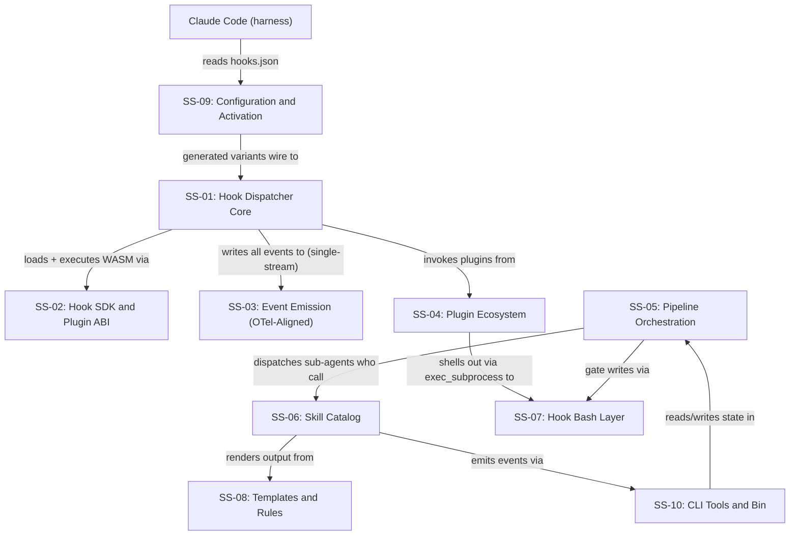

# Architecture Index: vsdd-factory

> **D-443(b)(i) + D-444(e)(ii) documentary-historical exemption (per D-414(c)):** Pre-v1.87-cohort changelog entries (ARCH v1.60..v1.86) are documentary-historical-exempt per D-414(c); the sample-vs-exhaustive flag introduced at pass-62 fix burst (D-442(c)) applies forward-only from ARCH v1.87+. Do NOT retroactively annotate or rewrite pre-v1.87 changelog entries.

> **Context Engineering:** This is a lightweight index (~350 tokens). Agents load
> ONLY the section files they need. See the Document Map for per-section consumer
> guidance.

## Document Map

| Section | File | Primary Consumer | Purpose |
|---------|------|-----------------|---------|
| SS-01 Hook Dispatcher Core | SS-01-hook-dispatcher.md | implementer, story-writer | Module catalog, host fns, sandbox model, Rust crates |
| SS-02 Hook SDK and Plugin ABI | SS-02-hook-sdk.md | implementer, plugin authors | SDK API, manifest schema, capability declarations |
| SS-03 Event Emission (OTel-Aligned) | SS-03-event-emission.md | implementer, story-writer | Single-stream FileSink, OTel schema, host enrichment, write-failure cascade. Old file SS-03-observability-sinks.md is SUPERSEDED (see ADR-015). |
| SS-04 Plugin Ecosystem | SS-04-plugin-ecosystem.md | implementer, story-writer | legacy-bash-adapter, capture-commit-activity, Tier E/F lifecycle plugin crates |
| SS-05 Pipeline Orchestration | SS-05-orchestration.md | orchestrator, story-writer | Agents, Lobster workflows, pipeline phase structure |
| SS-06 Skill Catalog | SS-06-skill-catalog.md | story-writer, skill authors | 119 skills, SKILL.md contract, output routing |
| SS-07 Hook Bash Layer | SS-07-hook-bash.md | implementer, formal-verifier | 44 bash hooks, registry bindings, exit code semantics |
| SS-08 Templates and Rules | SS-08-templates-rules.md | story-writer, implementer | 108 templates, 9 rules, template compliance contracts |
| SS-09 Configuration and Activation | SS-09-config-activation.md | implementer, story-writer | hooks.json variants, activation skill, CI platform config |
| SS-10 CLI Tools and Bin | SS-10-cli-tools.md | implementer, story-writer | 12 bin tools, 110 slash-command bindings |
| Verification Architecture | verification-architecture.md | formal-verifier, architect, story-writer | VP catalog by subsystem; proof method coverage totals; P0/P1 priority lists (Kani/proptest upgrade candidates); purity boundary; risk mitigations. Derived from VP-INDEX. v1.4 (D-624 pass-7 fix burst; architect bumped verification-architecture.md to v1.4). |
| Verification Coverage Matrix | verification-coverage-matrix.md | formal-verifier, story-writer | VP-to-module coverage table; per-subsystem tool breakdown; grand total arithmetic invariant (92 VPs). Derived from VP-INDEX §Full Index scope column. v1.2 (D-615 VP-092 added; SS-06 U 0→1; Grand Total 91→92). |

### Future Sections (Deferred)

The following cross-cutting documents were planned but are currently deferred.
The per-subsystem SS-NN files above collectively cover their content:

| Deferred File | Covered By |
|---------------|-----------|
| system-overview.md | ARCH-INDEX §Subsystem Registry + §Component Dependency Map |
| module-decomposition.md | SS-01..SS-10 section files + §Subsystem Registry |
| dependency-graph.md | §Component Dependency Map (Mermaid) in this file |
| api-surface.md | SS-01-hook-dispatcher.md, SS-02-hook-sdk.md |
| purity-boundary-map.md | SS-01..SS-04 section files (purity notes per module) |
| tooling-selection.md | VP-INDEX §Kani Upgrade Candidates + §Property-Test Upgrade Candidates |

## Cross-References

| If you need... | Read these together |
|----------------|-------------------|
| BC renumbering mapping | Subsystem Registry below (SS-NN → BC-S range) |
| Implementation plan for a module | SS-NN section file for that subsystem + §Subsystem Registry |
| Verification plan for a module | VP-INDEX.md + SS-07-hook-bash.md (for hook VPs) |
| Story decomposition input | SS-NN section files for relevant subsystems + §Component Dependency Map |

## Subsystem Registry

> **Source of truth** for subsystem names and IDs. BC frontmatter `subsystem:`,
> BC-INDEX subsystem column, story `subsystems:` fields, and PRD subsystem
> references MUST all use the exact Name from this table.

BC counts are shown by **authoritative subsystem** (BC frontmatter `subsystem:` field), not by directory location.

| SS-ID | Name | Section File | Implementing Modules / Folders | BC-S Prefix | BCs | Phase |
|-------|------|--------------|-------------------------------|-------------|-----|-------|
| SS-01 | Hook Dispatcher Core | SS-01-hook-dispatcher.md | `crates/factory-dispatcher/src/{main,registry,routing,executor,invoke,engine,plugin_loader,payload}.rs` | BC-1 | 118 (117 by directory + 1 reanchored: BC-7.06.001 frontmatter subsystem=SS-01 per F-P1-006; +1 BC-1.16.001 D-694 git_context injection) | Phase 1 |
| SS-02 | Hook SDK and Plugin ABI | SS-02-hook-sdk.md | `crates/hook-sdk/`, `crates/hook-sdk-macros/` | BC-2 | 26 (includes 2 D-183 BCs: BC-2.02.011 host::write_file, BC-2.02.012 HookPayload SubagentStop fields; +1 D-219 BC-2.02.013 host::run_subprocess — WITHDRAWN D-224; +1 D-321 BC-2.06.001 SDK semver bump) | Phase 1 |
| SS-03 | Event Emission (OTel-Aligned) | SS-03-event-emission.md | `crates/sink-core/` (FileSink; Router/SinkRegistry deprecated), `crates/sink-file/`, `crates/factory-dispatcher/src/{host/emit_event,internal_log,sinks}.rs` (`sink-otel-grpc/` deprecated Wave 1) | BC-3 | 56 (51 prior + 1 Phase 1b BC-3.05.004 v2 schema validation per ADR-015 D-15.1 (OQ-1 resolved in SS-03-event-emission.md) + 1 F2 pass-1 fix burst BC-3.08.001 async-semantics event catalog; +3 D-625 reconcile to BC-INDEX v3.06 ground truth) | Phase 1 |
| SS-04 | Plugin Ecosystem | SS-04-plugin-ecosystem.md | `crates/hook-plugins/legacy-bash-adapter/`, `crates/hook-plugins/capture-commit-activity/`, `crates/hook-plugins/capture-pr-activity/` [PLANNED S-3.02], `crates/hook-plugins/block-ai-attribution/` [PLANNED S-3.03], `crates/hook-plugins/session-start-telemetry/` [PLANNED S-5.01], `crates/hook-plugins/session-end-telemetry/` [PLANNED S-5.02], `crates/hook-plugins/worktree-hooks/` [PLANNED S-5.03], `crates/hook-plugins/tool-failure-hooks/` [PLANNED S-5.04], `crates/hook-plugins/validate-per-story-adversary-convergence/` [PLANNED], `crates/hook-plugins/validate-artifact-path/` [PLANNED] | BC-4 | 42 (+1 D-321 BC-4.09.001; +3 D-340 BC-4.10.001/002 + BC-4.11.001; +5 D-362 BC-4.12.001-005 resolver platform; +3 D-625 reconcile to BC-INDEX v3.06 ground truth including BC-4.13.001/BC-4.14.001/BC-4.15.001) | Phase 1 |
| SS-05 | Pipeline Orchestration | SS-05-orchestration.md | `plugins/vsdd-factory/agents/`, `plugins/vsdd-factory/workflows/*.lobster`, `plugins/vsdd-factory/workflows/phases/` | BC-5 | 655 (648 by directory + 4 reanchored: BC-8.29.001/002/003 + BC-8.30.002 frontmatter subsystem=SS-05; files remain in ss-08/ per POLICY 1; +3 D-625 reconcile to BC-INDEX v3.06 ground truth) | Phase 1 |
| SS-06 | Skill Catalog | SS-06-skill-catalog.md | `plugins/vsdd-factory/skills/` (119 skills, 581 markdown files) | BC-6 | 589 (+1 D-340 BC-6.22.001 relocate-artifact skill; +3 D-625 reconcile to BC-INDEX v3.06 ground truth including BC-6.23.001/BC-6.24.001/BC-6.25.001) | Phase 1 |
| SS-07 | Hook Bash Layer | SS-07-hook-bash.md | `plugins/vsdd-factory/hooks/*.sh` (44 scripts), `plugins/vsdd-factory/hooks-registry.toml`, `crates/hook-plugins/block-ai-attribution/` (PreToolUse + PostToolUse arms) | BC-7 | 201 (199 by directory − 1 reanchored: BC-7.06.001 is in ss-07/ but frontmatter subsystem=SS-01 per F-P1-006; +2 F-block-ai-attribution-message-file-arm: BC-7.03.094/095; +3 D-625 reconcile to BC-INDEX v3.06 ground truth including BC-7.07.001/BC-7.07.002) | Phase 1 |
| SS-08 | Templates and Rules | SS-08-templates-rules.md | `plugins/vsdd-factory/templates/` (108 files), `plugins/vsdd-factory/rules/` (9 files) | BC-8 | 222 (218 by directory − 4 reanchored: BC-8.29.001/002/003 + BC-8.30.002 frontmatter subsystem=SS-05; files remain in ss-08/ per POLICY 1; +8 D-625 reconcile to BC-INDEX v3.06 ground truth) | Phase 1 |
| SS-09 | Configuration and Activation | SS-09-config-activation.md | `plugins/vsdd-factory/hooks/hooks.json*`, `plugins/vsdd-factory/.claude-plugin/plugin.json`, `ci/platforms.yaml`, `scripts/generate-registry-from-hooks-json.sh` | BC-9 | 6 (+1 F2 pass-1 fix burst BC-9.01.006 envelope-sync invariant) | Phase 1 |
| SS-10 | CLI Tools and Bin | SS-10-cli-tools.md | `plugins/vsdd-factory/bin/` (12 tools), `plugins/vsdd-factory/commands/` (110 files), `scripts/` | BC-10 | 58 | Phase 1 |

**Total BCs: 1,973 (per BC-INDEX v3.42; counts above are by authoritative frontmatter subsystem).** Cross-subsystem file placements (POLICY 1 append-only): BC-7.06.001 in ss-07/ → SS-01 (F-P1-006 reanchor); BC-8.29.001/002/003 + BC-8.30.002 in ss-08/ → SS-05 (historical allocation). The total is invariant under both directory-based and frontmatter-based tallying.

**Renumbering history — BC-1.12.008 → BC-3.05.004 (D-311/D-312):** BC-1.12.008 was originally proposed as an SS-01 routing target in D-311; renumbered to BC-3.05.004 (SS-03) in D-312 corrigendum per POLICY 1 ID-collision rule (BC-3.05.001/002/003 already existed as brownfield BCs authored by codebase-analyzer on 2026-04-25; BC-3.05.004 was the next free slot). Consequence: SS-01 has +4 Phase 1a additions (BC-1.12.001–BC-1.12.004) and +4 Phase 1b additions (BC-1.12.005/006/007/009; no BC-1.12.008 ID exists). SS-03 has +1 Phase 1b addition (BC-3.05.004 v2 schema validation per ADR-015 D-15.1). OQ-W16-012 filed-and-resolved in D-312.

### Subsystem Registry Design Notes

The 10-subsystem layout reflects two first-class groups:

- **SS-01 through SS-04** are **Subsystem A** (Rust compiled artifacts). They share one Cargo workspace, one release binary per platform, and the WASM plugin ABI contract.
- **SS-05 through SS-10** are **Subsystem B** (VSDD orchestration framework). They share one plugin manifest, one marketplace entry, and the Lobster workflow format.

**Deviations from the suggested 10-subsystem template:**

- SS-05 was renamed from "Pipeline Orchestration" to "Pipeline Orchestration" — kept, but agents were moved in (34 agents belong here alongside workflows because agents are the steps' executors; splitting them would orphan the orchestrator).
- SS-06 "Skill Catalog" is the largest single BC surface (585 BCs as of v1.0.0-beta.6; see Subsystem Registry table for current count). It is intentionally a standalone subsystem because skills have independent behavioral contracts per skill (each SKILL.md is a discrete unit of behavior).
- SS-09 "Configuration and Activation" is narrower than the suggested name — it covers only the activation plumbing and CI variant generation, not general config. `hooks-registry.toml` routing lives in SS-07 (Hook Bash Layer) because it is the routing table for that layer.
- SS-10 merges "CLI Tools" and "Bin" because all 12 bin tools are CLI-invocable and the commands/ slash-command bindings are just thin wrappers around skills.

## Component Dependency Map

```mermaid
graph TD
    CC["Claude Code (harness)"]
    SS09["SS-09: Configuration and Activation"]
    SS01["SS-01: Hook Dispatcher Core"]
    SS02["SS-02: Hook SDK and Plugin ABI"]
    SS03["SS-03: Event Emission (OTel-Aligned)"]
    SS04["SS-04: Plugin Ecosystem"]
    SS05["SS-05: Pipeline Orchestration"]
    SS06["SS-06: Skill Catalog"]
    SS07["SS-07: Hook Bash Layer"]
    SS08["SS-08: Templates and Rules"]
    SS10["SS-10: CLI Tools and Bin"]

    CC -->|"reads hooks.json"| SS09
    SS09 -->|"generated variants wire to"| SS01
    SS01 -->|"loads + executes WASM via"| SS02
    SS01 -->|"writes all events to (single-stream)"| SS03
    SS01 -->|"invokes plugins from"| SS04
    SS04 -->|"shells out via exec_subprocess to"| SS07
    SS05 -->|"dispatches sub-agents who call"| SS06
    SS05 -->|"gate writes via"| SS07
    SS06 -->|"renders output from"| SS08
    SS06 -->|"emits events via"| SS10
    SS10 -->|"reads/writes state in"| SS05
```

**Strict dependency direction:** data flows down (CC → SS09 → SS01 → SS02/SS03/SS04 → SS07). The orchestration stack (SS-05/06/07/08/10) is a separate plane. SS-07 sits at the intersection: bash hooks are invoked by both SS-04 (via legacy-bash-adapter) and SS-05/SS-06 (as gates on tool use).

## Cross-Cutting Concerns

| Concern | Owner | Mechanism |
|---------|-------|-----------|
| Observability (single-stream) | SS-03 | `events-YYYY-MM-DD.jsonl` — all lifecycle + domain events (ADR-015). Debug file `dispatcher-internal-*.jsonl` opt-in via `VSDD_DEBUG_LOG=1`; ADR-007 amended. |
| Capability enforcement | SS-01 | Deny-by-default; cap-gated host fns emit denial event + return code |
| Schema versioning | SS-01, SS-09, SS-03 | per-config: `hooks-registry.toml` schema_version=2 (post-ADR-019; v1→v2 hard-error, no compat shim); `observability-config.toml` schema_version=2 (post-ADR-015 D-15.1; v1→v2 hard-errors with migration hint per BC-3.05.004 PC4); other TOML configs schema_version=1; mismatch = hard error per DI-014 |
| Trace correlation | SS-01 | `trace_id` (UUID v4) propagated on every emitted event (renamed from `dispatcher_trace_id` per DI-017 / ADR-015 v1.7) |
| Platform selection | SS-09 | Activation skill copies `hooks.json.<platform>` (ADR-009) |
| Error non-blocking | SS-01 | Registry/payload/engine errors → `internal.dispatcher_error` → exit 0 |
| Bash hook compatibility | SS-04 | `legacy-bash-adapter.wasm` via `exec_subprocess` (ADR-012) |
| Secrets protection | SS-07 | `protect-secrets.sh` PreToolUse gate + env_allow deny-by-default |

## Architecture Decisions

| ID | Decision Summary | Subsystems | File |
|----|-----------------|------------|------|
| ADR-001 | Compiled Rust dispatcher per platform | SS-01, SS-09 | decisions/ADR-001-rust-dispatcher.md |
| ADR-002 | WASM (wasmtime) plugin ABI | SS-01, SS-02, SS-04 | decisions/ADR-002-wasm-plugin-abi.md |
| ADR-003 | WASI preview 1 for v1.0; preview 2 deferred | SS-02, SS-04 | decisions/ADR-003-wasi-preview1.md |
| ADR-004 | TOML for all configuration files | SS-01, SS-09 | decisions/ADR-004-toml-config.md |
| ADR-005 | Multi-sink observability natively in dispatcher — **SUPERSEDED by [ADR-015](decisions/ADR-015-single-stream-otel-schema.md)** | SS-01, SS-03 | decisions/ADR-005-multi-sink-observability.md |
| ADR-006 | HOST_ABI_VERSION as separate semver constant | SS-01, SS-02 | decisions/ADR-006-host-abi-version.md |
| ADR-007 | Always-on dispatcher self-telemetry — **AMENDED by [ADR-015](decisions/ADR-015-single-stream-otel-schema.md)** | SS-01, SS-03 | decisions/ADR-007-always-on-telemetry.md |
| ADR-008 | Parallel-within-tier, sequential-between-tier execution | SS-01 | decisions/ADR-008-parallel-within-tier.md |
| ADR-009 | Activation-skill-driven platform binary selection | SS-09 | decisions/ADR-009-activation-platform-selection.md |
| ADR-010 | StoreData-typed linker for host functions (invoke.rs pattern) | SS-01, SS-02 | decisions/ADR-010-storedata-linker.md |
| ADR-011 | Dual hooks.json + hooks-registry.toml during migration | SS-07, SS-09 | decisions/ADR-011-dual-hook-routing-tables.md |
| ADR-012 | Legacy-bash-adapter as universal current router | SS-04, SS-07 | decisions/ADR-012-legacy-bash-adapter-router.md |
| ADR-013 | Cycle-keyed adversarial review structure | SS-05, SS-06 | decisions/ADR-013-adversarial-review-structure.md |
| ADR-014 | Tier-2 native WASM migration (latency-primary gate + bundle-size advisory + 30MB hard kill-switch) | SS-02, SS-04, SS-07 | decisions/ADR-014-tier-2-native-wasm-migration.md |
| ADR-015 | Single-stream OTel schema + producer-side enrichment — **ACCEPTED 2026-05-04; supersedes ADR-005, amends ADR-007** | SS-01, SS-03 | decisions/ADR-015-single-stream-otel-schema.md |
| ADR-016 | Artifact path registry as single source of truth for `.factory/` canonical paths — **ACCEPTED 2026-05-07; D-340 F2** | SS-04, SS-06 | decisions/ADR-016-artifact-path-registry-sot.md |
| ADR-017 | Per-story adversarial convergence gate — three-perimeter model and WASM hook phasing — **ACCEPTED 2026-05-07; D-340 F2** | SS-04, SS-05 | decisions/ADR-017-per-story-adversary-phasing.md |
| ADR-018 | WASM-plugin Context Resolvers — design and layering for factory-agnostic runtime context injection via sandboxed WASM-plugin resolvers — **ACCEPTED 2026-05-07; D-362 F2-amendment** | SS-01, SS-04 | decisions/ADR-018-wasm-plugin-context-resolvers.md |
| ADR-019 | Plugin Async Semantics Belong at the Registry Layer — hard cut to registry-layer `async: bool` per-plugin field; envelope uniformly synchronous; dispatcher partition (sync_group/async_group); CI lint `on_error=block ⇒ async=false` — **ACCEPTED 2026-05-07; F2 async-semantics; v1.8 (F2 pass-6 fix burst close: §Consequences inline 100ms parenthetical removed; cites DI-019 by reference; F-P6-005 closed)** | SS-01, SS-07, SS-09 | decisions/ADR-019-plugin-async-semantics-at-registry-layer.md |
| ADR-020 | Dispatcher Latency Budget Classes — defines Class A (binary-spawn current model, p95 ≤ 1500ms) and Class B (daemon-mode target, TBD); AC-016 in S-15.01 is anchored to Class A; S-15.02 escalation path for Class B — **ACCEPTED 2026-05-08; F5 pass-1 path-A; v1.0; rationale clarification F-P3-006 last_amended 2026-05-08** | SS-01 | decisions/ADR-020-dispatcher-latency-budget-classes.md |
| ADR-021 | WASM Plugin Cargo-Audit Integration Sandboxing — Option (b) bash pre-commit cache script + WASM reader hybrid; no D-337 exemption required (bash is data-provisioning tooling not a hook plugin); cache at `.factory/hooks/cargo-audit-cache.json`; WASM hook reads via `host::read_file`; cache-age warning + absent-file advisory (non-blocking) — **ACCEPTED 2026-05-15; S-15.03 wave M3 ADR batch; gates S-15.15 Part C (TD #74 Option b)** | SS-04, SS-07 | decisions/ADR-021-wasm-cargo-audit-sandboxing.md |
| ADR-022 | Hook Plugin Access to Current Adversary Pass Context — Option (c) pointer file at `.factory/current-adversary-pass.txt`; state-manager writes single-line integer (pass N, no trailing newline) at every Commit A; `validate-closes-completeness` reads via `host::read_file`; absent-file = non-blocking advisory; invalid-content = hard block — **ACCEPTED 2026-05-15; S-15.03 wave M3 ADR batch; gates S-15.13 Phase 2** | SS-04, SS-05 | decisions/ADR-022-hook-current-pass-context-discovery.md |
| ADR-023 | validate-trajectory-tail-cell-completeness cycle-conditional STATE.md Block-arm site model — Option (c) cycle-conditional: PC1/PC2 (Last Updated cell + Session Resume Section 1) always-Block on all cycles; PC3/PC4/PC5 (Phase Progress row, Concurrent Cycles row, Current Phase Steps rows) Block only when `per_pass_trajectory: true` in active cycle INDEX.md (F5-style per-pass cycles); milestone/story-delivery cycles omit flag (absence = false); INDEX.md cycle guard via path-component-walk; human-authorized un-seal of BC-5.39.009 SEALED D-522 — **ACCEPTED 2026-05-30; D-525 human-authorized; un-seal of BC-5.39.009 v1.8→v1.9; gates S-15.17** | SS-04, SS-05 | decisions/ADR-023-trajectory-tail-cell-completeness-cycle-conditional-site-model.md |
| ADR-024 | Dispatcher log-dir worktree-aware resolution, CLAUDE_PLUGIN_ROOT fail-loud contract, resolver WASM plugin path resolution, internal-error dedup, and destructive-guard shadow exception — 7-level resolution order (VSDD_LOG_DIR override → FACTORY_ROOT override → basename-is-.factory guard → walk-up ancestor → cwd-child .factory dir exists → git-worktree-main-root subprocess [200ms timeout] → cwd fallback); fail-loud-but-continue on absent CLAUDE_PLUGIN_ROOT; per-session dedup of `internal.dispatcher_error` (fixed-cap HashSet<u64>, cap 1024, bounded raw Value::as_str() at 4096-byte char-safe ceiling per v1.2 amendment); shadow exception in destructive-op guard uses lexical path-normalization predicate per v1.2 amendment; **v1.3 (S-18.14/D-676): Decision 1 Addendum — relative `plugin` paths in resolvers-registry.toml MUST resolve against path.parent() (CLAUDE_PLUGIN_ROOT), NOT process CWD — closes root cause of 8,560 resolver.load_error / 0 successful loads since rc.21; applies to `load_registry` + single production `get_or_compile` call site; Decision 5 — `dispatcher.started` MUST include `log_dir` from InternalLog::log_dir(); v1.4 (S-18.14 pass-1 adversary fix burst): §Decision 5 §Purity Boundary phantom `InternalLog::write_started` reference corrected to actual emission anchors; SS-04 advisory resolved NO: subsystem set remains SS-01/SS-03/SS-07; v1.5 (S-18.14 pass-2 adversary fix burst): §Decision 1 Addendum step 5 corrected — false 'two call sites' claim removed; ONE production `get_or_compile` call site in `load_registry` (TD-VSDD-060 sibling-sweep confirmed); `fail_closed` divergence is in post-call error `match`; `registry.rs::resolve_plugin_paths` / BC-1.01.004 proven precedent cross-referenced** — **ACCEPTED 2026-06-09; AMENDED v1.2 2026-06-10 (post-merge adversary convergence: dedup hash input bounded + guard predicate corrected + spec-drift process note); PR #179 squash-merged 89fbe2d6; issue #130 DELIVERED/MERGED; AMENDED v1.3 2026-06-22 (S-18.14 resolver WASM path + log_dir observability); AMENDED v1.4 2026-06-22 (S-18.14 pass-1 adversary fix burst: F-1 phantom method anchor corrected; F-5 SS-04 advisory resolved NO); AMENDED v1.5 2026-06-22 (S-18.14 pass-2 adversary fix burst: F-1 single call site corrected + BC-1.01.004 precedent cross-reference); **AMENDED v1.6 2026-06-22 (S-18.14 pass-4 adversary fix burst: F-2 §Files-to-change resolver_loader.rs row stale plural 'at all call sites' swept — reworded to single-production-call-site framing; sibling-sweep confirmed no other normative plural call-site framings); AMENDED v1.7 2026-06-22 (S-18.14 pass-7 adversary fix burst: F-1 Decision 5 'absolute path' guarantee made satisfiable — InternalLog::log_dir() is verbatim accessor with no absoluteness normalization; multiple resolution branches can return relative paths; made-it-true option (a): absolutization at emission site in main.rs via std::path::absolute() [stable Rust 1.79, toolchain 1.95.0] with unwrap_or_else fallback to verbatim; InternalLog::log_dir() unchanged; Decision 1 Addendum step 2 is_relative() guard made normative to mirror registry.rs::resolve_plugin_paths / BC-1.01.004 proven pattern — not relying on PathBuf::join absolute-replacement semantics which differ on Windows); requires rc release for operator-level cache**; **AMENDED v1.8 2026-06-22 (S-18.14 pass-9 adversary fix burst: F-1 BLOCKER §Decision 1 Addendum step 2 rationale corrected — v1.7 O-3 amendment introduced inverted is_relative() claim; correct Rust semantics: Path::is_relative() = !Path::is_absolute(); Windows \\foo has is_relative()=true (not false as previously stated); explicit guard and bare PathBuf::join produce behaviorally identical results on all platforms; genuine guard justification: sibling-consistency with registry.rs::resolve_plugin_paths (BC-1.01.004) + intent-clarity; false 'Windows portability requires guard vs bare join' claim removed; correct semantics per TD-VSDD-091); AMENDED v1.9 2026-06-22 (S-18.14 pre-ready hardening burst: A-1 phantom `toml_path` anchor corrected — `load_registry` param is `path: &Path`; steps 1/2/5 use `path.parent()` via alias `let toml_parent = path.parent()`; A-2 None-arm handling: `if let Some(base) = toml_parent { ... }` with explicit None-arm pass-through, matching registry.rs:354; A-4 §Files-to-change `resolver_loader.rs` row corrected `toml_path.parent()` → `path.parent()` + None-arm guard; p12-O1 §Decision 5 builder-chain `.with_field("log_dir", log_dir_abs.display().to_string())` made explicit — fragile `.to_string_lossy().as_ref()` form prohibited); **AMENDED v1.10 2026-06-22 (S-18.14 pass-18 fix burst: F-1 MAJOR POLICY 5: §Decision 1 Addendum step 1 phantom `, ...` parameter list removed — normative text cited `pub fn load_registry(&self, path: &Path, ...)` implying additional parameters; ground truth: exactly ONE parameter `path: &Path`; corrected citation: `pub fn load_registry(&self, path: &Path) -> Result<...>`; 'verified' attestation updated; sibling-sweep: zero additional `, ...`-in-paramlist normative sites; O-1: ADR-024 row v1.3 summary segment `toml_path.parent()` corrected to `path.parent()` for cross-cell consistency)** | SS-01, SS-03, SS-07 | decisions/ADR-024-dispatcher-log-dir-resolution-and-plugin-root-fail-loud.md |
| ADR-029 | Dispatcher git-context payload injection for WASM chain-detection gates — Option A (human-approved): dispatcher (host) execs git on PostToolUse Bash git-commit events; injects `git_context: {head_subject, head_sha, head_parent_subject, head_parent_sha}` into payload.extra; WASM plugins read payload field instead of calling exec_subprocess; removes PC1 violation in validate-burst-log + validate-dispatch-advance check_factory_artifacts_chain(); HOST_ABI_VERSION remains 1; trigger moves from Edit/Write PostToolUse to Bash PostToolUse (git commit detection); prerequisite story S-18.04b-prereq for dispatcher injection side; S-18.04b for WASM plugin rewiring; vp084-proof.bats schema corrected to tool="Bash" + head_sha/head_parent_sha fields; **Decision 8 (v1.2): S-18.04b LOCAL adversarial cascade F-P1-001 adjudication — mutation test found bats positive tests tautological for exemption decision (real PreCompact subjects are non-sentinel; block cannot fire regardless of exemption); architect determination: pure-Rust unit tests in `exemption.rs` (Section 1) are the load-bearing proof vehicle for `is_precompact_flush_exempt` 3-case decision; bats integration tests prove dispatcher injection plumbing + end-to-end chain-detection discrimination (negative-control Test 3 is mutation anchor); exemption is NOT dead code (defense-in-depth against future sentinel-set broadening); no production code change; BC-5.41.003 PC4 reworded (two-layer proof); VP-084 Feasibility Assessment updated (two-layer architecture)** — **PROPOSED 2026-06-24; ADR-029 v1.3; E-18 (CAP-032); SS-01 (dispatcher host) + SS-04 (WASM plugin consumer)** | SS-01, SS-04 | decisions/ADR-029-dispatcher-git-context-payload-injection.md |
| ADR-028 | E-18 precompact-flush native WASM migration — runtime worktree discovery and native lock renewal: (1) factory-artifacts worktree path discovered at runtime via `exec_subprocess("git", &["worktree","list","--porcelain"])` — parse for `refs/heads/factory-artifacts` stanza; no hard-coded path; no registry config key; absent-worktree → exit 0 advisory; (2) lock renewal native Rust in WASM via `crates/factory-lock::renew_lock()` — no bash exec; `binary_allow = ["git"]` ONLY; semantically faithful to `factory-lock-write.sh renew`: preserve `holder`+`locked_at`, update `expires_at = now + 2700s`; no-op when lock absent; fail-open (advisory) on malformed block; (3) new shared library crate `crates/factory-lock` (lib-only; no `[[bin]]`; no WASM output; depends on `crates/factory-lock-parse`; provides `renew_lock/acquire_lock/clear_lock`; reusable by future native WASM plugins); (4) canonical execution order: native renew (step 3) before git add (step 4) — renewed `expires_at` included in flush commit; (5) standing ADR-014 policy: native WASM only for new hooks; `binary_allow = ["git"]` no bash; bash `factory-lock-write.sh` retained for agent/skill callers (ADR-025 §D11 Mechanism 1); BC-6.23.001 + S-17.04 NO amendment needed; BC-7.07.001 amendment required (PC1 registry stanza → native WASM; PC3/INV3-step3 → native Rust; INV6 → Rust error handling; Arch Anchors → WASM crate + crates/factory-lock); S-18.04a amendment required (target_module → Rust crate; file list → Rust deliverables; ACs for worktree discovery + native renewal + Red Gate cargo unit + bats) — **ACCEPTED 2026-06-20; ADR-028 v1.0. AMENDED 2026-06-20 v1.1 (adversarial review remediation: F-NW-001 env_allow PATH+SSH_AUTH_SOCK; F-NW-002 path_allow domain/canonical-.factory/-mount invariant; F-NW-003 uniform git -C mandate; F-NW-004 renew_lock() Err→caller-downgrade; F-NW-005 parse-result→renew-outcome mapping; F-NW-007 log-append concurrency grounded-doc; F-NW-008 expires_at format YYYY-MM-DDTHH:MM:SSZ; F-NW-009 CRLF+mode native contract). AMENDED 2026-06-20 v1.2 (consolidated design-fix: write_file.rs false-blocker resolved — production invoke.rs cwd-rooted — confirmed viable; PREREQUISITE S-18.04a-prereq for write_file.rs align + BC-2.02.011 Inv3 + bats equal-roots; F-NW2-004 committer identity via HOME/.gitconfig; F-NW2-005 renew_lock() pure content sig; F-NW2-006 factory_lock: presence pre-check; F-NW2-007 empty-commit precedence; F-NW2-008 read_file absent-as-empty; F-NW2-009 LOUD advisory). AMENDED 2026-06-20 v1.3 (final spec-fix — round-3 adversarial review: F-R3-001 non-standard-mount hazard RESOLVED — 'supports non-standard mounts' portability rationale STRUCK; startup canonicalize assertion added: canonicalize(discovered) != canonicalize(<cwd>/.factory) → DURABILITY DEGRADED advisory + exit 0; F-R3-002 has_factory_lock_key() scan region pinned to awk f==1 semantics — frontmatter only; open-fence→EOF bash parity confirmed NOT divergence; open-fence+lock-key present → Err(Malformed); F-R3-003 staging adjudicated → git add -A recommended over git add -u; untracked-new .factory/ files captured; EC-008 reclassified LOW; F-R3-005 renew_lock returns Ok(NoOp) on byte-identical expires_at (same second); F-R3-006 wrong-branch Red Gate added (bats: develop HEAD unchanged after flush); F-R3-007 committer==holder not validated — documented acceptable; CV-002 Decision 4 forward-reference to Decision 9 binding RenewOutcome form); NO new capability/ABI/release-blocker; E-18 (CAP-032 context-durability); SS-04 (WASM plugin crate; shared library crate) + SS-07 (registry stanza migration from legacy-bash-adapter)** | SS-04, SS-07 | decisions/ADR-028-e18-precompact-flush-native-wasm-migration.md |
| ADR-027 | Factory-artifacts worktree path discipline for shell skills — canonical wiring convention for all E-18 shell skills that read from and commit to the factory-artifacts orphan branch; resolves F-S1801-P3-001 BLOCKER (ARTIFACTS_WT semantic contradiction); four decisions: (1) ARTIFACTS_WT = factory-artifacts worktree root (`.factory` in production) — `${ARTIFACTS_WT}/.factory/…` double-nesting FORBIDDEN; specs/STATE.md read as `${ARTIFACTS_WT}/specs/…` and `${ARTIFACTS_WT}/STATE.md` directly; (2) two-arg invocation model — `--artifacts-worktree` for the worktree root, `--sprint-state` and `--state-md` as explicit separate args for hermetic bats fixture isolation; (3) bats fixture correction — fixture files placed under `$ARTIFACTS_WT/…` not `$ARTIFACTS_WT/.factory/…` (the `--bc-dir` arg is explicit, suppressing derivation errors in test isolation); (4) sibling confirmation — S-18.04a (precompact-flush.sh) already uses `FACTORY_ARTIFACTS_PATH` with the same semantics; S-18.05 (postcompact-reanchor.sh) uses `git show factory-artifacts:…` branch-ref syntax (no path ambiguity); ADR-027 is the shared convention for all E-18 shell skills — **ACCEPTED 2026-06-18; resolves F-S1801-P3-001 BLOCKER; S-18.01 story updated to v1.5 with §Canonical Wiring Contract section; v1.1 amended 2026-06-18 (D-643 F-P11-003 MEDIUM: §Decision 3 Note + §Consequences corrected — no-nesting fixture layout; §Decision 3 Note describing `.factory/.factory` double-nesting removed)** | SS-05, SS-06, SS-07 | decisions/ADR-027-factory-artifacts-worktree-path-discipline-for-shell-skills.md |
| ADR-026 | Wave-boundary checkpoint+reset and lossless intra-wave compaction — wave-close gate requires verified HANDOFF.md (anti-fabrication; wave_id derives from sprint-state.yaml/STATE.md real fields, NOT phantom current_wave:); PreCompact synchronous flush (blocking exit 2, hermetic, lock-renewal no-op when factory_lock absent; 30s timeout; hung push fails open); PostCompact advisory re-anchor (best-effort; NOT in CAP-032 guarantee chain); curated wave-state.yaml scoped rehydration (next_wave_stories from sprint-state.yaml status:pending/draft; empty = hard error UNLESS EPIC-COMPLETE); validate-wave-handoff-completeness WASM gate (wave-1 no-op); precompact-flush.sh shell hook (corrected TOML: plugin=hook-plugins/legacy-bash-adapter.wasm); 70% proactive threshold via CLAUDE_AUTOCOMPACT_PCT_OVERRIDE (MEDIUM-confidence 83% ceiling); PreCompact flush lifecycle distinct from TD-VSDD-053 burst lifecycle; harness precondition ≥ v2.1.105 (runtime-checked via Decision 13 + check-state-health; honest degrade on older harness); SS-08 NOT in anchors (S-18.07 doc-only no-BC; S-18.06 advisory-only no-BC in v1); VP-086 allocated (BC-1.15.001 PC4 exit-2 propagation); D3 auto-reset / D4 RAG / D5 per-autonomy-level threshold explicit v2 deferrals — **ACCEPTED 2026-06-14; v1.1 amended 2026-06-14 (F2 adversarial-pass-1); v1.2 amended 2026-06-14 (F2 adversarial-pass-2 — canonical §Wave-Identity Derivation; crash-consistency append-only precompact-flush-log; EPIC-COMPLETE terminal-wave discriminator); v1.3 amended 2026-06-14 (F2 adversarial-pass-3 COMPLETE-SWEEP — precompact-flush-log four-field format; WASM corroboration without live git exec; EPIC-COMPLETE terminal set {merged, withdrawn, cancelled}); v1.4 amended 2026-06-14 (F2 adversarial-pass-4 — F-P4-001: append-failure→exit-2 (log always consistent when compaction proceeds); O-P4-004: WASM reads embedded field-4, shell execs git cat-file-t — canonical WASM/shell division explicit; §F-P4-004 PO Wording section with exact PC1/Inv1/EC-003 replacement text; O-P4-001: §VP Allocations stale narrative fixed); **v1.5 amended 2026-06-14 (F2 adversarial-pass-5 — F-P5-002: reset-on-append-failure added to Decision 6 step 6 + §Decision A: git reset --soft HEAD~1 before exit 2 eliminates orphan un-logged flush commits; stale-entry case (b) label corrected from `write-before-push crash` (impossible) to `log corruption or truncation`; BC-5.41.003 PC1/Inv1/EC-003 PO wording updated; BC-7.07.001 PC8 update section added; O-P5-002: §Decision A heading added as DI-025 anchor; F-P5-004: VP-084 v1.4→v1.5 harness re-anchored from validate-burst-log.sh to factory-dispatcher WASM invocation; VP-INDEX v2.10→v2.11); v1.6 amended 2026-06-14 (F2 adversarial-pass-6 — GOVERNANCE: BC Traceability cite convention adopted (TD-VSDD-091): load-bearing version tokens in BC ADR Traceability rows replaced with stable `ADR-026 §Decision N` form; F-P6-006: SHA-pinned concurrent-commit race guard for reset-on-append-failure (NOT HEAD~1; guard against HEAD advancing past SHA_B); F-P6-004: HANDOFF.md field-count reconciliation — epic_status as conditional 10th field (required on EPIC-COMPLETE wave only, absent on non-final waves); BC-4.14.001 + BC-5.41.001 change specs in §F-P6-004 PO Wording); **v1.7 amended 2026-06-14 (F2 adversarial-pass-7 — F-P7-001: §F-P6-004 PO Wording BC-4.14.001 change-spec corrected to PAYLOAD-ONLY EPIC-COMPLETE discriminator (next_wave_stories: [] in current payload → EPIC-COMPLETE; NO git/filesystem read of prior HANDOFF.md; satisfies BC-4.14.001 Invariant 1 pure-parse constraint; shell wave-gate BC-5.41.002 retains broken-sprint-state discrimination); F-P7-002: §Traceability downstream-index provenance trace completed through v2.35 (VP-INDEX v2.11→v2.12 leg added; ARCH-INDEX v2.33→v2.34 and v2.34→v2.35 legs added)); **v1.8 amended 2026-06-14 (F2 adversarial-pass-9 — F-P9-001: §F-P5-002 PC8 block annotated SUPERSEDED by §F-P6-006; HEAD~1 tokens in §Decision A + §F-P5-002 PC8 replaced/annotated as historical-only — live prescriptions now reference SHA-pinned `SHA_B^` + concurrent-commit guard per §F-P6-006; test-vector note updated (assert `SHA_B^` not `HEAD~1`; both reset and no-reset paths); F-P9-002: VP-INDEX VP-082 row description appended with append-failure → SHA-pinned reset (SHA_B^) + concurrent-commit guard; VP-INDEX v2.12→v2.13; ARCH-INDEX v2.35→v2.36); **v1.9 amended 2026-06-14 (F2 adversarial-pass-10 — F-P10-001: §Decision 9 wave-1 discriminator corrected to PAYLOAD-ONLY: gate computes `is_first_wave = (payload.wave_id == 1)` from Write/Edit tool-call payload — NO sprint-state.yaml read, NO factory-artifacts probe, NO git access; 'prior HANDOFF.md absence / sprint-state.yaml ordinal' proxy framing superseded; §F-P10-001 PO Wording section added with exact BC-4.14.001 change spec for all sprint-state/factory-artifacts/HANDOFF-absence sites; F-P10-002 NOTE: §Decision 6 push-step commit-vs-push contract explicitly stated in §F-P10-002 PO Note for BC-7.07.001 PC6/PC8/EC-003 alignment (PO-owned BC fix); F-P10-003: VP-082 v1.3→v1.4 Postcondition E added to VP-082.md body (append-failure → SHA-pinned reset `SHA_B^` + concurrent-commit guard per §F-P6-006); VP-INDEX v2.13→v2.14 (VP-082 row version cell updated; total_vps 86 unchanged); ARCH-INDEX v2.36→v2.37); **v1.10 amended 2026-06-15 (F2 pass-14 consistency-re-sweep remediation D-577 — CV-P14-001 MAJOR: §Decision 2 precompact_flush_sha schema row + Wave-1 and Genuine-Log-Absence special cases note reconciled to BC-5.41.001 v1.8 three-case null-SHA rule (null wave=1 unconditional; null wave>1 + log-absent → advisory; null wave>1 + log-exists-valid-FIELD-4 → HARD BLOCK; corruption → EXEMPT per DI-025/§F-P4-004 unchanged); CV-P14-002 MINOR: BC-5.41.001 v1.8→v1.9 EC-011 hard-block mechanism aligned to PC5 FIELD-4 corroboration; removed live git cat-file -t implication inconsistent with pure-parse capability; §F-P4-004/§Decision A/§Crash-Consistency arms UNCHANGED; ARCH-INDEX v2.37→v2.38); **v1.11 amended 2026-06-15 (D-578 F2 ADV PASS-15 NOT-CLEAN FIX BURST — F-P15-002 LOW: §Decision 2 precompact_flush_sha cite de-versioned — 'BC-5.41.001 v1.8' volatile version token replaced with stable '§PC2/§PC5/EC-006/EC-011' anchor form per POLICY 19 / TD-VSDD-091 anti-volatile-pin cite convention; §Traceability downstream-index provenance leg appended: VP-INDEX v2.18→v2.19 (VP-082 v1.6→v1.7 F-P15-001/005; VP-081 v1.3→v1.4 F-P15-003; VP-083 v1.3→v1.4 F-P15-004); no behavioral change; ARCH-INDEX v2.38→v2.39); **v1.12 amended 2026-06-15 (D-580 F2 ADV PASS-17 NOT-CLEAN FIX BURST — F-P17-001 MED security: §Decision 2 precompact_flush_sha null rule made WAVE-AGNOSTIC for the log-present-and-valid case — prior form permitted null unconditionally on wave_id=1 even when a real mid-wave-1 PreCompact flush left a valid log entry (reopened fabricated/dropped-SHA class DI-021/CAP-032 for the first wave); new uniform three-state rule applied to ALL wave_ids: (1) log genuinely absent → null valid (wave-1 advisory; wave>1 advisory); (2) log corrupt/truncated → null EXEMPT per DI-025/§F-P4-004 (any wave_id; WASM-gate pure-parse boundary unchanged); (3) log present + valid FIELD-4==commit → null HARD BLOCK (PrecompactShaMismatch) ANY wave_id INCLUDING wave-1; new TV wave-1-null-sha-log-present-hard-block added; F-P17-002 LOW: BC-5.41.001 EC table reordered ascending (append-only IDs preserved); §Traceability ARCH-INDEX v2.39→v2.40 provenance leg appended; ARCH-INDEX v2.39→v2.40); **v1.13 amended 2026-06-15 (D-582 F2 ADV PASS-19 NOT-CLEAN FIX BURST — F-P19-002 MED BC↔ADR contradiction: §Decision 9 heading retitled 'non-HANDOFF.md writes' (prior 'HANDOFF.md Absent' framing was a cross-reference-strand stale from F-P15-004 BC-title fix; §Decision 9 fires when the write tool-call target is NOT HANDOFF.md, not specifically when HANDOFF.md is absent); HandoffMissing re-attributed — disjoint-boundary paragraph added explicitly stating HandoffMissing is the SHELL wave-gate (BC-5.41.001 PC9) error code for the absent-HANDOFF-at-wave-close path, disjoint from WASM HandoffIncomplete (BC-4.14.001 EC-011, file-present-fields-missing path); §BC-Traceability table + §Risk F1-R3 cross-reference swept and updated to reflect corrected §Decision 9 title; §Traceability ARCH-INDEX v2.40→v2.41 provenance leg appended; ARCH-INDEX v2.40→v2.41); **v1.14 amended 2026-06-15 (D-583 F2 ADV PASS-20 NOT-CLEAN FIX BURST — F-P20-002 LOW: §Wave-Identity-Derivation cross-note added reconciling caller-side prior-HANDOFF.md-absence proxy (SHELL wave-gate BC-5.41.001 derives wave_id before embedding in payload) vs WASM PAYLOAD-ONLY discriminator (BC-4.14.001 validate-wave-handoff-completeness reads payload.wave_id==1 inside sandbox, never filesystem/git); §Decision 9 normative payload-only statement unchanged (F-P10-001 v1.9 closure authoritative); cross-note prevents recurring layer-conflation mis-reads; §Traceability ARCH-INDEX v2.41→v2.42 provenance leg appended; ARCH-INDEX v2.41→v2.42); **v1.15 amended 2026-06-15 (D-587 F2 ADV PASS-24 NOT-CLEAN COMPREHENSIVE CLEANUP — F-P22-001 MEDIUM + F-P23-001 MEDIUM + field-4 canonical (B) reconciliation: (F-P22-001) §VP Allocations table row corrected: VP-081 title updated to current H1 'Wave Cannot Close Without Verified Handoff (wave_id > 1)' + qualifier; VP-083 title updated to current H1 'Completeness Gate Is No-Op on Wave-1 or Non-HANDOFF.md Writes'; (F-P23-001) §Decision 6 numbered step list re-sequenced — prior ordering enumerated crash-recovery arm (push-fail) before stating the push step itself; corrected ordering: (1) commit(local) capturing SHA_B; (2) append ISO-timestamp+SHA_B+cycle/step+commit to precompact-flush-log; (3) push(remote) SHA_B; (4) on push failure after successful commit+append → exit 2 (local commit + log entry retained; retry is push-only); (5) on append failure → SHA-pinned reset + exit 2; (field-4 canonical B) §Decision 6 + §Crash-Consistency Design reconciled to canonical (B): shell hook executes `git cat-file -t SHA_B` at write time (OR embeds literal `commit`; both yield token `commit`) — the v1.16 BLOCKER (F-P16-001 DI-025 Enforcement-owner amendment) scoped no-git-exec to WASM-ONLY (WASM reads field-4 STATICALLY from the persisted log without git-exec); prior (A) over-reading ('no-git-exec anywhere') contradicted the §F-P4-004 'WASM reads embedded field; shell execs git cat-file -t' clause; canonical (B) restores internal consistency across §Decision 6, §Crash-Consistency, and §F-P4-004 OWording; §Traceability ARCH-INDEX v2.42→v2.43 provenance leg appended; ARCH-INDEX v2.42→v2.43)**; **v1.16 amended 2026-06-15 (D-588 F2 ADV PASS-25 NOT-CLEAN FIX BURST — F-P25-002 MED CARVE-OUT + F-P25-003 LOW: (F-P25-002) §Decision 9 5-step canonical order revised — EPIC-COMPLETE branch (next_wave_stories: []) evaluated BEFORE the wave_id==1 no-op; single-wave EPIC-COMPLETE payloads now validated rather than short-circuited; see ADR-026 §Decision 9 canonical 5-step order for the normative sequence (non-HANDOFF.md no-op → EPIC-COMPLETE check → wave_id==1 no-op → wave_id>1 validation → wave_id-absent fail-closed); (F-P25-003) §VP Allocations table row VP-082/VP-084/VP-085 title cells synced verbatim to current H1 forms (sibling-sweep per POLICY 5); §Traceability ARCH-INDEX v2.43→v2.44 provenance leg appended; ARCH-INDEX v2.43→v2.44)**; **v1.17 amended 2026-06-15 (D-591 F2 ADV PASS-28 NOT-CLEAN FIX BURST — F-P28-002-sibling MED normative side-channel→precompact-flush-log term migration: 2 normative-present-tense 'side-channel file' residue sites migrated: (1) §BC Traceability Cite Convention table BC-5.41.001 Replacement-text cell corrected — 'precompact_flush_sha hard cross-check against side-channel file' → 'precompact_flush_sha hard cross-check against precompact-flush-log (append-only)' (this is the normative PO-facing replacement text for BC-5.41.001; stale term would propagate verbatim into the BC); (2) §Decision 2 HANDOFF.md schema precompact_flush_sha Source column corrected — 'precompact-flush-log append-only side-channel file (last-line SHA field)' → 'precompact-flush-log (append-only) (last-line SHA field)' (stale 'side-channel file' qualifier removed; canonical name is precompact-flush-log (append-only) per DI-025/BC-5.41.001/BC-5.41.003/BC-7.07.001); §Decision-A historical rationale 'side-channel' uses retained (historical-rationale; explicitly describe OLD superseded point-file design or show old BC text to be replaced); invariants.md CONFIRMED clean at v1.20 — DI-025 normative text already uses precompact-flush-log; §Traceability ARCH-INDEX v2.44→v2.45 provenance leg appended; ARCH-INDEX v2.44→v2.45)**; **v1.18 amended 2026-06-15 (D-594 F2 E-18 ADV PASS-31 NOT-CLEAN FULL BACKLOG CLEARANCE — F-P31-001 bonus site + F-P27-001 narrative fix: (F-P31-001 bonus) §Decision 6 step 5 precompact-flush-log cite corrected — 'append to precompact-flush-log (append-only side-channel log)' → 'append to precompact-flush-log (append-only log)'; stale 'side-channel' adjective removed from the final surviving normative ADR site; exhaustive sweep confirms stale-term class now CLOSED across all normative VP/ADR sites; §Decision-A historical-rationale uses retained (explicitly document OLD superseded point-file design); (F-P27-001 NARRATIVE-FIX) §Traceability ARCH-INDEX v2.45→v2.46 provenance leg appended; ARCH-INDEX v2.45→v2.46)**; **v1.19 amended 2026-06-15 (D-600 F2 ADV PASS-37 NOT-CLEAN FIX BURST — F-P37-001 MED semantic-anchoring/scope: SS-01 added to `anchors:` and `subsystems_affected:` frontmatter; §SS-08 Scope Clarification extended to explain SS-01 inclusion via Decision 11 dispatcher routing (BC-1.15.001/VP-086/CAP-032 all confirm SS-01 in-scope; ADR was sole artifact dropping it); §Traceability 'potentially SS-01 per S-18.00 outcome' stale hedge corrected to definitive confirmation; §Traceability ARCH-INDEX v2.46→v2.47 provenance leg appended; ARCH-INDEX v2.46→v2.47)**; **v1.20 amended 2026-06-16 (D-612 INTEGRATION BURST — §Decision 12 'S-18.06 advisory-only no-BC in v1' corrected to 'BC-4.15.001 required' (BC-4.15.001 now authored; §Deliverables S-18.06 row updated correspondingly); §Traceability ARCH-INDEX v2.49→v2.50 provenance leg appended; ARCH-INDEX v2.49→v2.50)**; **v1.21 amended 2026-06-16 (D-615 E-18 STORY PASS-1 FIX WAVE INTEGRATION BURST — S-18.10 §Deliverables row added (check-state-health CLAUDE_AUTOCOMPACT_PCT_OVERRIDE advisory verification; BC-6.25.001; VP-092; wave 6; DI-020); §Traceability ARCH-INDEX v2.50→v2.51 provenance leg appended; ARCH-INDEX v2.50→v2.51)**; **v1.22 amended 2026-06-19 (D-653 S-18.13 SPEC-EVOLUTION burst — §Decision 8 HANDOFF.md Write-tool write-path constraint added: wave-handoff skill MUST write HANDOFF.md via the Claude Code Write tool (not bash redirection) so the PostToolUse validate-wave-handoff-completeness gate fires on every HANDOFF.md write; bash redirection emits NO PostToolUse event — BC-4.14.001 completeness gate is functionally inert in production under bash path; the producer MUST NOT silently fall back to bash if Write tool unavailable — fail loudly (see S-18.13 EC-003); §Traceability ARCH-INDEX v2.57→v2.58 provenance leg appended; ARCH-INDEX v2.57→v2.58)**; **v1.23 amended 2026-06-19 (D-656 S-18.13 RESTRUCTURE REDESIGN — §Decision 8 rewritten to four-step agent-orchestrated emit→Write→commit control flow: (1) `--emit-handoff` bash subcommand assembles HANDOFF.md payload → stdout (NO disk write, NO commit); (2) agent Write tool step captures stdout + invokes Write tool to write `${ARTIFACTS_WT}/HANDOFF.md`; PostToolUse validate-wave-handoff-completeness gate fires; (3) `--emit-wave-state` subcommand writes wave-state.yaml to disk; (4) `--commit` subcommand stages HANDOFF.md + wave-state.yaml ONE atomic git commit; fail-loud-no-fallback: Write tool unavailable → hard error HandoffWriteToolUnavailable; HANDOFF.md absent at `--commit` time → hard error HandoffFileAbsent EC-017; supersedes impossible 'bash function routes through Write tool' wording in v1.22 — v1.22 premise was architecturally impossible per F-SP13-P3-001 CRITICAL + F-SP13-P3-002 HIGH (pass-3 fresh-context adversary); §Traceability ARCH-INDEX v2.58→v2.59 provenance leg appended; ARCH-INDEX v2.58→v2.59)**; **v1.24 amended 2026-06-19 (D-657 S-18.13 spec-cascade LOCAL pass-5 NOT-CLEAN fix burst — F-SP13-P5-001 CRITICAL: §Decision 8 Step 5 `--commit` both-files-or-hard-abort guard broke EPIC-COMPLETE arm (no wave-state.yaml produced on EPIC-COMPLETE → epic-close impossible; regression vs current code); EPIC-COMPLETE carve-out added to §Decision 8 Step 5: HAS-NEXT-WAVE arm: `--commit` verifies BOTH HANDOFF.md + wave-state.yaml present before staging, hard-abort if EITHER absent; EPIC-COMPLETE arm (epic_status:complete / next_wave_stories:[]): `--commit` verifies HANDOFF.md present, stages HANDOFF.md alone, removes stale wave-state.yaml if present, hard-abort ONLY on missing HANDOFF.md; EC-017 HandoffFileAbsent fires on missing HANDOFF.md on BOTH arms; single-file (HANDOFF.md-only) commit on EPIC-COMPLETE is not a BC-5.41.002 PC6 violation (PC6 forbids two separate commits, not a one-file commit); §Traceability ARCH-INDEX v2.59→v2.60 provenance leg appended; ARCH-INDEX v2.59→v2.60)**; **v1.25 amended 2026-06-25 (S-18.05 LOCAL adversary fix burst — F-P1-001/F-P1-003/F-P1-004 adjudication: (F-P1-001 MEDIUM load-bearing) §Decision 7 SHA source corrected — phantom `last_verified_develop_sha:` STATE.md field DOES NOT EXIST (it is a HANDOFF.md field per §Decision 2); corrected source: `git rev-parse origin/develop` executed at hook invocation time; re-anchor block emits `sha=<40-char-hex>` from live git query; JSONL log field renamed `develop_sha`; advisory/best-effort nature preserved per DI-024 (git-network failure → sha=UNKNOWN gracefully); (F-P1-003 MEDIUM) §Decision 7 canonical TOML corrected: env_allow fixed to [PATH,HOME,TMPDIR,CLAUDE_PROJECT_DIR,CLAUDE_PLUGIN_ROOT,VSDD_SESSION_ID,GIT_CONFIG_GLOBAL,XDG_CONFIG_HOME] (GIT_DIR was test-fixture artifact; GIT_CONFIG_GLOBAL+XDG_CONFIG_HOME added matching Decision 6 canonical pattern for git-running hooks); read_file capability replaced with write_file path_allow=[.factory/logs/] (STATE.md read via git-show subprocess, not read_file; only direct filesystem write is JSONL log); capabilities block IS required per BC-7.07.002 PC1 (story AC-010 omitting it is a story defect, not an architectural question); (F-P1-004 MEDIUM) generator retirement confirmed: hooks-registry.toml header declares generator RETIRED as of v1.0.0 (human-edited SoT); S-18.05 worktree edits to scripts/generate-registry-from-hooks-json.sh and scripts/legacy/hooks-json-pre-templating.json are dead code — implementer must revert both files; only hooks-registry.toml contains canonical postcompact-reanchor entry; §Traceability ARCH-INDEX v2.76→v2.77 provenance leg appended); F2 E-18 (CAP-032 context-durability); issue #173; all OQ-18-001..004 resolved by LOCKED DECISIONS D1–D5**; **v1.26 amended 2026-06-25 (S-18.05 LOCAL adversary P2 fix burst — state-manager: F-P2-001 MEDIUM: §Decision 7 log-schema field + proof-harness skeleton swept `last_verified_develop_sha`→`develop_sha`; incomplete v1.25 propagation — §1 source-field corrected but §2 schema missed; aligns §Decision 7 log schema with BC-7.07.002 PC2 v1.13 + hook output; §Traceability ARCH-INDEX v2.77→v2.78 provenance leg appended)**; **v1.27 amended 2026-06-26 (SEC-002 fix burst — architect: §Decision 12 SEC-002 Redaction Sub-clause initial: redact-then-truncate ordering mandate; no-regex two-pass algorithm: Pass 1 flag-argument masking with trigger list including `--key`, `--token`, `--password`, `--secret`, `--api-key`, `--auth`, `--bearer`, `--credential`, `--private-key`, `--access-key`, `--secret-key`; Pass 2 inline assignment/Authorization/Bearer masking; mask token `***REDACTED***`; hard-coded non-configurable trigger list; false-negative acknowledgment; invariant-preservation note. VP-091 §6 initial authored in same burst)**; **v1.28 amended 2026-06-26 (SEC-002 revised fix burst — architect: §Decision 12 SEC-002 Redaction Sub-clause replaced with final canonical 4-pass design: best-effort-advisory framing (not a security boundary; aligned with GitLab/Warp best-effort masking guidance); mask token `***REDACTED***` (14 ASCII chars, corrected from v1.27 erroneous earlier counts); Pass 1 flag-argument masking (flag name lowercased, equals-or-contains trigger keywords; bare `--key` REMOVED — false-positive trap; no bare short flags); Pass 2 env-var assignment-prefix masking (compound triggers only; bare KEY not matched; allowlist SSH_AUTH_SOCK/SSH_ASKPASS/*_SERVICE_HOST checked first); Pass 3 Authorization/Cookie/Set-Cookie header masking; Pass 4 inline URL credential masking (`://user:pass@host` → `://***REDACTED***@host`); provider-prefix shape detection (sk-/AKIA/ghp_) explicitly deferred as documented future enhancement; EC-020 redact-then-truncate ordering invariant preserved. VP-091 §6 revised to 7 postconditions (PC6a–PC6g) in same burst. §Traceability ARCH-INDEX v2.78→v2.79 provenance leg appended)**; **v1.29 amended 2026-06-26 (S-18.06 Pass-3 bounded-consumption spec propagation — state-manager: §Decision 12 Pass-3 bounded-consumption rule added per BC-4.15.001 v1.5 + VP-091 v1.5; AC-012 updated to Pass-3 bounded-consumption (Form A/B + EC-022..025); Red Gate 31 total; S-18.06 v1.11 input-hash re-baselined 4af2745→4a23966. §Traceability ARCH-INDEX v2.79→v2.80 provenance leg appended)**; **v1.30 amended 2026-06-27 (D-704 governance burst — state-manager: §Decision 14 authored by architect — pure-parse invariant consistency gate 3-layer detection algorithm: normative-section extraction (`awk` H2 anchor extraction from `## Preconditions` to `## Related BCs`), verb+substrate collocation (`grep -Ei` read-verb pattern within 80 chars of sprint-state.yaml/git-log/git-cat-file), negation/comment exclusion (`grep -Eiv` negation-cue filter + `grep -Ev` Rust comment filter); VP scan whole-file; machine-executable gate commands specified; honest residual-risk statement; positive control (1 HITS injection); empirical validation on current corpus (BC-4.14.001/BC-4.15.001/VP-083/VP-081/VP-091 all = 0 genuine violations); §Decision 8 companion relationship; S-18.08 story anchor; human-adjudicated S-18.08 gate redesign; ADR-026.md input path in S-18.08 corrected to canonical decisions/ slug path; S-18.08 input-hash recomputed 747b3eb→fe61c2c; §Traceability ARCH-INDEX v2.80→v2.81 provenance leg appended; 4-index: BC-INDEX v3.52 / VP-INDEX v2.51 / STORY-INDEX v4.89 / ARCH-INDEX v2.81)**; **v1.31 amended 2026-06-27 (D-705 gate-REFINEMENT governance burst — state-manager: §Decision 14 REFINEMENT (LOCAL adv P1 F-P1-001/F-P1-002, architect-refined): discovery anchored to `## Invariants` section (awk scans only that section — structurally excludes BC-INDEX.md and ~190 SS-07 prose-mentions matched by prior `grep -rl "pure.parse"`); Layer-1 awk whitelist terminator (stops at first `## ` heading NOT in `{Preconditions, Postconditions, Invariants, Edge Cases, Error Paths, Canonical Test Vectors}` — robust to `## Related BCs (Recommended)` and all heading variants; supersedes hardcoded `## Related BCs` string match from v1.30); fail-loud scannability guard added to AC-003 loop (discovered BC lacking `## Preconditions` emits FAIL rather than vacuously passing — closes silent-skip gap); S-18.08 v1.6→v1.7; §Traceability ARCH-INDEX v2.81→v2.82 provenance leg appended; 4-index: BC-INDEX v3.52 / VP-INDEX v2.51 / STORY-INDEX v4.90 / ARCH-INDEX v2.82)**; **v1.32 amended 2026-06-27 (D-706 verb-set-reconciliation governance burst — state-manager: §Decision 14 verb-set reconciliation (LOCAL adv P2 F-P2-001, architect-reconciled): read-verb pattern in all three command-block occurrences (BC-loop inner, VP-scan, positive-control snippet) expanded to canonical 8-verb form `(reads?|loads?|fetches|derives?|access(es)?|retrieves?|opens?|parses?)` — adds `opens?` and `parses?` closing the recall gap identified by adv P2; prose "honest residual risk" statement updated to cite 8-verb set; opens/parses positive-control verification rows added (both yield HITS=1); empirical validation banner updated to v1.32; S-18.08 v1.7→v1.8; §Traceability ARCH-INDEX v2.82→v2.83 provenance leg appended; 4-index: BC-INDEX v3.52 / VP-INDEX v2.51 / STORY-INDEX v4.91 / ARCH-INDEX v2.83)**; **v1.33 amended 2026-06-27 (D-707 spec-hygiene governance burst — state-manager: §Decision 14 grep snippets normalized `\s+`→`[[:space:]]+` and `\s*`→`[[:space:]]*` (6 lines) for BSD/macOS + GNU grep cross-platform portability; portability note added to Layer 2 read-verb pattern prose; no logic change; validated 0/0/0 genuine violations + 3 positive controls; S-18.08 AC snippets normalized in parallel (story v1.8→v1.9); §Traceability ARCH-INDEX v2.83→v2.84 provenance leg appended; 4-index: BC-INDEX v3.52 / VP-INDEX v2.51 / STORY-INDEX v4.92 / ARCH-INDEX v2.84)**; **v1.34 amended 2026-06-28 (D-720 S-18.11 SPEC-REGISTRATION burst — state-manager: §Wave-Identity-Derivation §Definition-of-wave_id: wave_id MUST derive from sprint-state.yaml `wave_group_ordinal` field (NOT any legacy wave_id integer); BC-5.41.001 PC3/§Wave-Identity cross-reference updated; BC-5.41.004 §Wave-Identity cite added; ARCH-INDEX v2.84→v2.84-mid internal; §Traceability leg noted)**; **v1.35 amended 2026-06-28 (S-18.11 cascade pass-1 fix burst — state-manager: §Decision 3a two-partition ordering rule: terminal stories first partition, non-terminal stories second partition; partial statuses tolerated; BC-5.41.004 PC2 wording updated; ARCH-INDEX v2.84 internal)**; **v1.36 amended 2026-06-28 (S-18.11 cascade pass-5 fix burst — state-manager: §Decision 3a EC-010 narrowed — tolerate supersession edges (S-3.04 status partial via superseded depends_on path); architect determination: 5 terminal→non-terminal edges via S-3.04 supersession path ARE tolerated; BC-5.41.004 PC3 wording updated; §EC-010 clause added; ARCH-INDEX v2.84 internal)**; **v1.37 amended 2026-06-29 (D-721 S-18.11 LOCAL-CONVERGENCE burst — architect human directive: §Decision 3a PC3 intra-partition ordering — full-graph wave-depth definition (b): wave-depth of a story = maximum over all SAME-PARTITION predecessors (ignores cross-partition edges); two-partition sort: within each partition sort by wave-depth ascending, then S-N.MM ID ascending; supersession edges (S-3.04 partial path) excluded from wave-depth computation; BC-5.41.004 v1.4 PC3 normative text updated; §Traceability ARCH-INDEX v2.84→v2.85 provenance leg appended; 4-index: BC-INDEX v3.56 / VP-INDEX v2.51 / STORY-INDEX v4.104 / ARCH-INDEX v2.85)** | SS-01, SS-04, SS-05, SS-06, SS-07 | decisions/ADR-026-wave-boundary-checkpoint-reset-and-lossless-intra-wave-compaction.md |
| ADR-025 | Single-writer factory lock/lease — prevent concurrent developer races on factory-artifacts orphan branch — primary enforcement: native-WASM PreToolUse guard `verify-factory-lock` (new crate `crates/hook-plugins/verify-factory-lock/`; HOST_ABI_VERSION=1 unchanged; uses host::read_file + exec_subprocess binary_allow=["git"]); lock state: `factory_lock` frontmatter block in STATE.md (`holder`, `locked_at`, `expires_at`); identity: `git config user.email` (developer-level; same-developer self-vs-self not blocked — accepted tradeoff); block semantics: mutating tools (Edit/Write/Agent/Bash factory-artifacts push) blocked when unexpired foreign holder; reads pass through; async=false (sync-group required for block path in executor.rs); on_error="continue" (fail-open; efficiency-class lock per Kleppmann); TTL 45 min + mid-burst renewal at each intermediate state-manager commit; acquire via fetch-then-force-with-lease CAS (closes TOCTOU acquire-race CWE-367; residual exact-simultaneity window accepted); `/factory-lock` + `/factory-unlock [--force]` explicit skills; force-release audit-logged as factory.lock.stolen; D2 capability blocks mandatory (deny-by-default footgun); blind-push fix (--force-with-lease) as complementary secondary mitigation; git-ref CAS + fencing token preserved as future upgrade path (not built now) — **ACCEPTED v1.2 2026-06-10; D-540; issue #170; human+research-agent verified; implementation-ready. AMENDED v1.3 2026-06-11: [process-gap] exec_subprocess env_allow footgun — env_allow = ["HOME", "GIT_CONFIG_GLOBAL", "XDG_CONFIG_HOME"] added to D2 canonical registry form; third deny-by-default silent-no-op footgun vector closed. AMENDED v1.4 2026-06-11: [S-17.04] Decision 11 added — automatic heartbeat renewal enforcement: (1) mandatory `factory-lock-write.sh renew .factory/STATE.md` step in `state-burst` SKILL before `git add`/commit (reuses S-17.01 script); (2) new `verify-lock-renewal.sh` PreToolUse bash hook blocks held-lock `factory-artifacts` push when HEAD `expires_at` equals `origin/factory-artifacts` `expires_at` (RenewalMissed), on_error=continue, async=false, no-op when unlocked. Decision 5 vestigial burst-end-only sentence corrected. Deliverables D10–D14 added. BC-5.40.001 PC4 unaffected. AMENDED v1.5 2026-06-11: [S-17.04 adversary F-1701-001] Decision 11 gate-trigger corrected: primary trigger is `factory-cas-push` helper (state-burst SKILL runs `bash factory-cas-push.sh`; the real `git push --force-with-lease` runs as subprocess invisible to PreToolUse — `git.*push.*factory-artifacts` pattern was inert on the production path); secondary belt-and-suspenders pattern retained for hand-typed raw pushes. Block message reconciled to legacy-bash-adapter one-liner form. D12 binary_allow extended to ["bash","git","jq"] (gate execs jq to parse STATE.md; omitting jq → CapabilityDenied → silent fail-open — fourth deny-by-default silent-no-op vector). AMENDED v1.6 2026-06-11: [S-17.04 redirect — human approved] Decision 12 added — `verify-state-timestamp-refresh` Rust WASM PreToolUse guard: blocks Edit/Write/MultiEdit to `.factory/STATE.md` when proposed full content (reconstructed for Edit/MultiEdit) does not advance `timestamp:` frontmatter (TimestampStale, every write) or `factory_lock.expires_at` (LockExpiryStale, when lock held); `on_error=continue` fail-open; `async=false`; `tool=Edit|Write|MultiEdit`; trigger on `file_path == ".factory/STATE.md"` after canonical-path normalization. Per-tool payload: Write→`tool_input.content`; Edit→on-disk+`old_string`/`new_string` reconstruct; MultiEdit→sequential `edits[]` apply. Registry caps: `path_allow`-ONLY in `[hooks.capabilities.read_file]` (ReadFileCaps `#[serde(deny_unknown_fields)]`). Priorities: verify-factory-lock=142, verify-state-timestamp-refresh=143. Decision 11 Mechanism 2 (verify-lock-renewal.sh bash gate, D11/D12-registry/D14) WITHDRAWN. Mechanism 1 (state-burst SKILL renew step, D10) RETAINED. D15 `factory-lock-parse` shared crate. D16 `verify-state-timestamp-refresh` plugin + registry entry. D17 15 Rust unit + 4 bats tests. S-17.04 v1.2 (10 ACs 8pts SS-04+SS-05 12 Red Gate tests; D-550); v1.3 pass-1 corrections (15 ACs 19 Red Gate tests; D-551); v1.4 pass-2 corrections (17 ACs 24 Red Gate tests; D-552). BC impact NONE. D-552. AMENDED v1.6 PASS-2 2026-06-12: [Gemini cross-family adversary pass 2 — D-539 multi-family obligation satisfied] §12.3 expanded: lock-held + proposed `expires_at` absent OR empty → Block LockExpiryStale (previously only byte-identical stale triggered Block); §12.7 R6 step 5 added: `..` segment-stack resolution (split on `/`, pop on `..`, above-root escape silently discarded); §12.9 clarity note added: `timestamp:` is sole guard-gated freshness field; `last_amended:` is POLICY-14 discipline only (not independently gated); verify-factory-lock `tool` matcher MUST include `MultiEdit` for lock-identity guard parity; SKILL.md `block_with_fix` and AC anti-pattern rows updated to `Edit/Write/MultiEdit`. D-552. AMENDED v1.6 PASS-4+5 2026-06-12: [adversary pass 4+5 deep-probe — build/test-harness corrections] D15 `factory-lock-parse` crate path corrected: `crates/hook-plugins/factory-lock-parse/` → `crates/factory-lock-parse/` (lib-only crate, no `[[bin]]`, must not reside under `hook-plugins/` — inflates CI WASM floor-count gate; correct path alongside other non-plugin workspace crates; CI floor-count now `[[bin]]`-derived); `guard_ran` stderr sentinel added to `verify-state-timestamp-refresh` spec (all 10 Continue paths; replaces false-green `plugins_run=1` assertion — crash exits 0 under `on_error=continue`); CI_REQUIRE_ARTIFACTS=1 hard-fail noted; S-17.04 v1.4→v1.5; STORY-INDEX v3.97→v3.98. INV-019 cure (a): D15 path corrected; (b): §12.9 guard_ran sentinel spec added; (c): S-17.04 v1.5 deliverables updated. D-553. AMENDED v1.6 PASS-7 (DEEP) 2026-06-12: [adversary deep-pass-7 — P0 WASM env-var dead-code fix] §12.7 R6 step 1 rewrote: `std::env::var("CLAUDE_PROJECT_DIR")` strip was dead code in WASI sandbox (WasiCtxBuilder never passes env vars; std::env::var always Err in production; Claude Code emits absolute file_path; guard was inert); fix: trigger when normalized path EQUALS `.factory/STATE.md` OR ENDS WITH `/.factory/STATE.md`; no env dependency; `host::env`+`env_allow` route explicitly rejected (env_allow footgun class); §12.1 trigger description updated; EC-006 updated; D17 update: AC-018 absolute-path bats e2e through real WASM (closes masking gap where unit tests set env var in native test binary but WASM runtime has no env); AC-019 empty proposed `timestamp:` → Block TimestampStale (mirrors absent→Block AC-008 item 4; consistent with empty `expires_at`→Block); S-17.04 v1.5→v1.6; impl green 96eb1a0a (31 unit + 7 bats); STORY-INDEX v3.98→v3.99. INV-019 cure (a): §12.1+§12.7 R6 rewritten; (b): §12.9 absolute-path e2e mandate + D17 AC-018+AC-019; (c): S-17.04 v1.6 AC-018+AC-019 + EC-006. D-554. AMENDED v1.7 2026-07-06 (E-19 adv-P1 fix burst — architect): Decision 13 added — NOT_FOUND=-5 host ABI code allocation; STATE_MD_MAX_BYTES 65536→262144 frontmatter-only parse authorization; HOST_ABI_VERSION=1 unchanged (D-6 Option A additive extension per ADR-006); TD-031 executor.rs volatile line-cite fixed. ARCH-INDEX v2.85→v2.86** | SS-04, SS-05, SS-06, SS-07 | decisions/ADR-025-single-writer-factory-locklease-prevent-concurrent-session-races-on-factory-artifacts-orphan-branch.md |

## Phase 1.4 BC Renumbering Map

This table enables downstream Phase 1.4 migration from `BC-AUDIT-NNN` to `BC-S.SS.NNN`.

| Subsystem | Name | Pass-0 source files | Approx BC-AUDIT range | Target BC-S prefix |
|-----------|------|--------------------|-----------------------|-------------------|
| SS-01 | Hook Dispatcher Core | pass-3-behavioral-contracts.md, pass-3-behavioral-contracts-deep-r1.md | BC-AUDIT-001 – BC-AUDIT-086 | BC-1 |
| SS-02 | Hook SDK and Plugin ABI | pass-3-behavioral-contracts.md (hook-sdk section) | BC-AUDIT-087 – BC-AUDIT-111 | BC-2 |
| SS-03 | Event Emission (OTel-Aligned) | pass-3-behavioral-contracts.md (sink-core, sink-file; sink-otel-grpc deprecated) | BC-AUDIT-112 – BC-AUDIT-161 | BC-3 |
| SS-04 | Plugin Ecosystem | pass-3-behavioral-contracts.md (hook-plugins section) | BC-AUDIT-162 – BC-AUDIT-191 | BC-4 |
| SS-05 | Pipeline Orchestration | pass-3-deep-agents.md, pass-3-deep-workflows.md | BC-AUDIT-787 – BC-AUDIT-1003 | BC-5 |
| SS-06 | Skill Catalog | pass-3-deep-skills-batch-1.md, batch-2.md, batch-3.md | BC-AUDIT-192 – BC-AUDIT-744 | BC-6 |
| SS-07 | Hook Bash Layer | pass-3-deep-hooks.md | BC-AUDIT-1004 – BC-AUDIT-1179 | BC-7 |
| SS-08 | Templates and Rules | pass-3-deep-templates-tools-rules.md (templates + rules) | BC-AUDIT-1180 – BC-AUDIT-1309 | BC-8 |
| SS-09 | Configuration and Activation | pass-3-behavioral-contracts.md (activation, CI config) | BC-AUDIT-744 – BC-AUDIT-763 | BC-9 |
| SS-10 | CLI Tools and Bin | pass-3-deep-templates-tools-rules.md (bin tools + commands) | BC-AUDIT-1310 – BC-AUDIT-1452 | BC-10 |
