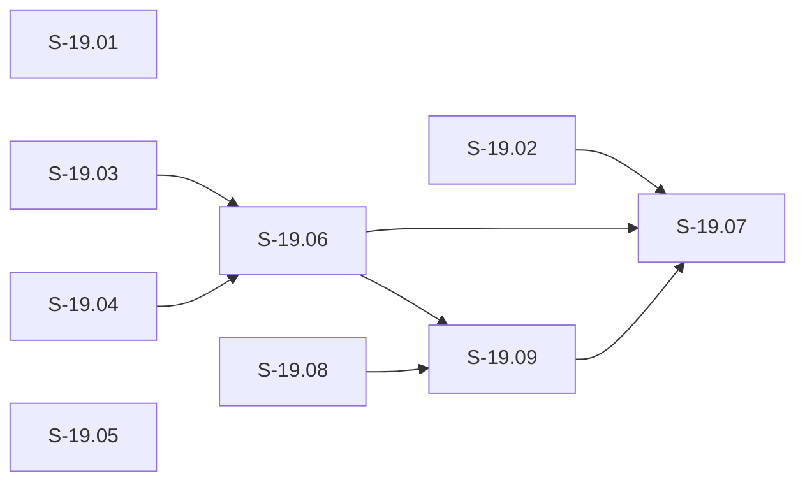

# Epic E-19: Post-rc.22 Operator Hardening

## Description

E-19 collects the nine hardening stories authorized by the rc.22 post-install smoke gate
(2026-07-04; 73/73 PASS-WITH-FINDINGS) and the E-19 pass-2 wiring package
(2026-07-06). The findings expose five distinct defect classes discovered only after the
v1.0.0-rc.22 marketplace tarball was installed and exercised against a live
production-state vsdd-factory repository, plus one new host ABI capability added in the
same hardening wave, and one phased continuation (S-19.07 Phase-B read_prefix migration)
authorized in E-19 pass-4:

1. **pr-manager process gaps (S-19.01):** Three lessons codified from the rc.22
   brownfield-backfill cycle (L-BB-merge-race-ready-report-stale-head / D-749,
   L-BB-release-pr-squash-merge-not-mechanically-enforced / D-750,
   L-BB-simulation-shell-dialect-gap / D-750) expose silent failure modes: READY
   verdicts with no SHA pinning, no mechanical squash-merge guard on release PRs,
   and darwin-leg scripts validated under the wrong Bash version.

2. **verify-factory-lock byte-cap defect (S-19.02 Phase-A + S-19.07 Phase-B):** STATE.md in the rc.22 production
   install is ~90 KB, exceeding the 64 KiB cap in `verify-factory-lock`
   (`STATE_MD_MAX_BYTES = 65536`). Every PreToolUse Edit/Write/Agent dispatch triggers
   `capability_denied reason=output_too_large`, causing the single-writer enforcement
   gate (BC-4.13.001) to fail-open silently (ADR-025 Decision 7). Confirmed in
   `.factory/logs/dispatcher-internal-2026-07-04.jsonl` on traces a4b26f12, bcc3e6ef,
   cf4c2e4d, 2551d7db.

3. **warn-pending-wave-gate false-positive (S-19.03):** In a fresh install where
   `.factory/wave-state.yaml` does not yet exist, `read_file.rs::path_allowed()` calls
   `canonicalize()` which fails for absent files and returns `false` (path not allowed),
   even though the path IS in the allowlist. Every Stop event emits a false-positive
   `capability_denied reason=path_not_allowed` telemetry event. Confirmed on trace
   bc687a0f.

4. **Registry/bundle hygiene and observability gaps (S-19.04, S-19.05):** Four orphan
   WASM files ship unreferenced in the release bundle; unanchored tool-filter regex
   entries fire on unintended tool names (e.g., `Edit` matches `MultiEdit`); async
   plugins emit `plugin.invoked` but never `plugin.completed` or `plugin.abandoned`;
   `VSDD_SINK_FILE` is compile-gated out of release builds, making diagnostic replay
   impossible for operators.

5. **Host ABI read_prefix capability (S-19.06):** Operators issuing large file-read
   operations via `host::read_file` have no bounded partial-read mechanism; requesting
   oversized files returns `OUTPUT_TOO_LARGE` with no data. BC-1.17.001 (E-19 pass-2
   fix burst) defines `host::read_prefix(path, max_bytes, timeout_ms) -> i32` as a
   separate FFI entry point with a dedicated `capabilities.read_prefix` registry block,
   leaving `read_file` semantics unchanged.

6. **verify-state-timestamp-refresh byte-cap defect (S-19.08):** Same defect class as
   S-19.02 FINDING-1, affecting a different guard. The `verify-state-timestamp-refresh`
   PreToolUse guard reads `.factory/STATE.md` via `host::read_file` with a 64 KiB cap
   (`STATE_MD_MAX_BYTES = 65536`). In production rc.22 installs, STATE.md exceeds 64 KiB;
   the guard returns `OUTPUT_TOO_LARGE` and fails-open silently per ADR-025 Decision 7.
   Timestamp-freshness enforcement (BC-5.40.001 PC4) is therefore silently inert on every
   PreToolUse Edit/Write/MultiEdit to STATE.md. Confirmed via three production
   dispatcher-log traces (D-826 + D-835). Fix mirrors S-19.02: raise cap to 262144 and
   wire `factory_lock_parse::extract_frontmatter`. Authorized 2026-07-13.

7. **Post-E-19 host ABI implementation gaps (S-19.09):** The E-19 cascade reviews surface
   four systemic items requiring a follow-on story. D19 (CRITICAL): `read_prefix` is absent
   from `setup_host_on_store_data` (`invoke.rs`) — the production dispatch path
   (`Linker<StoreData>`) — though registered in `setup_linker` (test path,
   `Linker<HostContext>`), causing a wasmtime link error for any plugin importing
   `vsdd::read_prefix` on the production path despite S-19.06 appearing CI green. D20:
   incorrect `timeout_ms` doc comments in `read_file.rs` and `read_prefix.rs` claim
   epoch-interruption enforcement that is structurally impossible in `func_wrap` synchronous
   host calls (ADR-025 Decision 18). D21: bare string literals `"internal.file_not_found"`
   and `"plugin.abandoned"` duplicated without named constants across `read_file.rs`,
   `read_prefix.rs`, and `emit_event.rs` (F-WG-002). D22: `emit_plugin_completed_async`
   missing mandatory `timestamp` field present on all sibling async emitters (F-WG-003;
   BC-3.08.001 §Common Fields). Authorized 2026-07-15 (ADR-025 Decisions 16–19).

E-19 is intentionally narrow: it fixes the known defects and adds the read_prefix
capability without scope expansion. All nine stories are production-grade closures per
the Canonical Principle — no MVP deferrals, no `TODO for later`, no paper-fixes.

## Trigger / Motivation

rc.22 post-install smoke gate (2026-07-04) run against the marketplace tarball at
`~/.claude/plugins/cache/claude-mp/vsdd-factory/1.0.0-rc.22/`. The gate captured
dispatcher internal log evidence for all four defect classes. Stories S-19.01..S-19.05
are authored under the story-writer dispatch dated 2026-07-04 with explicit human
authorization. S-19.06 is authorized under the E-19 pass-2 wiring package
(2026-07-06). S-19.07 is authorized under the E-19 pass-4 fix burst (2026-07-07).
S-19.08 is authorized by human directive 2026-07-13 (same defect class as S-19.02
FINDING-1; confirmed via three production dispatcher-log traces D-826 + D-835).
S-19.09 is authorized by human directive 2026-07-15 (post-E-19 cascade reviews; ADR-025
Decisions 16–19; design-brief-post-e19-host-abi-fixes.md v1.0).

## Epic Placement Justification

E-18 is the immediately preceding epic (Factory Context Durability; COMPLETE as of
S-18.12 PR #384 ec05606a 2026-07-01). E-19 is the next free ID under POLICY 1
(append-only numbering; STORY-INDEX confirmed no E-19 row at time of creation
2026-07-04). The post-rc.22 smoke findings are logically distinct from E-18
(context-durability) and warrant a new epic because they span four different defect
classes across seven subsystems. Grouping them under E-18 would conflate the
context-durability epic with unrelated hardening work.

**Sequencing context (F-P2-006):** `depends_on: []` reflects that E-18 is already
COMPLETE at time of E-19 authoring. E-19 does not require any E-18 work to be
in-progress or gated — E-18 is a delivered predecessor, not an active dependency.
Human authorization for E-19 was granted independently of E-18's completion status.
Treating E-18 as a formal `depends_on` entry would create a spurious block on a cycle
that is already closed, which would misrepresent the actual dependency graph for tooling
that reads this frontmatter.

## PRD Capabilities Covered

No new PRD capabilities from the base defect-fix set. E-19 stories fix defects in
existing capabilities and add observability infrastructure. BC-4.13.001 (verify-factory-
lock behavioral contract) is amended by S-19.02 to reflect the raised byte budget.
BC-3.08.001 v1.23 (async event catalog — Event 5 `plugin.abandoned` with all 7 mandatory fields including `type`, `timestamp`, `entry_index: u32` + Invariant 6 extended terminal key `trace_id+plugin_name+entry_index`; Event 6 `plugin.completed` async path with all 9 mandatory fields including `plugin_version`; schema-level defense for concurrent `entry_index` traceability) LANDED (product-owner, E-19 pass-3/pass-5/pass-7 fix bursts); implementer for S-19.05 follows BC-3.08.001 without further routing action. BC-1.17.001 v1.6 (host::read_prefix bounded
partial read — incl. wrapper/wire-ABI layering disambiguation) LANDED (product-owner, E-19 pass-2 fix burst; v1.2 layering parenthetical added E-19 pass-12); implementer for S-19.06
follows BC-1.17.001 v1.6 without further routing action.

## Acceptance Criteria

| ID | Criterion | Validation Method | Test Scenarios |
|----|-----------|-------------------|----------------|
| EAC-001 | All nine stories S-19.01..S-19.09 shipped and merged to `develop` within this epic's cycle | All story PRs CI-green and merged | S-19.01..S-19.09 PR merge confirmations |
| EAC-002 | `verify-factory-lock` no longer fails with `capability_denied reason=output_too_large` when STATE.md exceeds 64 KiB | CI integration test with 70000-byte (>64 KiB) STATE.md fixture | S-19.02 AC-004 integration test (70000-byte fixture; zero output_too_large events) + AC-002 block-detection test |
| EAC-003 | `warn-pending-wave-gate` emits no false-positive `capability_denied reason=path_not_allowed` on fresh install with absent `.factory/wave-state.yaml` | CI integration test with absent wave-state.yaml fixture | S-19.03 AC-001 test suite; AC-001 negative-control B (BC-2.07.001 v1.6 EC-007): inject mock canonicalize fn returning Err for every ancestor → path_resolution_failed (not path_not_allowed) |
| EAC-004 | `VSDD_SINK_FILE` env var is honored in release-profile dispatcher builds | Release-profile CI integration test with VSDD_SINK_FILE set | S-19.05 AC-004 test suite |
| EAC-005 | Zero WASMs unreferenced by BOTH hooks-registry.toml AND resolvers-registry.toml in the rc.23 bundle | CI bundle manifest diff gate | S-19.04 AC-001 + AC-007 |
| EAC-008 | BC-3.08.001 Invariant 6 schema-level property tests (S-19.05 AC-002 gates a/b) pass in CI — preservation gate for the entry_index defense | S-19.05 AC-002 CI test suite pass (gates a and b both green) | AC-002 gate (a) property test: enumerate() ordinal correctly marshalled into entry_index field of plugin.abandoned; gate (b) synthetic-distinctness test: two plugin.abandoned structs same plugin_name distinct entry_index are independently traceable |

## Stories

| Story ID | Title | Wave | Points | BCs |
|----------|-------|------|--------|-----|
| S-19.01 | pr-manager hardening: READY verdict HEAD-SHA pinning + release-PR merge-strategy guard + shell-dialect simulation discipline | W1 | 8 | BC-5.42.001 |
| S-19.02 | verify-factory-lock FINDING-1: frontmatter-only STATE.md read + raised byte budget | W1 | 8 | BC-4.13.001 |
| S-19.03 | warn-pending-wave-gate FINDING-2: read_file file_not_found semantics + graceful absent-file handling | W1 | 5 | BC-2.07.001, BC-2.02.011 |
| S-19.04 | Registry/bundle hygiene: orphan WASM removal + tool-filter regex anchoring convention + lint check | W2 | 5 | — (config-only) |
| S-19.05 | Observability gaps: async plugin completion telemetry + VSDD_SINK_FILE release-mode opt-in | W2 | 8 | BC-3.08.001 |
| S-19.06 | host::read_prefix bounded partial read | W2 | 8 | BC-1.17.001 |
| S-19.07 | verify-factory-lock read_prefix migration (D18(e)) | W3 | 3 | BC-4.13.001 |
| S-19.08 | verify-state-timestamp-refresh: raise 64 KiB byte cap to 256 KiB + wire extract_frontmatter | W2 | 5 | BC-5.40.001 |
| S-19.09 | post-E-19 host ABI fixes: read_prefix production path registration, timeout_ms framing, telemetry hygiene | W3 | 5 | BC-1.17.001, BC-3.08.001 |

**Total:** 9 stories, 55 story points.

> **Maintenance tally drift-check:** Compute story count + points from the 9 linked story frontmatters and assert equals the Stories-table totals (9 / 55); run at every epic amendment.

**Sequencing rationale:**

- Wave 1 (S-19.01, S-19.02, S-19.03): The three P0/P1 defect fixes. S-19.02 is P0 (the
  verify-factory-lock single-writer gate is silently bypassed in production). S-19.01 and
  S-19.03 are P1 (process gaps and false-positive telemetry; no data-loss risk). All three
  are independent; they can run in parallel within W1.

- Wave 2 (S-19.04, S-19.05, S-19.06, S-19.08): The P2 hygiene, observability, host ABI
  extension, and verify-state-timestamp-refresh byte-cap fix stories. S-19.04, S-19.05,
  and S-19.08 have no hard dependency on W1; wave ordering is priority-driven. S-19.06
  depends on S-19.03 (the `path_allowed` fix for absent files; BC-2.07.001
  codes::NOT_FOUND semantics are a prerequisite for read_prefix absent-file behavior) AND
  S-19.04 (S-19.04 creates the tool-filter-anchoring preamble comment block in
  `hooks-registry.toml`; S-19.06 adds a DISTINCT "Capability Schemas" preamble block for
  the `capabilities.read_prefix` schema — separate from, not embedded in, S-19.04's block;
  the dependency is ordering-only so the two preamble blocks land without merge conflict).
  S-19.08 is fully parallel-eligible: it depends on nothing in E-19 (S-19.02's
  `extract_frontmatter` is already MERGED on develop via PR #610), and blocks nothing.
  Only S-19.03 and S-19.04 gate S-19.06; S-19.05 and S-19.08 are independent and
  have no S-19.03/S-19.04/S-19.06 dependency. S-19.04, S-19.05, and S-19.08 can run in
  parallel; S-19.06 starts when BOTH S-19.03 AND S-19.04 have merged to develop.

- Wave 3 (S-19.09, S-19.07 in sequence): S-19.09 fills the post-E-19 host ABI gaps —
  D19 (CRITICAL): `read_prefix` production-path registration in `invoke.rs::setup_host_on_store_data`
  (`Linker<StoreData>`); D20/D21/D22: doc corrections, named constants, and telemetry timestamp
  field. S-19.09 depends on S-19.06 (test-path `read_prefix` must exist) AND S-19.08
  (wave-ordering: all W2 stories merged before W3 begins). S-19.07 (BC-4.13.001 Phase-B
  migration) depends on S-19.02 (Phase-A cap raise), S-19.06 (`host::read_prefix` FFI entry
  point), AND S-19.09 (production-path registration — without D19, the migrated
  `verify-factory-lock` plugin fails wasmtime link on production dispatch). S-19.09 MUST NOT
  begin until S-19.06 AND S-19.08 have merged to develop. S-19.07 MUST NOT begin until S-19.09
  has additionally merged to develop.

**Wave model note:** W2 tolerates the internal S-19.04→S-19.06 edge (doc-section ordering); waves here group by priority tier, with intra-wave sequencing expressed solely via depends_on — the scheduler honors depends_on, not wave co-membership.

## Dependency Graph

S-19.02, S-19.06, and S-19.09 gate S-19.07; S-19.06 and S-19.08 gate S-19.09; S-19.03 and S-19.04 gate S-19.06; S-19.01 and S-19.05 block nothing.

Topological order: W1 → W2 → W3 (by priority + S-19.06 gate on S-19.03 AND S-19.04 + S-19.09 gate on S-19.06 AND S-19.08 + S-19.07 gate on S-19.02 AND S-19.06 AND S-19.09). S-19.01 and S-19.05 are isolated W1/W2 nodes. No cycles. Acyclic confirmed.

## Dependencies (External)

| System | Capability Needed | Readiness |
|--------|------------------|-----------|
| None | E-19 is self-contained within the vsdd-factory codebase (`crates/factory-dispatcher/`, `plugins/vsdd-factory/`, `CLAUDE.md`). No external systems, APIs, or third-party services are required. | N/A |

## Out of Scope

- **BC-3.08.001 async event catalog amendment:** LANDED as v1.19 (carried forward through v1.23) (product-owner, E-19
  pass-3/pass-5/pass-7 fix bursts). Event 5 `plugin.abandoned` catalog with `entry_index: u32`
  field and extended Invariant 6 terminal key `trace_id+plugin_name+entry_index`; Event 6
  `plugin.completed` async path with all 9 mandatory fields including `plugin_version`;
  schema-level defense for concurrent `entry_index` traceability are now in the BC.
  S-19.05 implementer follows BC-3.08.001 without further routing action.

- **BC-1.17.001 host::read_prefix:** LANDED as v1.5 (carried forward through v1.6) (product-owner, E-19 pass-2 fix
  burst; see BC changelog). FFI signature `read_prefix(path: &str, max_bytes: u32, timeout_ms: u32) -> i32`
  and separate `capabilities.read_prefix` registry block are now in the BC. S-19.06
  implementer follows BC-1.17.001 v1.6 without further routing action.

- **ADR-025 v1.7 amendment:** Authored by architect in E-19 pass-1 fix burst (Decisions
  13+14: `codes::NOT_FOUND = -5`; `STATE_MD_MAX_BYTES = 262144` + frontmatter-only parse).
  Amendment is complete; this item is closed for E-19.

- **WASM fuel-budget increase for lessons.md:** D-442(e) documents the WASM fuel exhaustion
  issue on large lessons.md files. This is NOT part of E-19; it is tracked under S-15.03
  PRIORITY-A and is a separate concern.

- **S-15.03 hook path-pattern narrowing:** The convergence-tracker.sh false-positive on
  `.factory/cycles/` path patterns (Factory Hook Diagnostics table, row 5) is not part
  of E-19; it is tracked under S-15.03 PRIORITY-A.

## Behavioral Contract Traceability

| BC ID | Story |
|-------|-------|
| BC-5.42.001 | S-19.01 (pr-manager READY verdict SHA pinning + merge-strategy guard) |
| BC-4.13.001 | S-19.02 (Phase-A: raised byte budget + frontmatter-only extraction) + S-19.07 (Phase-B: migrate verify-factory-lock to host::read_prefix; removes STATE_MD_MAX_BYTES + TooLarge/OutputTooLarge handling) |
| BC-2.07.001 | S-19.03 (host::read_file absent-file semantics: codes::NOT_FOUND + HostError::NotFound) |
| BC-2.02.011 | S-19.03 (path traversal prevention via resolve_path_for_allowlist in path_util.rs; EC-001 traversal → CAPABILITY_DENIED) |
| BC-1.17.001 | S-19.06 (new: host::read_prefix bounded partial read) + S-19.09 (D19: production-path read_prefix registration in invoke.rs::setup_host_on_store_data; AC-001 instantiation gate, AC-002 round-trip bytes + non-zero out_ptr, AC-003 CAPABILITY_DENIED via production path) |
| BC-3.08.001 | S-19.05 (amended v1.23: Event 5 plugin.abandoned all 7 mandatory fields including type + timestamp + entry_index; Invariant 6 key extension; Event 6 plugin.completed async path 9 mandatory fields including plugin_version; schema-level defense for concurrent entry_index traceability) + S-19.09 (D22: emit_plugin_completed_async missing mandatory timestamp field; §Common Fields requires timestamp for all plugin.* events; AC-009) |
| BC-5.40.001 | S-19.08 (verify-state-timestamp-refresh: raise 64 KiB byte cap to 256 KiB + wire extract_frontmatter; PC4 mid-burst TTL renewal enforcement operational at production STATE.md sizes) |

Story BC-table rows use abbreviated titles for cell fit; the BC file H1 remains the sole authoritative title (POLICY 7); abbreviations are non-normative.

## Changelog

| Version | Date | Author | Change |
|---------|------|--------|--------|
| v1.31 | 2026-07-17 | state-manager | F-003 resolution (D-853): status draft→complete; completion_date 2026-07-17; all 9 E-19 stories merged (S-19.01..S-19.09; E-19 COMPLETE D-851 2026-07-17); W3/epic wave-gate D-853 PASS-PENDING-HUMAN; STORY-INDEX already reflected v1.31 at D-851. |
| v1.30 | 2026-07-15 | story-writer | S-19.09 added (post-E-19 host ABI fixes; ADR-025 D19–D22; authorized 2026-07-15): Stories table S-19.09 row; story_count 8→9; total 50→55 pts; Description ninth story + seventh defect class; Dependency Graph S-19.06→S-19.09 + S-19.08→S-19.09 + S-19.09→S-19.07 edges; W3 sequencing note expanded (S-19.09 now gates S-19.07); EAC-001 9 stories; BC Traceability BC-1.17.001 D19 row + BC-3.08.001 D22 row; Trigger S-19.08 authorization cite; title extended; inputs + hash refreshed; S-19.07 depends_on propagated (→ S-19.09 added). |
| v1.29 | 2026-07-13 | story-writer | Pass-15 BC/DI version-pin sweep: PRD Capabilities BC-3.08.001 v1.21→v1.23 + drop version from "implementer follows" sentence; EAC-003 BC-2.07.001 v1.5→v1.6; Out-of-Scope BC-3.08.001 "carried forward through v1.21"→v1.23 + drop version from "implementer follows" sentence; BC Traceability cell "amended v1.21"→"amended v1.23"; D-803 heading-parity intact. POLICY 14 parity. |
| v1.28 | 2026-07-13 | story-writer | S-19.08 added (verify-state-timestamp-refresh 64 KiB byte-cap fix; D-826/D-835; W2 parallel-eligible, 5 pts, BC-5.40.001): Stories table S-19.08 row; story_count 7→8; total 45→50 pts; S-19.08 isolated node in Dependency Graph; W2 sequencing note updated; EAC-001 8 stories; Description eighth story + fifth defect class; BC Traceability BC-5.40.001 row; Trigger section S-19.08 authorization cite; title extended. S-19.04 v1.12 no-new-.sh policy amendment (AC-006 orphan-detection gate: bats+.sh → Rust cargo test) noted; EAC-005 test-scenarios cite (AC-001+AC-007) unaffected. |
| v1.27 | 2026-07-10 | story-writer | E-19 pass-52 F-P52-001: §Behavioral Contract Traceability BC-2.02.011 row description mis-anchor (BC-2.07.001 semantics duplicated) → path traversal prevention/resolve_path_for_allowlist/EC-001 role per S-19.03 body SoT; full-table class audit (5 other rows PASS). |
| v1.26 | 2026-07-10 | story-writer | E-19 pass-46 F-P46-001 propagation: BC-1.17.001 v1.5→v1.6 cite sweep (frontmatter-ordering-only amendment — §PRD Capabilities Covered ×2, §Out of Scope LANDED provenance carried-forward through v1.6 + implementer cite ×1). |
| v1.25 | 2026-07-10 | story-writer | E-19 pass-43 F-P43-003/005 propagation: BC-3.08.001 v1.20→v1.21 cite sweep (VP-table/changelog-only amendment — §PRD Capabilities Covered ×2, §Out of Scope carry-forward v1.21, BC Traceability cell ×1). |
| v1.24 | 2026-07-09 | story-writer | pre-pass-43 consistency sweep propagation: BC-3.08.001 v1.20 cite sweep (VP-table-only amendment — §PRD Capabilities Covered ×2, §Out of Scope BC-3.08.001 carry-forward ×1, BC Traceability table amended-version cell ×1). |
| v1.23 | 2026-07-09 | story-writer | E-19 pass-42 F-P42-002/003 propagation: BC-2.07.001 v1.4→v1.5 cite sweep (VP-table-only amendment — EC-007 and all PCs/Invariants unchanged; 1 body site: EAC-003 negative-control B). |
| v1.22 | 2026-07-09 | story-writer | E-19 pass-33 F-P33-001 (story-writer): EAC-003 BC-2.07.001 v1.3→v1.4 — pass-32 partial-sweep escape at epic layer. |
| v1.21 | 2026-07-09 | story-writer | E-19 pass-32 O-P32-02: §Out of Scope BC-1.17.001 bullet — drop 'subsequently amended through v1.5 — ' parenthetical clause (cosmetic; '(product-owner, E-19 pass-2 fix burst; see BC changelog)' retained). |
| v1.20 | 2026-07-09 | story-writer | E-19 pass-31 fix burst (F-P31-001): §Out of Scope BC-1.17.001 bullet stale 'LANDED as v1.3' corrected to v1.5 (partial-sweep escape from pass-28/pass-30 sweeps; two version tokens in one bullet, only one previously updated). |
| v1.19 | 2026-07-09 | story-writer | E-19 pass-30 fix burst: BC-1.17.001 v1.4→v1.5 cite sweep (metadata-only — L2 Domain Invariants TBD→none; §PRD Capabilities Covered ×2 + §Out of Scope ×1 = 3 sites). BC-2.07.001 v1.2→v1.3 cite sweep (metadata-only; EAC-003 ×1 site). |
| v1.18 | 2026-07-08 | story-writer | F-P28-001 epic leg: EAC-002 Test-Scenarios corrected to S-19.02 AC-004 integration test (70000-byte fixture; zero output_too_large events) + AC-002 block-detection test (was: S-19.02 AC-001 test suite); EAC-002 Validation-Method corrected to 70000-byte (>64 KiB) STATE.md fixture (was: 90 KB); BC-1.17.001-v1.4-propagation: v1.3→v1.4 body-scope cite sweep (§PRD Capabilities Covered ×2 + §Out of Scope ×1 = 3 sites). |
| v1.17 | 2026-07-08 | story-writer | F-P27-001 epic leg: Wave-2 sequencing note S-19.04 parenthetical fixed to DISTINCT-block form (was: 'S-19.06 adds capabilities.read_prefix schema documentation to that same section'; now: S-19.06 adds a DISTINCT "Capability Schemas" preamble block, separate from S-19.04's tool-filter-anchoring block; ordering-only dependency). |
| v1.16 | 2026-07-08 | story-writer | BC-1.17.001-v1.3-propagation: BC-1.17.001 v1.2→v1.3 cite propagation (anchoring-only change — ffi.rs bullet added to §Architecture Anchors in BC v1.3); §PRD Capabilities Covered ×2 sites + §Out of Scope ×3 sites updated. |
| v1.15 | 2026-07-08 | story-writer | O-P16-01 human adjudication (D-773): POLICY 17 frontmatter parity backfill (modified[] + last_amended added). |
| v1.14 | 2026-07-08 | story-writer | O-P16-02: EAC-008 Validation Method + Test Scenarios columns split for column parity (both previously "S-19.05 AC-002 test suite"; now distinct per AC-002 gates a/b). |
| v1.13 | 2026-07-07 | story-writer | O-P15-02: EAC-006/EAC-007 never allocated (numbering skip at pass-14 authoring; orchestrator brief error); EAC-008 retained per POLICY 1 append-only. |
| v1.12 | 2026-07-07 | story-writer | E-19 pass-14 sweep: F-P14-004 Epic Placement Justification "six subsystems" → "seven subsystems"; F-P14-005 Out-of-Scope BC-3.08.001 pass-2 → pass-3; O-P14-04 EAC-008 added (BC-3.08.001 Invariant 6 schema-level property tests preservation gate); O-P14-06 maintenance tally drift-check note added after Stories total; input-hash f6bf703 (S-19.03 v1.11 + S-19.06 v1.11 + S-19.07 v1.6). |
| v1.11 | 2026-07-07 | story-writer | E-19 pass-13 fix burst: O-P13-04 Dependency Graph mermaid — S-19.01 and S-19.05 added as isolated nodes to make independence visually explicit. |
| v1.10 | 2026-07-07 | story-writer | E-19 pass-12 fix burst: F-P12-006 EAC-003 negative-control B — 'path with NO existing ancestor' framing retired; replaced with injectable mock canonicalize form per BC-2.07.001 v1.2 EC-007. BC-1.17.001 body-scope cite sweep: PRD Capabilities (line 113, layering note added), PRD Capabilities follow-on (line 115), Out-of-Scope (line 199) — all v1.1→v1.2. |
| v1.9 | 2026-07-07 | story-writer | E-19 pass-9 fix burst: F-P9-001 subsystems_affected SS-06 removed (phantom; union recomputation SS-01/02/03/04/05/07/09 confirmed); F-P9-004 ASCII Dependency Graph replaced with mermaid graph LR (edges: S-19.03→S-19.06, S-19.04→S-19.06, S-19.02→S-19.07, S-19.06→S-19.07); O-P9-003 BC Traceability abbreviation convention sentence added. |
| v1.8 | 2026-07-07 | story-writer | E-19 pass-8 fix burst: F-P8-004 Stories table S-19.03 BCs cell → "BC-2.07.001, BC-2.02.011"; F-P8-011 Wave model note added to Sequencing rationale. |
| v1.7 | 2026-07-07 | story-writer | E-19 pass-7 fix burst: F-P7-008 Description item 2 header updated to S-19.02 Phase-A + S-19.07 Phase-B; O-P7-001 one-liner phased-continuation note added to intro paragraph; PRD Capabilities BC-3.08.001 v1.18→v1.19 + pass-7 cite + schema-level defense note; Out-of-Scope BC-3.08.001 v1.18→v1.19 + pass-7 cite + schema-level defense; BC Traceability BC-3.08.001 v1.18→v1.19 + schema-level defense note. |
| v1.6 | 2026-07-07 | story-writer | E-19 pass-6 fix burst: F-P6-003 BC-3.08.001 v1.17→v1.18 sweep (PRD Capabilities, Out-of-Scope, BC Traceability); O-P6-001 Trigger section S-19.06/S-19.07 authorization sentences added; O-P6-003 EAC-003 path_resolution_failed negative-control B added. |
| v1.5 | 2026-07-07 | story-writer | E-19 pass-5 fix burst: O-P5-002 BC Traceability BC-2.02.011 row added (via S-19.03); last_amended + modified[] parity. |
| v1.4 | 2026-07-07 | story-writer | E-19 pass-4 fix burst: S-19.07 row added (W3, 3 pts, BC-4.13.001 Phase-B); story_count 6→7; total 42→45 pts; title extended; inputs add S-19.07; EAC-001 seven stories S-19.01..S-19.07; EAC-005 cite → S-19.04 AC-001 + AC-007; S-19.04 BCs cell → — (config-only); W3 sequencing note; Dependency Graph S-19.07 edges; O-P4-004 DAG restatement; BC-1.17.001 v1.0→v1.1 (PRD Capabilities ×2, Out-of-Scope ×2); BC Traceability BC-4.13.001 Phase-A/Phase-B split + S-19.07; Description seven stories. |
| v1.3 | 2026-07-06 | story-writer | E-19 pass-3 fix burst: F-P3-010 Dependency Graph S-19.04→S-19.06 edge added; S-19.06 depends_on updated [S-19.03]→[S-19.03, S-19.04] in wave sequencing note; O-P3-004 Stories table S-19.05 BCs column: version suffix "v1.16" dropped (bare BC-3.08.001 per POLICY 19); subsystems_affected: SS-02 added; BC Traceability + PRD Capabilities v1.16→v1.17 live-spec cites updated. |
| v1.2 | 2026-07-06 | story-writer | E-19 pass-2 wiring package: story_count 5→6; S-19.06 row added (W2, 8 pts, BC-1.17.001, depends_on: S-19.03); title updated to include read_prefix; depends_on: [E-18]→[] with F-P2-006 sequencing-context prose note in Epic Placement Justification; EAC-001 updated (six stories, S-19.01..S-19.06); EAC-005 reworded per O-P2-004 (BOTH hooks-registry.toml AND resolvers-registry.toml); total points 34→42; W2 sequencing note updated (S-19.06 depends_on S-19.03); Dependency Graph updated (S-19.03 → S-19.06 edge); Out of Scope: BC-3.08.001 v1.15→v1.16 with entry_index detail; BC-1.17.001 Out of Scope block added; PRD Capabilities updated (BC-3.08.001 v1.16 + BC-1.17.001 LANDED); BC Traceability table: all story BCs added (BC-5.42.001, BC-2.07.001, BC-3.08.001, BC-1.17.001); Stories table BCs column updated for S-19.01/S-19.03 per pass-2 wiring. |
| v1.1 | 2026-07-06 | story-writer | F-P1-005: delete ADR amendment Out-of-Scope bullet; replace with "ADR-025 v1.7 amendment authored by architect in E-19 pass-1 fix burst (Decisions 13+14)". F-P1-012: BC Traceability table — Title column dropped; bare BC-4.13.001 used (H1 title overflows table cell). BC-3.08.001 v1.15 LANDED status updated in PRD Capabilities + Stories table + Out of Scope. |
| v1.0 | 2026-07-04 | story-writer | Initial creation. Post-rc.22 smoke gate authorization. 5 stories S-19.01..S-19.05 spanning SS-01/SS-03/SS-04/SS-05/SS-06/SS-07/SS-09. 2 waves; 34 pts. No new PRD capabilities. BC-4.13.001 amended by S-19.02. BC-3.08.001 amendment flagged for PO routing (S-19.05). |
