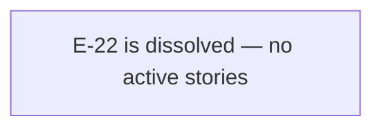

# Epic E-22: Dependency Security Hardening

> **DISSOLVED 2026-08-07 / FILE RETAINED 2026-08-08.** E-22's sole founding story S-21.12
> was re-anchored to E-21 W4 by team-lead ruling 2026-08-07 (ADR-041). E-22 became empty
> and was dissolved. The file was retained per human ruling 2026-08-08 (supersedes the
> D-961(c) deletion clause); dissolution and file retention are compatible. E-22-the-epic is
> dissolved; E-22-the-file is retained as a charter for future dependency-security work. The
> charter obligations below (SEC-001 sequencing constraint, RUSTSEC-2026-0204,
> 7 batched Dependabot alerts, EAC-002) are live obligations now mirrored in STATE.md Drift
> Items; they are future scope for whichever epic eventually picks them up.

## Description

E-22 was chartered to collect stories that remediate CVE/RUSTSEC advisories in
vsdd-factory's shipped runtime and tooling dependencies, and to provide the CI machinery
that detects future advisories before human-directed triage must catch them. This is a
recurring maintenance axis — advisories arrive on the ecosystem's schedule, not the epic's,
so the dependency-security charter will continue to require attention over the project
lifetime.

The original founding story, S-21.12, moved the workspace from `wasmtime = "44.0"` to
`wasmtime = "46.0.2"`, closing two active advisories (RUSTSEC-2026-0188 and RUSTSEC-2026-0222)
and adding a `cargo deny check advisories` CI job (PR-007) so no future advisory sits
silently on `develop`. S-21.12 was re-anchored to E-21 W4 per team-lead ruling 2026-08-07
(ADR-041); its delivery is tracked under E-21, not E-22.

## Trigger / Motivation

The trigger was the PR #770 fresh-eyes review (PR-001), which found that the PR body's
central claim — "this unblocks SEC-001 preopen hardening" — was false: a FilePerms bypass
advisory (RUSTSEC-2026-0188, CVE-2026-58494) survives on every version of the 44.x line
with no 44.x backport fix, and the planned SEC-001 hardening configuration is verbatim the
vulnerable configuration. The review mandated:

1. A concrete story anchor for the `>= 46.0.2` wasmtime move before SEC-001 is dispatched.
2. The PR-007 gap be addressed: `deny.toml` exists at repo root with a deny-all advisories
   posture (`ignore = []`), but no GitHub Actions workflow invokes it — the process gap that
   allowed RUSTSEC-2026-0188 to sit silently on `develop` until manual review caught it.

The full reachability analysis and advisory triage is in
`.factory/research/dependency-vulnerability-triage-2026-08-06.md`, which serves as the
standing analysis for this charter rather than being restated here.

## Epic Placement Justification

> **SUPERSEDED — retained as historical record.** The following justification was written
> at E-22 creation (2026-08-06) to argue for a dedicated dependency-security epic separate
> from E-21. This reasoning was overruled by team-lead ruling 2026-08-07 (ADR-041), which
> re-anchored S-21.12 to E-21 W4 for operational convenience. The original reasoning is
> preserved below for traceability; it no longer describes the current placement decision.

E-21 is the immediately preceding registered epic. E-22 is the next free ID under POLICY 1
(append-only numbering; STORY-INDEX confirmed no E-22 row at time of creation 2026-08-06).

**Why separate from E-21 (original rationale, now superseded):** E-21 is "Factory State
Data-Loss Hardening" — a fixed-scope collection of factory artifact write-path issues with
a bounded story set (S-21.01..S-21.06). Dependency security is a distinct, recurring
maintenance axis: CVE/RUSTSEC advisories arrive on the ecosystem's schedule, not the
epic's. Placing S-21.12 in E-21 would conflate runtime-defect fixes with dependency
security maintenance, and would falsely imply that E-22's future scope is complete when
E-21 closes.

**Blocking relationship to E-21 does not imply same-epic membership (original rationale,
now superseded):** S-21.12 is a P0 prerequisite for the unscheduled SEC-001 preopen
hardening story, which is itself adjacent to E-21's S-21.06 (the Layer-2 sync-protocol
WASM guard). That blocking edge is a dependency, not a membership claim.

## PRD Capabilities Covered

E-22 introduces no new PRD capabilities. The wasmtime version move and cargo-deny CI gate
are security maintenance within existing capability boundaries — the WASM sandbox semantics
(CAP-002, CAP-008, CAP-013) are unchanged by the version move. The FilePerms enforcement
is improved (the RUSTSEC-2026-0188 bypass is closed), but the behavioral contract as seen
by hook plugin authors is identical.

| Capability ID | Note |
|--------------|------|
| (none) | E-22 is recurring security maintenance; no new PRD capabilities |

## Stories

E-22 has no active stories. S-21.12 (the sole founding story) was re-anchored to E-21 W4
per team-lead ruling 2026-08-07 (ADR-041). It is tracked under E-21 and is not listed here.

| Story ID | Title | Wave | Points | BCs |
|----------|-------|------|--------|-----|
| _(none — E-22 is dissolved; no active stories)_ | — | — | — | — |

**Total:** 0 active stories, 0 story points.

> **Historical:** S-21.12 (wasmtime major-version move >= 46.0.2: clear
> RUSTSEC-2026-0188/CVE-2026-58494 + RUSTSEC-2026-0222, add cargo-deny advisories CI job)
> was E-22 Wave 1 (8 pts) at initial authoring. Re-anchored to E-21 W4 per team-lead
> ruling 2026-08-07 (ADR-041). Delivery tracked under E-21.

**Future waves:** When a future epic picks up the dependency-security charter (see §Known
Future Scope), wave numbering will be assigned at story-decomposition time per project
convention. RUSTSEC-2026-0204 and the deliberately-batched Dependabot alert set are the
primary candidates.

## Acceptance Criteria

EAC-001..EAC-004 are retained as charter criteria. They are no longer active obligations
of E-22 itself (E-22 is dissolved and owns no stories). They represent the acceptance bar
that must be met by whichever epic eventually picks up E-22's dependency-security scope.
EAC-002 is a live obligation mirrored in STATE.md Drift Items.

| ID | Criterion | Validation Method | Test Scenarios | Status |
|----|-----------|-------------------|----------------|--------|
| EAC-001 | S-21.12 shipped and merged to `develop` | S-21.12 PR CI-green and merged | S-21.12 AC-001..AC-008 test suite | Discharged by E-21 W4 (S-21.12 re-anchored to E-21; delivery tracked under E-21) |
| EAC-002 | `cargo deny check advisories` exits 0 on `develop` post-S-21.12 merge — RUSTSEC-2026-0188 and RUSTSEC-2026-0222 absent, `deny.toml` `ignore` list not extended | CI deny-advisories job green on the S-21.12 merge commit | S-21.12 AC-004 | Charter criterion — live obligation in STATE.md Drift Items; discharged by E-21 W4 (S-21.12) delivery |
| EAC-003 | wasmtime-wasi resolved to >= 46.0.2 in `Cargo.lock` on `develop` post-S-21.12 merge | `cargo metadata --locked` resolves `wasmtime-wasi` >= 46.0.2 | S-21.12 AC-003 | Discharged by E-21 W4 (S-21.12 re-anchored to E-21) |
| EAC-004 | cargo-deny CI job present in `.github/workflows/` with no `paths:` filter — fires on every PR to `main` or `develop` | grep workflow for `cargo deny check advisories` in a `pull_request` trigger with no path filter | S-21.12 AC-007 | Discharged by E-21 W4 (S-21.12 re-anchored to E-21) |

## SEC-001 Sequencing Constraint

> **Charter obligation — retained as live.** This constraint is mirrored in STATE.md Drift
> Items. It applies to whichever epic eventually authors the SEC-001 story.

RUSTSEC-2026-0188 (CVE-2026-58494) is a FilePerms bypass for `path_link` and `path_rename`
destination paths in `wasmtime-wasi`. A WASM plugin holding a read-only preopen can still
create a hard link or rename a file to that directory's contents, bypassing the intended
write restriction. The vulnerable configuration is `DirPerms::all()` combined with
`FilePerms::READ` — exactly the configuration the planned SEC-001 preopen hardening story
intends to set in the host-function registration path of `invoke.rs`.

**Therefore:** SEC-001 preopen hardening MUST NOT be dispatched until S-21.12 merges and
the wasmtime floor is confirmed at `>= 46.0.2`. When the SEC-001 story is authored, it MUST
carry `depends_on: [S-21.12]` to encode this gate structurally. This requirement is an
authoring contract, not a mechanical gate. S-21.12 is tracked under E-21 W4 and satisfies
this constraint upon merge.

## Known Future Scope

> **Charter obligations — retained as live.** The following items are in E-22's charter but
> are not yet scheduled as stories. They are mirrored in STATE.md Drift Items and are future
> scope for whichever epic the human directs to pick up dependency-security work. None are
> blocked by S-21.12 (re-anchored to E-21 W4); all are blocked by human direction awaiting
> a dispatch decision.

**RUSTSEC-2026-0204 (crossbeam-epoch pointer dereference):** This advisory surfaced during
the PR #770 review and is NOT currently visible as a Dependabot alert (Dependabot does not
surface all RUSTSEC advisories — only those with a GitHub Security Advisory record). The
`cargo deny check advisories` CI gate added by S-21.12 WILL surface it as a CI failure.
Reachability analysis is in the standing triage doc. A separate story will be required;
priority TBD by human.

**7 deliberately-batched Dependabot alerts** (human direction to batch rather than address
individually):
- 1 Cargo advisory: `opentelemetry_sdk` (CVE-2026-48504, medium; `cargo` ecosystem)
- 6 npm advisories in `plugins/vsdd-factory/skills/visual-companion/package-lock.json`:
  `lodash-es` (3 advisories: CVE-2026-4800 high, CVE-2026-2950 medium, CVE-2025-13465
  medium), `nanoid` (2 alerts: 3.x and 4.x CVE-2024-55565 medium), `postcss` (no CVE,
  high)

  **Important scope note on the npm six:** `visual-companion` is an optional,
  operator-local, non-shipped tool. Its `package-lock.json` is in source control but the
  tool is NOT included in the marketplace-tarball or any vsdd-factory release artifact.
  Dependabot reports these as `scope: runtime` but that label describes the npm dependency
  graph, not vsdd-factory's runtime surface. Reachability analysis confirms they are
  operator-tooling-only. The human's batching decision reflects this classification.

The standing reachability analysis for all 8 current open alerts is in
`.factory/research/dependency-vulnerability-triage-2026-08-06.md`. Story authors for
future dependency-security work MUST re-verify advisory status against the live API at
dispatch time rather than relying on this document's snapshot.

## Dependencies (External)

| System | Capability Needed | Readiness |
|--------|------------------|-----------|
| crates.io | wasmtime 46.0.2 and wasmtime-wasi 46.0.2 packages available | Available (verified in triage doc) |
| cargo-deny | `deny.toml` posture correct for advisories gate | Already configured (`[advisories] ignore = []`); CI job additive (delivered by S-21.12 under E-21) |

## Out of Scope

- **SEC-001 preopen hardening** (`DirPerms::all() + FilePerms::READ` configuration in the
  host-function registration path): S-21.12 is the prerequisite (tracked under E-21 W4);
  SEC-001 must be authored separately with `depends_on: [S-21.12]`.
- **wasmtime 47.x:** 46.0.2 clears both active advisories. A future story may address a
  47.x move when relevant advisories require it.
- **E-21 stories (S-21.01..S-21.06, S-21.07..S-21.12):** Factory state write-path
  hardening and the re-anchored S-21.12 are E-21's scope; E-22 does not modify any E-21
  story or its implementing BCs.
- **`deny.toml` `[advisories] ignore` field:** The existing deny-all posture MUST NOT be
  modified to suppress RUSTSEC-2026-0188 or RUSTSEC-2026-0222 — they must be genuinely
  patched (S-21.12 AC-004, tracked under E-21).

## Behavioral Contract Traceability

E-22 introduces no behavioral contracts. The wasmtime upgrade and cargo-deny CI gate are
infrastructure changes with no new behavioral API surface observable by other components.

| BC ID | Note |
|-------|------|
| (none) | BC-free: dependency version move and CI job addition introduce no new observable behavioral contracts |

## Dependency Graph

S-21.12 (the original sole story) was re-anchored to E-21 W4 per team-lead ruling
2026-08-07 (ADR-041). E-22 has no internal dependency edges. The blocking relationship
from S-21.12 to the unscheduled SEC-001 story is tracked under E-21.

## Changelog

| Version | Date | Author | Summary |
|---------|------|--------|---------|
| v1.1 | 2026-08-08 | story-writer | Dissolution record (F-S2107-P9-005). S-21.12 re-anchored to E-21 W4 (team-lead ruling 2026-08-07, ADR-041); story_count 1→0; status draft→dissolved; file retained for historical record per human ruling 2026-08-08 (supersedes D-961(c) deletion clause). Stories roster cleared; EAC-001..EAC-004 reframed as charter criteria (EAC-001/EAC-003/EAC-004 discharged by E-21 W4; EAC-002 live in STATE.md Drift Items). Placement Justification marked superseded-history. Charter obligations (SEC-001 sequencing, RUSTSEC-2026-0204, 7 batched Dependabot alerts) preserved as future scope. |
| v1.0 | 2026-08-06 | story-writer | Initial authoring. Founding story S-21.12 (wasmtime 44.x to 46.0.2 upgrade, 8 pts, W1). Charter: CVE/RUSTSEC remediation and CI advisory gate. SEC-001 sequencing constraint documented. Known future scope: RUSTSEC-2026-0204 + 7 batched Dependabot alerts. Epic separated from E-21 (state hardening) as a recurring security maintenance axis. |
