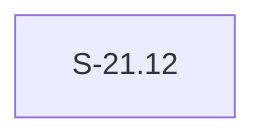

# Epic E-22: Dependency Security Hardening

## Description

E-22 collects stories that remediate CVE/RUSTSEC advisories in vsdd-factory's shipped
runtime and tooling dependencies, and provides the CI machinery that detects future
advisories before human-directed triage must catch them. This is a recurring maintenance
axis — advisories arrive on the ecosystem's schedule, not the epic's, so E-22 will continue
to receive stories over the project lifetime.

The founding story, S-21.12, moves the workspace from `wasmtime = "44.0"` to
`wasmtime = "46.0.2"`, closing two active advisories (RUSTSEC-2026-0188 and RUSTSEC-2026-0222)
and adding a `cargo deny check advisories` CI job (PR-007) so no future advisory sits
silently on `develop`.

## Trigger / Motivation

The trigger is the PR #770 fresh-eyes review (PR-001), which found that the PR body's
central claim — "this unblocks SEC-001 preopen hardening" — was false: a FilePerms bypass
advisory (RUSTSEC-2026-0188, CVE-2026-58494) survives on every version of the 44.x line
with no 44.x backport fix, and the planned SEC-001 hardening configuration is verbatim the
vulnerable configuration. The review mandated:

1. A concrete story anchor for the `>= 46.0.2` wasmtime move before SEC-001 is dispatched.
2. The PR-007 gap be addressed: `deny.toml` exists at repo root with a deny-all advisories
   posture (`ignore = []`), but no GitHub Actions workflow invokes it — the process gap that
   allowed RUSTSEC-2026-0188 to sit silently on `develop` until manual review caught it.

The full reachability analysis and advisory triage is in
`.factory/research/dependency-vulnerability-triage-2026-08-06.md`, which serves as the
standing analysis for this epic rather than being restated here.

## Epic Placement Justification

E-21 is the immediately preceding registered epic. E-22 is the next free ID under POLICY 1
(append-only numbering; STORY-INDEX confirmed no E-22 row at time of creation 2026-08-06).

**Why separate from E-21:** E-21 is "Factory State Data-Loss Hardening" — a fixed-scope
collection of factory artifact write-path issues with a bounded story set (S-21.01..S-21.06).
Dependency security is a distinct, recurring maintenance axis: CVE/RUSTSEC advisories arrive
on the ecosystem's schedule, not the epic's. Placing S-21.12 in E-21 would conflate
runtime-defect fixes with dependency security maintenance, and would falsely imply that
E-22's future scope is complete when E-21 closes.

**Blocking relationship to E-21 does not imply same-epic membership:** S-21.12 is a P0
prerequisite for the unscheduled SEC-001 preopen hardening story, which is itself adjacent
to E-21's S-21.06 (the Layer-2 sync-protocol WASM guard). That blocking edge is a
dependency, not a membership claim.

## PRD Capabilities Covered

E-22 introduces no new PRD capabilities. The wasmtime version move and cargo-deny CI gate
are security maintenance within existing capability boundaries — the WASM sandbox semantics
(CAP-002, CAP-008, CAP-013) are unchanged by the version move. The FilePerms enforcement
is improved (the RUSTSEC-2026-0188 bypass is closed), but the behavioral contract as seen
by hook plugin authors is identical.

| Capability ID | Note |
|--------------|------|
| (none) | E-22 is recurring security maintenance; no new PRD capabilities |

## Stories

| Story ID | Title | Wave | Points | BCs |
|----------|-------|------|--------|-----|
| S-21.12 | wasmtime major-version move >= 46.0.2: clear RUSTSEC-2026-0188/CVE-2026-58494 + RUSTSEC-2026-0222, add cargo-deny advisories CI job | W1 | 8 | — |

**Total:** 1 story, 8 story points.

**Sequencing rationale:**

- Wave 1 (S-21.12 — 8 pts): The P0 founding story. No E-22-internal prerequisites. S-21.12
  must ship before SEC-001 preopen hardening can be dispatched (see §SEC-001 Sequencing
  Constraint below). Running immediately on the first available wave slot.

**Future waves (TBD):** RUSTSEC-2026-0204 and the deliberately-batched Dependabot alert
set (see §Known Future Scope) will be assigned to subsequent waves when the human unblocks
them. Wave numbering is assigned at story-decomposition time per project convention.

## Acceptance Criteria

| ID | Criterion | Validation Method | Test Scenarios |
|----|-----------|-------------------|----------------|
| EAC-001 | S-21.12 shipped and merged to `develop` | S-21.12 PR CI-green and merged | S-21.12 AC-001..AC-008 test suite |
| EAC-002 | `cargo deny check advisories` exits 0 on `develop` post-S-21.12 merge — RUSTSEC-2026-0188 and RUSTSEC-2026-0222 absent, `deny.toml` `ignore` list not extended | CI deny-advisories job green on the S-21.12 merge commit | S-21.12 AC-004 |
| EAC-003 | wasmtime-wasi resolved to >= 46.0.2 in `Cargo.lock` on `develop` post-S-21.12 merge | `cargo metadata --locked` resolves `wasmtime-wasi` >= 46.0.2 | S-21.12 AC-003 |
| EAC-004 | cargo-deny CI job present in `.github/workflows/` with no `paths:` filter — fires on every PR to `main` or `develop` | grep workflow for `cargo deny check advisories` in a `pull_request` trigger with no path filter | S-21.12 AC-007 |

## SEC-001 Sequencing Constraint

RUSTSEC-2026-0188 (CVE-2026-58494) is a FilePerms bypass for `path_link` and `path_rename`
destination paths in `wasmtime-wasi`. A WASM plugin holding a read-only preopen can still
create a hard link or rename a file to that directory's contents, bypassing the intended
write restriction. The vulnerable configuration is `DirPerms::all()` combined with
`FilePerms::READ` — exactly the configuration the planned SEC-001 preopen hardening story
intends to set in the host-function registration path of `invoke.rs`.

**Therefore:** SEC-001 preopen hardening MUST NOT be dispatched until S-21.12 merges and
the wasmtime floor is confirmed at `>= 46.0.2`. When the SEC-001 story is authored, it MUST
carry `depends_on: [S-21.12]` to encode this gate structurally. This requirement is noted
in S-21.12 body and is unenforceable in the pipeline until the SEC-001 story exists — it
is an authoring contract, not a mechanical gate.

## Known Future Scope

The following items are in E-22's charter but are not yet scheduled as stories. None are
blocked by S-21.12; all are blocked by human direction awaiting a dispatch decision.

**RUSTSEC-2026-0204 (crossbeam-epoch pointer dereference):** This advisory surfaced during
the PR #770 review and is NOT currently visible as a Dependabot alert (Dependabot does not
surface all RUSTSEC advisories — only those with a GitHub Security Advisory record). The
`cargo deny check advisories` CI gate added by S-21.12 WILL surface it as a CI failure.
Reachability analysis is in the standing triage doc. A separate story will be required;
priority TBD by human.

**7 deliberately-batched Dependabot alerts** (human direction to batch rather than address
individually):
- 1 Cargo advisory: `opentelemetry_sdk` (CVE-2026-48504, medium; `cargo` ecosystem)
- 6 npm advisories in `plugins/vsdd-factory/skills/visual-companion/package-lock.json`:
  `lodash-es` (3 advisories: CVE-2026-4800 high, CVE-2026-2950 medium, CVE-2025-13465
  medium), `nanoid` (2 alerts: 3.x and 4.x CVE-2024-55565 medium), `postcss` (no CVE,
  high)

  **Important scope note on the npm six:** `visual-companion` is an optional,
  operator-local, non-shipped tool. Its `package-lock.json` is in source control but the
  tool is NOT included in the marketplace-tarball or any vsdd-factory release artifact.
  Dependabot reports these as `scope: runtime` but that label describes the npm dependency
  graph, not vsdd-factory's runtime surface. Reachability analysis confirms they are
  operator-tooling-only. The human's batching decision reflects this classification.

The standing reachability analysis for all 8 current open alerts is in
`.factory/research/dependency-vulnerability-triage-2026-08-06.md`. Story authors for
future E-22 work MUST re-verify advisory status against the live API at dispatch time
rather than relying on this document's snapshot.

## Dependencies (External)

| System | Capability Needed | Readiness |
|--------|------------------|-----------|
| crates.io | wasmtime 46.0.2 and wasmtime-wasi 46.0.2 packages available | Available (verified in triage doc) |
| cargo-deny | `deny.toml` posture correct for advisories gate | Already configured (`[advisories] ignore = []`); CI job is additive |

## Out of Scope

- **SEC-001 preopen hardening** (`DirPerms::all() + FilePerms::READ` configuration in the
  host-function registration path): S-21.12 is the prerequisite; SEC-001 is authored
  separately with `depends_on: [S-21.12]`.
- **wasmtime 47.x:** 46.0.2 clears both active advisories. A future E-22 story may address
  a 47.x move when relevant advisories require it.
- **E-21 stories (S-21.01..S-21.06):** Factory state write-path hardening is E-21's scope;
  E-22 does not modify any E-21 story or its implementing BCs.
- **`deny.toml` `[advisories] ignore` field:** The existing deny-all posture MUST NOT be
  modified to suppress RUSTSEC-2026-0188 or RUSTSEC-2026-0222 — they must be genuinely
  patched (S-21.12 AC-004).

## Behavioral Contract Traceability

E-22 introduces no behavioral contracts. The wasmtime upgrade and cargo-deny CI gate are
infrastructure changes with no new behavioral API surface observable by other components.

| BC ID | Note |
|-------|------|
| (none) | BC-free: dependency version move and CI job addition introduce no new observable behavioral contracts |

## Dependency Graph

S-21.12 is the sole story in E-22 Wave 1 and has no E-22-internal dependencies. Its
blocking relationship to the unscheduled SEC-001 story is an authoring constraint, not a
mermaid dependency edge (SEC-001 does not yet exist as a node).

## Changelog

| Version | Date | Author | Summary |
|---------|------|--------|---------|
| v1.0 | 2026-08-06 | story-writer | Initial authoring. Founding story S-21.12 (wasmtime 44.x to 46.0.2 upgrade, 8 pts, W1). Charter: CVE/RUSTSEC remediation and CI advisory gate. SEC-001 sequencing constraint documented. Known future scope: RUSTSEC-2026-0204 + 7 batched Dependabot alerts. Epic separated from E-21 (state hardening) as a recurring security maintenance axis. |
